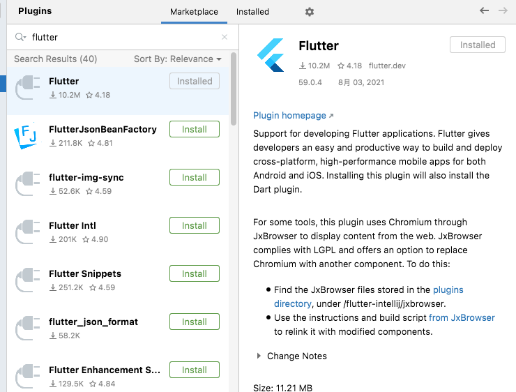
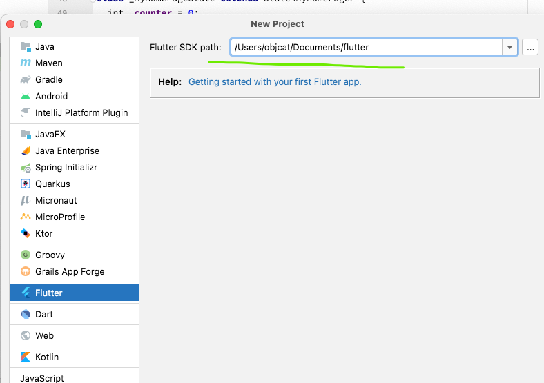

# 🍎 简介

Dart 是谷歌开发的计算机编程语言，被应用于 Web、服务器、移动应用和物联网等领域的开发。Dart 是面向对象、类定义的、单继承的语言。它的语法类似C语言，可以转译为 JavaScript，支持接口(interfaces)、混入(mixins)、抽象类(abstract classes)、具体化泛型(reified generics)、可选类型(optional typing)和sound type system。

# 🍎 环境搭建

官方网站

https://dart.dev

IDE下载

https://download.jetbrains.com.cn/idea/ideaIU-2021.2.1.dmg

本文档直接使用flutter自带的dart来使用, 依据教程

https://flutterchina.club/setup-macos/

首先在中文网下载flutter最新版本

https://flutter.dev/docs/development/tools/sdk/releases?tab=macos#macos

下载后配置环境变量

```shell
open -a xcode ~/.bash_profile
# 写入
PATH="/Users/objcat/Documents/flutter/bin:${PATH}"
export PATH
```

如果是zsh需要在zsh中执行一下bash

```shell
open -a xcode ~/.zshrc
# 写入
source ~/.bash_profile
```

然后打开IDEA下载Flutter插件




安装完成后 新建flutter项目, 路径选择刚才下载安装包的路径



到此为止 配置结束

# 🍎 Hello World

```python
print("Hello world!");
```

# 🍎 变量

## 🌲 定义变量

要注意的是dart是具有可空类型的语言, 这种语言会设定默认所有的变量都是不能为null的, 如果想允许变量为null, 那么需要使用可空类型

```dart
// 整型
int testInt = 100;
// 浮点型
double testDouble = 1000.0;
// 字符串
String testString = "objcat";
// 数组
List<int> testList = [1, 2, 3];
// 字典
Map<String, dynamic> testMap = {"name": "objcat", "age": 18};
// 布尔
bool testBool = true;
```

## 🌲 可空类型

说来就来了, 一起看看吧, 可控类型其实并没有什么难点, 就是可以标记一个变量可空

```dart
void main(List<String> args) {
  int testInt = null;
}
```

我们这么定义变量发现报错了

```
A value of type 'Null' can't be assigned to a variable of type 'int'.
Try changing the type of the variable, or casting the right-hand type to 'int'.dartinvalid_assignment
```

意思就是`null`不能被赋值到不可空的变量上, 如果我们希望这个变量可以为null, 那么就可以使用`?`来给变量标记可空

```dart

void main(List<String> args) {
  int? testInt = null;
  print(testInt); // null
}

// 这样写会有一个警告, 因为可空类型默认的值就是null, 所以不需要再提前进行初始化了, 我们直接按照下面的写法就可以了

void main(List<String> args) {
  int? testInt;
  print(testInt); // null
}
```

## 🌲 推导类型

`dart`拥有高级语言的特性, 即推导类型, 可以根据等号后面的值进行推导, 最长用的就是`var`关键字, 表示变量

```dart
// 整型
var testInt = 100;
// 浮点型
var testDouble = 1000.0;
// 字符串
var testString = "Objcat";
// 数组
var testList = [1, 2, 3];
// 字典
var testMap = {"name": "objcat", "age": 18};
// 布尔
var testBool = true;
```

## 🌲 final

意思是只能赋值一次, 它也是可以推导的

```dart
final testInt = 1;
print(testInt);
// 报错
testInt = 2;
```

当赋值第二次就会出现报错

```
The final variable 'testInt' can only be set once. (Documentation)  Try making 'testInt' non-final.
```

## 🌲 const

我们使用`const`来定义常量, 值得注意的是常量必须使用常量来定义, 它也是可以推导的

```dart
const testInt = 1;
print(testInt);
// 报错
testInt = 2;
```

和`final`类似常量也不支持二次赋值

```
Constant variables can't be assigned a value. (Documentation)  Try removing the assignment, or remove the modifier 'const' from the variable.
```

但是常量必须是由常量定义, 比如下面的错误案例

```dart
var a = 1;
const testInt = a;
print(testInt);
```

我们使用变量来定义一个常量, 这就导致了报错

```
Const variables must be initialized with a constant value. (Documentation)  Try changing the initializer to be a constant expression.
```

如果想使用变量定义一个常量还是推荐使用`final`

```dart
var a = 1;
final testInt = a;
print(testInt);
```

顺便提一下, const和final最大的区别就是const在编译时决定的, 而final可以在编译后的运行时决定, 所以final可以接受变量的赋值

# 🍎 动态类型

## 🌲 定义

在`dart`中有一个类型非常特殊, 那就是`dynamic`动态类型, 它给我们带来了灵活, 也给我们带来了麻烦, 我们一起来看看吧

```dart
dynamic a = 1;
print(a);
```

这是如果查看a的类型, 那就是`dynamic`的

## 🌲 转换

动态类型可以直接赋值在变量上, 不需要任何转换

```dart
dynamic a = 1;
int b = a;
print(b);
```

但是如果类型不正确, 在运行时会出现错误

```dart
dynamic a = "123";
int b = a;
print(b);
```

我们来看一下错误信息, 意思是不能使用一个`int`类型的变量来承接`String`字符串, 这个问题在书写中是不存在问题的, 所以增加了排查难度

```shell
Unhandled exception:
type 'String' is not a subtype of type 'int'
#0      main (package:test_dart/test_dart.dart:27:7)
#1      _delayEntrypointInvocation.<anonymous closure> (dart:isolate-patch/isolate_patch.dart:296:19)
#2      _RawReceivePort._handleMessage (dart:isolate-patch/isolate_patch.dart:189:12)
```

# 🍎 函数

## 🌲 无参数无返回值

```dart
void main() {
  hello();
}

void hello() {
  print("hello world!");
}
```

## 🌲 有参数无返回值

```dart
void main() {
  hello("hello world!");
}

void hello(String text) {
  print(text);
}
```

## 🌲 有参数有返回值

```python
void main() {
  print(hello("hello world!"));
}

String hello(String text) {
  return text;
}
```

## 🌲 命名参数

有时候我们希望传参的时候可以加上参数名字, 这样可以防止传错, `required`表示参数必须要传

```dart
void main() {
  hello(text: "hello world");
}

void hello({required String text}) {
  print(text);
}
```

冠名参数如果不加`required`也会报错

```shell
The parameter 'text' can't have a value of 'null' because of its type, but the implicit default value is 'null'. (Documentation)  Try adding either an explicit non-'null' default value or the 'required' modifier.
```

我们也可以设置可空类型

```dart
void hello({String? text}) {
  print(text);
}
```

## 🌲 可选参数

顾名思义, 可选参数就是可传可不传的参数, 因为它的这种特性所以必须标记为`?`可空类型

```dart
void main(List<String> args) {
  hello("张三");
  hello("张三", 18);
}

void hello(String name, [int? age]) {
  print('$name $age');
}
```

## 🌲 动态类型参数

### 🌸 普通动态类型

动态类型没什么高深的, 就是把参数类型换成`dynamic`可以保证灵活性

```dart
void hello(dynamic text) {
  print(text);
}
```

我们也可以省略`dynamic`

```dart
void hello(text) {
  print(text);
}
```

值得注意的是`text`无法指定可空, 所以是必传否则会报错

```shell
bin/test_dart.dart:2:8: Error: Too few positional arguments: 1 required, 0 given.
  hello();
       ^
bin/test_dart.dart:5:6: Context: Found this candidate, but the arguments don't match.
void hello(dynamic text) {
     ^^^^^
```

### 🌸 冠名动态类型

```dart
void hello({text}) {
  print(text);
}
```

这个不强制要求传值, 默认就是`null`

## 🌲 自执行函数

```dart
(n) {
  print(n); // 1
}(1);
```

# 🍎 字符串

## 🌲 定义字符串

```dart
var my_str = "123";
```

## 🌲 获取字符串

```dart
// 字符串可以通过下标来获取字字符串
print(my_str[0]);
print(my_str[1]);
```

## 🌲 拼接字符串

```dart
// 加号拼接
var my_str2 = my_str + "456"; // 123456
// $拼接
var my_str2 = "${my_str}456"; // 123456

```

## 🌲 替换字符串

```dart
my_str2 = my_str2.replaceAll("1", "2"); // 223456
```

## 🌲 查找字符串位置

```python
var index = my_str2.indexOf("2"); // 1
```

## 🌲 遍历字符串

```python
for(var i = 0; i < my_str2.length; i++) {
  print(my_str2[i]);
}
```

# 🍎 数组

## 🌲 定义数组

```dart
var my_arr = [1, 2, 3];
```

## 🌲 获取元素

```dart
// 通过下标获取 下标从0开始
print(my_arr[0]);
```

## 🌲 添加元素

```dart
my_arr.add(4);
print(my_arr); // [1, 2, 3, 4]
```

## 🌲 删除元素

```dart
my_arr.remove(4);
print(my_arr); // [1, 2, 3]
```

## 🌲 截取元素

```dart
print(my_arr.sublist(0, 1)); // [1]
print(my_arr.sublist(0, 2)); // [1, 2]
print(my_arr.sublist(1, 1)); // []
```

## 🌲 拼接数组

```dart
my_arr.addAll([4, 5, 6]);
print(my_arr) // [1, 2, 3, 4, 5, 6]
```

## 🌲 遍历数组

```dart
// 写法1
my_arr.forEach((element) => print(element)); // 1 2 3
// 写法2 注意里面的内容不要加分号 不推荐这种写法 会提示
my_arr.forEach((element) => {
    print(element)
});
// 写法3 去掉箭头 里面可以写多个语句
my_arr.forEach((element) {
    print(element);
});
```

## 🌲 map操作

`map`操作后会创造出一个新数组, 所以是深拷贝

```dart
// 写法1
my_arr = my_arr.map((e) => e * 2).toList();
print(my_arr); // [2, 4, 6]
// 写法2
my_arr = my_arr.map((e) {
return e * 2;
}).toList();
print(my_arr);
```

## 🌲 动态泛型问题

### 🌸 dynamic转化成数组

这个是很值得深究的问题, 我们一起来看看, 我们都知道`dynamic`是可以在类型相同的情况下转化成任何类型的, 即使类型不同, 也都是在运行过程中报错

```dart
dynamic list1 = [1, 2, 3];
List<int> list2 = list1;
print(list2);
```

### 🌸 仅修改类型就转化失败

我们来看下面的代码, 我仅仅是改动了一下`list1`的类型, 值没有变, 我们会发现还没运行就报错了

```dart
List<dynamic> list1 = [1, 2, 3];
List<int> list2 = list1;
print(list2);
```

我们来看一下错误提示

```
A value of type 'List<dynamic>' can't be assigned to a variable of type 'List<int>'. (Documentation)  Try changing the type of the variable, or casting the right-hand type to 'List<int>'.
```

意思是`List<dynamic>`不能转化成`List<int>`, 这其实是非常奇怪的, 按道理`dynamic`可以转化成任何, 而`dynamic`在泛型中, 也就是数组中的元素都是`dynamic`却不能转化

### 🌸 List.from

后来我发现了`List.from`

```dart
List<dynamic> list1 = [1, 2, 3];
List<int> list2 = List.from(list1);
print(list2);
```

它会帮你创建一个新的数组, 并添加新的元素, 这也算是上面问题的解决方法吧

### 🌸 dynamic.map

我们有时候会使用一个`dynamic`类型做`map`操作, 这样会出现一个问题, 我们来看看

```dart
dynamic list = [1, 2, 3];
List<int> list2 = list.map((e) => 1).toList();
print(list2);
```

别管我为什么这样写, 现在`list2`应该是`[1, 1, 1]`, 结果是报错的

```shell
Unhandled exception:
type 'List<dynamic>' is not a subtype of type 'List<int>'
#0      main (package:test_dart/test_dart.dart:32:13)
#1      _delayEntrypointInvocation.<anonymous closure> (dart:isolate-patch/isolate_patch.dart:296:19)
#2      _RawReceivePort._handleMessage (dart:isolate-patch/isolate_patch.dart:189:12)
```

但是我们这么写就可以

```dart
List<dynamic> list = [1, 2, 3];
List<int> list2 = list.map((e) => 1).toList();
print(list2);
```

明明向里面装的数据都是`1`, 明明`e`都是`dynamic`, 最终的结果却不一样, 我只能说这是天大的`bug`

### 🌸 添加泛型

后来问了一个大佬, 他说如果是第一种可以加一个泛型

```dart
dynamic list = [1, 2, 3];
List<int> list2 = list.map<int>((e) => 1).toList();
print(list2);
```

我们发现确实可以, 但是e必须是明确类型才可以

### 🌸 结论

所以目前的问题, 总结出来就是下面两段代码的问题

```dart
{
dynamic list = [1, 2, 3];
List<int> list2 = list.map((e) => 1).toList();
print(list2);
}

{
List<dynamic> list = [1, 2, 3];
List<int> list2 = list.map((e) => 1).toList();
print(list2);
}
```

我目前是无法解答的, 只能在实际使用过程中尽量不要直接用dynamic做map了

# 🍎 字典

## 🌲 定义字典

```dart
my_dic = {"name": "张三", "age": "18"}
```

## 🌲 获取元素

```dart
my_dic["name"];
```

## 🌲 添加元素

```python
my_dic["gender"] = "男";
```

## 🌲 删除元素

```python
my_dic.remove("name");
```

## 🌲 截取字典

```dart
无法截取
```

## 🌲 拼接字典

```dart
my_dic.addAll({"gender": "男", "cat": "objcat"});
```

# 🍎 集合

## 🌲 定义集合

```dart
var my_set = {1, 2, 3, 1};
```

## 🌲 获取元素

```dart
// 集合不能获取元素 但可以先转成数组再操作
var my_set = {1, 2, 3, 1};
var my_list = my_set.toList();
print(my_list[0]);
```

## 🌲 添加元素

```dart
my_set.add(4);
```

## 🌲 删除元素

```dart
my_set.remove(2);
```

## 🌲 截取元素

```dart
无法截取 但可以转化为数组再截取
```

## 🌲 拼接集合

```dart
var my_set = {1, 2, 3};
var my_set2 = {4, 5, 6};
my_set.addAll(my_set2);
print(my_set);
```

# 🍎 条件语句

## 🌲 if

```dart
var a = 1;
// 如果a等于1 执行条件
if (a == 1) {
  print("a等于1");
}
```

## 🌲 if - else if

```dart
var a = 1;
// 如果a等于1执行1 如果a等于2执行2
if (a == 1) {
  print("a等于1");
} else if (a == 2) {
  print("a等于2");
}
```

## 🌲 if - else if - else

```dart
var a = 1;
if (a == 1) {
  print("a等于1");
} else if (a == 2) {
  print("a等于2");
} else {
  print("a既不等于1也不等于2");
}
```

# 🍎 循环语句

## 🌲 for

```dart
for (var i = 0; i < 3; i++) {
  print(i);
}

for (var i in [0, 1, 2]) {
  print(i);
}
```

## 🌲 while

```dart
while (i < 3) {
  print(i);
  i++;
}
```

# 🍎 类和对象

## 🌲 类

```Dart
class Person {
  
}
```

## 🌲 定义成员变量

```dart
class Person {
  String name;
  int age;
}
```

但是我们会发现报错了, 因为我们的`name`和`age`都没有初始化, 所以和现代语言一样, 我们需要给类添加初始化方法

## 🌲 定义初始化方法

### 🌸 方法1

```dart
void main() {
  var per = Person("张三", 18);
  print(per.name);
  print(per.age);
}

class Person {
  String name;
  int age;

  Person(this.name, this.age);
}
```

### 🌸 方法2

```dart
void main() {
  var per = Person(name: "张三", age: 18);
  print(per.name);
  print(per.age);
}

class Person {
  String name;
  int age;

  Person({required this.name, required this.age});
}
```

### 🌸 多个初始化方法

```dart
void main() {
  var per = Person(name: "张三", age: 18);
  print(per.name);
  print(per.age);

  var per2 = Person.init("李四", 20);
  print(per2.name);
  print(per2.age);
}

class Person {
  String name;
  int age;

  Person({required this.name, required this.age});

  Person.init(this.name, this.age);
}
```

- init 可以换成任何名字, 我只是为了表达式初始化才写成了`init`, 例如`Person.haha(this.name, this.age);`

## 🌲 定义方法

方法分为`实例方法`和`类方法`

```dart
void main() {
  var per = Person("张三", 18);
  per.say();
  Person.ssay();
}

class Person {
  String name;
  int age;

  Person(this.name, this.age);

  void say() {
    print("人说");
  }

  static ssay() {
    print("人类说");
  }
}
```

## 🌲 继承

```dart
class Student extends Person {
  
}
```

## 🌲 重写方法

```dart
class Student extends Person {
   void say() {
    print("学生说");
  }
}
    
var stu = Student();
stu.say();
```

## 🌲 单例

```dart
class P {
    String name;
    static Map<String, dynamic> _cache = {};
    
    factory P(String name) {
        if (_cache.containsKey(name)) {
            return _cache[name];
        } else {
            final p = P._internal(name);
            _cache[name] = p;
            return p;
        }
    }
    
    P._internal(this.name);
}

void main() {
    final p = P('tom');
    print(p.name);
}
```

# 🍎 json

## 🌲 map -> json字符串

```dart
const map = {"name": "张三", "age": 18};
String jsonString = json.encode(map);
print(jsonString);
```

## 🌲 json字符串 -> map

```dart
final map2 = json.decode(jsonString);
print(map2);
```

## 🌲 对象 -> map

```dart
import 'dart:convert';

void main() {
  print(json.encode(Student("李四", 20)));
}

class Student {
  String name;
  int age;

  Student(this.name, this.age);
}
```

我们发现报错了

```shell
Unhandled exception:
Converting object to an encodable object failed: Instance of 'Student'
#0      _JsonStringifier.writeObject (dart:convert/json.dart:793:7)
#1      _JsonStringStringifier.printOn (dart:convert/json.dart:982:17)
#2      _JsonStringStringifier.stringify (dart:convert/json.dart:967:5)
#3      JsonEncoder.convert (dart:convert/json.dart:345:30)
#4      JsonCodec.encode (dart:convert/json.dart:231:45)
#5      main (file:///Users/objcat/project/flutter/test_dart/bin/test_dart.dart:18:14)
#6      _delayEntrypointInvocation.<anonymous closure> (dart:isolate-patch/isolate_patch.dart:296:19)
#7      _RawReceivePort._handleMessage (dart:isolate-patch/isolate_patch.dart:189:12)
```

解决办法是在`Student`内重写一个`toJson`方法

```dart
class Student {
  String name;
  int age;

  Student(this.name, this.age);

  Map toJson() {
    Map map = {};
    map["name"] = name;
    map["age"] = age;
    return map;
  }
}
```

然后再转换发现可以了

```json
{"name":"李四","age":20}
```

不过这样是十分麻烦的, 你可以去学习使用谷歌官方的`json_serializable`

# 🍎 扩展

https://dart.dev/language/extension-methods

## 🌲 基本用法

高级语言特性已经不稀奇了, 就是可以无侵入性的扩展类的方法和属性

```dart
class Person {
  String name;

  Person(this.name);
}

extension PersonExtension on Person {
  static int age = 17;
  void say() {
    print("人说: $name");
  }

  static void ssay() {
    print("人类说");
  }
}
```

然后使用就是

```dart
final per = Person("张三");
per.say();
Person.ssay(); // 不能调用
```

但是我们发现扩展的静态方法无法被调用, 但是可以被扩展内部的方法调用

```dart
extension PersonExtension on Person {
  static int age = 17;
  void say() {
    print("人说: $name");
    ssay();
  }

  static void ssay() {
    print("人类说");
  }
}
```

# 🍎 导入

## 🌲 基本用法

不需要什么复杂的流程, 导入就是完全导入里面的`类`和`方法`和`属性`

```dart
import 'package:flutter/material.dart';
```

## 🌲 as

有时候如果api会发生冲突, 那我们可以给文件起个别名

```dart
import 'package:ldtg/utils/global.dart' as global;
```

然后使用的时候就是

```dart
global.logger.d("xxxx");
```

## 🌲 屏蔽

有时候属性重名了, 我们希望屏蔽一个

```dart
import 'package:ldtg/utils/global.dart' hide logger;
```

然后`logger`就不能用了
