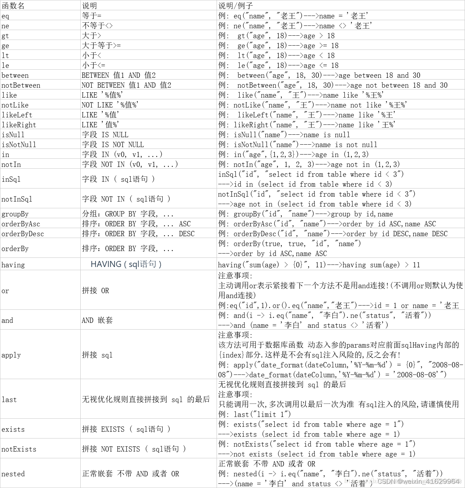
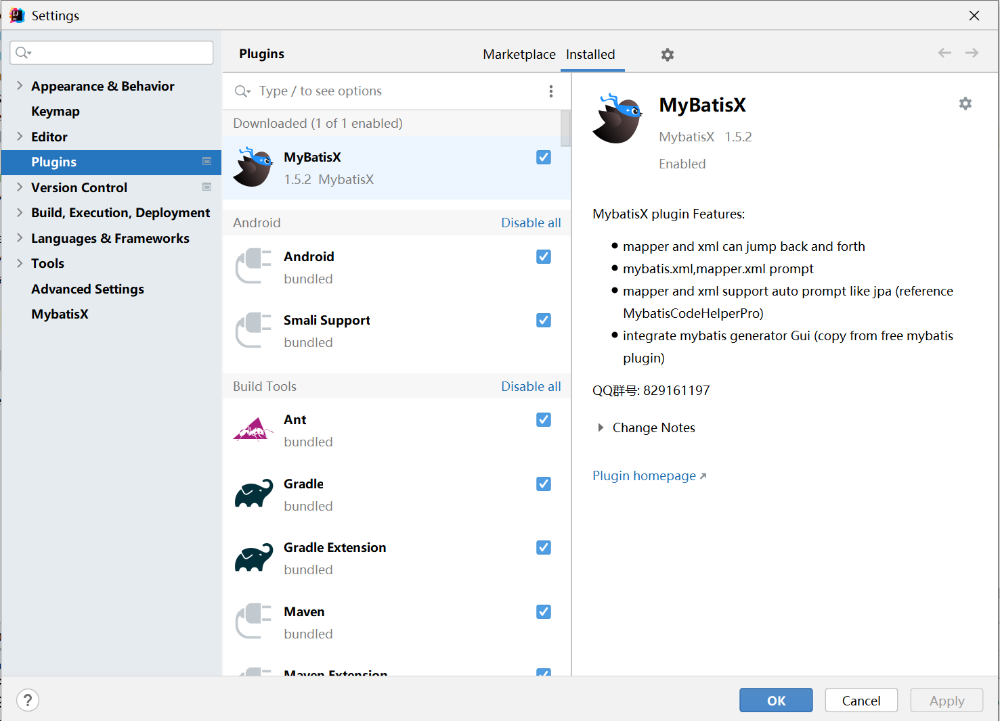

# 🍎 介绍

`MyBatis-Plus`是`MyBatis`的增强工具, 在`MyBatis`的基础上只做增强不做改变, 为简化开发, 提高效率而生, `MyBatis-Plus`提供了通用的mapper和service, 可以再不编写任何SQL语句的情况下, 快速实现对单标的CRUD, 批量, 逻辑删除, 分页等操作.

# 🍎 规范

## 🌲 配置关键字大写

`Setting -> Editor -> Code Style -> SQL -> General -> Keywords`为`To upper`


## 🌲 命名规范

参考阿里巴巴Java开发手册, 规范如下:

```
18.【参考】各层命名规约：
A) Service/DAO 层方法命名规约
1） 获取单个对象的方法用 get 做前缀。
2） 获取多个对象的方法用 list 做前缀，复数结尾，如：listObjects。 3） 获取统计值的方法用 count 做前缀。 4） 插入的方法用 save/insert 做前缀。
5） 删除的方法用 remove/delete 做前缀。
6） 修改的方法用 update 做前缀。
B) 领域模型命名规约
1） 数据对象：xxxDO，xxx 即为数据表名。
2） 数据传输对象：xxxDTO，xxx 为业务领域相关的名称。
3） 展示对象：xxxVO，xxx 一般为网页名称。
4） POJO 是 DO/DTO/BO/VO 的统称，禁止命名成 xxxPOJO。
```

# 🍎 必要配置

## 🌲 安装MySQL

自行安装

## 🌲 连接数据库

我们可以直接使用IDEA自带的`dataGrip`来连接数据库


然后填写上对应的`用户名`和`密码`就能连接了, 常用的用户名和密码是, `root 123456`


配置完毕后点击`Test Connection`来测试是否连接成功了

## 🌲 设置方言

我们在使用xml写SQL的时候首先需要设置方言, 否则我们的IDEA不知道XML应该和什么数据库进行匹配


# 🍎 依赖库安装

## 🌲 Maven

```xml
<dependencies>
	<dependency>
		<groupId>mysql</groupId>
		<artifactId>mysql-connector-java</artifactId>
		<version>8.0.28</version>
	</dependency>
	        
	<dependency>
		<groupId>com.baomidou</groupId>
		<artifactId>mybatis-plus-boot-starter</artifactId>
		<version>3.5.1</version>
	</dependency>
</dependencies>
```

## 🌲 Gradle 

```groovy
dependencies {
	implementation "mysql:mysql-connector-java:8.0.28"
	implementation "com.baomidou:mybatis-plus-boot-starter:3.5.1"
}
```

# 🍎 数据库配置四部曲

## 🌲 配置连接

```yaml
spring:
  datasource:
    # 数据库连接url
    url: jdbc:mysql://localhost:3306/test?useUnicode=true&characterEncoding=UTF-8&useSSL=false
    # 驱动类名
    driver-class-name: com.mysql.cj.jdbc.Driver
    # 数据库用户名
    username: root
    # 数据库密码
    password: 123456
```

## 🌲 配置xml文件存放路径

对应的就是`resources -> mapper -> ** -> *.xml`

```yaml
mybatis-plus:
  # xml存放位置, 注意中间是两颗星, 如果是一颗直接放在mapper文件夹里会无法识别
  mapper-locations: classpath:mapper/**/*.xml
```

## 🌲 配置日志输出

有时候我们需要去看SQL输出来判断操作是否执行正确

```yaml
mybatis-plus:
  configuration:
    log-impl: org.apache.ibatis.logging.stdout.StdOutImpl
```

## 🌲 配置扫包

所谓扫包就是扫存放`mapper`的包

```java
@SpringBootApplication
@MapperScan("com.objcat.mybatisplus.mapper")
public class MyBatisPlusMain {
    public static void main(String[] args) {
        SpringApplication.run(MyBatisPlusMain.class, args);
    }
}
```

我们也可以通过`@Mapper`注解来配置扫包如:

```java
@Mapper
public interface UserMapper extends BaseMapper<UserDO> {

}
```

# 🍎 工程样子

我们需要先来看一看完成Demo的结构


我们可以看到`controller, service, dao, entity, mapper`都齐全, 这就是我们的项目结构了, 也是spring编程中要遵守的, 不要着急, 我们往下看

# 🍎 快速开始

## 🌲 创建数据库

请确保已经在上面的配置中用`DataGrip`连接好数据库

```sql
CREATE DATABASE test;
```

## 🌲 创建表

就是普通的创建表, 我们把dog的id类型设置为`INT`, 把user的id类型设置为`BIGINT`是方便测试生成ID策略的区分

```sql
CREATE TABLE dog
(
    id   INT AUTO_INCREMENT
        PRIMARY KEY,
    name VARCHAR(10) NULL
) ENGINE=InnoDB DEFAULT CHARSET=utf8mb4;

CREATE TABLE user
(
    id   BIGINT AUTO_INCREMENT
        PRIMARY KEY ,
    name VARCHAR(4) NULL,
    age  VARCHAR(3) NULL,
    dog_id  INT     NULL
) ENGINE=InnoDB DEFAULT CHARSET=utf8mb4;
```

## 🌲 插入数据

```sql
INSERT INTO dog (id, name) VALUES (1, '金毛');
INSERT INTO dog (id, name) VALUES (2, '二哈');
INSERT INTO user (name, age, dog_id) VALUES ('张三', '18', 1);
INSERT INTO user (name, age, dog_id) VALUES ('李四', '20', 2);
```

## 🌲 创建DO

`DO`是我们数据库表的映射, 我们可以通过`MyBatisX插件自动生成`, 这里我演示手动写

我们首先创建`entity`文件夹, 然后创建`UserDO`

这个创建有点说道, 数据库和`DO`要保持类型一致, 如果主键是`BIGINT`就使用`Long`, 如果是`INT`就使用`Integer`,  如果主键是`varchar`就用`String`

```java
@Data
@TableName("user")
public class UserDO {
    @TableId(value = "id", type = IdType.ASSIGN_ID)
    private Long id;
    @TableField(value = "name")
    private String name;
    private String age;
    private Integer dogId;
}
```

值得注意的是`@TableName("user")`必须要写, 否则`mybatis`会给我解析成`user_d_o`表从而从查询不到数据, 不过好在你如果忘记配置这一条后, 会在错误提示中很容易就看到问题

### 🌸 @Data

`lombok`的注解, 自动生成`setter/getter`方法

### 🌸 @TableName

指定表名, 如果不指定默认是类名(忽略大小写), 如果实体与数据库表不一致则这一项必须要指定, 否则会找不到表, 比如上文中`UserDO`和`user`表不一样, 所以必须指定

### 🌸 @TableId

指定主键, value是主键的名字, 如果和数据库不一致需要修改成数据库中的, 驼峰命名法默认可以转换为数据库中的下划线写法, 比如`dogId`可以转换成`dog_id`

`type`是设置主键生成策略, 有些是自增, 由数据库自己生成, 有些则是UUID或是雪花算法, 我们来看一下它提供了机种类型

```java
@Getter
public enum IdType {
    /**
     * 数据库ID自增
     * <p>该类型请确保数据库设置了 ID自增 否则无效</p>
     */
    AUTO(0),
    /**
     * 该类型为未设置主键类型(注解里等于跟随全局,全局里约等于 INPUT)
     */
    NONE(1),
    /**
     * 用户输入ID
     * <p>该类型可以通过自己注册自动填充插件进行填充</p>
     */
    INPUT(2),

    /* 以下3种类型、只有当插入对象ID 为空，才自动填充。 */
    /**
     * 分配ID (主键类型为number或string）,
     * 默认实现类 {@link com.baomidou.mybatisplus.core.incrementer.DefaultIdentifierGenerator}(雪花算法)
     *
     * @since 3.3.0
     */
    ASSIGN_ID(3),
    /**
     * 分配UUID (主键类型为 string)
     * 默认实现类 {@link com.baomidou.mybatisplus.core.incrementer.DefaultIdentifierGenerator}(UUID.replace("-",""))
     */
    ASSIGN_UUID(4);

    private final int key;

    IdType(int key) {
        this.key = key;
    }
}
```

其中比较常用的就是`AUTO`和`ASSIGN_ID`, 前者是数据库自增, 后者是雪花算法和UUID

如果你的主键是`int`自增就选`AUTO`类型配置如下, 可以看到结果里没有生成主键是因为数据库设置了自增, 如果没传递主键就自动生成. 数据类型据我测试使用`Integer`和`Long`都可以

```java
@TableId(value = "id", type = IdType.AUTO)
private Long id;
/**
==>  Preparing: INSERT INTO user ( name, age, dog_id, cat_id ) VALUES ( ?, ?, ?, ? )
==> Parameters: 赵六(String), 18(String), 1(Integer), 1(Integer)
<==    Updates: 1
*/
```

如果主键是`bigint`就选`ASSIGN_ID`类型配置如下

```java
@TableId(value = "id", type = IdType.ASSIGN_ID)
private Long id;
/**
==>  Preparing: INSERT INTO user ( id, name, age, dog_id, cat_id ) VALUES ( ?, ?, ?, ?, ? )
==> Parameters: 1574292844847042561(Long), 赵六(String), 18(String), 1(Integer), 1(Integer)
<==    Updates: 1
*/
```

如果主键是`varchar(32)`就选`ASSIGN_UUID`类型

```java
@TableId(value = "id", type = IdType.ASSIGN_UUID)
private String id;
/**
==>  Preparing: INSERT INTO user ( id, name, age, dog_id, cat_id ) VALUES ( ?, ?, ?, ?, ? )
==> Parameters: 0bf464fc75f82665bbb1e910d3133d72(String), 赵六(String), 18(String), 1(Integer), 1(Integer)
<==    Updates: 1
*/
```

### 🌸 @TableField

指定字段名, 还有一些其他用处以后再说

## 🌲 创建Mapper


Mapper是数据访问层, 我们看看要怎么实现, 我们创建一个`UserMapper接口`继承于`BaseMapper`, 后者是`MyBatis-plus`提供的公共`Mapper`类, 用于做一些通用的增删改查

```java
public interface UserMapper extends BaseMapper<UserDO> {

}
```

## 🌲 测试Mapper

创建好`Mapper`之后我们就可以用它来和数据库交互了, 我们写一个测试例子试一下, 测试需要导入下面的依赖, 我在前面的章节默认就导入这个了

```xml
<dependency>
	<groupId>org.springframework.boot</groupId>
	<artifactId>spring-boot-starter-test</artifactId>
</dependency>
```

我们创建测试包


注意包名要与主包一致

### 🌸  测试插入

然后我们就可以测试一下插入了

```java
@SpringBootTest
public class TestController {
    @Resource
    private UserMapper userMapper;
    @Test
    public void testInsert() {
        UserDO userDO = new UserDO();
        userDO.setName("王五");
        userDO.setAge("18");
        userDO.setDogId(1);
        int result = userMapper.insert(userDO);
        System.out.println(result);
        System.out.println(userDO); 
        // UserDO(id=1699703719342141442, name=王五, age=18, dogId=1)
    }
}
```

- `@Resource` 依赖注入的注解, 把userMapper从容器中取出来, 方便我们使用, 我们同样也可以使用`@Autowired`来注入

然后`userMapper.insert(userDO);`, 我们发现`userMapper`天生就具有插入的功能, 这是因为我们继承了`BaseMapper`, 是`MyBatis-plus`帮我们实现好的一套通用接口

然后我们运行测试


发现是可以插入数据的


### 🌸  测试查询

```java
@SpringBootTest
public class MyBatisPlusTest {
    @Autowired
    private UserMapper userMapper;

    @Test
    public void testSelect() {
        List<UserDO> user = userMapper.selectList(null);
        System.out.println(user.toString()); 
        // [UserDO(id=1, name=张三, age=18, dogId=1), UserDO(id=2, name=李四, age=20, dogId=2), UserDO(id=1699703719342141442, name=王五, age=18, dogId=1)]
    }
}
```

## 🌲 创建Service


`Service`是服务层, 我们写接口一般不直接使用`Mapper`, 而是使用`Service`来调用`Mapper`, 新建一个`service`文件夹, 然后创建`UserService.java`接口继承于`IService`

```java
public interface UserService extends IService<UserDO> {

}
```

## 🌲 创建ServiceImpl

我们还需要创建一个`Service`接口的实现类, 我们创建一个`impl`文件夹来实现`Service`, 注意`@service`注解很关键, 如果不注入依赖就无法找到这个`Bean`

```java
@Service
public class UserServiceImpl extends ServiceImpl<UserMapper, UserDO> implements UserService {

}
```

## 🌲 测试Service

### 🌸  测试插入

我们刚才说过了, `Mapper`一般是不直接与`Controller`交互的, 所以我们需要在`Service`层中处理逻辑, 记住这一点

```java
@Autowired
private UserService userService;
    
@Test
public void testServiceInsert() {
	UserDO userDO = new UserDO();
	userDO.setName("赵六");
	userDO.setAge("18");
	userDO.setDogId(1);
	boolean result = userService.save(userDO);
	System.out.println(result);
	System.out.println(userDO); 
	// UserDO(id=1699707091805065217, name=赵六, age=18, dogId=1)
}
```

我们可以看到, `userService`有一个方法叫`save`, 因为我们的实现的`IService`接口里有`save`方法, 和mapper一样也是继承过来的通用接口, mapper能做什么, 我们的service也能做什么

### 🌸  测试查询

```java
@Autowired
private UserService userService;
    
@Test
public void testServiceSelect() {
	List<UserDO> list = userService.list();
	System.out.println(list);
	// [UserDO(id=1, name=张三, age=18, dogId=1), UserDO(id=2, name=李四, age=20, dogId=2), UserDO(id=1699703719342141442, name=王五, age=18, dogId=1), UserDO(id=1699707091805065217, name=赵六, age=18, dogId=1)]
}
```

到这里我们Service层也创建成功了

## 🌲 Controller

`controller`是接口层, 我们就是在这里写接口的, 东西都准备好了, 我们直接写一个用户列表的接口吧

```java
@RestController
public class TestController {

    @Resource
    private UserService userService;

    @RequestMapping("/listUser")
    public Object hello() throws JSONException {
        List<UserDO> list = userService.list();
        System.out.println(list);
        JSONObject jsonObject = new JSONObject();
        jsonObject.put("code", "200");
        jsonObject.put("message", "请求成功");
        jsonObject.put("data", list);
        return list;
    }
}
```

然后我们访问试试

http://localhost:8080/listUser


到此就是三层架构写接口的全过程, 完结撒花, 下面是扩展章节

## 🌲 XML

### 🌸  创建初始XML

`resources`目录下新建`mapper`文件夹, 创建文件`UserMapper.xml`,  下面就是xml初始化必须的内容

```xml
<?xml version="1.0" encoding="UTF-8"?>
<!DOCTYPE mapper
	PUBLIC "-//mybatis.org//DTD Mapper 3.0//EN"
	"http://mybatis.org/dtd/mybatis-3-mapper.dtd">
```

为什么叫初始, 因为一切都要从这里开始, 我们可以看到上面有一个网址, 打开是一个`.dtd`文件用于规范此XML中的语法

### 🌸  绑定查询

我们主要是来看一下`xml`怎么与`.java`绑定

首先我们在里面写一个`mapper`标签

```xml
<?xml version="1.0" encoding="UTF-8"?>
<!DOCTYPE mapper
        PUBLIC "-//mybatis.org//DTD Mapper 3.0//EN"
        "http://mybatis.org/dtd/mybatis-3-mapper.dtd">
<mapper namespace="com.objcat.mybatisplus.mapper.UserMapper">
    <select id="listUsers" resultType="com.objcat.common.entitys.UserDO">
        SELECT *
        FROM objcat.user
    </select>
</mapper>
```

用`namespace`属性指定所属的`UserMapper`接口类, 这一步叫做`绑定`
使用`select`标签来实现一个查询功能

然后我们在`UserMapper.java`中添加一个方法

```java
public interface UserMapper extends BaseMapper<UserDO> {
    List<UserDO> listUsers();
}
```

#### 🌵 id

方法名

与`UserMapper.java`的方法名一一对应

```java
public interface UserMapper extends BaseMapper<UserDO> {
    List<UserDO> selectAll();
}
```

#### 🌵 resultType

返回值类型

必须要写否则会报错`A query was run and no Result Maps were found for the Mapped Statement`

#### 🌵 语句

`select`标签中间就是写我们的语句

```sql
select * from objcat.user
```

### 🌸  SQL语句重用

`mybatis`允许通过`<sql>`标签来定义SQL语句, 可以使用到多个地方, 达到重用的目的

```sql
<sql id="fields">
	id, name, username, password, salt, create_time, update_time, is_delete
</sql>
```

我们在查询的时候就可以直接使用它了

```xml
<select id="selectByUsername" resultType="com.objcat.shiro.entity.UserDO">
	SELECT
	<include refid="fields" />
	FROM test_shiro.user
	WHERE username=#{username}
</select>
```

# 🍎 XML CRUD

## 🌲 增

### 🌸  普通插入数据

```xml
Boolean testInsert(UserDO user);

<insert id="testInsert" parameterType="com.objcat.common.entitys.UserDO">
	INSERT INTO objcat.user (name, age, dog_id)
	VALUES (#{name}, #{age}, #{dogId})
</insert>
```

使用就是这样的

```java
@Test
public void testInsert() {
	UserDO userDO = new UserDO();
	userDO.setName("王五");
	userDO.setAge("18");
	userDO.setDogId(1);
	Boolean result = userMapper.testInsert(userDO);
	System.out.println(result);
}
```

### 🌸  插入时自动生成时间

自动生成时间有两种方法, 一种是在代码生成, 一种是在数据库生成

首先我们可以先修改一下UserDO, 增加三个常用字段`createTime`创建时间, `updateTime`更新时间, `delFlag`逻辑删除标识

```sql
CREATE TABLE user
(
    id          bigint AUTO_INCREMENT
        PRIMARY KEY,
    name        text                         NULL,
    age         char(5)                      NULL,
    dog_id      int                          NULL,
    create_time datetime                     NULL,
    update_time datetime                     NULL,
    del_flag    tinyint UNSIGNED DEFAULT '0' NULL
);
```

```java
@Data
@TableName("user")
public class UserDO {
    @TableId(value = "id", type = IdType.AUTO)
    private Long id;
    @TableField(value = "name")
    private String name;
    private String age;
    private Integer dogId;
    @TableField(fill = FieldFill.INSERT)
    private LocalDateTime createTime;
    @TableField(fill = FieldFill.INSERT_UPDATE)
    private LocalDateTime updateTime;
    private Boolean delFlag;
}
```

#### 🌵 代码生成时间

代码生成时间, 我们要使用一个注解`@TableField`, 里面可以指定`fill`类型, 如果是`INSERT`就是插入的时候生成时间, 如果是`INSERT_UPDATE`就是插入和修改的时候都生成时间

写完这个还不够, 我们需要再写一个拦截器, 当需要生成字段的时候, 我们就给他生成

```java
@Component
public class ZYMetaObjectHandler implements MetaObjectHandler {

    @Override
    public void insertFill(MetaObject metaObject) {
        System.out.println("insertFill");
        this.setFieldValByName("createTime", LocalDateTime.now(), metaObject);
        this.setFieldValByName("updateTime", LocalDateTime.now(), metaObject);
    }

    @Override
    public void updateFill(MetaObject metaObject) {
        System.out.println("updateFill");
        this.setFieldValByName("updateTime", new Date(), metaObject);
    }
}
```

注意这个文件需要放在`Mapper`所在的子模块下, 新建一个文件夹`handler`, 比如`com.objcat.mybatisplus.handler.ZYMetaObjectHandler`, 否则可能拦截不到

我们现在就来插入点数据试试吧

```java
@Test
public void insertUser() {
	UserDO userDO = new UserDO();
	userDO.setName("赵六");
	userDO.setAge("18");
	userDO.setDogId(1);
	int result = userMapper.insert(userDO);
	System.out.println(result);
	System.out.println(userDO.toString());
}
```

我们来看看结果

```shell
==>  Preparing: INSERT INTO user ( name, age, dog_id, create_time, update_time ) VALUES ( ?, ?, ?, ?, ? )
==> Parameters: 赵六(String), 18(String), 1(Integer), 2022-09-27T21:48:00.247(LocalDateTime), 2022-09-27T21:48:00.247(LocalDateTime)
<==    Updates: 1
Closing non transactional SqlSession [org.apache.ibatis.session.defaults.DefaultSqlSession@45877634]
1
UserDO(id=1574366766287523845, name=赵六, age=18, dogId=1, createTime=2022-09-27T21:48:00.247, updateTime=2022-09-27T21:48:00.247, delFlag=null)
```

我们可以看到它自动生成了时间, 大功告成

扩展一个事情, 如果你想很爽给`entity`添加这三个字段, 那么你就要新建一个`BaseDO`并继承与这个实体, 

```java
@Data
@TableName("user")
public class UserDO extends BaseDO {
    @TableId(value = "id", type = IdType.AUTO)
    private Long id;
    @TableField(value = "name")
    private String name;
    private String age;
    private Integer dogId;
}
```

那么问题就来了

```
Generating equals/hashCode implementation but without a call to superclass, even though this class does not extend java.lang.Object. If this is intentional, add '(callSuper=false)' to your type. 
```

他说你的`equals/hashCode`是自动生成的, 但是他们不会去顾及你的父类, 什么意思呢, 其实很简单

在你们java中比较两个对象是否相等, 就要使用`equals`这个方法里的实现是`@Data`注解生成的, 原理是比较了对象中的所有的值是否相等, 而这种带继承的情况下就会有点说道, 也就是它不会去比较你父类里的值, 只比较子类, 所以往往这种比较方式是存在错误的, 所以我们想要解决就是从这里入手, 好在`lombok`也提供了解决办法`@EqualsAndHashCode(callSuper = true)`

```java
@EqualsAndHashCode(callSuper = true)
@Data
@TableName("user")
public class UserDO extends BaseDO {
    @TableId(value = "id", type = IdType.AUTO)
    private Long id;
    @TableField(value = "name")
    private String name;
    private String age;
    private Integer dogId;
}
```

但是这种东西对我们来说也是不友好的, 我们想全局设置要怎么做呢

我们可以在java根目录下新建一个配置文件`lombok.config`

```
config.stopBubbling=true
lombok.equalsAndHashCode.callSuper=call
```

这就相当于所有自动生成`equals`方法的类都遵守`@EqualsAndHashCode(callSuper = true)`

测试方法很简单

```java
@Test
public void testEqual() {

	UserDO userDO1 = new UserDO();
	userDO1.setName("王五");
	userDO1.setAge("18");
	userDO1.setDogId(1);

	UserDO userDO2 = new UserDO();
	userDO2.setName("王五");
	userDO2.setAge("18");
	userDO2.setDogId(1);
	userDO2.setCreateTime(LocalDateTime.now());

	System.out.println(userDO1.equals(userDO2));
}
```

我们可以看到, 这两个类属都大致相同, 唯独`createTime`字段是在父类里的, 这段代码会返回`false`, 如果不加上面的配置, 那么执行结果是true. 因为默认不会去比较父类的属性

#### 🌵 数据库自动生成时间

这个比上面的更加简单, 只需要修改时间的生成策略即可

```sql
ALTER TABLE objcat.user MODIFY create_time datetime NOT NULL DEFAULT CURRENT_TIMESTAMP;
ALTER TABLE objcat.user MODIFY update_time datetime NOT NULL DEFAULT CURRENT_TIMESTAMP ON UPDATE CURRENT_TIMESTAMP;
```

然后我们把model中的注解去掉, 就可以随便进行插入了

如果你在建表的时候想要指定也是可以的

```sql
CREATE TABLE user
(
    id          BIGINT AUTO_INCREMENT
        PRIMARY KEY,
    name        VARCHAR(50)                         NULL,
    age         VARCHAR(5)                      NULL,
    dog_id      INT                          NULL,
    create_time DATETIME NOT NULL DEFAULT CURRENT_TIMESTAMP,
    update_time DATETIME NOT NULL DEFAULT CURRENT_TIMESTAMP ON UPDATE CURRENT_TIMESTAMP,
    delete_flag    TINYINT UNSIGNED DEFAULT '0' NULL
) ENGINE=InnoDB DEFAULT CHARSET=utf8mb4;
```

插入数据的时候就跟主键自增策略一样, 不插入创建时间和更新时间就会自动生成

对比下来好像还是数据库中生成比较简单啊兄弟 - -, 强烈推荐数据库生成时间

## 🌲 删

```xml
Boolean testDeleteById(Long id);

<delete id="testDeleteById">
	DELETE
	FROM objcat.user
	WHERE id = #{id}
</delete>
```

使用就是这样

```java
@Test
public void testDelete() {
	Boolean result = userMapper.testDeleteById(1L);
	System.out.println(result);
}
```

## 🌲 改

```xml
Boolean testUpdateNameById(String name, Long id);

<update id="testUpdateNameById">
	UPDATE objcat.user
	SET name=#{name}
	WHERE id = #{id}
</update>
```

## 🌲 查

### 🌸  无参数查询

我们在`HelloWorld`章节已经讲解过了, `namespace`配置对应我们的`mapper`类, 配置好返回值就可以查了

```xml
<?xml version="1.0" encoding="UTF-8"?>
<!DOCTYPE mapper
        PUBLIC "-//mybatis.org//DTD Mapper 3.0//EN"
        "http://mybatis.org/dtd/mybatis-3-mapper.dtd">
<mapper namespace="com.objcat.mybatisplus.mapper.UserMapper">
    <select id="listUsers" resultType="com.objcat.common.entitys.UserDO">
        select * from objcat.user
    </select>
</mapper>
```

```java
public interface UserMapper extends BaseMapper<UserDO> {
    List<UserDO> listUsers();
}
```

需要注意的是我们写方法的时候要注意返回值, 查询所有数据返回的是一个列表, 我们必须使用`List<UserDO>`来接收, 如果使用`UserDO`来接收就会报出错误`org.apache.ibatis.exceptions.TooManyResultsException`结果太多了

### 🌸  有参数查询

#### 🌵 普通参数

为了方便, 我们之后都是方法和对应的xml代码卸载一起, 我们可以看到, 定义参数也十分方便, 参数传递到xml中使用的是`#{参数}`的方式

```xml
// 方法使用两种定义方式都可以
UserDO getUserById(Long id);
List<UserDO> listUsersById(Long id);

<select id="getUserById" resultType="com.objcat.common.entitys.UserDO">
	select * from objcat.user where id=#{id}
</select>

<select id="listUsersById" resultType="com.objcat.common.entitys.UserDO">
	select * from objcat.user where id=#{id}
</select>
```

我们可以看到, 这一次我是写了两个方法, 一个是用`数组`接收, 一个是使用`UserDo`对象接收都是可以的, 如果是用数组接收返回的就是个数组里面装着`UserDo`, 如果是用`UserDo`来接收那就是返回一个实体

我们看一下如何使用吧

```java
@Test
public void testXMLSelectP() {
	List<UserDO> users = userMapper.listUsersById(1574366765331222530L);
	System.out.println(users.toString());
}
// [UserDO(id=1574366765331222530, name=张三, age=18, dogId=1)]
```

```java
@Test
public void testXMLSelectP() {
	UserDO user = userMapper.getUserById(1574366765331222530L);
	System.out.println(user.toString());
}
// UserDO(id=1574366765331222530, name=张三, age=18, dogId=1)
```

那么你可能会问, 我想要返回值是map只想看看结构怎么搞, 那也很简单直接设置`resultType="map"`就可以了, 但没有多少人会这么用, 而且看结构可以直接看输出日志的

#### 🌵 实体参数

有时候参数是一个实体, 正常情况下没有这么写的, 我只是在测试参数传递

```xml
UserDO getUserByUser(UserDO id);

<select id="getUserByUser" resultType="com.objcat.common.entitys.UserDO">
	select * from objcat.user where id=#{id}
</select>
```

使用起来也很简单

```java
@Test
public void testXMLSelectP() {
	UserDO user = new UserDO() ;
	user.setId(1574366765331222530L);
	UserDO resultUser = userMapper.getUserByUser(user);
	System.out.println(resultUser.toString());
}
// UserDO(id=1574366765331222530, name=张三, age=18, dogId=1)
```

我们可以看到`xml`中的参数获取还是没有改变, 那我们推断这里面的参数到了`myBatis`内部都会被拆分成普通的参数, 那如果有多个参数叫id怎么办呢

```xml
UserDO getUserByUserAndId(UserDO user, Long id);

<select id="getUserByUserAndId" resultType="com.objcat.common.entitys.UserDO">
	select * from objcat.user where id=#{id}
</select>
```

```java
@Test
public void testXMLSelectP() {
	UserDO user = new UserDO() ;
	user.setId(1574366766287523841L);
	UserDO resultUser = userMapper.getUserByUserAndId(user, 1574366765331222530L);
	System.out.println(resultUser.toString());
}
```

我们可以看到user实体里的id是`李四`的, 而参数上另外一个参数也叫id是`张三`的, 那我们来跑一下看看id用的到底是谁的

本来以为会报错 没想到能跑通

```java
UserDO(id=1574366765331222530, name=张三, age=18, dogId=1)
```

我们可以看到查询到的结果是张三的, 那我可以推断为先寻找外部参数, 如果没有再去寻找实体里面的参数

### 🌸  resultMap

```xml
<resultMap id="userResultMap" type="com.objcat.common.entitys.UserDO">
	<id column="id" jdbcType="BIGINT" property="id"/>
	<result property="name" column="name" jdbcType="VARCHAR" />
	<result property="age" column="age" jdbcType="CHAR" />
	<result property="dogId" column="dog_id" jdbcType="INTEGER" />
</resultMap>
```

#### 🌵 id

结果集名称, 引用的时候用

#### 🌵 type

实体引用路径

#### 🌵 property, column

`property`实体中的字段名, 写错了会报错
`column`数据库中的字段名, 写错了对应字段会为null

意思是把数据库的某个字段映射到实体上

#### 🌵 jdbcType

数据库中字段的类型

据说是如果没有会在更新的时候会遇到奇怪的问题

```
Exception in thread "main" org.springframework.jdbc.UncategorizedSQLException: Error setting null for parameter #6 with JdbcType OTHER .
```

或者是

```
Try setting a different JdbcType for this parameter or a different jdbcTypeForNull configuration property. Cause: java.sql.SQLException: 无效的列类型: 1111 
; uncategorized SQLException for SQL []; SQL state [99999]; error code [17004];
```

### 🌸  连接查询

连接查询也比较简单, 但是要注意字段名是否相同, 否则会出问题, 我写个例子吧

一般我们做连接查询都需要写一个DTO, 我这里关联dog表来查询

```java
@Data
public class UserInfoDTO {
    @TableId(value = "id", type = IdType.AUTO)
    private Long id;
    @TableField(value = "name")
    private String name;
    private String age;
    private Integer dogId;
    private String dogName;
}

List<UserInfoDTO> listUsersJoin();
```

```xml
<select id="listUsersJoin" resultType="com.objcat.common.entity.UserInfoDTO">
	SELECT u.id, u.name, u.age, u.dog_id, d.name 'dog_name'
	FROM objcat.user u
			 LEFT JOIN objcat.dog d ON d.id = u.dog_id
</select>
```

我们会发现一个问题, 就是name字段会存在于两张表中, 如果不加以区分就会出现映射到实体的时候有一个name为空, 所以这里使用`d.name 'dog_name'`来给dog_name起别名, 用来区分`u.name`, 阿里巴巴java开发手册也指明了多张表查询的时候必须使用`表`和`别名`进行区分

### 🌸  resultMap连接查询

使用`resultMap`表示连接查询就不是很方便, 但能帮助我们映射到对象

```java
List<UserDogDTO> listUsersJoinDog();

@Data
public class UserDogDTO {
    @TableId(value = "id", type = IdType.AUTO)
    private Long id;
    @TableField(value = "name")
    private String name;
    private String age;
    private DogDO dog;
}
```

```xml
<resultMap id="userDogResultMap" type="com.objcat.common.entity.UserDogDTO">
	<id property="id" column="id" jdbcType="BIGINT"/>
	<result property="name" column="name" jdbcType="VARCHAR"/>
	<result property="age" column="age" jdbcType="CHAR"/>
	<association property="dog" javaType="com.objcat.common.entity.DogDO">
		<id property="id" column="dog_id" jdbcType="INTEGER"/>
		<result property="name" column="dog_name" jdbcType="VARCHAR"/>
	</association>
</resultMap>
    
<select id="listUsersJoinDog" resultMap="userDogResultMap">
	SELECT user.id, user.name, user.age, user.dog_id, dog.name 'dog_name'
	FROM objcat.user,
		 objcat.dog
</select>
```

# 🍎 注解CRUD

## 🌲 增

```java
@Insert("INSERT INTO objcat.user (name, age, dog_id) VALUES (#{name}, #{age}, #{dogId})")
Boolean testInsert(UserDO user);
```

## 🌲 删

```java
@Delete("DELETE FROM objcat.user WHERE id = #{id}")
Boolean testDeleteById(Long id);
```

## 🌲 改

```java
@Update("UPDATE objcat.user SET name = #{name} WHERE id = #{id}")
int testUpdateNameById(String name, Long id);
```

## 🌲 查

### 🌸  无参数查询

与`xml`不同的是, 使用注解的方式做查询会更加方便, 我们在原来的`mapper`方法上面加上注解`@Select`然后进行查询就可以了

```java
@Select("SELECT id FROM objcat.user")
List<UserDO> listUsers();
```

那么你可能会问了, 这个方法`xml`里和`注解`里都写了查询, 会执行谁的语句呢, 我这边得到的结论是`xml`优先级更高, 证明办法也很简单, 注解里故意少查一个字段即可, 看最后这个字段是否为空, 如果为空就是注解优先级高, 如果不为空就是`xml`优先级高

并且两地方都配置了SQL后, 启动项目会有一个报错, 但是不会影响程序的运行, 看来官方还是希望你用一处的 - -

```shell
2022-09-28 18:51:33.377 ERROR 8228 --- [           main] c.b.m.core.MybatisConfiguration          : mapper[com.objcat.mybatisplus.mapper.UserMapper.listUsers] is ignored, because it exists, maybe from xml file
Parsed mapper file: 'file [G:\project\Java\test-springboot-gradle\test-mybatisplus\build\resources\main\mapper\UserMapper.xml]'
```

### 🌸  有参数查询

```java
@Select("SELECT * FROM objcat.user WHERE id=#{id}")
UserDO getUserById(Long id);
```

# 🍎 Lambda CRUD

使用拉姆达的方式来进行增删改查, 过程略

```java
@Test
public void testSelectUsers2() {
	LambdaQueryWrapper<UserDO> queryWrapper = new LambdaQueryWrapper<>();
	queryWrapper.eq(UserDO::getId, 2);
	List<UserDO> user = userMapper.selectList(queryWrapper);
	System.out.println(user.toString());
}
```



# 🍎 分页

分页是我们开发中常见的操作, 那我们就一起来看看吧

## 🌲 使用插件来实现分页

首先我们要在目录下创建一个`config`文件夹, 然后创建一个`MyBatisPlusConfig`配置类来配置我们的分页插件

```java
@Configuration
public class MyBatisPlusConfig {
    @Bean
    public MybatisPlusInterceptor mybatisPlusInterceptor() {
        MybatisPlusInterceptor interceptor = new MybatisPlusInterceptor();
        interceptor.addInnerInterceptor(new PaginationInnerInterceptor(DbType.MYSQL));
        return interceptor;
    }
}
```

然后在代码里直接使用

```java
@Test
public void testPages() {
	IPage<UserDO> page = new Page<>();
	// 取第一页数据
	page.setCurrent(1);
	// 每页的数据是3条
	page.setSize(3);
	userMapper.selectPage(page, null);
	System.out.println(page.getRecords());
}
/**
==>  Preparing: SELECT COUNT(*) AS total FROM user
==> Parameters: 
<==    Columns: total
<==        Row: 12
<==      Total: 1
==>  Preparing: SELECT id,name,age,dog_id,create_time,update_time,delete_flag FROM user LIMIT ?
==> Parameters: 3(Long)
*/
```

我们可以看到插件是使用的`LIMIT`关键字来进行分页, 先查了所有的条数total, 然后根据这个数量来分页, 如果我们把页数改成2

```sql
==>  Preparing: SELECT COUNT(*) AS total FROM user
==> Parameters: 
<==    Columns: total
<==        Row: 12
<==      Total: 1
==>  Preparing: SELECT id,name,age,dog_id,create_time,update_time,delete_flag FROM user LIMIT ?,?
==> Parameters: 3(Long), 3(Long)
```

我们可以看到`LIMIT`接收了两个参数, 分别是`从第几条数据开始`和`取几条数据` , 那么你可能会问为什么非要查total, 那我们接着看, 如果我们把条数改成超过数据库范围的值, 假如我们取第十页

```sql
==>  Preparing: SELECT COUNT(*) AS total FROM user
==> Parameters: 
<==    Columns: total
<==        Row: 12
<==      Total: 1
Closing non transactional SqlSession [org.apache.ibatis.session.defaults.DefaultSqlSession@6b3a3bcf]
[]
```

我们发现, 它看到数据超出范围了就直接返回了空数组, 而没有进行分页查询了, 避免了不必要的开销

# 🍎 ~~别名~~

我们在配置类名的时候, 往往写的都比较冗长比如`com.objcat.common.entitys.UserDO`怎么简化呢, 其实有办法, 那就是别名

```java
@Data
@TableName("user")
@Alias("UserDO")
public class UserDO {
    @TableId(value = "id", type = IdType.AUTO)
    private Long id;
    @TableField(value = "name")
    private String name;
    private String age;
    private Integer dogId;
}
```

使用`@Alias`来定义一个别名, 然后在`xml`中就可以直接写这个别名了

```xml

<select id="listUsers" resultType="com.objcat.common.entitys.UserDO">
	SELECT *
	FROM objcat.user
</select>

替换后
    
<select id="listUsers" resultType="UserDO">
	SELECT *
	FROM objcat.user
</select>
```

但是这么设置使用的时候会导致`Could not resolve type alias 'UserDO'`, 急眼, 暂时没解决这个问题, 还是使用全路径名+类名吧

# 🍎 MyBatisX插件安装



# 🍎 配置sql解析范围

在工作中使用xml写sql的时候, 我们往往是只写表名, 忽略数据库名, 因为这样方便扩展, 方便更换数据库, 所以我们为了在开发中也方便需要指定sql解析范围

在报红的表名上点击错误修复会弹出选项, 你可以选择`SQL Resolution Scopes`来唤起下方窗口


然后配置成指定的数据库, 我们发现表名就不会报红了, 开发起来也顺心了

# 🍎 FAQ

## 🌲 A component required a bean of type xxxService that could not be found.

```shell
***************************
APPLICATION FAILED TO START
***************************

Description:

A component required a bean of type 'com.objcat.web.service.UserService' that could not be found.


Action:

Consider defining a bean of type 'com.objcat.web.service.UserService' in your configuration.
```

出现这个问题一般是因为service层没有配置对, 送你四个字粗心大意, 我们来看一下问题代码

```java
@Service  
public class UserServiceImpl extends ServiceImpl<UserMapper, UserDO> {  
      
}
```

乍眼一看没什么大毛病, 但是你忽略了一点, impl没有继承接口, 发现没有, 所以正确的应该这么写

```java
@Service  
public class UserServiceImpl extends ServiceImpl<UserMapper, UserDO> implements UserService {  
  
}
```

在次运行程序解决

## 🌲 different type arguments

```shell
'com.baomidou.mybatisplus.extension.service.IService' cannot be inherited with different type arguments: 'com.objcat.web.entity.UserDO' and 'com.objcat.web.dao.UserMapper'
```

我们来看一下问题代码

```java
public interface UserService extends IService<UserMapper> {  
  
}

@Service  
public class UserServiceImpl extends ServiceImpl<UserMapper, UserDO> implements UserService {  
  
}
```

乍眼一看没什么问题, 仔细一看配错了, 我们可以看到`IService<UserMapper>`这一句中的对象和`ServiceImpl<UserMapper, UserDO>`中的`UserDO`不是一个对象, 所以报错了, 从错误的提示上也可以看到这个错误, 这是典型的泛型错误, 送你四个字粗心大意, 所以我们只需要修改一下配置就可以了

```java
public interface UserService extends IService<UserDO> {  
  
}
```

