# 🍎 简介

`SpringCloud`是一系列框架的集合, 有人亲切地把它称为全家桶。它利用Spring Boot的开发便利性巧妙地简化了分布式系统基础设施的开发，如服务发现注册、配置中心、消息总线、负载均衡、断路器、数据监控等，都可以用Spring Boot的开发风格做到一键启动和部署。Spring Cloud并没有重复制造轮子，它只是将各家公司开发的比较成熟、经得起实际考验的服务框架组合起来，通过Spring Boot风格进行再封装屏蔽掉了复杂的配置和实现原理，最终给开发者留出了一套简单易懂、易部署和易维护的分布式系统开发工具包。

一般情况下, 我们使用`spring-cloud`是搭建微服务的项目, 我们利用`maven module`的方式来把项目按照功能模块细分为不同的模块, 每一个功能模块都可以独立运行, 在`spring-boot`中也喜欢这种分模块的写法, 但是它的主启动类只有一个, 只是通过模块来区分功能区, 看起来很微服务而已

# 🍎 环境搭建

环境搭建无非就是`Java`怎么下载, 现阶段已经很少有人直接去`Oracle`官网下载了, 都是使用openJDK来做, 其中比较有名的就是`AdoptOpenJDK`, 后改名为`Adoptium`, 而版本一般是选择`java8`或`java17`, 也可以都选, 因为`17`是一个长期维护版本, 而且`spring-boot 3.0`最低支持版本是17所以说切换过去只是早晚的问题

[跳转 java_env](../../../../../3-program/env/java/java_env.md)

# 🍎 版本选择

这其实是一个大问题, 因为一个健全的项目使用的`spring-boot`的版本和`spring-cloud`的版本是要对应上的, 否则会出现不兼容的问题, 不是越高越好, 所以我把网站列在下方了, 方便查找

官网:
https://spring.io/

文档:
https://spring.io/projects/spring-boot

Git:
https://github.com/spring-projects/spring-boot
https://github.com/spring-cloud

那么怎么来选择合适的版本呢, 我们可以在官网上看版本对照表

https://spring.io/projects/spring-cloud

| Release Train | Boot Version |
| - | - |
| 2022.0.x aka Kilburn | 3.0.x |
| 2021.0.x aka Jubilee | 2.6.x, 2.7.x (Starting with 2021.0.3) |
| 2020.0.x aka Ilford | 2.4.x, 2.5.x (Starting with 2020.0.3) |
| Hoxton | 2.2.x, 2.3.x (Starting with SR5) |
| Greenwich | 2.1.x |
| Finchley | 2.0.x |
| Edgware | 1.5.x |
| Dalston | 1.5.x |

你可能觉得这张表不太详细, 有更详细的规则在json里

https://start.spring.io/actuator/info

我们来看下面的一段JSON, 上面标注了`SpringCloud`和`SpringBoot`的对应关系, 比如`2021.0.8的SpringCloud`对应`SpringBoot 2.6.0到<3.0.0的任意版本`

```json
"spring-cloud": {
	"2021.0.8": "Spring Boot >=2.6.0 and <3.0.0", 
	"2022.0.4": "Spring Boot >=3.0.0 and <3.2.0-M1"
}
```

如果你不会选择, 官方还为我们提供了快速搭建项目使用的网站

https://start.spring.io

进去是这个样子的


可以根据提示创建项目

上面写的内容是如何帮你选择版本, 至于我选择的版本请继续往下看

# 🍎 技术更替

记录主流框架, 由于技术更新较快所以我写的框架很可能在你看来很老旧, 那么请忽略这一章

## 🌲 服务注册与发现

| 组件 | 状态 | 备注 |
| - | - | - |
| Eureka | ❌ | 已经不再维护 |
| Nacos | ✔️ | 替换方案 |
| Zookeeper | 🌎 | 备选方案 |
| Consul | 🌎 | 备选方案 |

## 🌲 负载均衡

| 组件 | 状态 | 备注 |
| - | - | - |
| Ribbon | ❌ | 正在被慢慢替换 |
| LoadBalancer | ✔️ | 方案2 |

## 🌲 服务调用

| 组件 | 状态 | 备注 |
| - | - | - |
| Feign | ❌ | 不推荐 |
| OpenFeign | ✔️ | 替换方案 |

## 🌲 服务降级

| 组件 | 状态 | 备注 |
| - | - | - |
| Hystrix | ❌ | 国外废了, 国内大批量在用 |
| Sentinel | ✔️ | 替换方案, 阿里巴巴 |
| resilience4j | 🌎 | 备选方案, 国外推荐 |

## 🌲 服务网关

| 组件 | 状态 | 备注 |
| - | - | - |
| Zuul | ❌ | 不推荐 |
| gateway | ✔️ | 替换方案 |

## 🌲 分布式配置中心

| 组件 | 状态 | 备注 |
| - | - | - |
| Nacos | ✔️ | 方案 |
| Apolo | 🌎 | 备选方案, 协程 |
| spring-cloud-config | 🌎 | 备选方案, spring |

## 🌲 服务总线

| 组件 | 状态 | 备注 |
| - | - | - |
| Bus | ❌ | 不推荐 |
| Nacos | ✔️ | 替换方案 |

# 🍎 快速开始

## 🌲 创建父工程

这个模块会快速教你搭建一个`Spring`项目, 你准备好了嘛

我们创建工程主要用的思想就是`SpringCloud微服务思想`, 所以我们需要先创建一个父工程, 在里面配置好依赖, 然后再创建子模块(微服务)遵循这些依赖, 这样我们就可以通过无限扩展子模块来进行微服务方式的开发了

新建一个普通Maven项目做父工程, 随便起个名如`test-springcloud`, 可以选择`java8`也可以选择`java17`


新建完成后的结构是这样的


### 🌸 配置Maven

创建后可以出现这样的问题, 如果没问题则不需要配置

```
The desired archetype does not exist (org.apache.maven.archetypes:maven-archetype-archetype:1.0)
```

那你可能就要去配置`maven`, 可以参考我的文档

[跳转 Maven](../../../../../4-package-manager/maven/maven.md)

### 🌸 配置IDEA

[跳转 IDEA 配置](../../../../../3-program/IDE/IDEA/IDEA/IDEA.md)

### 🌸 选择版本

然后我们要选择一个好的`spingboot`和`springcloud`版本

根据上文提及的`json`文件选用一个比较好的版本, 看我划线的地方, 我这里就选择这个版本了, 可以看到它的`springboot`要求是`大于2.6.1并小于3.0.0`, `springcloud`要求是`2021.0.6`

https://start.spring.io/actuator/info


为什么要这么选择呢, 我是这样想的, 目前`spring-boot`大体分为`2和3`两个版本, 3是最新的但是要使用`java17`作为环境, 2是老版本使用`java8+`作为环境, 然而3的使用还没有普及, 很多公司的老项目用的还是2, 所以我们这里还是选择了大众使用的2

然后我们再选择`spring-cloud-alibaba`版本

https://central.sonatype.com/artifact/com.alibaba.cloud/spring-cloud-alibaba-dependencies/2022.0.0.0-RC1/versions

我一眼就看到了这个版本


所以下面就是我的版本选择

| 框架 | 版本 |
| -- | -- |
| spring-boot | 2.7.10 |
| spring-cloud | 2021.0.6 |
| spring-cloud-alibaba | 2021.0.5.0 |

版本选好了我们先放着 继续往下看

### 🌸 配置packaging为pom

选择完版本了, 我们就要开始配置父工程了, 首先我们找到`pom`文件, 配置父文件的类型为`pom`, 因为父工程的`pom`主要是用来负责管理子项目和引入一些通用的依赖, 不负责打包, 如果不配置会被默认为`jar`,` jar`是可以被打包成独立应用的类型与我们想要的类型不符

```xml
<packaging>pom</packaging>
```

这个地方还有很多可选值, 最常见的就是不填写, 那么默认是jar, 我们的子工程一般是不用配置, 因为微服务的子工程几乎都是jar, 我们接下来来看看gpt的回答

```
在 Maven 中，packaging 元素用于指定 Maven 项目构建时要生成的构件类型。它有以下几种选项：

jar：生成一个 JAR 包，包含项目的编译代码和资源文件。这是最常见的构件类型, 也是默认类型
war：生成一个 WAR 包，包含项目的编译代码、资源文件和 Web 应用所需的 WEB-INF 目录和 META-INF 目录。适用于 Web 应用程序。
pom：生成一个 POM 文件，用于将当前项目作为一个模块依赖在其他项目中使用。
ear：生成一个 EAR 包，用于将多个 JAR、WAR 或 EJB 模块打包到一起，形成一个完整的 J2EE 应用程序。
rar：生成一个 RAR 包，用于打包资源适配器模块（Resource Adapter Module）。
maven-plugin：生成一个 Maven 插件 JAR 包，用于扩展 Maven 的功能。
bundle：生成一个 OSGi Bundle，用于在 OSGi 容器中部署。
以上是常见的 packaging 类型，除此之外，还可以自定义一些构件类型。在实际开发中，需要根据项目的类型和要部署的环境来选择合适的 packaging 类型。
```

### 🌸 定义pom属性

我们选择版本后最好来配置一下`pom`属性, 主要是定义一些版本号, 在父工程中一次性定义可以在所有子工程中应用, 保持一致性, 你直接粘贴进去就行, 怎么使用以后就知道了

```xml
<?xml version="1.0" encoding="UTF-8"?>
<project xmlns="http://maven.apache.org/POM/4.0.0"
         xmlns:xsi="http://www.w3.org/2001/XMLSchema-instance"
         xsi:schemaLocation="http://maven.apache.org/POM/4.0.0 http://maven.apache.org/xsd/maven-4.0.0.xsd">
    <modelVersion>4.0.0</modelVersion>

    <groupId>com.objcat</groupId>
    <artifactId>test-springcloud</artifactId>
    <version>1.0</version>

    <properties>
        <maven.compiler.source>8</maven.compiler.source>
        <maven.compiler.target>8</maven.compiler.target>
        <project.build.sourceEncoding>UTF-8</project.build.sourceEncoding>
        <maven.compiler.plugin.version>3.8.1</maven.compiler.plugin.version>
        <lombok.version>1.18.22</lombok.version>
        <mysql-connector.version>8.0.32</mysql-connector.version>
        <mybatis-plus.version>3.5.3.1</mybatis-plus.version>
        <spring-boot.version>2.7.10</spring-boot.version>
        <spring-cloud.version>2021.0.6</spring-cloud.version>
        <spring-cloud-alibaba.version>2021.0.5.0</spring-cloud-alibaba.version>
    </properties>

</project>
```

最显眼的就是最下面的三个, 跟我上面约定的版本是一致的, 其他都是一些常用的依赖库版本

### 🌸 配置仓库镜像源

因为`maven`仓库在国外, 拉取依赖速度比较慢, 所以我们先配置镜像源总是没错的, 体验飞速下载, 放在`</properties>`下面

```xml
<repositories>
	<repository>
		<id>aliyun</id>
		<name>aliyun</name>
		<url>https://maven.aliyun.com/repository/public</url>
		<releases>
			<enabled>true</enabled>
		</releases>
		<snapshots>
			<enabled>false</enabled>
		</snapshots>
	</repository>
</repositories>
```

https://developer.aliyun.com/mirror/maven?spm=a2c6h.13651102.0.0.44d61b112BnMIT

### 🌸 配置dependencyManagement

我们把这些带有`dependencies`的库叫做 `Maven BOM`(Bill Of Materials，依赖管理声明), 它包含了一组通用的依赖版本号和依赖范围等信息, 提供了应用程序所需的所有依赖库的版本管理和依赖关系.

```xml
<?xml version="1.0" encoding="UTF-8"?>
<project xmlns="http://maven.apache.org/POM/4.0.0"
         xmlns:xsi="http://www.w3.org/2001/XMLSchema-instance"
         xsi:schemaLocation="http://maven.apache.org/POM/4.0.0 http://maven.apache.org/xsd/maven-4.0.0.xsd">
    <modelVersion>4.0.0</modelVersion>

    <groupId>com.objcat</groupId>
    <artifactId>test-springcloud</artifactId>
    <version>1.0-SNAPSHOT</version>

    <properties>
        <maven.compiler.source>8</maven.compiler.source>
        <maven.compiler.target>8</maven.compiler.target>
        <project.build.sourceEncoding>UTF-8</project.build.sourceEncoding>
        <maven.compiler.plugin.version>3.8.1</maven.compiler.plugin.version>
        <lombok.version>1.18.22</lombok.version>
        <mysql-connector.version>8.0.32</mysql-connector.version>
        <mybatis-plus.version>3.5.3.1</mybatis-plus.version>
        <spring-boot.version>2.7.10</spring-boot.version>
        <spring-cloud.version>2021.0.6</spring-cloud.version>
        <spring-cloud-alibaba.version>2021.0.5.0</spring-cloud-alibaba.version>
    </properties>

    <dependencyManagement>
        <dependencies>
            <dependency>
                <groupId>org.springframework.cloud</groupId>
                <artifactId>spring-cloud-dependencies</artifactId>
                <version>${spring-cloud.version}</version>
                <type>pom</type>
                <scope>import</scope>
            </dependency>

            <dependency>
                <groupId>org.springframework.boot</groupId>
                <artifactId>spring-boot-dependencies</artifactId>
                <version>${spring-boot.version}</version>
                <type>pom</type>
                <scope>import</scope>
            </dependency>

            <dependency>
                <groupId>com.alibaba.cloud</groupId>
                <artifactId>spring-cloud-alibaba-dependencies</artifactId>
                <version>${spring-cloud-alibaba.version}</version>
                <type>pom</type>
                <scope>import</scope>
            </dependency>
        </dependencies>
    </dependencyManagement>

	<repositories>
		<repository>
			<id>aliyun</id>
			<name>aliyun</name>
			<url>https://maven.aliyun.com/repository/public</url>
			<releases>
				<enabled>true</enabled>
			</releases>
			<snapshots>
				<enabled>false</enabled>
			</snapshots>
		</repository>
    </repositories>
</project>
```

上面我们分别配置了`spring-boot`, `spring-cloud`和`spring-cloud-alibaba`的`依赖管理声明`, 我们可以发现`<version>`标签里面使用的是上一节定义的变量, 也就是依赖版本, 这非常方便, 如果需要升级版本只需要修改定义的属性就可以了

经过上面的学习我们已经学会配置`Maven BOM`了, 那么你知道他们是怎么管理版本的吗? 我们一起来看, 首先同步一下, 同步的按钮就在我们的`IDEA`的右上角, 有一个`Maven`的标签


同步完成后库就拉取下来了, 我们可以点进去看, 按住cmd然后点这个名字


会跳到依赖页面


我们会发现库中的`pom`里包含了大量的版本号,`依赖管理声明`就是利用这些版本号对子依赖进行管理的, 所以我们配置里面包含的库就不需要再加上版本了, 这些`依赖管理声明`会自动给我们管理补全, 所以说配置`依赖管理声明`会更加方便管理, 让项目中的库都保持一致性

### 🌸 拓展

这个东西很重要, 以至于不得不拿到如此前面来讲, 我们经过上面的学习已经知道了`dependencyManagement`主要负责管理依赖版本, 而我们刚才引入的那三个只是最基础的, 我们还可以引入自定义的, 比如下面我就加了`mybatis-plus`和`mysql-connector-java`来约定这两个依赖在子模块中的版本

```xml
<dependencyManagement>
	<dependencies>
		<dependency>
			<groupId>org.springframework.cloud</groupId>
			<artifactId>spring-cloud-dependencies</artifactId>
			<version>${spring-cloud.version}</version>
			<type>pom</type>
			<scope>import</scope>
		</dependency>

		<dependency>
			<groupId>org.springframework.boot</groupId>
			<artifactId>spring-boot-dependencies</artifactId>
			<version>${spring-boot.version}</version>
			<type>pom</type>
			<scope>import</scope>
		</dependency>

		<dependency>
			<groupId>com.alibaba.cloud</groupId>
			<artifactId>spring-cloud-alibaba-dependencies</artifactId>
			<version>${spring-cloud-alibaba.version}</version>
			<type>pom</type>
			<scope>import</scope>
		</dependency>

		<dependency>
			<groupId>com.baomidou</groupId>
			<artifactId>mybatis-plus-boot-starter</artifactId>
			<version>${mybatis-plus.version}</version>
		</dependency>

		<dependency>
			<groupId>mysql</groupId>
			<artifactId>mysql-connector-java</artifactId>
			<version>${mysql-connector.version}</version>
		</dependency>
	</dependencies>
</dependencyManagement>
```

还有另外一种方法就是子模块中直接使用`${mybatis-plus.version}`也可以约定版本号也可以, 我们还没有学习到子模块, 所以这里知道就行, 后面会学习如何配置

### 🌸 配置lombok

Lombok项目是一个java库，它可以自动插入到编辑器和构建工具中，增强java的性能。不需要再写getter、setter或equals方法，只要有一个注解，就有一个功能齐全的构建器、自动记录变量等等。

人人都用直接配置上

```xml
<dependencies>  
	<dependency>  
		<groupId>org.projectlombok</groupId>  
		<artifactId>lombok</artifactId>  
	</dependency>  
</dependencies>  
```

### 🌸 配置插件

这是最基本的配置, 直接粘贴在父pom上就可以

```xml
<build>
	<plugins>
		<plugin>
			<groupId>org.springframework.boot</groupId>
			<artifactId>spring-boot-maven-plugin</artifactId>
			<version>${spring-boot.version}</version>
		</plugin>

		<plugin>
			<groupId>org.apache.maven.plugins</groupId>
			<artifactId>maven-compiler-plugin</artifactId>
			<version>${maven.compiler.plugin.version}</version>
			<configuration>
				<source>${maven.compiler.source}</source>
				<target>${maven.compiler.target}</target>
				<encoding>${project.build.sourceEncoding}</encoding>
			</configuration>
		</plugin>
	</plugins>
</build>
```

- spring-boot-maven-plugin 这个插件是重点要说的, 因为没有这个插件打包的时候就会出现`xxxx 中没有注清单属性`的问题, 所以一定要认真配置
- maven-compiler-plugin 添加后maven中会多出来一个`compiler`的按钮, 是编译java文件用的, 但是我没觉得它有什么用

### 🌸 完整配置

下面是白猫的父工程的完成配置, 你可以先粘贴在你的父工程里

```xml
<project xmlns="http://maven.apache.org/POM/4.0.0" xmlns:xsi="http://www.w3.org/2001/XMLSchema-instance"
         xsi:schemaLocation="http://maven.apache.org/POM/4.0.0 http://maven.apache.org/maven-v4_0_0.xsd">
    <modelVersion>4.0.0</modelVersion>
    <groupId>com.objcat</groupId>
    <artifactId>test-springcloud</artifactId>
    <version>1.0</version>
    <packaging>pom</packaging>

    <properties>
        <maven.compiler.source>8</maven.compiler.source>
        <maven.compiler.target>8</maven.compiler.target>
        <project.build.sourceEncoding>UTF-8</project.build.sourceEncoding>
        <maven.compiler.plugin.version>3.8.1</maven.compiler.plugin.version>
        <lombok.version>1.18.22</lombok.version>
        <mysql-connector.version>8.0.32</mysql-connector.version>
        <mybatis-plus.version>3.5.3.1</mybatis-plus.version>
        <spring-boot.version>2.7.10</spring-boot.version>
        <spring-cloud.version>2021.0.6</spring-cloud.version>
        <spring-cloud-alibaba.version>2021.0.5.0</spring-cloud-alibaba.version>
    </properties>

    <dependencyManagement>
        <dependencies>
            <dependency>
                <groupId>org.springframework.cloud</groupId>
                <artifactId>spring-cloud-dependencies</artifactId>
                <version>${spring-cloud.version}</version>
                <type>pom</type>
                <scope>import</scope>
            </dependency>

            <dependency>
                <groupId>org.springframework.boot</groupId>
                <artifactId>spring-boot-dependencies</artifactId>
                <version>${spring-boot.version}</version>
                <type>pom</type>
                <scope>import</scope>
            </dependency>

            <dependency>
                <groupId>com.alibaba.cloud</groupId>
                <artifactId>spring-cloud-alibaba-dependencies</artifactId>
                <version>${spring-cloud-alibaba.version}</version>
                <type>pom</type>
                <scope>import</scope>
            </dependency>

            <dependency>
                <groupId>com.baomidou</groupId>
                <artifactId>mybatis-plus-boot-starter</artifactId>
                <version>${mybatis-plus.version}</version>
            </dependency>

            <dependency>
                <groupId>mysql</groupId>
                <artifactId>mysql-connector-java</artifactId>
                <version>${mysql-connector.version}</version>
            </dependency>
        </dependencies>
    </dependencyManagement>

    <dependencies>
        <dependency>
            <groupId>org.projectlombok</groupId>
            <artifactId>lombok</artifactId>
        </dependency>
    </dependencies>

    <repositories>
        <repository>
            <id>aliyun</id>
            <name>aliyun</name>
            <url>https://maven.aliyun.com/repository/public</url>
            <releases>
                <enabled>true</enabled>
            </releases>
            <snapshots>
                <enabled>false</enabled>
            </snapshots>
        </repository>
    </repositories>

    <build>
        <plugins>
            <plugin>
                <groupId>org.springframework.boot</groupId>
                <artifactId>spring-boot-maven-plugin</artifactId>
                <version>${spring-boot.version}</version>
            </plugin>

            <plugin>
                <groupId>org.apache.maven.plugins</groupId>
                <artifactId>maven-compiler-plugin</artifactId>
                <version>${maven.compiler.plugin.version}</version>
                <configuration>
                    <source>${maven.compiler.source}</source>
                    <target>${maven.compiler.target}</target>
                    <encoding>${project.build.sourceEncoding}</encoding>
                </configuration>
            </plugin>
        </plugins>
    </build>
</project>
```

### 🌸 跳过单元测试

maven跳过单元测试(可以节约时间), 否则打包之前会把你的单元测试跑一遍, 我们只需要点击上面的禁止按钮即可, 效果如图所示


## 🌲 创建子模块(开始写接口了)

配置完父工程, 我们终于可以开始写接口了, 在`spring-cloud`中我们会把业务模块细分成一个一个的微服务, 每个服务都可以单独进行发布, 单独运行, 我们下面要创建的`module`就是一个微服务了, 单个服务用的技术叫`SpringBoot`是一个不需要过多配置就可以跑起来的后台应用

### 🌸 创建module

创建`module`的方式主要有两种, 我们一起来看看, 在项目工程中选择项目文件夹, 右键新建一个`module`

#### 🌵 直接通过`new module`创建(推荐)

起名为`cloud-provider-payment8001`, 我觉得这个名字很冗长, 你可以随便起名字不一定非要起这个


新建完成后的目录结构是这样的


我们点击pom查看一下, 我们可以看`parent`标签中是父模块的名字, 证明我们继承父模块的配置成功了

```xml
<?xml version="1.0" encoding="UTF-8"?>
<project xmlns="http://maven.apache.org/POM/4.0.0"
         xmlns:xsi="http://www.w3.org/2001/XMLSchema-instance"
         xsi:schemaLocation="http://maven.apache.org/POM/4.0.0 http://maven.apache.org/xsd/maven-4.0.0.xsd">
    <parent>
        <artifactId>test-springcloud</artifactId>
        <groupId>com.objcat</groupId>
        <version>1.0</version>
    </parent>

    <modelVersion>4.0.0</modelVersion>

    <artifactId>cloud-provider-payment8001</artifactId>
</project>
```

然后我们点击父pom, 我们会在父pom里看到IDEA为我们自动新增加了一个子module

```xml
<modules>
    <module>cloud-provider-payment8001</module>
</modules>
```

说明父与子都关联上了

顺便提一下, 有时候发现自己的pom是灰色的, 这种情况会出现在删除module后重新创建有概率发生, 去maven里设置一下就好(一般人遇不到), 把对钩勾掉即可

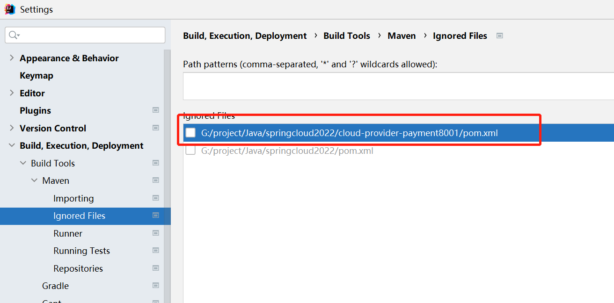

#### 🌵 通过`spring initializr`创建(不推荐)

我们也可以通过这种方式创建, 好处是可以选择组件, 学习起来比较方便, 我们来看一下


然后点击下一步, 依赖的话勾选一个web就可以创建了


创建完成是这个样子的


我们可以看到文件夹上没有颜色, 而且里面文件报红, 别慌, 我们要先把他和父项目关联一下


然后继续走


点击import


添加我们刚才创建的模块


然后导入即可

然后我们可以看到文件夹有颜色了, 下面配置pom


把parent替换一下

```xml
<parent>
	<groupId>com.objcat</groupId>
	<artifactId>test-springcloud</artifactId>
	<version>1.0</version>
</parent>
```

让后关联父pom

```xml
<modules>
	<module>cloud-provider-payment8001</module>
</modules>
```

我们可以看到, 这个创建方法和`new module`比起来非常麻烦, 虽然可以手动选择依赖包, 但当我们熟练后可以直接通过粘贴XML导入依赖, 所以这种方法看看就行, 不要用

### 🌸 配置子pom

然后我们点击这个新建的pom文件, 然后把依赖导进去, 一共四个

```xml
<?xml version="1.0" encoding="UTF-8"?>
<project xmlns="http://maven.apache.org/POM/4.0.0"
         xmlns:xsi="http://www.w3.org/2001/XMLSchema-instance"
         xsi:schemaLocation="http://maven.apache.org/POM/4.0.0 http://maven.apache.org/xsd/maven-4.0.0.xsd">
         
    <parent>
        <artifactId>test-springcloud</artifactId>
        <groupId>com.objcat</groupId>
        <version>1.0</version>
    </parent>
    
    <modelVersion>4.0.0</modelVersion>

    <artifactId>cloud-provider-payment8001</artifactId>

    <properties>
        <maven.compiler.source>8</maven.compiler.source>
        <maven.compiler.target>8</maven.compiler.target>
    </properties>

    <dependencies>
		<dependency>
            <groupId>org.springframework.boot</groupId>
            <artifactId>spring-boot-starter-web</artifactId>
        </dependency>

        <dependency>
            <groupId>org.springframework.boot</groupId>
            <artifactId>spring-boot-starter-test</artifactId>
        </dependency>

        <dependency>
            <groupId>com.baomidou</groupId>
            <artifactId>mybatis-plus-boot-starter</artifactId>
        </dependency>

        <dependency>
            <groupId>mysql</groupId>
            <artifactId>mysql-connector-java</artifactId>
        </dependency>
    </dependencies>

</project>
```

我说明一下

- spring-boot-starter-web 只要你写接口这个依赖就必须用
- spring-boot-starter-test 做测试用的依赖 我们在开发过程中可能会写一些测试代码
- mybatis-plus-boot-starter 是mybatis的升级版, 一个开箱即用的ORM框架
- mysql-connector-java 连接数据库必要的库

我们会发现`mybatis-plus-boot-starter`和`mysql-connector-java`都没有去写版本号, 如果在通常情况下不写版本号就会报错因为找不到版本, 我们不用配置的原因是因为在父工程中我们配置了`dependencyManagement`来约定版本, 你的明白? 

### 🌸 写yml

在子模块下的`src -> resources`文件夹建立`application.yml`文件


配置说明在注释上都有, 自己看

```yaml
server:
  # 服务端口号
  port: 8080
  servlet:
    encoding:
      # 返回数据使用utf-8编码
      charset: utf-8
      # 强制使用utf-8, 否则某些浏览器中查看会乱码
      force: true
spring:
  application:
    # 服务名称
    name: cloud-payment-service
  datasource:
    # 数据库连接url
    url: 1
    # 数据库驱动类名
    driver-class-name: com.mysql.cj.jdbc.Driver
    # 数据库用户名
    username: root
    # 数据库密码
    password: 123456
mybatis-plus:
  # xml存放位置, 注意中间是两颗星, 如果是一颗直接放在mapper文件夹里的会无法识别
  mapper-locations: classpath:mapper/**/*.xml
```

因为数据库我们还没有开始学, 所以你可以像我这样配置, 把url位置写一个占位符比如`1`, 否则`mybatis`会报错, 如果你有数据库你可以像下面这样配置

```
jdbc:mysql://localhost:3306/test?useUnicode=true&characterEncoding=UTF-8&useSSL=false
```

### 🌸 第一个接口

搞了这么久, 我们应该写一个接口犒劳一下自己了, 不能一直搞配置否则很难坚持下去, 在上面的配置文件中, 虽然我们配置了数据库的路径, 但是我们还没有安装数据库, 所以我们只写一些简单的接口

首先我们按照图片中的目录结构新建文件, 我们先看一下配置好的目录结构, 我们需要创建的效果就是这样的


接下来我们从无到有一步一步来创建

#### 🌵 创建主启动类

我来简单说明一下, 首先我们要创建包, 所谓包其实就是我们的一个目录结构, 在`java`上点击右键, `new package`然后我们输入`com.objcat.payment`, 这个包名你自己起, 然后是我们的`springboot`程序如果想启动, 必须有一个主启动文件, 在图中就是`PaymentApplication`, 我们在这个`payment`包里创建这个文件, 文件如下

```java
@SpringBootApplication
public class PaymentApplication {
    public static void main(String[] args) {
        SpringApplication.run(PaymentApplication.class, args);
    }
}
```

#### 🌵 创建控制器

然后我们想要写接口, 一般情况下是要创建一个控制器, 然后在里面写,我们创建一个`controller`文件夹在里面创建一个`TestController.java`文件, 然后在里面写一个`hello`接口

```java
@RestController
public class TestController {
    @RequestMapping("hello")
    public String hello() {
        return "hello world";
    }
}
```

- `@RestController`是一个Java 注解, 将一个类标记为处理 `RESTful Web` 服务的控制器, 也就是告诉`spring`我们要在这里写接口了

- `@RequestMapping("hello")`这是接口的路径, RequestMapping表示可以用任何请求类型, 如`get, post, put, delete`

然后下面的`hello`方法就是我们的接口, 我们按照上面写完后就可以运行我们的应用试一试了

### 🌸 运行项目

运行项目有多方法, 我们一个一个看

#### 🌵 启动文件运行法

第一种是找到启动文件点右键, 比如我们找到`PaymentApplication`文件, 然后点击右键会看到一个绿色的箭头


#### 🌵 右上角运行法

在IDEA的右上角有运行程序的图标, 当我们运行一次后, 在右上角会自动给我们配置好运行需要的脚本, 所以我们可以点右上角来运行了


#### 🌵 管理器运行法

管理器以前叫做`dashboard`, 现在叫做`services`, 我们可以点击IDEA下方的对应按钮来开启这个面板, 我在上面的教程中也有叙述


如果没有管理器可以点加号然后加一个`springBoot`项目就可以了

### 🌸 测试接口

运行完如果看见控制台上输出一下内容项目就跑起来了

```shell
2023-04-04 14:43:55.587  INFO 12336 --- [           main] o.s.b.w.embedded.tomcat.TomcatWebServer  : Tomcat started on port(s): 8001 (http) with context path ''
2023-04-04 14:43:55.597  INFO 12336 --- [           main] com.objcat.payment.PaymentApplication    : Started PaymentApplication in 2.707 seconds (JVM running for 3.856)
```

看到下面这两行就是成功了

然后我们使用浏览器访问一下试试吧

http://localhost:8001/hello


我们看到网页上出现`hello world`, 到此你已经搭建出来`Spring`项目了, 赶紧喝杯饮料庆祝一下吧!

### 🌸 读取配置文件

配置文件不一定是固定内容也可以配置自定义内容, 我们下面就来看看, 比如我给配置文件加点东西

```yml
test-config:
  name: "张三"
```

然后我们就可以在程序中使用这个配置了, 我们使用`@Value`来读取配置

```java
@RestController
public class TestController {

    @Value("${test-config.name}")
    private String name;

    @RequestMapping("hello")
    public String hello() {
        return "hello world " + name;
    }
}
```

然后我们访问是可以看到张三的, 这就是配置文件的自定义应用


# 🍎 三层架构

这个章节要注意听, 因为它非常重要, 就跟你平时要吃饭要睡觉一样重要

为了方便开发, 我们的`Spring`项目通常都需要遵循三层架构来开发, 即`Controller, Service, Dao`

在你使用插件根据数据库表自动生成代码其实就是生成的这三个层, 我们一起来看看手动创建要怎么做吧

## 🌲 Controller(控制层)

`控制层/接口层`用来写接口, 我们上面的例子已经写过了

```java
@RestController
public class TestController {
    @RequestMapping("/hello")
    public String hello() {
        return "hello world!";
    }
}
```

## 🌲Service/Dao(服务层/数据访问层)

分别是`服务层/业务逻辑层`和`数据访问层/持久层`, 因为篇幅比较长, 我们这里就引入最常使用到的`ORM`框架进行讲解, 点击学习三层架构

[跳转 mybatis_plus](../../mybatis/mybatis_plus/mybatis_plus.md)

# 🍎 打包

我们要发布服务的时候肯定是要打包的, 我们一起来看看吧

## 🌲 正常打包

如果是正常情况下打包是很简单的, 只需要点击`package`就可以了


如果哪个依赖找不到无非就是install一下那个依赖, 然后照旧`package`

## 🌲 非正常打包

### 🌸 Downloading from aliyun

```shell
[INFO] Scanning for projects...
[INFO] 
[INFO] ------------------------< com.objcat:test-api >-------------------------
[INFO] Building test-api 1.0
[INFO]   from pom.xml
[INFO] --------------------------------[ jar ]---------------------------------
Downloading from aliyun: https://maven.aliyun.com/repository/public/com/objcat/test-springcloud/1.0/test-springcloud-1.0.pom
Downloading from central: https://repo.maven.apache.org/maven2/com/objcat/test-springcloud/1.0/test-springcloud-1.0.pom
[INFO] ------------------------------------------------------------------------
[INFO] BUILD FAILURE
[INFO] ------------------------------------------------------------------------
[INFO] Total time:  5.099 s
[INFO] Finished at: 2023-09-03T22:16:26+08:00
[INFO] ------------------------------------------------------------------------
[ERROR] Failed to execute goal on project test-api: Could not resolve dependencies for project com.objcat:test-api:jar:1.0: Failed to collect dependencies at com.objcat:test-api-common:jar:1.0: Failed to read artifact descriptor for com.objcat:test-api-common:jar:1.0: The following artifacts could not be resolved: com.objcat:test-springcloud:pom:1.0 (absent): Could not find artifact com.objcat:test-springcloud:pom:1.0 in aliyun (https://maven.aliyun.com/repository/public) -> [Help 1]
[ERROR] 
[ERROR] To see the full stack trace of the errors, re-run Maven with the -e switch.
[ERROR] Re-run Maven using the -X switch to enable full debug logging.
[ERROR] 
[ERROR] For more information about the errors and possible solutions, please read the following articles:
[ERROR] [Help 1] http://cwiki.apache.org/confluence/display/MAVEN/DependencyResolutionException
```

我们可以看到它尝试在阿里云拉取了父工程的pom, 显而易见云上是没有父工程的pom, 所以编译失败了, 我需要`install`一下父工程


然后我们发现又报错了

```SHELL
[FATAL] Non-resolvable parent POM for com.objcat:test-security:1.0: Could not find artifact com.objcat:test-springcloud:pom:1.0 in aliyunmaven (https://maven.aliyun.com/repository/public) and 'parent.relativePath' points at wrong local POM @ line 6, column 13
[FATAL] Non-resolvable parent POM for com.objcat:test-shiro-token:1.0: com.objcat:test-springcloud:pom:1.0 was not found in https://maven.aliyun.com/repository/public during a previous attempt. This failure was cached in the local repository and resolution is not reattempted until the update interval of aliyunmaven has elapsed or updates are forced and 'parent.relativePath' points at wrong local POM @ line 6, column 13
[FATAL] Non-resolvable parent POM for com.objcat:test-shiro-session:1.0: com.objcat:test-springcloud:pom:1.0 was not found in https://maven.aliyun.com/repository/public during a previous attempt. This failure was cached in the local repository and resolution is not reattempted until the update interval of aliyunmaven has elapsed or updates are forced and 'parent.relativePath' points at wrong local POM @ line 6, column 13
[FATAL] Non-resolvable parent POM for com.objcat:test-shiro-jwt:1.0: com.objcat:test-springcloud:pom:1.0 was not found in https://maven.aliyun.com/repository/public during a previous attempt. This failure was cached in the local repository and resolution is not reattempted until the update interval of aliyunmaven has elapsed or updates are forced and 'parent.relativePath' points at wrong local POM @ line 6, column 13
[FATAL] Non-resolvable parent POM for com.objcat:test-nacos:1.0: com.objcat:test-springcloud:pom:1.0 was not found in https://maven.aliyun.com/repository/public during a previous attempt. This failure was cached in the local repository and resolution is not reattempted until the update interval of aliyunmaven has elapsed or updates are forced and 'parent.relativePath' points at wrong local POM @ line 6, column 13
```


原因出在这几个子模块上面, 因为使用了`0.xxx`做文件夹名, 里面包含`.`后会有问题, 所以他们变的不太老实, 而且这个错误难以排查, 后来我把`.`改成`-`发现可以了

```xml
<modules>
	<module>0-test-auth/test-security</module>
	<module>0-test-auth/test-shiro-token</module>
	<module>0-test-auth/test-shiro-session</module>
	<module>0-test-auth/test-shiro-jwt</module>
	<module>1-test-spring-alibaba/test-nacos</module>
	<module>2-test-spring-cloud/test-spring-boot-starter-web</module>
	<module>test-api</module>
	<module>test-api-common</module>
</modules>
```

# 🍎 选学内容

## 🌲 自动生成代码

首先我们要下载插件`MyBatisX`


### 🌸 新建数据库

然后我们新建一个数据库用于测试使用, 比如我这里叫做objcat


然后给数据库起个名字


### 🌸 新建表

然后我们创建表


把下面的SQL填写进去

```sql
CREATE TABLE user
(
    id          bigint AUTO_INCREMENT COMMENT '身份id'
        PRIMARY KEY,
    name        varchar(50)                                NULL COMMENT '名字',
    username    varchar(20)                                NULL COMMENT '用户名',
    password    varchar(32)                                NULL COMMENT '密码',
    salt        varchar(10)                                NOT NULL COMMENT '盐',
    status      int              DEFAULT 0                 NULL COMMENT '状态: 0正常 1未激活 3冻结',
    create_time datetime         DEFAULT CURRENT_TIMESTAMP NOT NULL COMMENT '创建时间',
    update_time datetime         DEFAULT CURRENT_TIMESTAMP NOT NULL ON UPDATE CURRENT_TIMESTAMP COMMENT '修改时间',
    is_delete   tinyint UNSIGNED DEFAULT 0                 NULL COMMENT '是否删除',
    CONSTRAINT user_username_uindex
        UNIQUE (username)
) ENGINE = InnoDB
  DEFAULT CHARSET = utf8mb4 COMMENT '用户表';
```

执行完毕后我们会发现多了一个表


### 🌸 使用插件自动生成代码

我们在数据库表上点击右键, 然后选择`MybatisX-Generator`


然后会弹出对话框

​


生成后是这样的


自动生成的代码需要好好的说一下, 因为这是我`spring-boot`的基础结构, 结构图如下

```
src
├── main
│   ├── java 
│   │   └── com.example.demo
│   │       ├── DemoApplication.java // Spring Boot启动类
│   │       ├── controller
│   │       │   └── DemoController.java    // Controller
│   │       ├── mapper
│   │       │   └── DemoMapper.java        // Mapper
│   │       └── service
│   │           └── DemoService.java      // Service
│   └── resources
│       └── application.yml                // 配置文件
└── test
    └── java 
        └── com.example.demo
            └── DemoApplicationTests.java   // 测试类
```

- Controller: 处理请求和响应,负责接受客户端请求并调用服务层进行业务处理。通常用@Controller注解标注。
- Mapper: 负责数据库操作,进行ORM映射(Object-Relational Mapping),通常使用MyBatis框架。
- Service: 业务逻辑层,处理复杂的业务逻辑,Validator验证,调用Mapper访问数据库。通常用@Service注解标注。

调用步骤就是, `Mapper`写查询数据的方法, 然后`Service`调用`Mapper`加上业务逻辑来封装服务, 最后在`Controller`中返回`Service`中生成的数据

### 🌸 测试

我们要怎么测试自动生成的类呢, 这就要使用到我们的`spring-boot-starter-test`依赖库了, 如果你是跟着我做的那么在前面就已经引入了

我们接下来就来测试一下service是否好用吧, 首先我们在测试类中创建包结构, 注意如果包名不对程序是不能跑起来的


然后在里面写一个测试类


里面按照我的写

```java
@SpringBootTest
public class TestUserService {
    @Autowired
    private UserService userService;

    @Test
    public void test() {
        User user = userService.list().get(0);
        System.out.println(user.toString());
    }
}
```

然后在数据库中添加几条数据就能进行查询了

## 🌲 热部署工具安装

每次修改完代码手动重启都十分麻烦, 那么怎么来实现代码自动生效呢

首先添加maven库 - 在子工程中

```xml
<dependency>
	<groupId>org.springframework.boot</groupId>
	<artifactId>spring-boot-devtools</artifactId>
</dependency>
```

然后添加热启动插件 - 在父工程中

```xml
<build>
	<plugins>
		<plugin>
			<groupId>org.springframework.boot</groupId>
			<artifactId>spring-boot-maven-plugin</artifactId>
			<version>${springboot.version}</version>
			<configuration>
				<fork>true</fork>
				<addResources>true</addResources>
			</configuration>
		</plugin>
	</plugins>
</build>
```

然后同步maven

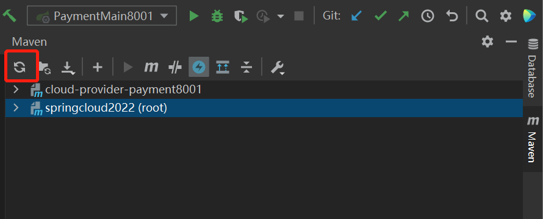

配置idea

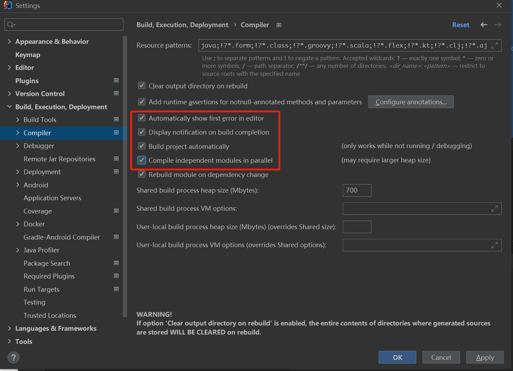

然后按 `ctrl + shift + alt + /`

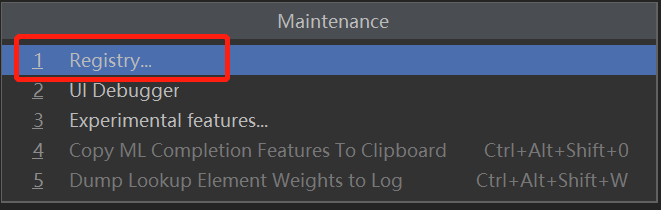

勾选下图所示即可

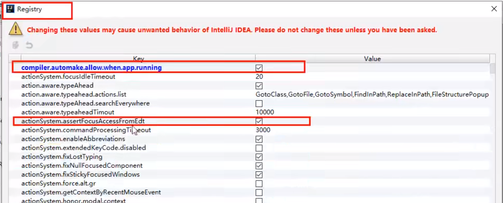

新版本没有上面两个选项, 需要在设置里勾选

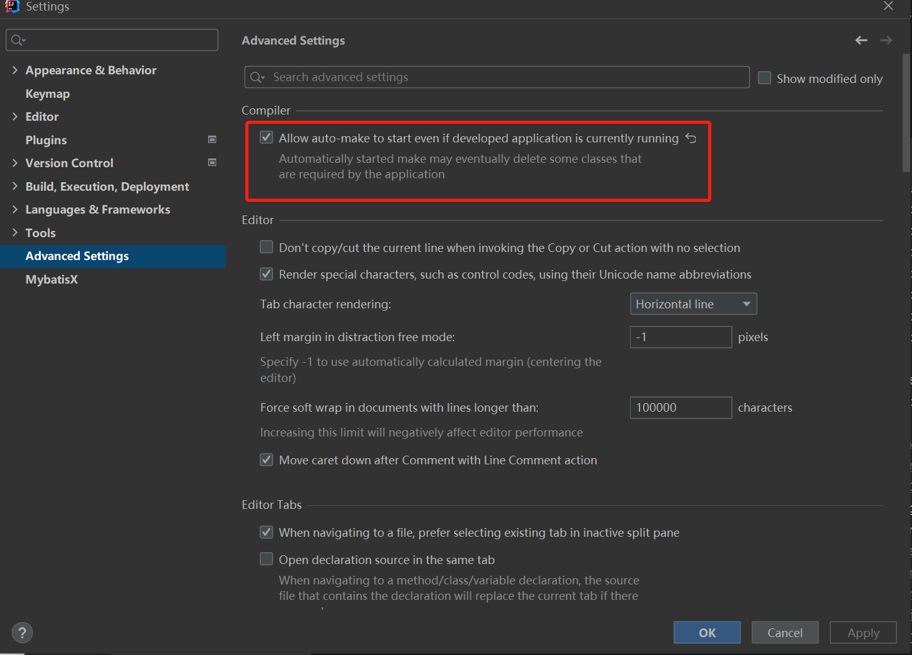

这个功能适合在开发环境使用

## 🌲 开启DashBoard

DashBoard是用来管理多个微服务的面板, 后来改名叫做`Services`, 我们在开发中几乎是必用的, 那么怎么开启呢

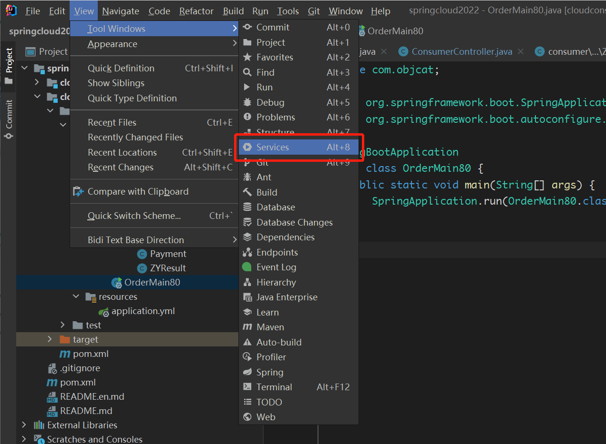

然后在IDEA下面会出来services窗口

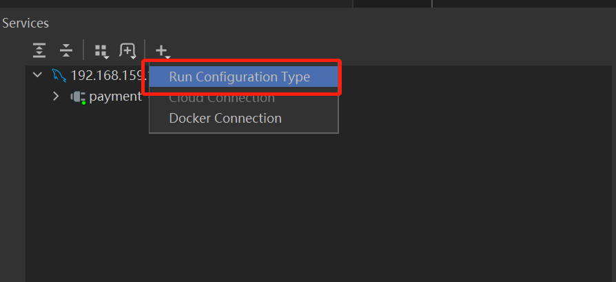

选择`spring-boot`即可

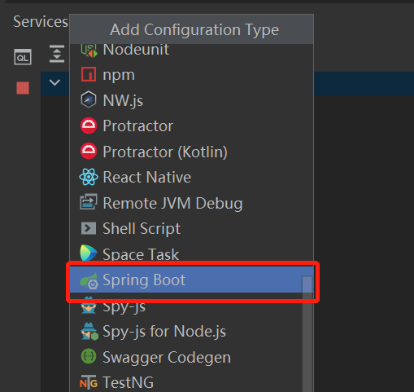

之后就可以很方便的运行了

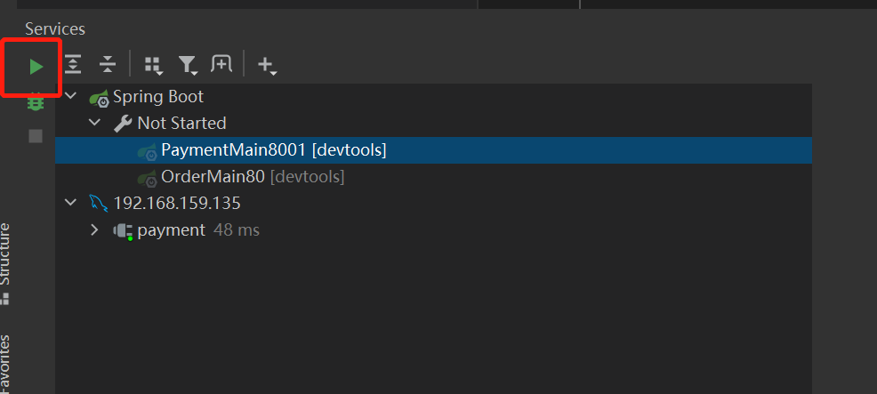

## 🌲 创建通用模块

### 🌸 创建module

有时候一个工程中需要有共用的类和公共的依赖, 比如我们写api接口, 用到的依赖库大致就那么多, 每次都重新写一遍pom, 费时费力, 针对此类问题, 我们可以抽出公共模块来让开发更方便

首先创建一个maven module, 起名叫`test-api-common`


### 🌸 写pom

然后我们把pom改一下, 怎么改? 很简单, 我们把上面创建的`cloud-provider-payment8001`的pom的依赖库直接拷贝过来就可以了

```xml
<dependencies>
	<dependency>
		<groupId>org.springframework.boot</groupId>
		<artifactId>spring-boot-starter-web</artifactId>
	</dependency>

	<dependency>
		<groupId>org.springframework.boot</groupId>
		<artifactId>spring-boot-starter-test</artifactId>
	</dependency>

	<dependency>
		<groupId>com.baomidou</groupId>
		<artifactId>mybatis-plus-boot-starter</artifactId>
	</dependency>

	<dependency>
		<groupId>mysql</groupId>
		<artifactId>mysql-connector-java</artifactId>
	</dependency>
</dependencies>
```

### 🌸 推送到maven本地仓库

然后把它推送到`maven`本地仓库


先`clean`再`install`

我们可以去到仓库里看一下

```
open ~/.m2
```


我们可以看到所谓的提交到本地仓库就是编译成jar包, 然后放到`.m2`仓库中

### 🌸 导入其他服务

提交到maven本地仓库后, 我们其他微服务就能使用它了, 我们子服务的依赖库清空, 只需要引入下面的通用依赖就可以了

```xml
<dependency>
    <groupId>com.objcat</groupId>
    <artifactId>cloud-api-common</artifactId>
    <version>1.0</version>
</dependency>
```

# 🍎 接口

## 🌲 写法

这一章记录接口有哪些写法

### 🌸 返回字符串

我们写接口的时候通常都是如下写法

```java
@RestController
public class TestController {
    @RequestMapping("hello")
    public String hello() {
        return "hello world";
    }
}
```

- @RestController 注解该控制器用来写接口
- @RequestMapping 请求方式任意 如果使用@GetMapping注解则该接口只接受Get请求

为了方便我们下面的接口默认不限制请求方式

### 🌸 返回字典

我们可以看到上面的接口返回的是一个`hello world`字符串, 这是接口最基本的用法, 慢慢的字符串已经无法表达出我们的信息了, 所以我们使用`xml/json`来传递数据, 这种结构可以返回更多信息, 最简单的就是使用 一个`map`作为返回值

```java
@RequestMapping("hello2")
public Map<String, Object> hello2() {
	Map<String, Object> map = new HashMap<>();
	map.put("code", "200");
	map.put("message", "请求成功");
	Map<String, Object> dataMap = new HashMap<>();
	dataMap.put("name", "张三");
	dataMap.put("age", 18);
	map.put("data", dataMap);
	return map;
}
```

### 🌸 返回自定义对象

我们会发现能表达的信息增加了, 结构也明了了, 但是一直这么使用不太规范, 所以后来我们又把返回值封装成自己的模型, 下面是例子

```java
static class ZYResponseEntity {
	String code;
	String message;
	Map<String, Object> data;
}

@RequestMapping("hello3")
public ZYResponseEntity hello3() {
	ZYResponseEntity responseEntity = new ZYResponseEntity();
	responseEntity.code = "200";
	responseEntity.message = "请求成功";
	Map<String, Object> dataMap = new HashMap<>();
	dataMap.put("name", "张三");
	dataMap.put("age", 18);
	responseEntity.data = dataMap;
	return responseEntity;
}
```

### 🌸 ResponseEntity包装对象

但是问题来了, 我们是否可以配置更多信息呢, 答案是肯定的, 我们可以利用spring提供`ResponseEntity`来包装我们的自定义对象, 的我们在返回数据的时候如果想配置一些参数如`状态码`也可以把返回值包装成实体

```java
@RequestMapping("hello4")
public ResponseEntity<Object> hello4() {
	ZYResponseEntity responseEntity = new ZYResponseEntity();
	responseEntity.code = "200";
	responseEntity.message = "请求成功";
	Map<String, Object> dataMap = new HashMap<>();
	dataMap.put("name", "张三");
	dataMap.put("age", 18);
	responseEntity.data = dataMap;
	return ResponseEntity.status(500).body(responseEntity);
}
```

我们把`status`配置成了`500`, 然后打开请求的控制台发现上面的`Status Code`确实是500


然后我们看一看页面


可以看到页面上的数据是正常显示的, 所以我们可以得到一个结论, 状态码只表示状态, 不影响页面的展示

## 🌲 @RequestParam参数

`@RequestParam`参数是最简单的一种参数, 这种参数用于接收GET或POST请求在URL上拼接的参数, 还有非GET请求传递的正文中的参数, 但值得注意的是正文必须为`application/x-www-form-urlencoded`才能使用这个注解类型接收

### 🌸  接收普通参数

使用`@RequestParam`注解修饰的变量默认不能为空, 否则会抛出异常, 如果想允许为`null`, 需要设置`@RequestParam(required = false)`即可

```java
@RequestMapping("/hello")
String hello(@RequestParam String name) {
	return "hello " + name;
}

/**
GET http://localhost:8001/hello?name=张三

###

POST http://localhost:8001/hello
Content-Type: application/x-www-form-urlencoded

name=张三

结果:
hello 张三
*/
```

有此可见`@RequestParam`接收的参数范围是URL上面的参数和正文中的参数, 如果参数在正文中, 那么类型需要设置为`application/x-www-form-urlencoded`, 

如果是`application/json`则会出现下面的错误

```
Resolved [org.springframework.web.bind.MissingServletRequestParameterException: Required request parameter 'age' for method parameter type String is not present]
```

我们来看一下数据包

```
POST /api/v1/test_post?name=%E5%BC%A0%E4%B8%89 HTTP/1.1
Host: localhost.charlesproxy.com:8080
Content-Type: application/json;
Accept: */*
Accept-Encoding: br;q=1.0, gzip;q=0.9, deflate;q=0.8
User-Agent: ZYKit/1.0 (com.objcat.ZYKit; build:1; iOS 16.2.0) Alamofire/5.5.0
Accept-Language: en;q=1.0
Content-Length: 6
token: xxx
Connection: keep-alive

age=18
```

可以看到虽然里面的值是正确的格式, 但是后台是无法获取的, 可见后台在取值的时候先分辨了`application/json`然后看内容里能不能拿到`json`这个内容里明显是个字段, 并不是`json`格式所以参数是取不到的, 从而报错

### 🌸  接收字典参数

我们传递的参数不仅仅可以转换成单字段, 而且可以转化成字典, 只需把接收的类型设置成`Map`就可以进行自动转换了, 比如前端传递的`name=张三`会转换成`{"name": "张三"}`

```java
@RequestMapping("/hello")
String hello(@RequestParam Map<?, ?> map) {
	return "hello " + map;
}

/**
GET http://localhost:8001/hello?name=张三

###

POST http://localhost:8001/hello?name=张三
Content-Type: application/x-www-form-urlencoded

age=18

结果:
hello {name=张三}
hello {name=张三, age=18}
*/
```

我们会发现如果是POST请求, 那么`@RequestParam`会把URL参数和正文参数组合起来

## 🌲 @RequestBody参数

`@RequestBody`参数又名正文参数, 是放在HTTP协议正文中的, 所以正文只在非GET请求中存在, 如POST, PUT, DELETE

### 🌸  接收普通类型参数

```java
@RequestMapping("/hello")
String hello(@RequestBody String body) {
	System.out.println(body); // name=张三9&age=18 或 {"age":"18"}
	return "hello " + body;
}
```

我们会发现body可能出现两个值, 这是怎么回事呢, 原因就是我们的`content-type`有改变

```
POST http://localhost:8001/hello?name=张三
Content-Type: application/x-www-form-urlencoded

age=18
```

如果是这种, 使用body参数, body会把URL上的参数和正文的参数拼接成`application/x-www-form-urlencoded`的形式也就是`name=张三&age=18`

如果是用的JSON, 那么正文只会收集到`age=18`并转化为JSON, 所以就是`{"age":"18"}`至于`name`字段怎么接收聪明的你应该可以想到, 使用`@RequestParam`接收即可

另外说明一下, 本模块这种普通类型参数在开发中并不常用, 我们在接收`Body`正文的时候一般使用字典或实体来接收, sping会自动帮我们转换

### 🌸  接收字典类型

使用起来也很简单

```java
@RequestMapping("/hello")
String hello(@RequestBody Map<?, ?> body) {
	System.out.println(body); // {"age": "18"}
	return "hello " + body;
}
```

值得注意的是, 使用字典类型接收值前端Header中的`Content-Type`必须设置成`application/json`否则会出现下面的错误

```
Resolved [org.springframework.web.HttpMediaTypeNotSupportedException: Content type 'application/x-www-form-urlencoded;charset=utf-8' not supported]
```

### 🌸  接收自定义对象类型

我们自定义一个`User`类来接收正文中的参数

```java
@Data
public class User {
    String name;
    String age;
}

@RequestMapping("/hello")
String hello(@RequestBody User user) {
	return "hello " + user;
}

/**
POST http://localhost:8001/hello
Content-Type: application/json

{"name": "张三"}

结果:
hello User [Hash = 614413846, name=张三, age=null]
*/

多参数 - 没有什么好说的, @RequestParam接收的是URL上面的参数
@RequestMapping("/hello")
String hello(@RequestBody User user, @RequestParam String name) {
	return "hello " + name + user;
}

/**
POST http://localhost:8001/hello?name=李四
# Content-Type: application/x-www-form-urlencoded
Content-Type: application/json

{"name": "张三"}

结果:
hello 李四User [Hash = 614413846, id=null, name=张三, username=null, password=null, salt=null, status=null, createTime=null, updateTime=null, isDelete=null, serialVersionUID=1]
*/
```

## 🌲multipart/form-data

`content-type`为`multipart/form-data`的请求用处很广, 不仅可以传递字段, 还可以传递二进制流, 接收的时候也使用`@RequestPart`接收 

### 🌸  接收字段

```java
@PostMapping("/hello")
String hello(@RequestPart String name) {
	return name;
}
```

我们使用前端发送网络请求并使用`charles`抓包来看一下协议

```
POST /api/v1/test_upload HTTP/1.1
Host: localhost.charlesproxy.com:8080
Content-Type: multipart/form-data; boundary=Boundary+317AC9825E03A832
Accept: */*
User-Agent: ZYKit/1.0 (iPhone; iOS 16.2; Scale/3.00)
Accept-Language: en;q=1
Content-Length: 116
Accept-Encoding: gzip, deflate
Connection: keep-alive

--Boundary+317AC9825E03A832
Content-Disposition: form-data; name="name"

张三
--Boundary+317AC9825E03A832--
```

我们可以看到`Content-Type`是`multipart/form-data; boundary=Boundary+317AC9825E03A832`, 分号后面这串字符串是随机的, 一般网络请求第三方库都会有封装

我们主要看正文, 正文是以`--Boundary+317AC9825E03A832`开头, 并以`--Boundary+317AC9825E03A832--`结尾, 里面的`Content-Disposition`就是我们传输的数据了, 这里要注意的是前端传递参数名为`name`必须与我们声明的变量名对应, 否则接收不到文件

我们也可以在注解上指定参数名, 比如我们想要接收参数名叫做`name2`的值, 那我们可以这么写

```
@RequestPart(name = "name2")
```

顺便提一下`@RequestPart`类似注解修饰的变量默认都是要传值的, 如果接收不到值会返回前端`400`的错误, 我们可以使用`@RequestPart(required = false)`来指定值非必传

### 🌸  接收单文件

接收文件与接收字段类似, 只不过我们需要使用`MultipartFile`来接收文件, 并且参数名默认是与我们的变量名一样为`file`

```java
@RequestMapping("/test_upload")
String hello(@RequestPart MultipartFile file1) {
	return "hello world!";
}
```

我们一起来看一下数据包

```
POST /api/v1/test_upload HTTP/1.1
Host: localhost.charlesproxy.com:8080
Content-Type: multipart/form-data; boundary=Boundary+A7AB5CB2A9414769
Accept: */*
User-Agent: ZYKit/1.0 (iPhone; iOS 16.2; Scale/3.00)
Accept-Language: en;q=1
Content-Length: 168
Accept-Encoding: gzip, deflate
Connection: keep-alive

--Boundary+A7AB5CB2A9414769
Content-Disposition: form-data; name="file1"; filename="fileName1"
Content-Type: multipart/form-data

123
--Boundary+A7AB5CB2A9414769--
```

可以看到文件并不复杂, 就是多了个文件名`filename`这个前端是可以指定的, 当然我们这里传递的不是文件, 而是字符串`123`, 这无妨, 因为都是数据, 我们只是用来测试, 我们来看一下数据

```java
file1 = {StandardMultipartHttpServletRequest$StandardMultipartFile@7047} 
 part = {ApplicationPart@7078} 
  fileItem = {DiskFileItem@7080} "name=fileName1, StoreLocation=/private/var/folders/wm/mhtytbyn2h399v6219kyjzb40000gp/T/tomcat.8080.757716260978993468/work/Tomcat/localhost/ROOT/upload_82b7f065_09d1_4bab_8411_4cfd01f61afa_00000006.tmp, size=3 bytes, isFormField=false, FieldName=file1"
   fieldName = "file1"
   contentType = "multipart/form-data"
   isFormField = false
   fileName = "fileName1"
   size = -1
   sizeThreshold = 0
   repository = {File@8348} "/private/var/folders/wm/mhtytbyn2h399v6219kyjzb40000gp/T/tomcat.8080.757716260978993468/work/Tomcat/localhost/ROOT"
   cachedContent = null
   dfos = {DeferredFileOutputStream@8349} 
   tempFile = {File@8350} "/private/var/folders/wm/mhtytbyn2h399v6219kyjzb40000gp/T/tomcat.8080.757716260978993468/work/Tomcat/localhost/ROOT/upload_82b7f065_09d1_4bab_8411_4cfd01f61afa_00000006.tmp"
   headers = {FileItemHeadersImpl@8351} 
   defaultCharset = "ISO-8859-1"
  location = {File@7081} "/private/var/folders/wm/mhtytbyn2h399v6219kyjzb40000gp/T/tomcat.8080.757716260978993468/work/Tomcat/localhost/ROOT"
 filename = "fileName1"
```

可以看到我们上传的参数都被后台接收到了

### 🌸  保存文件

我们使用`MultipartFile`提供的方法`transferTo`可以方便的保存文件到本地

```java
@RequestMapping("/test_upload")
String hello(@RequestPart MultipartFile file1) {
	File localfile = new File("/Users/objcat/Desktop/1.txt");
	try {
		file1.transferTo(localfile);
	} catch (IOException e) {
		e.printStackTrace();
	}
	return "hello world!";
}
```

我们可以看到桌面上确实多出来个文本


### 🌸  接收多文件, 多参数

```java
@PostMapping("/test_upload")
public ZYResponseEntity<?> testUpload(@RequestParam String age, @RequestPart String sex, @RequestPart String name, @RequestPart MultipartFile file1, @RequestPart MultipartFile file2) {

	File localfile1 = new File("/Users/objcat/Desktop/1.txt");
	File localfile2 = new File("/Users/objcat/Desktop/2.txt");
	try {
		file1.transferTo(localfile1);
		file2.transferTo(localfile2);
	} catch (IOException e) {
		e.printStackTrace();
	}

	return ZYResponseEntity.success("传输文件成功", name + " " + age + " " + sex );
}
// {"code":"200","message":"传输文件成功","data":"李四 18 man"}
```

我们来看看数据包

```
POST /api/v1/test_upload?age=18 HTTP/1.1
Host: localhost.charlesproxy.com:8080
Content-Type: multipart/form-data; boundary=Boundary+3F818FD93F66B32F
Accept: */*
User-Agent: ZYKit/1.0 (iPhone; iOS 16.2; Scale/3.00)
Accept-Language: en;q=1
Content-Length: 473
Accept-Encoding: gzip, deflate
Connection: keep-alive

--Boundary+3F818FD93F66B32F
Content-Disposition: form-data; name="sex"

man
--Boundary+3F818FD93F66B32F
Content-Disposition: form-data; name="name"

李四››
--Boundary+3F818FD93F66B32F
Content-Disposition: form-data; name="file1"; filename="fileName1"
Content-Type: multipart/form-data

123
--Boundary+3F818FD93F66B32F
Content-Disposition: form-data; name="file2"; filename="fileName2"
Content-Type: multipart/form-data

123
--Boundary+3F818FD93F66B32F--
```

我们可以看到, 不仅有`formData`中的参数, 也有地址栏上的参数, 都是可以处理的

### 🌸  接收文件列表

```java
@PostMapping("/test_upload_list")
public ZYResponseEntity<?> testUploadList(@RequestPart List<MultipartFile> files, @RequestPart String name) {
	System.out.println(files);
	return ZYResponseEntity.success("传输文件列表成功", files.get(0).getOriginalFilename() + " " + files.get(1).getOriginalFilename() + " " + name);
}
// {"code":"200","message":"传输文件列表成功","data":"file1 file2 李四"}
```

我们来看一下数据包

```
POST /api/v1/test_upload_list HTTP/1.1
Host: localhost.charlesproxy.com:8080
Content-Type: multipart/form-data; boundary=Boundary+7B3FF1BAA6DEA2CD
Accept: */*
User-Agent: ZYKit/1.0 (iPhone; iOS 16.2; Scale/3.00)
Accept-Language: en;q=1
Content-Length: 385
Accept-Encoding: gzip, deflate
Connection: keep-alive

--Boundary+7B3FF1BAA6DEA2CD
Content-Disposition: form-data; name="name"

李四››
--Boundary+7B3FF1BAA6DEA2CD
Content-Disposition: form-data; name="files"; filename="file1"
Content-Type: multipart/form-data

123
--Boundary+7B3FF1BAA6DEA2CD
Content-Disposition: form-data; name="files"; filename="file2"
Content-Type: multipart/form-data

123
--Boundary+7B3FF1BAA6DEA2CD--
```

## 🌲 内部接口

### 🌸 参数接收

内部参数是我们, Java Servlet API 中的接口, 它代表了一个客户端向服务器发起的 HTTP 请求。通过 HttpServletRequest 接口，开发人员可以获取客户端请求中的信息，如请求方法、URL、请求头、请求参数等，并可以向客户端发送响应。

```java
@RequestMapping("/hello")
String hello(HttpServletRequest request, HttpServletResponse response) {
	System.out.println(request.getRequestURL());
	response.setStatus(500);
	return "hello world!";
}
```

### 🌸 依赖注入

我们也可以使用依赖注入的方式来使用内部接口

```java
@Resource
private HttpServletRequest request;

@Resource
private HttpServletResponse response;
```

## 🌲 无参数接口

```java
@RequestMapping("/hello")
String hello() {
	return "hello world!";
}
```

## 🌲 接口异常捕获处理

在前端调用接口的时候经常会出现一些错误, 如果在程序内部处理我们可能会多些很多代码和不好修改, 不好迁移, 所以我们一般都会做通用错误拦截, 然后给用户返回一段带有错误原因的Json

我们先从最简单的开始, 我们给`hello`接口做一些修改, 让它能够抛出异常

```java
@RestController
public class TestController {
    @RequestMapping("/hello")
    String hello(@RequestParam String name) {
        return "hello world " + name;
    }
}
```

我们在上面已经学过了使用`@RequestParam`注解修饰的变量在请求时默认必须不为空, 否则会出现报错, 我们就不给它传参数让它抛出异常, 写好后我们访问网址

http://localhost:8001/hello

发现不行了


然后我们在后台看一下报错

```
2023-08-23 15:31:12.463  WARN 25593 --- [nio-8001-exec-1] .w.s.m.s.DefaultHandlerExceptionResolver : Resolved [org.springframework.web.bind.MissingServletRequestParameterException: Required request parameter 'name' for method parameter type String is not present]
```

意思是`name`不存在, 那我们如果想提示给用户要怎么做呢?

我们需要建一个类叫做`TestExceptionHandler`

```java
@RestControllerAdvice
public class TestExceptionHandler {
    @ExceptionHandler(MissingServletRequestParameterException.class)
    @ResponseBody
    public ResponseEntity<Object> missingServletRequestParameterExceptionHandler(MissingServletRequestParameterException e) {
        HashMap<String, String> hashMap = new HashMap<>();
        hashMap.put("code", "200");
        hashMap.put("message", e.toString());
        hashMap.put("data", null);
        return ResponseEntity.status(HttpStatus.OK).body(hashMap);
    }
}
```

- @RestControllerAdvice 注解说明它是一个`ExceptionHandler`
- @ExceptionHandler 注解里面传递要捕获的异常

然后我们再次访问接口看一看

```
{"code":"200","data":null,"message":"org.springframework.web.bind.MissingServletRequestParameterException: Required request parameter 'name' for method parameter type String is not present"}
```

我们发现是一段json, 而不是那个报错的空白页面了

# 🍎 排除模块

有时候由于项目功能可能不需要导入公共模块中的某些依赖, 所以我们需要进行排除, 这里就使用nacos为例子, 注意这只是一个例子!

```xml
<dependencies>
	<dependency>
		<groupId>org.objcat</groupId>
		<artifactId>test-common</artifactId>
		<version>1.0</version>
		<exclusions>
			<exclusion>
				<groupId>com.alibaba.cloud</groupId>
				<artifactId>spring-cloud-starter-alibaba-nacos-discovery</artifactId>
			</exclusion>
		</exclusions>
	</dependency>
</dependencies>
```

因为我创建的`新服务`仅仅是一个测试服务, 所以不需要使用`nacos`, 然而不启动`nacos`程序就会报错, 所以我这里把`nacos`排除了使用`exclusion`标签

# 🍎 本地化

有时候接口返回的`message`可能需要根据请求的地区来进行显示中文或者英文, 那么我们就来看看怎么实现吧

## 🌲 创建i18n文件夹

在`resource`下创建`i18n`文件夹(internationalization国际化, 共18个字母简称i18n)

## 🌲 创建Resource Bundle

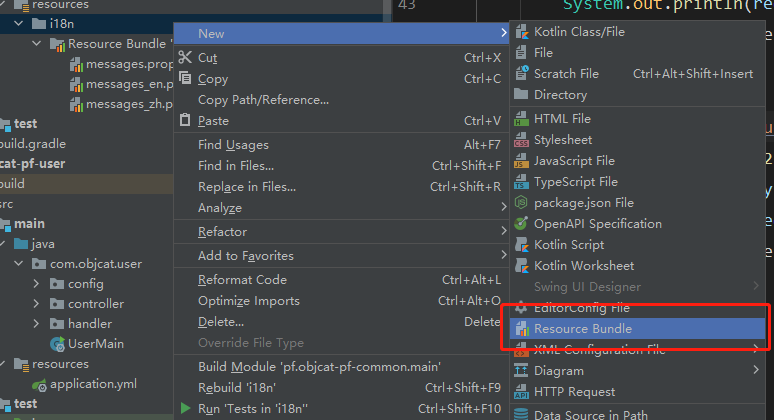

然后我们需要对它进行一些配置

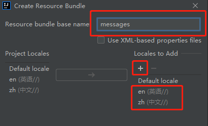

创建完成后, 我们看一下就是这个样子

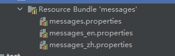

然后我们就来修改en和zh两个文件吧, 分别填入我们的字段

```
title = "title"
```

```
title = "标题"
```


## 🌲 代码实现工具类

配置了这么久, 你可能会问那怎么调用呢, 我们需要在代码里写一个工具类

```java
public class ZYI18nUtil {

    private final MessageSource messageSource;

    public ZYI18nUtil() {
        messageSource = initMessageSource();
    }

    private MessageSource initMessageSource() {
        ReloadableResourceBundleMessageSource messageSource = new ReloadableResourceBundleMessageSource();
        messageSource.setBasename("i18n/messages");
        messageSource.setDefaultEncoding("UTF-8");
        return messageSource;
    }

    /**
     * description: 获取本地化文字 <br>
     * version: 1.0 <br>
     * date: 2022/10/2 11:36 <br>
     * author: objcat <br>
     *
     * @param key 键
     * @return value值
     */
    public String get(String key) {
        return get(key, Locale.CHINA);
    }

    /**
     * description: 获取本地化文字 <br>
     * version: 1.0 <br>
     * date: 2022/10/2 11:36 <br>
     * author: objcat <br>
     *
     * @param key    键
     * @param locale 语言
     * @return value值
     */
    public String get(String key, Locale locale) {
        return messageSource.getMessage(key, null, locale);
    }
}
```

是不是挠挠的简单呢, 那我们就来用一下吧

```java
// 中文
System.out.println(new ZYI18nUtil().get("title"));
// 英文
System.out.println(new ZYI18nUtil().get("title", Locale.ENGLISH));
```

## 🌲 依赖注入

因为每次我们使用`ZYI18nUtil`对象的时候都需要重新创建一个, 这样效率很低, 所以可以交给的`Spring IOC`进行管理

### 🌸 对象放入容器

我们需要新建config包, 然后在包下创建一个类叫做`AppConfig`, 我们使用`@Bean`来把对象交给容器去管理

```java
@Configuration
public class AppConfig {
    @Bean
    public ZYI18nUtil zyi18nUtil() {
        return new ZYI18nUtil();
    }
}
```

### 🌸 依赖注入

我们使用的时候也很简单使用`@Resource`或`@Autowired`都可以注入, 这样我们使用的时候就直接从IOC容器里面拿, 就不需要重新创建对象, 避免了性能开销

```java
@Resource
private ZYI18nUtil zyi18nUtil;

@RequestMapping("/request1")
ZYResult<Object> request1() {
	System.out.println(zyi18nUtil.get("title"));
	return ZYResult.success();
}
```

## 🌲 单例

除了依赖注入我们也可以使用静态变量来搞, 增加下面的方法

```java
public class ZYI18nUtil {

    private static ZYI18nUtil zyi18nUtil;

    public static ZYI18nUtil getInstance() {
        if (zyi18nUtil == null) {
            zyi18nUtil = new ZYI18nUtil();
        }
        return zyi18nUtil;
    }
}
```

然后我们可以直接在接口中使用

```java
@RequestMapping("/request1")
ZYResult<Object> request1() {
	System.out.println(ZYI18nUtil.getInstance().get("title"));
	return ZYResult.success();
}
```

# 🍎 配置多环境

## 🌲 application.yml配置多环境

### 🌸 新建配置文件

配置多环境其实非常简单, 首先我们新建3个文件

```
application.yml

application-dev.yml

application-prod.yml
```


### 🌸 配置管理文件

然后我们在第一个文件中配置下面属性来设定读取哪个环境的配置文件

```yml
spring:
  profiles:
    active: dev
```

### 🌸 配置环境

然后在`application-dev.yml`, `application-prod.yml`中分别配置

```yml
server:
  # 服务端口号
  port: 8080
  servlet:
    encoding:
      # 返回数据使用utf-8编码
      charset: utf-8
      # 强制使用
      force: true
```

生产环境配置文件

```yml
server:
  # 服务端口号
  port: 80
  servlet:
    encoding:
      # 返回数据使用utf-8编码
      charset: utf-8
      # 强制使用
      force: true
```

然后我们只需要修改主文件中的`active: prod`就能切换生产环境配置文件了

### 🌸 部署

在linux中我们可以配置环境变量来切换环境如

```shell
export SPRING_PROFILES_ACTIVE=prod
```

我们也可以在运行java应用的时候来切换环境

```shell
java -jar myapp.jar --spring.profiles.active=prod
```

我们下面就来测试一下吧, 首先打包


然后在`target`文件夹下面就可以看见包


我们就使用本地的java来运行一下吧, 如果单纯用`java -jar`来执行, 默认就是加载dev环境, 因为我们的配置文件中写的是dev

```shell
objcat@yuanjun-2 target % java -jar test-spring-boot-starter-web-application-active-1.0.jar

  .   ____          _            __ _ _
 /\\ / ___'_ __ _ _(_)_ __  __ _ \ \ \ \
( ( )\___ | '_ | '_| | '_ \/ _` | \ \ \ \
 \\/  ___)| |_)| | | | | || (_| |  ) ) ) )
  '  |____| .__|_| |_|_| |_\__, | / / / /
 =========|_|==============|___/=/_/_/_/
 :: Spring Boot ::               (v2.7.10)

2023-09-04 15:00:33.255  INFO 22089 --- [           main] com.objcat.web.WebApplication            : Starting WebApplication using Java 17.0.5 on yuanjun-2.local with PID 22089 (/Users/objcat/project/Java/test-springcloud/2-test-spring-cloud/test-spring-boot-starter-web-application-active/target/test-spring-boot-starter-web-application-active-1.0.jar started by objcat in /Users/objcat/project/Java/test-springcloud/2-test-spring-cloud/test-spring-boot-starter-web-application-active/target)
2023-09-04 15:00:33.259  INFO 22089 --- [           main] com.objcat.web.WebApplication            : The following 1 profile is active: "dev"
2023-09-04 15:00:34.718  INFO 22089 --- [           main] o.s.b.w.embedded.tomcat.TomcatWebServer  : Tomcat initialized with port(s): 8080 (http)
2023-09-04 15:00:34.732  INFO 22089 --- [           main] o.apache.catalina.core.StandardService   : Starting service [Tomcat]
2023-09-04 15:00:34.732  INFO 22089 --- [           main] org.apache.catalina.core.StandardEngine  : Starting Servlet engine: [Apache Tomcat/9.0.73]
2023-09-04 15:00:34.835  INFO 22089 --- [           main] o.a.c.c.C.[Tomcat].[localhost].[/]       : Initializing Spring embedded WebApplicationContext
2023-09-04 15:00:34.836  INFO 22089 --- [           main] w.s.c.ServletWebServerApplicationContext : Root WebApplicationContext: initialization completed in 1473 ms
2023-09-04 15:00:35.351  INFO 22089 --- [           main] o.s.b.w.embedded.tomcat.TomcatWebServer  : Tomcat started on port(s): 8080 (http) with context path ''
2023-09-04 15:00:35.370  INFO 22089 --- [           main] com.objcat.web.WebApplication            : Started WebApplication in 2.924 seconds (JVM running for 3.58)
2023-09-04 15:00:51.211  INFO 22089 --- [nio-8080-exec-1] o.a.c.c.C.[Tomcat].[localhost].[/]       : Initializing Spring DispatcherServlet 'dispatcherServlet'
2023-09-04 15:00:51.212  INFO 22089 --- [nio-8080-exec-1] o.s.web.servlet.DispatcherServlet        : Initializing Servlet 'dispatcherServlet'
2023-09-04 15:00:51.214  INFO 22089 --- [nio-8080-exec-1] o.s.web.servlet.DispatcherServlet        : Completed initialization in 2 ms
```

然后我们访问8080端口看一下

http://localhost:8080/api/v1/hello


生产环境同理, 我们可以使用`--spring.profiles.active`来标识运行生产环境

```shell
java -jar test-spring-boot-starter-web-application-active-1.0.jar --spring.profiles.active=prod
```

我就不去一一演示了

## 🌲 bootstrap.yml配置多环境

### 🌸 新建配置文件

跟`application.yml`一样多创建三个配置文件, `bootstrap.yml`, `bootstrap-dev.yml`, `bootstrap-prod.yml`


我们会发现下面这个`bootstrap`文件的图标不太对, 不要慌

### 🌸 导入依赖

```xml
<dependency>
	<groupId>org.springframework.cloud</groupId>
	<artifactId>spring-cloud-starter-bootstrap</artifactId>
</dependency>
```

导入依赖后编译我们发现图标正常了


### 🌸 配置管理文件

然后我们配置`bootstrap.yml`, 这个是主文件, 值得注意的是配置这个文件后, 我们的`application.yml`就完全被接管了

```yml
spring:
  profiles:
    active: dev
```

### 🌸 配置环境

这个文件既可以控制`bootstrap-xxx.yml`, 也能控制`application.yml`, 也就是说以前该咋配置, 现在还是咋配置, 没变, 唯一变的就是多出来`bootstrap-xxx.yml`, 这些文件是用来配置如`分布式配置中心`等需要提前进行配置的配置, 为了凑出来一点东西, 那就在里面配置个`nacos`吧

```yml
spring:  
  cloud:  
    nacos:  
      discovery:  
        server-addr: 127.0.0.1:8848  
      config:  
        # 配置中心服务器地址  
        server-addr: 127.0.0.1:8848  
        # 配置文件扩展名  
        file-extension: yml  
        # 配置文件所属组  
        group: DEFAULT_GROUP  
        # 配置文件前缀  
        prefix: ${spring.application.name}
```

# 🍎 自定义配置文件映射实体

我们首先要引入一个包

```xml
<dependency>
	<groupId>org.springframework.boot</groupId>
	<artifactId>spring-boot-configuration-processor</artifactId>
	<optional>true</optional>
</dependency>
```

然后我们新建一个配置文件, 并写上内容

```yml
basic.student.name="张三"
basic.student.age="18"

basic.student2.name="李四"
basic.student2.age="100"
```

然后我们新建两个类, 来承接我们的配置

```java
@Data
public class Student {
    private String name;
    private String age;
}

@Data
@Component
@PropertySource("classpath:test.properties")
@ConfigurationProperties(prefix = "basic")
public class BasicConfig {
    private Student student;
    private Student student2;
}
```

然后我们新建一个测试类

```java
@Test
public void hello() {
	System.out.println(basicConfig.getStudent());
	System.out.println(basicConfig.getStudent2());
}
/**
Student(name="张三", age="18")
Student(name="李四", age="100")
*/
```

我们可以看到配置文件中的配置被自动读取到实体中了

# 🍎 版本选择完整JSON

```json
{
    "git": {
        "branch": "87454b79e1cfa772c013928e06e62457eba7b7df", 
        "commit": {
            "id": "87454b7", 
            "time": "2023-04-07T14:10:04Z"
        }
    }, 
    "build": {
        "version": "0.0.1-SNAPSHOT", 
        "artifact": "start-site", 
        "versions": {
            "spring-boot": "3.0.5", 
            "initializr": "0.20.0-SNAPSHOT"
        }, 
        "name": "start.spring.io website", 
        "time": "2023-04-07T14:12:17.694Z", 
        "group": "io.spring.start"
    }, 
    "bom-ranges": {
        "codecentric-spring-boot-admin": {
            "2.4.3": "Spring Boot >=2.3.0.M1 and <2.5.0-M1", 
            "2.5.6": "Spring Boot >=2.5.0.M1 and <2.6.0-M1", 
            "2.6.8": "Spring Boot >=2.6.0.M1 and <2.7.0-M1", 
            "2.7.4": "Spring Boot >=2.7.0.M1 and <3.0.0-M1", 
            "3.0.2": "Spring Boot >=3.0.0-M1 and <3.1.0-M1"
        }, 
        "solace-spring-boot": {
            "1.1.0": "Spring Boot >=2.3.0.M1 and <2.6.0-M1", 
            "1.2.2": "Spring Boot >=2.6.0.M1 and <3.0.0-M1"
        }, 
        "solace-spring-cloud": {
            "1.1.1": "Spring Boot >=2.3.0.M1 and <2.4.0-M1", 
            "2.1.0": "Spring Boot >=2.4.0.M1 and <2.6.0-M1", 
            "2.3.2": "Spring Boot >=2.6.0.M1 and <3.0.0-M1"
        }, 
        "spring-cloud": {
            "Hoxton.SR12": "Spring Boot >=2.2.0.RELEASE and <2.4.0.M1", 
            "2020.0.6": "Spring Boot >=2.4.0.M1 and <2.6.0-M1", 
            "2021.0.0-M1": "Spring Boot >=2.6.0-M1 and <2.6.0-M3", 
            "2021.0.0-M3": "Spring Boot >=2.6.0-M3 and <2.6.0-RC1", 
            "2021.0.0-RC1": "Spring Boot >=2.6.0-RC1 and <2.6.1", 
            "2021.0.6": "Spring Boot >=2.6.1 and <3.0.0-M1", 
            "2022.0.0-M1": "Spring Boot >=3.0.0-M1 and <3.0.0-M2", 
            "2022.0.0-M2": "Spring Boot >=3.0.0-M2 and <3.0.0-M3", 
            "2022.0.0-M3": "Spring Boot >=3.0.0-M3 and <3.0.0-M4", 
            "2022.0.0-M4": "Spring Boot >=3.0.0-M4 and <3.0.0-M5", 
            "2022.0.0-M5": "Spring Boot >=3.0.0-M5 and <3.0.0-RC1", 
            "2022.0.0-RC1": "Spring Boot >=3.0.0-RC1 and <3.0.0-RC2", 
            "2022.0.0-RC2": "Spring Boot >=3.0.0-RC2 and <3.0.0", 
            "2022.0.2": "Spring Boot >=3.0.0 and <3.1.0-M1"
        }, 
        "spring-cloud-azure": {
            "4.7.0": "Spring Boot >=2.5.0.M1 and <3.0.0-M1", 
            "5.0.0": "Spring Boot >=3.0.0-M1 and <3.1.0-M1"
        }, 
        "spring-cloud-gcp": {
            "2.0.11": "Spring Boot >=2.4.0-M1 and <2.6.0-M1", 
            "3.4.8": "Spring Boot >=2.6.0-M1 and <3.0.0-M1", 
            "4.1.4": "Spring Boot >=3.0.0-M1 and <3.1.0-M1"
        }, 
        "spring-cloud-services": {
            "2.3.0.RELEASE": "Spring Boot >=2.3.0.RELEASE and <2.4.0-M1", 
            "2.4.1": "Spring Boot >=2.4.0-M1 and <2.5.0-M1", 
            "3.3.0": "Spring Boot >=2.5.0-M1 and <2.6.0-M1", 
            "3.4.0": "Spring Boot >=2.6.0-M1 and <2.7.0-M1", 
            "3.5.0": "Spring Boot >=2.7.0-M1 and <3.0.0-M1", 
            "4.0.0": "Spring Boot >=3.0.0 and <3.1.0-M1"
        }, 
        "spring-shell": {
            "2.1.6": "Spring Boot >=2.7.0 and <3.0.0-M1", 
            "3.0.0": "Spring Boot >=3.0.0 and <3.1.0-M1"
        }, 
        "vaadin": {
            "14.9.6": "Spring Boot >=2.1.0.RELEASE and <2.6.0-M1", 
            "23.2.15": "Spring Boot >=2.6.0-M1 and <2.7.0-M1", 
            "23.3.10": "Spring Boot >=2.7.0-M1 and <3.0.0-M1", 
            "24.0.3": "Spring Boot >=3.0.0-M1 and <3.1.0-M1"
        }, 
        "wavefront": {
            "2.0.2": "Spring Boot >=2.1.0.RELEASE and <2.4.0-M1", 
            "2.1.1": "Spring Boot >=2.4.0-M1 and <2.5.0-M1", 
            "2.2.2": "Spring Boot >=2.5.0-M1 and <2.7.0-M1", 
            "2.3.4": "Spring Boot >=2.7.0-M1 and <3.0.0-M1", 
            "3.0.1": "Spring Boot >=3.0.0-M1 and <3.1.0-M1"
        }
    }, 
    "dependency-ranges": {
        "okta": {
            "1.4.0": "Spring Boot >=2.2.0.RELEASE and <2.4.0-M1", 
            "1.5.1": "Spring Boot >=2.4.0-M1 and <2.4.1", 
            "2.0.1": "Spring Boot >=2.4.1 and <2.5.0-M1", 
            "2.1.6": "Spring Boot >=2.5.0-M1 and <3.0.0-M1", 
            "3.0.3": "Spring Boot >=3.0.0-M1 and <3.1.0-M1"
        }, 
        "mybatis": {
            "2.1.4": "Spring Boot >=2.1.0.RELEASE and <2.5.0-M1", 
            "2.2.2": "Spring Boot >=2.5.0-M1 and <2.7.0-M1", 
            "2.3.0": "Spring Boot >=2.7.0-M1 and <3.0.0-M1", 
            "3.0.0": "Spring Boot >=3.0.0-M1"
        }, 
        "pulsar": {
            "0.2.0": "Spring Boot >=3.0.0 and <3.1.0-M1"
        }, 
        "pulsar-reactive": {
            "0.2.0": "Spring Boot >=3.0.0 and <3.1.0-M1"
        }, 
        "camel": {
            "3.5.0": "Spring Boot >=2.3.0.M1 and <2.4.0-M1", 
            "3.10.0": "Spring Boot >=2.4.0.M1 and <2.5.0-M1", 
            "3.13.0": "Spring Boot >=2.5.0.M1 and <2.6.0-M1", 
            "3.17.0": "Spring Boot >=2.6.0.M1 and <2.7.0-M1", 
            "3.20.2": "Spring Boot >=2.7.0.M1 and <3.0.0-M1", 
            "4.0.0-M2": "Spring Boot >=3.0.0-M1 and <3.1.0-M1"
        }, 
        "picocli": {
            "4.7.0": "Spring Boot >=2.5.0.RELEASE and <3.1.0-M1"
        }, 
        "open-service-broker": {
            "3.2.0": "Spring Boot >=2.3.0.M1 and <2.4.0-M1", 
            "3.3.1": "Spring Boot >=2.4.0-M1 and <2.5.0-M1", 
            "3.4.1": "Spring Boot >=2.5.0-M1 and <2.6.0-M1", 
            "3.5.0": "Spring Boot >=2.6.0-M1 and <2.7.0-M1"
        }
    }
}
```

# 🍎 FAQ

## 🌲 xxxx 中没有主清单属性

```
test-spring-boot-starter-web-application-active-1.0.jar中没有主清单属性
```

解决方法是把插件添加到pom

```xml
<build>
	<plugins>
		<plugin>
			<groupId>org.springframework.boot</groupId>
			<artifactId>spring-boot-maven-plugin</artifactId>
			<configuration>
				<executable>true</executable>
			</configuration>
			<executions>
				<execution>
					<goals>
						<goal>repackage</goal>
					</goals>
				</execution>
			</executions>
		</plugin>
	</plugins>
</build>
```