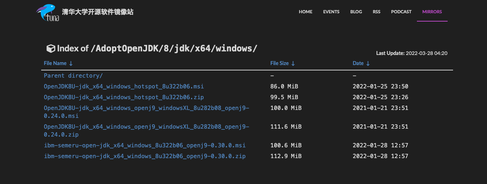
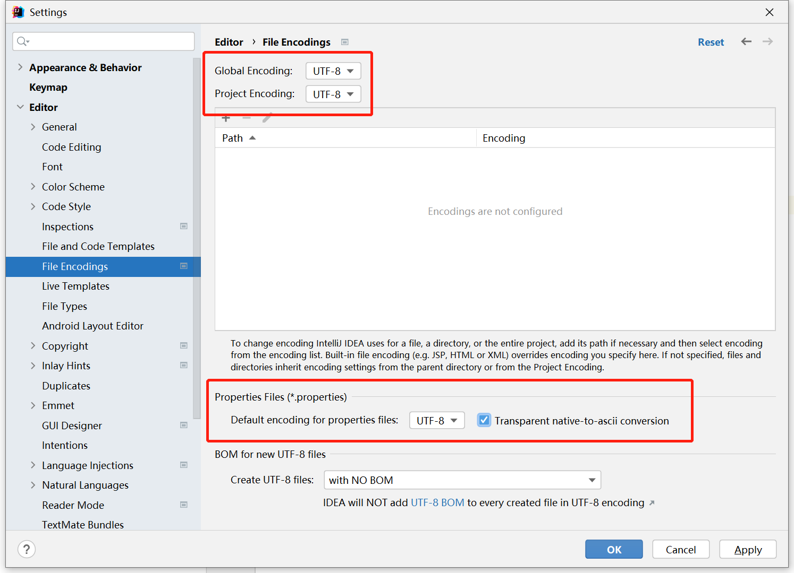
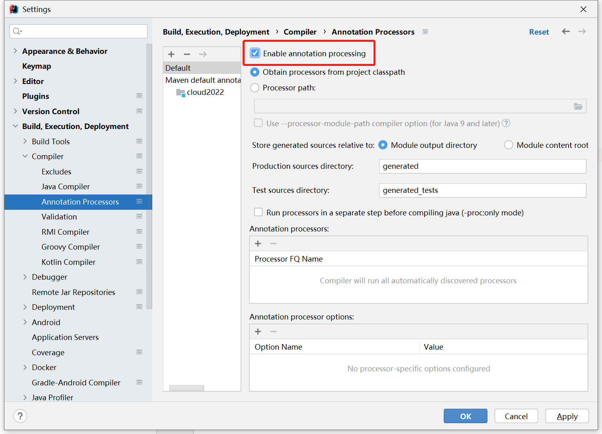
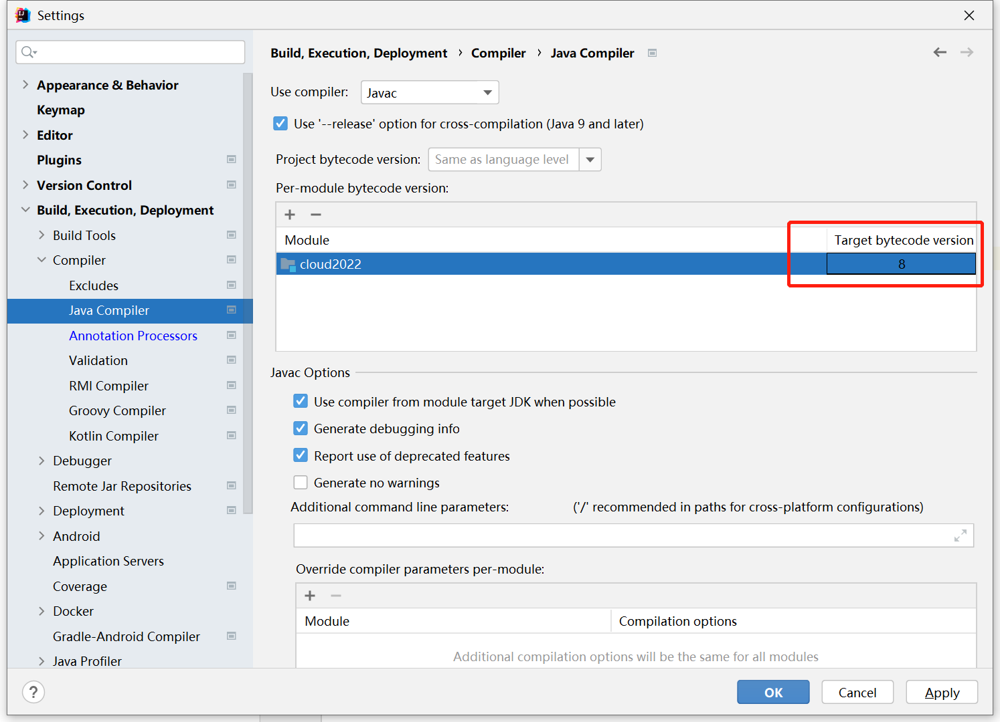
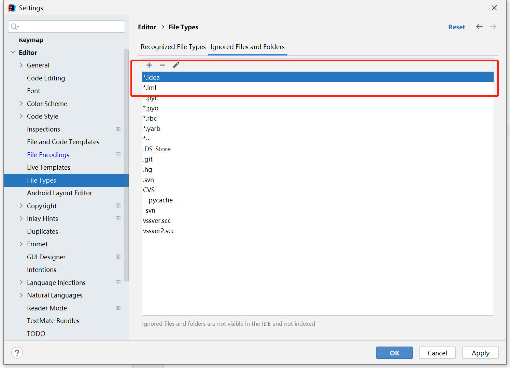
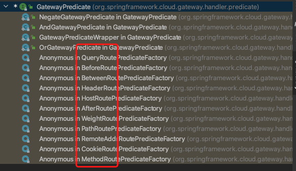

# 🍎 简介

Spring Cloud是一系列框架的有序集合。它利用Spring Boot的开发便利性巧妙地简化了分布式系统基础设施的开发，如服务发现注册、配置中心、消息总线、负载均衡、断路器、数据监控等，都可以用Spring Boot的开发风格做到一键启动和部署。Spring Cloud并没有重复制造轮子，它只是将各家公司开发的比较成熟、经得起实际考验的服务框架组合起来，通过Spring Boot风格进行再封装屏蔽掉了复杂的配置和实现原理，最终给开发者留出了一套简单易懂、易部署和易维护的分布式系统开发工具包。

一般情况下, 我们使用`spring-cloud`是搭建微服务的项目, 我们利用`maven module`的方式来把项目按照功能模块细分为不同的模块, 每一个功能模块都可以独立运行, 在`spring-boot`中也喜欢这种分模块的写法, 但是它的主启动类只有一个, 只是通过模块来区分功能区, 看起来很微服务而已

另外本人认为与其把Spring Cloud说成是全家桶, 倒不如说成是一种思想, 把业务模块拆分细分成多个细小的模块, 每个模块都是一个项目, 都可以独立运行, 模块之间可以通过接口调用服务

# 🍎 环境搭建

环境搭建无非就是Java怎么下载, 现阶段已经很少有人直接去`Oracle`官网下载了, 都是使用openJDK来做, 其中比较有名的就是`AdoptOpenJDK`, 后改名为`Adoptium`, 而版本一般是选择`java8`或`java17`, 因为`17`是一个长期维护版本, 而且`spring-boot 3.0`最低支持版本是17所以说切换过去只是早晚的问题

https://mirrors.tuna.tsinghua.edu.cn/Adoptium/8/jdk/x64/windows/



可以看到有`hotspot`和`openj9`两个版本, 推荐下载`hotspot`因为另一个我也不熟悉, 据说是某些方面性能更强

https://mirrors.tuna.tsinghua.edu.cn/AdoptOpenJDK/8/jdk/x64/windows/OpenJDK8U-jdk_x64_windows_hotspot_8u322b06.msi

比如这个就是windows版本

https://mirrors.tuna.tsinghua.edu.cn/AdoptOpenJDK/8/jdk/x64/mac/OpenJDK8U-jdk_x64_mac_hotspot_8u322b06.pkg

这个就是mac版本

# 🍎 版本选择

这其实是一个大问题, 因为一个健全的项目使用的`spring-boot`的版本和`spring-cloud`的版本是要对应上的, 否则会出现不兼容的问题, 不是越高越好, 所以我把网站列在下方了, 方便查找

官网:
https://spring.io/

文档:
https://spring.io/projects/spring-boot

Git:
https://github.com/spring-projects/spring-boot
https://github.com/spring-cloud

那么怎么来选择合适的版本呢, 我们可以在官网上看版本对照表

https://spring.io/projects/spring-cloud

| Release Train | Boot Version |
| - | - |
| 2022.0.x aka Kilburn | 3.0.x |
| 2021.0.x aka Jubilee | 2.6.x, 2.7.x (Starting with 2021.0.3) |
| 2020.0.x aka Ilford | 2.4.x, 2.5.x (Starting with 2020.0.3) |
| Hoxton | 2.2.x, 2.3.x (Starting with SR5) |
| Greenwich | 2.1.x |
| Finchley | 2.0.x |
| Edgware | 1.5.x |
| Dalston | 1.5.x |

你可能觉得这张表不太详细, 有更详细的规则在json里

https://start.spring.io/actuator/info

```json
"spring-cloud": {
	"2021.0.8": "Spring Boot >=2.6.0 and <3.0.0", 
	"2022.0.4": "Spring Boot >=3.0.0 and <3.2.0-M1"
}
```

如果你不会选择, 官方还为我们提供了快速搭建项目使用的网站

https://start.spring.io

上面写的内容是如何帮你选择版本, 至于我选择的版本请继续往下看

# 🍎 技术更替

## 🌲 服务注册与发现

| 组件 | 状态 | 备注 |
| - | - | - |
| Eureka | ❌ | 已经不再维护 |
| Nacos | ✔️ | 替换方案 |
| Zookeeper | 🌎 | 备选方案 |
| Consul | 🌎 | 备选方案 |

## 🌲 服务调用

| 组件 | 状态 | 备注 |
| - | - | - |
| Ribbon | ❌ | 正在被慢慢替换 |
| LoadBalancer | ✔️ | 方案2 |

## 🌲 服务调用2

| 组件 | 状态 | 备注 |
| - | - | - |
| Feign | ❌ | 不推荐 |
| OpenFeign | ✔️ | 替换方案 |

## 🌲 服务降级

| 组件 | 状态 | 备注 |
| - | - | - |
| Hystrix | ❌ | 国外废了, 国内大批量在用 |
| Sentinel | ✔️ | 替换方案, 阿里巴巴 |
| resilience4j | 🌎 | 备选方案, 国外推荐 |

## 🌲 服务网关

| 组件 | 状态 | 备注 |
| - | - | - |
| Zuul | ❌ | 不推荐 |
| gateway | ✔️ | 替换方案 |

## 🌲 分布式配置中心

| 组件 | 状态 | 备注 |
| - | - | - |
| Nacos | ✔️ | 方案 |
| Apolo | 🌎 | 备选方案, 协程 |
| spring-cloud-config | 🌎 | 备选方案, spring |

## 🌲 服务总线

| 组件 | 状态 | 备注 |
| - | - | - |
| Bus | ❌ | 不推荐 |
| Nacos | ✔️ | 替换方案 |

# 🍎 搭建项目

## 🌲 创建项目

新建一个普通Maven项目做spring-cloud的父工程, 随便起个名, 比如`test-springcloud`, 这个是老版本的创建界面, 新版本同理, 凑合看吧, 我这里选择的是`1.8`版本的java, 也就是java8


## 🌲 配置Maven

创建后可以出现这样的问题

```
The desired archetype does not exist (org.apache.maven.archetypes:maven-archetype-archetype:1.0)
```

那我们就要去配置`maven`, 可以参考我的文档

[Maven](../../../../package-manager/Maven/Maven.md)

## 🌲 字符编码

修改编码格式为utf-8



## 🌲 注解生效激活

如果不配置这一步, `lombok`会一直弹出提示, 很烦



## 🌲 配置java版本

目前常用两个版本8和17, 我们选择8



## 🌲 文件过滤

有些文件用不到, 可以在idea设置中过滤掉, 也可以不过滤, 看个人习惯



## 🌲 配置父工程pom

### 🌸 选择版本

然后我们要选择一个好的`spingboot`和`springcloud`版本

根据上文提及的`json`文件选用一个比较好的版本, 看我划线的地方, 我这里就选择这个版本了, 可以看到它的`springboot`要求是`大于2.6.1并小于3.0.0`, springcloud要求是`2021.0.6`

https://start.spring.io/actuator/info


为什么要这么选择呢, 我是这样想的, 目前`spring-boot`大体分为2和3两个版本, 3是最新的但是要使用`java17`作为环境, 2是老版本使用`java8`作为环境, 然而3的使用还没有普及, 很多公司的老项目用的还是2, 所以我们这里还是选择了大众使用的2

然后我们再选择`spring-cloud-alibaba`版本

https://central.sonatype.com/artifact/com.alibaba.cloud/spring-cloud-alibaba-dependencies/2022.0.0.0-RC1/versions

我一眼就看到了这个版本


所以下面就是我的版本选择

```
spring-boot 2.7.10
spring-cloud 2021.0.6
spring-cloud-alibaba 2021.0.5.0
```

版本选好了我们先放着 继续往下看

### 🌸 配置packaging为pom

选择完版本了, 我们就要开始配置父工程了, 首先我们找到pom文件, 配置父文件的类型为pom, 因为父工程的pom主要是用来负责管理子项目和引入一些通用的依赖, 不负责打包, 如果不配置会被默认为jar, jar是可以被打包的类型与我们想要的效果不符

```xml
<packaging>pom</packaging>
```

这个地方还有很多可选值, 最常见的就是不填写, 那么默认是jar, 我们的子工程一般是不用配置, 因为微服务的子工程几乎都是jar, 我们接下来来看看gpt的回答

```
在 Maven 中，packaging 元素用于指定 Maven 项目构建时要生成的构件类型。它有以下几种选项：

jar：生成一个 JAR 包，包含项目的编译代码和资源文件。这是最常见的构件类型, 也是默认类型
war：生成一个 WAR 包，包含项目的编译代码、资源文件和 Web 应用所需的 WEB-INF 目录和 META-INF 目录。适用于 Web 应用程序。
pom：生成一个 POM 文件，用于将当前项目作为一个模块依赖在其他项目中使用。
ear：生成一个 EAR 包，用于将多个 JAR、WAR 或 EJB 模块打包到一起，形成一个完整的 J2EE 应用程序。
rar：生成一个 RAR 包，用于打包资源适配器模块（Resource Adapter Module）。
maven-plugin：生成一个 Maven 插件 JAR 包，用于扩展 Maven 的功能。
bundle：生成一个 OSGi Bundle，用于在 OSGi 容器中部署。
以上是常见的 packaging 类型，除此之外，还可以自定义一些构件类型。在实际开发中，需要根据项目的类型和要部署的环境来选择合适的 packaging 类型。
```

### 🌸 定义pom属性

我们既然选择了版本然后我们来配置一下pom属性, 主要是定义一些版本号, 在父工程中一次性定义可以在所有子工程中应用, 保持一致性

```xml
<?xml version="1.0" encoding="UTF-8"?>
<project xmlns="http://maven.apache.org/POM/4.0.0"
         xmlns:xsi="http://www.w3.org/2001/XMLSchema-instance"
         xsi:schemaLocation="http://maven.apache.org/POM/4.0.0 http://maven.apache.org/xsd/maven-4.0.0.xsd">
    <modelVersion>4.0.0</modelVersion>

    <groupId>com.objcat</groupId>
    <artifactId>test-springcloud</artifactId>
    <version>1.0-SNAPSHOT</version>

    <properties>
        <maven.compiler.source>8</maven.compiler.source>
        <maven.compiler.target>8</maven.compiler.target>
        <project.build.sourceEncoding>UTF-8</project.build.sourceEncoding>
        <maven.compiler.plugin.version>3.8.1</maven.compiler.plugin.version>
        <lombok.version>1.18.22</lombok.version>
        <mysql-connector.version>8.0.32</mysql-connector.version>
        <mybatis-plus.version>3.5.3.1</mybatis-plus.version>
        <spring-boot.version>2.7.10</spring-boot.version>
        <spring-cloud.version>2021.0.6</spring-cloud.version>
        <spring-cloud-alibaba.version>2021.0.5.0</spring-cloud-alibaba.version>
    </properties>

</project>
```

### 🌸 配置dependencyManagement

我们把这些带有`dependencies`的库叫做 `Maven BOM`(Bill Of Materials，依赖管理声明), 它包含了一组通用的依赖版本号和依赖范围等信息, 提供了应用程序所需的所有依赖库的版本管理和依赖关系.

```xml
<?xml version="1.0" encoding="UTF-8"?>
<project xmlns="http://maven.apache.org/POM/4.0.0"
         xmlns:xsi="http://www.w3.org/2001/XMLSchema-instance"
         xsi:schemaLocation="http://maven.apache.org/POM/4.0.0 http://maven.apache.org/xsd/maven-4.0.0.xsd">
    <modelVersion>4.0.0</modelVersion>

    <groupId>com.objcat</groupId>
    <artifactId>test-springcloud</artifactId>
    <version>1.0-SNAPSHOT</version>

    <properties>
        <maven.compiler.source>8</maven.compiler.source>
        <maven.compiler.target>8</maven.compiler.target>
        <project.build.sourceEncoding>UTF-8</project.build.sourceEncoding>
        <maven.compiler.plugin.version>3.8.1</maven.compiler.plugin.version>
        <lombok.version>1.18.22</lombok.version>
        <mysql-connector.version>8.0.32</mysql-connector.version>
        <mybatis-plus.version>3.5.3.1</mybatis-plus.version>
        <spring-boot.version>2.7.10</spring-boot.version>
        <spring-cloud.version>2021.0.6</spring-cloud.version>
        <spring-cloud-alibaba.version>2021.0.5.0</spring-cloud-alibaba.version>
    </properties>

    <dependencyManagement>
        <dependencies>
            <dependency>
                <groupId>org.springframework.cloud</groupId>
                <artifactId>spring-cloud-dependencies</artifactId>
                <version>${spring-cloud.version}</version>
                <type>pom</type>
                <scope>import</scope>
            </dependency>

            <dependency>
                <groupId>org.springframework.boot</groupId>
                <artifactId>spring-boot-dependencies</artifactId>
                <version>${spring-boot.version}</version>
                <type>pom</type>
                <scope>import</scope>
            </dependency>

            <dependency>
                <groupId>com.alibaba.cloud</groupId>
                <artifactId>spring-cloud-alibaba-dependencies</artifactId>
                <version>${spring-cloud-alibaba.version}</version>
                <type>pom</type>
                <scope>import</scope>
            </dependency>
        </dependencies>
    </dependencyManagement>
    
</project>
```

上面我们分别配置了`spring-boot`, `spring-cloud`和`spring-cloud-alibaba`的`依赖管理声明`, 那么你肯定想知道他们是怎么管理的, 我们一起来看, 首先把配置文件填入父POM中, 然后我们同步一下


同步完成后库就拉取下来了, 我们可以点进去看


我们会发现库中的pom里包含了大量的版本号,`依赖管理声明`就是利用这些版本号对子依赖进行管理的, 所以我们配置里面包含的库就不需要再加上版本了, 这些`依赖管理声明`会自动给我们管理补全, 所以说配置`依赖管理声明`会更加方便管理, 让项目中的库都保持一致性

### 🌸 dependencyManagement拓展

如果觉得迷糊可以先跳过这一节, 之后再回来看它也可以

接下来我们说一些, 可能有些人认为这里就只能配置上面三个依赖, 其实不然, 我们也可以配置一些其他的库来管理版本, 比如我就拿`mybatis-puls`举例子吧, 在我们上面引入的依赖库中并没有包含它的版本管理, 我们想在子模块中引入`mybatis-puls`但是我们想在父模块中管理版本, 其实可以这样做, 在父模块的`dependencyManagement`中配置

```xml
<dependency>
	<groupId>com.baomidou</groupId>
	<artifactId>mybatis-plus-boot-starter</artifactId>
	<version>${mybatis-plus.version}</version>
</dependency>

<dependency>
	<groupId>mysql</groupId>
	<artifactId>mysql-connector-java</artifactId>
	<version>${mysql-connector.version}</version>
</dependency>
```

然后在子模块中就不用指定版本号了, 还有另外一种方法就是子模块中使用`${mybatis-plus.version}`也可以约定版本号, 都可以, 顺便提一嘴的目的就是给大家提个醒, 这个`dependencyManagement`的正确用法, 在这里导入依赖并不能让你使用他们, `<dependencyManagement>`只做版本管理作用, 想要使用需要在子模块中导入库, 比如

```xml
<dependencies>
	<dependency>
		<groupId>com.baomidou</groupId>
		<artifactId>mybatis-plus-boot-starter</artifactId>
	</dependency>
	
	<dependency>
		<groupId>mysql</groupId>
		<artifactId>mysql-connector-java</artifactId>
	</dependency>
</dependencies>
```

可以看到我没有写版本号, 如果到这里你不明白也没关系, 我们还没学习到子模块呢

### 🌸 配置插件

这是最基本的配置, 直接粘贴在父pom上就可以

```xml
<build>
	<finalName>sprintcloud2022</finalName>
	<plugins>
		<plugin>
			<groupId>org.springframework.boot</groupId>
			<artifactId>spring-boot-maven-plugin</artifactId>
			<version>${spring-boot.version}</version>
		</plugin>

		<plugin>
			<groupId>org.apache.maven.plugins</groupId>
			<artifactId>maven-compiler-plugin</artifactId>
			<version>${maven.compiler.plugin.version}</version>
			<configuration>
				<source>${maven.compiler.source}</source>
				<target>${maven.compiler.target}</target>
				<encoding>${project.build.sourceEncoding}</encoding>
			</configuration>
		</plugin>
	</plugins>
</build>
```

### 🌸 配置仓库镜像源

我们可以把这个配置到`maven`里面去, 在拉取库的时候可以起到加速作用, 虽然在前面的`maven`的`setting.xml`文件中已经全局配置过了, 但是这个可以解决在新电脑上的加速

```xml
<repositories>
	<repository>
		<id>aliyun</id>
		<name>aliyun</name>
		<url>https://maven.aliyun.com/repository/public</url>
		<releases>
			<enabled>true</enabled>
		</releases>
		<snapshots>
			<enabled>false</enabled>
		</snapshots>
	</repository>
</repositories>
```

### 🌸 完整配置

下面是我的父工程的完整配置, 注意`artifactId`一般是你的项目名, 这个不用复制我的

```xml
<?xml version="1.0" encoding="UTF-8"?>
<project xmlns="http://maven.apache.org/POM/4.0.0"
         xmlns:xsi="http://www.w3.org/2001/XMLSchema-instance"
         xsi:schemaLocation="http://maven.apache.org/POM/4.0.0 http://maven.apache.org/xsd/maven-4.0.0.xsd">
    <modelVersion>4.0.0</modelVersion>

    <groupId>com.objcat</groupId>
    <artifactId>test-springcloud</artifactId>
    <packaging>pom</packaging>
    <version>1.0</version>

    <properties>
        <maven.compiler.source>8</maven.compiler.source>
        <maven.compiler.target>8</maven.compiler.target>
        <project.build.sourceEncoding>UTF-8</project.build.sourceEncoding>
        <maven.compiler.plugin.version>3.8.1</maven.compiler.plugin.version>
        <lombok.version>1.18.22</lombok.version>
        <mysql-connector.version>8.0.32</mysql-connector.version>
        <mybatis-plus.version>3.5.3.1</mybatis-plus.version>
        <spring-boot.version>2.7.10</spring-boot.version>
        <spring-cloud.version>2021.0.6</spring-cloud.version>
        <spring-cloud-alibaba.version>2021.0.5.0</spring-cloud-alibaba.version>
    </properties>

    <dependencyManagement>
        <dependencies>
            <dependency>
                <groupId>org.springframework.cloud</groupId>
                <artifactId>spring-cloud-dependencies</artifactId>
                <version>${spring-cloud.version}</version>
                <type>pom</type>
                <scope>import</scope>
            </dependency>

            <dependency>
                <groupId>org.springframework.boot</groupId>
                <artifactId>spring-boot-dependencies</artifactId>
                <version>${spring-boot.version}</version>
                <type>pom</type>
                <scope>import</scope>
            </dependency>

            <dependency>
                <groupId>com.alibaba.cloud</groupId>
                <artifactId>spring-cloud-alibaba-dependencies</artifactId>
                <version>${spring-cloud-alibaba.version}</version>
                <type>pom</type>
                <scope>import</scope>
            </dependency>

            <dependency>
                <groupId>com.baomidou</groupId>
                <artifactId>mybatis-plus-boot-starter</artifactId>
                <version>${mybatis-plus.version}</version>
            </dependency>

            <dependency>
                <groupId>mysql</groupId>
                <artifactId>mysql-connector-java</artifactId>
                <version>${mysql-connector.version}</version>
            </dependency>
        </dependencies>
    </dependencyManagement>

    <dependencies>
        <dependency>
            <groupId>org.projectlombok</groupId>
            <artifactId>lombok</artifactId>
        </dependency>
    </dependencies>

    <build>
        <finalName>sprintcloud2023</finalName>
        <plugins>
            <plugin>
                <groupId>org.springframework.boot</groupId>
                <artifactId>spring-boot-maven-plugin</artifactId>
                <version>${spring-boot.version}</version>
            </plugin>

            <plugin>
                <groupId>org.apache.maven.plugins</groupId>
                <artifactId>maven-compiler-plugin</artifactId>
                <version>${maven.compiler.plugin.version}</version>
                <configuration>
                    <source>${maven.compiler.source}</source>
                    <target>${maven.compiler.target}</target>
                    <encoding>${project.build.sourceEncoding}</encoding>
                </configuration>
            </plugin>
        </plugins>
    </build>

</project>
```

### 🌸 跳过单元测试

maven跳过单元测试(可以节约时间), 只需要点击上面的闪电按钮即可, 效果如图所示


## 🌲 创建服务

配置完父模块, 我们终于可以开始写接口了, 在`spring-cloud`中我们会把业务模块细分成一个一个的微服务, 每个服务都可以单独进行发布, 单独运行, 说了这么多我们一起来看看吧

### 🌸 创建module

在项目工程中选择项目文件夹, 右键新建一个`module`, 起名为`cloud-provider-payment8001`


新建完成后是这样的, 我们可以看`parent`标签中是父模块的名字, 证明我们继承父模块的配置成功了


然后我们点击父pom, 我们会在父pom里看到IDEA为我们自动新增加了一个子module


说明父与子都关联上了

顺便提一下, 有时候发现自己的pom是灰色的, 这种情况会出现在删除module后重新创建有概率发生, 去maven里设置一下就好(一般人遇不到), 把对钩勾掉即可


### 🌸 写pom

然后我们来看一下子模块的配置

```xml
<?xml version="1.0" encoding="UTF-8"?>
<project xmlns="http://maven.apache.org/POM/4.0.0"
         xmlns:xsi="http://www.w3.org/2001/XMLSchema-instance"
         xsi:schemaLocation="http://maven.apache.org/POM/4.0.0 http://maven.apache.org/xsd/maven-4.0.0.xsd">
    <parent>
        <artifactId>springcloud2022</artifactId>
        <groupId>com.objcat</groupId>
        <version>1.0-SNAPSHOT</version>
    </parent>
    <modelVersion>4.0.0</modelVersion>

    <artifactId>cloud-provider-payment8001</artifactId>

    <properties>
        <maven.compiler.source>8</maven.compiler.source>
        <maven.compiler.target>8</maven.compiler.target>
    </properties>

    <dependencies>
		<dependency>
            <groupId>org.springframework.boot</groupId>
            <artifactId>spring-boot-starter-web</artifactId>
        </dependency>

        <dependency>
            <groupId>org.springframework.boot</groupId>
            <artifactId>spring-boot-starter-test</artifactId>
        </dependency>

        <dependency>
            <groupId>org.springframework.boot</groupId>
            <artifactId>spring-boot-actuator</artifactId>
        </dependency>

        <dependency>
            <groupId>com.baomidou</groupId>
            <artifactId>mybatis-plus-boot-starter</artifactId>
        </dependency>

        <dependency>
            <groupId>mysql</groupId>
            <artifactId>mysql-connector-java</artifactId>
        </dependency>
    </dependencies>

</project>
```

### 🌸 写yml

在子模块下的`src -> resources`文件夹建立`application.yml`文件


配置说明在注释上都有, 自己看

```yaml
server:
  # 服务端口号
  port: 8001
spring:
  application:
    # 服务名称
    name: cloud-payment-service
  datasource:
    # 数据库连接url
    url: jdbc:mysql://localhost:3306/objcat?useUnicode=true&characterEncoding=UTF-8&useSSL=false
    # 驱动类名
    driver-class-name: com.mysql.cj.jdbc.Driver
    # 数据库用户名
    username: root
    # 数据库密码
    password: 123456
mybatis-plus:
  # xml存放位置, 注意中间是两颗星, 如果是一颗直接放在mapper文件夹里的会无法识别
  mapper-locations: classpath:mapper/**/*.xml
```

### 🌸 第一个接口

搞了这么久, 我们应该写一个接口犒劳一下自己了, 不能一直搞配置否则很难坚持下去, 在上面的配置文件中, 虽然我们配置了数据库的路径, 但是我们还没有安装数据库, 所以我们只写一些简单的接口

首先我们按照图片中的目录结构新建文件


我来简单说明一下, 首先我们要创建包, 所谓包其实就是我们的一个目录结构, 在java上点击右键, new package, 然后我们输入`com.objcat.payment`, 你也可以写你自己的包名, 然后是我们的`SpringBoot`程序如果想启动, 必须有一个启动文件, 在图中就是`PaymentApplication`, 我们在这个payment包里创建这个文件, 文件如下

```java
@SpringBootApplication
public class PaymentApplication {
    public static void main(String[] args) {
        SpringApplication.run(PaymentApplication.class, args);
    }
}
```

然后我们想要写接口, 一般情况下是要创建一个控制器, 然后在里面写,我们创建一个`controller`文件夹在里面创建一个`TestController.java`文件, 然后在里面写一个`hello`接口

```java
@RestController
public class TestController {
    @RequestMapping("hello")
    public String hello() {
        return "hello world";
    }
}
```

`@RestController`是一个Java 注解, 将一个类标记为处理 RESTful Web 服务的控制器, 也就是告诉spring我们要在这里写接口了

`@RequestMapping("hello")`这是接口的路径, RequestMapping表示可以用任何请求类型, 如`get, post, put, delete`

然后下面的`hello`方法就是我们的接口, 我们按照上面写完后就可以运行我们的应用试一试了

运行的方法很简单, 就是在我们的`PaymentApplication`中点击右键, 然后上面有个`run`

运行后我们会看见控制台有日志输出

```shell
2023-04-04 14:43:55.587  INFO 12336 --- [           main] o.s.b.w.embedded.tomcat.TomcatWebServer  : Tomcat started on port(s): 8001 (http) with context path ''
2023-04-04 14:43:55.597  INFO 12336 --- [           main] com.objcat.payment.PaymentApplication    : Started PaymentApplication in 2.707 seconds (JVM running for 3.856)
```

看到下面这两行就是成功了

然后我们使用浏览器访问一下试试吧

http://localhost:8001/hello


我们看到网页上出现`hello world`就算成功了

## 🌲 安装MySQL

### 🌸 安装

这个章节不属于`spring-boot`的教学范畴内, 在网上搜搜应该都有, 我们这里就只做简要说明, 推荐使用docker来安装, 首先下载docker

https://www.docker.com

然后我们使用`docker-compose`来创建mysql, 新建`docker-compose.yml`然后写入下面内容

```yml
version: '3'
services:
  mysql:
    image: mysql:5.7
    container_name: mysql
    command: mysqld --character-set-server=utf8mb4 --collation-server=utf8mb4_unicode_ci
    restart: always
    environment:
      - MYSQL_ROOT_PASSWORD=123456
      - TZ=Asia/Shanghai
    ports:
      - 3306:3306
    volumes:
      - ./mysql/data:/var/lib/mysql
      - ./mysql/log:/var/log/mysql
      - ./mysql/conf:/etc/mysql
```

然后cd到该文件所在的文件夹运行docker命令

```
docker-compose up -d
```

运行完毕后我们来检查一下`mysql`是否启动起来了, 看到下面的提示就是成功了

```
docker ps

739f4772aa52   mysql:5.7      "docker-entrypoint.s…"   6 minutes ago   Up 6 minutes   0.0.0.0:3306->3306/tcp, 33060/tcp   mysql
```

### 🌸 测试

测试起来也很简单, 我们使用IDEA自带的`datagrip`来连接


然后点击Test就可以看到是否连接成功了


## 🌲 自动生成代码

首先我们要下载插件`MyBatisX`


### 🌸 新建数据库

然后我们新建一个数据库用于测试使用, 比如我这里叫做objcat


然后给数据库起个名字


### 🌸 新建表

然后我们创建表


把下面的SQL填写进去

```sql
CREATE TABLE user
(
    id          bigint AUTO_INCREMENT COMMENT '身份id'
        PRIMARY KEY,
    name        varchar(50)                                NULL COMMENT '名字',
    username    varchar(20)                                NULL COMMENT '用户名',
    password    varchar(32)                                NULL COMMENT '密码',
    salt        varchar(10)                                NOT NULL COMMENT '盐',
    status      int              DEFAULT 0                 NULL COMMENT '状态: 0正常 1未激活 3冻结',
    create_time datetime         DEFAULT CURRENT_TIMESTAMP NOT NULL COMMENT '创建时间',
    update_time datetime         DEFAULT CURRENT_TIMESTAMP NOT NULL ON UPDATE CURRENT_TIMESTAMP COMMENT '修改时间',
    is_delete   tinyint UNSIGNED DEFAULT 0                 NULL COMMENT '是否删除',
    CONSTRAINT user_username_uindex
        UNIQUE (username)
) ENGINE = InnoDB
  DEFAULT CHARSET = utf8mb4 COMMENT '用户表';
```

执行完毕后我们会发现多了一个表


### 🌸 使用插件自动生成代码

我们在数据库表上点击右键, 然后选择`MybatisX-Generator`


然后会弹出对话框

​


生成后是这样的


自动生成的代码需要好好的说一下, 因为这是我`spring-boot`的基础结构, 结构图如下

```
src
├── main
│   ├── java 
│   │   └── com.example.demo
│   │       ├── DemoApplication.java // Spring Boot启动类
│   │       ├── controller
│   │       │   └── DemoController.java    // Controller
│   │       ├── mapper
│   │       │   └── DemoMapper.java        // Mapper
│   │       └── service
│   │           └── DemoService.java      // Service
│   └── resources
│       └── application.yml                // 配置文件
└── test
    └── java 
        └── com.example.demo
            └── DemoApplicationTests.java   // 测试类
```

- Controller: 处理请求和响应,负责接受客户端请求并调用服务层进行业务处理。通常用@Controller注解标注。
- Mapper: 负责数据库操作,进行ORM映射(Object-Relational Mapping),通常使用MyBatis框架。
- Service: 业务逻辑层,处理复杂的业务逻辑,Validator验证,调用Mapper访问数据库。通常用@Service注解标注。

调用步骤就是, `Mapper`写查询数据的方法, 然后`Service`调用`Mapper`加上业务逻辑来封装服务, 最后在`Controller`中返回`Service`中生成的数据

### 🌸 测试

我们要怎么测试自动生成的类呢, 这就要使用到我们的`spring-boot-starter-test`依赖库了, 如果你是跟着我做的那么在前面就已经引入了

我们接下来就来测试一下service是否好用吧, 首先我们在测试类中创建包结构


然后在里面写一个测试类


里面按照我的写

```java
@SpringBootTest
public class TestUserService {
    @Autowired
    private UserService userService;

    @Test
    public void test() {
        User user = userService.list().get(0);
        System.out.println(user.toString());
    }
}
```

然后在数据库中添加几条数据就能进行查询了

## 🌲 热部署工具安装

每次修改完代码手动重启都十分麻烦, 那么怎么来实现代码自动生效呢

首先添加maven库 - 在子工程中

```xml
<dependency>
	<groupId>org.springframework.boot</groupId>
	<artifactId>spring-boot-devtools</artifactId>
</dependency>
```

然后添加热启动插件 - 在父工程中

```xml
<build>
	<finalName>sprintcloud2022</finalName>
	<plugins>
		<plugin>
			<groupId>org.springframework.boot</groupId>
			<artifactId>spring-boot-maven-plugin</artifactId>
			<version>${springboot.version}</version>
			<configuration>
				<fork>true</fork>
				<addResources>true</addResources>
			</configuration>
		</plugin>
	</plugins>
</build>
```

然后同步maven


配置idea


然后按 `ctrl + shift + alt + /`


勾选下图所示即可


新版本没有上面两个选项, 需要在设置里勾选


这个功能适合在开发环境使用

## 🌲 开启DashBoard

DashBoard是用来管理多个微服务的, 我们在开发中几乎是必用的, 那么怎么开启呢


然后在IDEA下面会出来services窗口


选择`spring-boot`即可


之后就可以很方便的运行了


## 🌲 创建通用模块

### 🌸 创建module

有时候一个工程中需要有共用的类和公共的依赖, 比如我们写api接口, 用到的类库大致就那么多, 每次都重新写一遍pom, 费时费力, 针对此类问题, 我们可以抽出公共模块来让开发更方便

首先创建一个maven module, 起名叫`test-api-common`


### 🌸 写pom

然后我们把pom改一下, 怎么改? 很简单, 我们把上面创建的`cloud-provider-payment8001`的pom的依赖库直接拷贝过来就可以了

```xml
<dependencies>
	<dependency>
		<groupId>org.springframework.boot</groupId>
		<artifactId>spring-boot-starter-web</artifactId>
	</dependency>

	<dependency>
		<groupId>org.springframework.boot</groupId>
		<artifactId>spring-boot-starter-test</artifactId>
	</dependency>

	<dependency>
		<groupId>org.springframework.boot</groupId>
		<artifactId>spring-boot-actuator</artifactId>
	</dependency>

	<dependency>
		<groupId>com.baomidou</groupId>
		<artifactId>mybatis-plus-boot-starter</artifactId>
	</dependency>

	<dependency>
		<groupId>mysql</groupId>
		<artifactId>mysql-connector-java</artifactId>
	</dependency>
</dependencies>
```

然后把它推送到`maven`本地仓库


先`clean`再`install`, 这样我们其他微服务就能使用它了, 我们子服务的依赖库都清空, 只需要引入下面的依赖就可以了

```xml
<dependency>
    <groupId>com.objcat</groupId>
    <artifactId>cloud-api-common</artifactId>
    <version>1.0-SNAPSHOT</version>
</dependency>
```

然后我们运行项目, 发现能够成功运行, 所以我宣布, 创建通用模块圆满成功

## 🌲 排除模块

有时候由于项目功能可能不需要导入公共模块中的某些依赖, 所以我们需要进行排除, 这里就使用nacos为例子

```xml
<dependencies>
	<dependency>
		<groupId>org.objcat</groupId>
		<artifactId>test-common</artifactId>
		<version>1.0</version>
		<exclusions>
			<exclusion>
				<groupId>com.alibaba.cloud</groupId>
				<artifactId>spring-cloud-starter-alibaba-nacos-discovery</artifactId>
			</exclusion>
		</exclusions>
	</dependency>
</dependencies>
```

因为我创建的`新服务`仅仅是一个测试服务, 所以不需要使用`nacos`, 然而不启动`nacos`程序就会报错, 所以我这里把`nacos`排除了使用`exclusion`标签

# 🍎 依赖库

## 🌲 Eureka(使用Nacos代替)

### 🌸 代替

目前市面上已经使用阿里巴巴的`Nacos`代替`Eureka`, 推荐直接学习最新的[Nacos](../../Nacos/Nacos.md)

### 🌸 配置服务端

新建工程配置pom

```xml
<dependencies>
    <dependency>
        <groupId>org.springframework.cloud</groupId>
        <artifactId>spring-cloud-starter-netflix-eureka-server</artifactId>
    </dependency>
</dependencies>
```

然后配置`application.yml`

```yml
server:
  # 配置服务端口
  port: 7001
eureka:
  instance:
    hostname: localhost
  client:
    service-url:
      # 配置eureka服务器地址
      defaultZone: http://${eureka.instance.hostname}:${server.port}/eureka/
    # 是否需要将自己注册到注册中心(注册中心集群需要设置为true)
    register-with-eureka: false
    # 是否需要搜索服务信息 因为自己是注册中心所以为false
    fetch-registry: false
```


到了这一步注册中心服务器搭建完成, 运行项目试试吧

http://localhost:7001/


### 🌸 配置客户端


```xml
<dependency>
    <groupId>org.springframework.cloud</groupId>
    <artifactId>spring-cloud-starter-netflix-eureka-client</artifactId>
</dependency>
```


然后改配置`application.yml`


```yml
eureka:
  instance:
    hostname: localhost
    # 使用ip地址注册到注册中心
    prefer-ip-address: true
    # 注册中心列表中显示的状态参数
    instance-id: ${spring.cloud.client.ip-address}:${server.port}
  client:
    service-url:
      # 配置eureka服务器地址
      defaultZone: http://localhost:7001/eureka
    # 是否需要将自己注册到注册中心
    register-with-eureka: true
    # 是否从注册中心抓取已有的注册信息
    fetch-registry: true
```

配置另外一个微服务, 配置步骤与上面一致, 配置文件也一模一样


注册成功后我们要试一试他们之间的通讯了

```java
@GetMapping("/consumer/create")
    public ZYResult<Payment> create(Payment payment) {
        return restTemplate.postForObject("http://localhost:8001/payment/create", payment, ZYResult.class);
    }

@GetMapping("/consumer/create")
    public ZYResult<Payment> create(Payment payment) {
        return restTemplate.postForObject("http://cloud-payment-service/payment/create", payment, ZYResult.class);
    }
```

我们就可以使用在注册中心注册的名字`cloud-payment-service`来代替`localhost:8001`了

### 🌸 集群

这里只做简单的配置 不想看的可以后面再看

想要eureka集群, 首先需要搞两个域名

```
127.0.0.1 eureka7001.com
127.0.0.1 eureka7002.com
```

然后新建一个7002端口的eureka修改7001和7002的配置


```yml
server:
  # 配置服务端口
  port: 7001
eureka:
  instance:
    hostname: eureka7001.com
  client:
    service-url:
      # 配置eureka服务器地址
      defaultZone: http://eureka7002.com:7002/eureka
    # 是否需要将自己注册到注册中心(注册中心集群需要设置为true)
    register-with-eureka: false
    # 是否需要搜索服务信息 因为自己是注册中心所以为false
    fetch-registry: false
```

```yml
server:
  # 配置服务端口
  port: 7002
eureka:
  instance:
    hostname: eureka7002
  client:
    service-url:
      # 配置eureka服务器地址
      defaultZone: http://eureka7001.com:7001/eureka
    # 是否需要将自己注册到注册中心(注册中心集群需要设置为true)
    register-with-eureka: false
    # 是否需要搜索服务信息 因为自己是注册中心所以为false
    fetch-registry: false
```

可以看到在7001的时候要设置7002的地址, 反过来在7002的配置文件要设置7001的地址, 为了让他们连接在一起

配置完启动这两个程序


可以看到7002注册上来了

反之亦然


到这里集群就配置完了

### 🌸 服务发现

```java
@SpringBootApplication
@EnableDiscoveryClient
@MapperScan("com.objcat.payment.mapper")
@EnableEurekaClient
public class PaymentMain8001 {
    public static void main(String[] args) {
        SpringApplication.run(PaymentMain8001.class, args);
    }
}
```

服务发现是可以让服务器获取eureka上面信息的一种方式, 只需要简单的注解`@EnableDiscoveryClient`

之后我们来试试吧

```java
@Autowired
private DiscoveryClient discoveryClient;

@GetMapping(value = "/discovery")
    public ZYResult<Object> discovery() {
        List<ServiceInstance> instances = discoveryClient.getInstances("CLOUD-PAYMENT-SERVICE");
        for (ServiceInstance instance : instances) {
            log.info(instance.getInstanceId());
        }
        return ZYResult.success();
    }
```

主要注意的就是`import org.springframework.cloud.client.discovery.DiscoveryClient;`别引入错了

### 🌸 关闭自我保护机制

```yml
eureka:
	server:
    	# 关闭自我保护机制, 在服务不可用的时候剔除, 默认是true在服务不可用的时候不移除等待服务恢复
    	enable-self-preservation: false
```

## 🌲 RestTemplate

### 🌸 开始使用

微服务之间通讯需要使用RPC远程调用或HTTP, springcloud就提供了这样一个工具, 基于HTTP的通讯工具, 让我们来看一下怎么使用吧

首先创建一个工程, 我这里面叫`test-service1`


怎么简单怎么来, 我们配置一下pom和yml和主启动类, 然后创建`config`, 把`RestTemplate`对象交给容器


代码如下

```java
@Configuration
public class ApplicationContextConfig {
    @Bean
    public RestTemplate getRestTemplate() {
        return new RestTemplate();
    }
}
```

### 🌸 测试请求字符串

然后我们写个测试文件测试一下

```java
@SpringBootTest
public class TestController {

    @Autowired
    private RestTemplate restTemplate;

    @Test
    public void testHello() {
        System.out.println(restTemplate.getForObject("http://localhost:8001/hello", String.class)); // hello world
    }
}
```

首先我们注入`RestTemplate`然后使用它的`getForObject`方法来做网络请求, 请求之前不要忘了先启动我们的服务器


我们发现测试结果是正确的, 可以打印出hello world

### 🌸 测试请求json

因为字典本质上也是json字符串, 所以我们既可以用字符串类型来接收, 也能用字典类型来接收, 也可以使用我们定义的模型来接收, 只要结构合规都可以

```java
@Test
public void testHello2() {
	System.out.println(restTemplate.getForObject("http://localhost:8001/hello2", String.class));
	System.out.println(restTemplate.getForObject("http://localhost:8001/hello2", Map.class));
	System.out.println(restTemplate.getForObject("http://localhost:8001/hello2", JSONObject.class));
	System.out.println(restTemplate.getForObject("http://localhost:8001/hello2", ZYResult.class));
	/**
	{"code":"200","data":{"name":"张三","age":18},"message":"请求成功"}
	{code=200, data={name=张三, age=18}, message=请求成功}
	{"code":"200","data":{"name":"张三","age":18},"message":"请求成功"}
	ZYResult{code=200, message='请求成功', data={name=张三, age=18}}
	*/
}
```

但是当我们用数组类型的接收就不行了, 因为这段字符串是无法转换成数组的

### 🌸 测试getForEntity

`getForEntity`和`getForObject`大体相当, 只不过前者包含的信息更全, 我们可以试一试

```java
ResponseEntity<String> forEntity = restTemplate.getForEntity("http://localhost:8001/hello2", String.class);
System.out.println(forEntity);
System.out.println(forEntity.getBody());
/**
<200,{"code":"200","data":{"name":"张三","age":18},"message":"请求成功"},[Content-Type:"application/json;charset=UTF-8", Transfer-Encoding:"chunked", Date:"Fri, 07 Apr 2023 09:45:32 GMT", Keep-Alive:"timeout=60", Connection:"keep-alive"]>
{"code":"200","data":{"name":"张三","age":18},"message":"请求成功"}
*/
```

我们可以看到, `getForEntity`实际上就是一个`ResponseEntity`对象, 在这个对象里面可以获取到一些更全面的数据, 比如`状态码`等

### 🌸 注册中心 访问

开启注册中心后, 会得到注册中心中的别名, 使用别名来代替ip地址和端口号即可, 在eureka里的`🌸配置客户端`章节中写过了, 这里就不在重复了

### 🌸 服务端集群 访问

首先需要启动两个相同的服务


我们看一下配置文件, 除了端口号不同其他都相同

```yml
server:
  # 服务端口号
  port: 8001
  servlet:
    encoding:
      # 返回数据使用utf-8编码
      charset: utf-8

spring:
  application:
    # 服务名称
    name: cloud-payment-service
  datasource:
    # 数据库连接url
    url: jdbc:mysql://192.168.159.135:3306/objcat?useUnicode=true&characterEncoding=UTF-8&useSSL=false
    # 驱动类名
    driver-class-name: com.mysql.cj.jdbc.Driver
    # 数据库用户名
    username: root
    # 数据库密码
    password: 123456

eureka:
  instance:
  	# 使用ip地址注册
  	prefer-ip-address: true
    # 注册中心列表中显示ip地址
    instance-id: ${spring.cloud.client.ip-address}:${server.port}
  client:
    service-url:
      # 配置eureka服务器地址
      defaultZone: http://eureka7001.com:7001/eureka, http://eureka7002.com:7002/eureka
    # 是否需要将自己注册到注册中心
    register-with-eureka: true
    # 是否从注册中心抓取已有的注册信息
    fetch-registry: true


mybatis-plus:
  # xml存放位置, 注意中间是两颗星, 如果是一颗直接放在mapper文件夹里会无法识别
  mapper-locations: classpath:mapper/**/*.xml
```

```

然后为了证明负载均衡的有效性, 都写一个hello接口

```java
@Value("${server.port}")
private String serverPort;
    
@GetMapping(value = "/hello")
public ZYResult<Object> hello() {
    return ZYResult.success("serverPort: " + serverPort);
}
```

建立服务时, 你可以拷贝一份相同的服务, 但很麻烦, 这里提供一个好的方案, 使用一个module来开两个端口 

首先需要把devtools禁用, 因为每次改动的时候都重启就会影响这个方案

```yml
spring:
  devtools:
    restart:
      enabled: false
```

禁用后我们在idea中还需要勾选一个东西


勾选完成后就能跑两个服务了

 先运行8001然后改yml端口号为8002, 然后再次运行 我们就可能看见有两个服务启动了


启动起来


然后我们使用有`restTemplate`的微服务来通过别名访问


很明显可以看出, 我们使用的是别名而不是ip, 在启动之前我们还要做另外一个事情, 就是开启负载均衡, 否则会出现找不到别名的问题


都配置好我们测试一下


## 🌲 OpenFeign

### 🌸 配置pom

首先配置pom

```xml
<!--   主要库     -->
<dependency>  
    <groupId>org.springframework.cloud</groupId>  
    <artifactId>spring-cloud-starter-openfeign</artifactId>  
</dependency>

<!--   备选库     -->
<dependency>
	<groupId>org.springframework.cloud</groupId>
	<artifactId>spring-cloud-loadbalancer</artifactId>
</dependency>

/**
如果出现下面的异常, 请加上`spring-cloud-loadbalancer`库, 一般情况下选择和我一样的版本不会出现这个问题, 在老版本上可能会有这样的问题
org.springframework.beans.factory.UnsatisfiedDependencyException: Error creating bean with name 'testController': Unsatisfied dependency expressed through field 'paymentFeignService'; nested exception is org.springframework.beans.factory.BeanCreationException: Error creating bean with name 'com.objcat.service1.service.PaymentFeignService': Unexpected exception during bean creation; nested exception is java.lang.IllegalStateException: No Feign Client for loadBalancing defined. Did you forget to include spring-cloud-starter-loadbalancer?
*/
```

### 🌸 开启服务注解

```java
@SpringBootApplication
@EnableFeignClients
public class Service1Application {
    public static void main(String[] args) {
        SpringApplication.run(Service1Application.class, args);
    }
}
```

### 🌸 使用feign访问controller

首先我们创建一个接口, 起名`PaymentFeignService`, 然后使用`FeignClient`指定服务器别名, 然后我们把controller里面的第一个方法拷贝出来, 但只留下方法名, 而不用实现, feign会自动帮我们去请求指定服务器上的接口


代码如下

```java
@FeignClient("cloud-payment-service")
public interface PaymentFeignService {
    @RequestMapping("hello")
    public String hello();
}
```

使用的时候也很简单, 我们首先使用`@Autowired`注入, 然后直接调用方法就可以了, 我们写一个`testHello`接口, 然后调用另外一台服务器的`hello`接口, 这样就实现对控制器的访问了

```java
@RestController
public class TestController {

    @Autowired
    private PaymentFeignService paymentFeignService;

    @RequestMapping("testHello")
    public String testHello() {
        return paymentFeignService.hello();
    }
}
```

### 🌸 错误解决ribbon冲突

在某些老版本中, 我们运行项目会出现这个报错

```
java.lang.AbstractMethodError: org.springframework.cloud.netflix.ribbon.RibbonLoadBalancerClient.choose(Ljava/lang/String;Lorg/springframework/cloud/client/loadbalancer/Request;)Lorg/springframework/cloud/client/ServiceInstance;
```

错误解决, 如过与nacos搭配可能出现ribbon和loadbalancer冲突, 需要排除nacos中的ribbon, 或者你可以升级`spring-cloud-alibaba-dependencies`的版本, 在我的配置版本中, 它已经抛弃了`ribbon`转向`spring-cloud-loadbalancer`

```xml
<dependency>
	<groupId>com.alibaba.cloud</groupId>
	<artifactId>spring-cloud-starter-alibaba-nacos-discovery</artifactId>
	<exclusions>
		<exclusion>
			<groupId>org.springframework.cloud</groupId>
			<artifactId>spring-cloud-starter-netflix-ribbon</artifactId>
		</exclusion>
	</exclusions>
</dependency>
```

## 🌲 Gateway

网关就是在微服务外面加上一层网关, 作用很广, 诸如反向代理, 鉴权, 流量控制, 熔断, 日志监控等

首先改pom

我们可以看到, 网关需要使用`spring-cloud-starter-gateway`并且还需要一个服务发现的客户端, 可以是eureka或nacos

```xml
<dependencies>  
    <dependency>  
        <groupId>org.springframework.cloud</groupId>  
        <artifactId>spring-cloud-starter-gateway</artifactId>  
    </dependency>  
</dependencies>
```

然后改yml

```yml
server:
  # 服务端口号
  port: 9527
  servlet:
    encoding:
      # 返回数据使用utf-8编码
      charset: utf-8

spring:
  application:
    # 服务名称
    name: cloud-gateway
  cloud: # 配置cloud相关属性
    gateway: # 配置cloud网关相关熟属性
      discovery: # 配置网关发现机制
        locator: # 配置处理机制
          enabled: true # 开启网关自动映射处理机制
          # 只要请求地址符合规则 http://gatewayIp:gatewayPort/微服务服务名称/微服务请求地址
          # 网关自动会映射为 http://微服务名称/微服务地址
          # 之后微服务名称会自动根据负载均衡选择合适的 ip:port 来映射达到访问的目的
          # 商业开发中enable一般不设置, 使用默认的false, 都采取手动配置的方式
          lower-case-service-id: true # 开启服务名转换成小写

eureka:
  client:
    service-url:
      # 配置eureka服务器地址
      defaultZone: http://eureka7001.com:7001/eureka
    # 是否需要将自己注册到注册中心
    register-with-eureka: true
    # 是否从注册中心抓取已有的注册信息
    fetch-registry: true
  instance:
    # 注册中心列表中显示的状态参数
    instance-id: ${spring.cloud.client.ip-address}:${server.port}
    prefer-ip-address: true
```

主启动类

```java
@SpringBootApplication  
@EnableEurekaClient  
public class GatewayMain9527 {  
    public static void main(String[] args) {  
        SpringApplication.run(GatewayMain9527.class, args);  
    }  
}
```

我们可以看到网关也是需要注册到注册中心的, 然后最关键的是`gateway`路由配置, 具体配置可以查看官网
https://docs.spring.io/spring-cloud-gateway/docs/current/reference/html/

### 🌸 最基本的路由
```yml
spring:
  application:
    # 服务名称
    name: cloud-gateway
  cloud: # 配置cloud相关属性
    gateway: # 配置cloud网关相关熟属性
      discovery: # 配置网关发现机制
        locator: # 配置处理机制
          enabled: true # 开启网关自动映射处理机制
          # 只要请求地址符合规则 http://gatewayIp:gatewayPort/微服务服务名称/微服务请求地址
          # 网关自动会映射为 http://微服务名称/微服务地址
          # 之后微服务名称会自动根据负载均衡选择合适的 ip:port 来映射达到访问的目的
          # 商业开发中enable一般不设置, 使用默认的false, 都采取手动配置的方式
          lower-case-service-id: true # 开启服务名转换成小写
```

配置完毕后, 我们访问一下
http://localhost:9527/cloud-payment-service/hello
但是这种路由在商业项目中一般不会使用, 因为路由作用是限制微服务接口暴露, 完全放开显然不符合开发规范

### 🌸 固定路径路由

网关可以通过路径来转发到固定的微服务, 这样可以隐藏某些不对外开放的接口

```yml
cloud:  
  gateway:  
    routes:  
      - id: payment  
        uri: http://localhost:8001  
        predicates:  
          - Path=/payment/get/**, /payment/create/**
```

这个配置的意思是只转发get和create路径下的接口, 对应的接口如下所示
```java
@RequestMapping(value = "/payment/create")  
// 如果加上 @RequestBody 就可以接受正文中的内容, 如果不加就接收param中的内容  
public ZYResult<Object> create(Payment payment) {  
    int result = paymentService.create(payment);  
    log.info("插入数据");  
    if (result > 0) {  
        return ZYResult.success("插入成功!", result);  
    } else {  
        return ZYResult.error("插入失败!", result);  
    }  
}  
  
@GetMapping(value = "/payment/get/{id}")  
public ZYResult<Payment> getPaymentById(@PathVariable("id") Long id) {  
    Payment payment = paymentService.getPaymentById(id);  
    if (payment != null) {  
        return ZYResult.success("查询成功", payment);  
    } else {  
        return ZYResult.error("查询失败", payment);  
    }  
}
```

这两个接口都在payment下, 所以我们也可以写成

```yml
- Path=/payment/**
```

这个时候只有payment下面的接口才允许访问, 如果想打开所有接口的访问, 可以写成

```yml
- Path=/**
```

不过这样写我觉得意义不大, 你说呢

### 🌸 负载均衡路由

完全开放

```
spring:
  application:
    # 服务名称
    name: cloud-gateway
  cloud: # 配置cloud相关属性
    gateway: # 配置cloud网关相关熟属性
      discovery: # 配置网关发现机制
        locator: # 配置处理机制
          enabled: false # 开启网关自动映射处理机制
          # 只要请求地址符合规则 http://gatewayIp:gatewayPort/微服务服务名称/微服务请求地址
          # 网关自动会映射为 http://微服务名称/微服务地址
          # 之后微服务名称会自动根据负载均衡选择合适的 ip:port 来映射达到访问的目的
          # 商业开发中enable一般不设置, 使用默认的false, 都采取手动配置的方式
          lower-case-service-id: true # 开启服务名转换成小写
      routes:
        - id: payment # 路由定义的命名, 唯一即可, 命名规则符合Java命名规则即可
          uri: lb://cloud-payment-service # 当前路由的别名; lb代表负载均衡
          predicates: # 配置谓词集合
            - Path=/** # 定义一个谓词
```

`lower-case-service-id` 注意这里, 如果这里设置为true, 配置的时候就写小写的服务别名
如果为false就写大写的服务别名, 因为eureka默认是使用大写来搞的, 所以开发中这里使用默认的大写居多, 此教程是使用小写, 因为觉得小写好看 - -

部分开放 - 只开放payment路径下的接口, 那么根路径下的 cloud-payment-service/hello 就不能被访问

```
routes:
- id: payment # 路由定义的命名, 唯一即可, 命名规则符合Java命名规则即可
  uri: lb://cloud-payment-service # 当前路由的别名; lb代表负载均衡
  predicates: # 配置谓词集合
	- Path=/payment/**
```

可以定义多个谓词路由

```
- Path=/payment/**, Path=/payment2/**, Path=/payment3/**
```

谓词除了Path还有很多, 可以查看官方文档, 在项目中对应的实体类为`GatewayPredicate`




### 🌸 过滤器
```
filter:
- stripPrefix=1
```

# 🍎 接口

## 🌲 写法

### 🌸 返回字符串

我们写接口的时候通常都是如下写法

```java
@RestController
public class TestController {
    @RequestMapping("hello")
    public String hello() {
        return "hello world";
    }
}
```

### 🌸 返回字典

我们可以看到上面的接口返回的是一个`hello world`字符串, 这是接口最基本的用法, 慢慢的字符串已经无法表达出我们的信息了, 所以我们使用xml/json来传递数据, 这种结构可以返回更多信息, 最简单的就是使用 一个map作为返回值

```java
@RequestMapping("hello2")
public Map<String, Object> hello2() {
	Map<String, Object> map = new HashMap<>();
	map.put("code", "200");
	map.put("message", "请求成功");
	Map<String, Object> dataMap = new HashMap<>();
	dataMap.put("name", "张三");
	dataMap.put("age", 18);
	map.put("data", dataMap);
	return map;
}
```

### 🌸 返回自定义对象

我们会发现能表达的信息增加了, 结构也明了了, 但是一直这么使用不太规范, 所以后来我们又把返回值封装成自己的模型, 下面是例子

```java
static class ZYResponseEntity {
	String code;
	String message;
	Map<String, Object> data;
}

@RequestMapping("hello3")
public ZYResponseEntity hello3() {
	ZYResponseEntity responseEntity = new ZYResponseEntity();
	responseEntity.code = "200";
	responseEntity.message = "请求成功";
	Map<String, Object> dataMap = new HashMap<>();
	dataMap.put("name", "张三");
	dataMap.put("age", 18);
	responseEntity.data = dataMap;
	return responseEntity;
}
```

### 🌸 ResponseEntity包装对象

但是问题来了, 我们是否可以配置更多信息呢, 答案是肯定的, 我们可以利用spring提供`ResponseEntity`来包装我们的自定义对象, 的我们在返回数据的时候如果想配置一些参数如`状态码`也可以把返回值包装成实体

```java
@RequestMapping("hello4")
public ResponseEntity<Object> hello4() {
	ZYResponseEntity responseEntity = new ZYResponseEntity();
	responseEntity.code = "200";
	responseEntity.message = "请求成功";
	Map<String, Object> dataMap = new HashMap<>();
	dataMap.put("name", "张三");
	dataMap.put("age", 18);
	responseEntity.data = dataMap;
	return ResponseEntity.status(500).body(responseEntity);
}
```

我们把`status`配置成了`500`, 然后打开请求的控制台发现上面的`Status Code`确实是500


然后我们看一看页面


可以看到页面上的数据是正常显示的, 所以我们可以得到一个结论, 状态码只表示状态, 不影响页面的展示

## 🌲 @RequestParam参数

`@RequestParam`参数是最简单的一种参数, 这种参数用于接收GET或POST请求在URL上拼接的参数, 还有非GET请求传递的正文中的参数, 但值得注意的是正文必须为`application/x-www-form-urlencoded`才能使用这个注解类型接收

### 🌸  接收普通参数

使用`@RequestParam`注解修饰的变量默认不能为空, 否则会抛出异常, 如果想允许为`null`, 需要设置`@RequestParam(required = false)`即可

```java
@RequestMapping("/hello")
String hello(@RequestParam String name) {
	return "hello " + name;
}

/**
GET http://localhost:8001/hello?name=张三

###

POST http://localhost:8001/hello
Content-Type: application/x-www-form-urlencoded

name=张三

结果:
hello 张三
*/
```

有此可见`@RequestParam`接收的参数范围是URL上面的参数和正文中的参数, 如果参数在正文中, 那么类型需要设置为`application/x-www-form-urlencoded`, 

如果是`application/json`则会出现下面的错误

```
Resolved [org.springframework.web.bind.MissingServletRequestParameterException: Required request parameter 'age' for method parameter type String is not present]
```

我们来看一下数据包

```
POST /api/v1/test_post?name=%E5%BC%A0%E4%B8%89 HTTP/1.1
Host: localhost.charlesproxy.com:8080
Content-Type: application/json;
Accept: */*
Accept-Encoding: br;q=1.0, gzip;q=0.9, deflate;q=0.8
User-Agent: ZYKit/1.0 (com.objcat.ZYKit; build:1; iOS 16.2.0) Alamofire/5.5.0
Accept-Language: en;q=1.0
Content-Length: 6
token: xxx
Connection: keep-alive

age=18
```

可以看到虽然里面的值是正确的格式, 但是后台是无法获取的, 可见后台在取值的时候先分辨了`application/json`然后看内容里能不能拿到`json`这个内容里明显是个字段, 并不是`json`格式所以参数是取不到的, 从而报错

### 🌸  接收字典参数

我们传递的参数不仅仅可以转换成单字段, 而且可以转化成字典, 只需把接收的类型设置成`Map`就可以进行自动转换了, 比如前端传递的`name=张三`会转换成`{"name": "张三"}`

```java
@RequestMapping("/hello")
String hello(@RequestParam Map<?, ?> map) {
	return "hello " + map;
}

/**
GET http://localhost:8001/hello?name=张三

###

POST http://localhost:8001/hello?name=张三
Content-Type: application/x-www-form-urlencoded

age=18

结果:
hello {name=张三}
hello {name=张三, age=18}
*/
```

我们会发现如果是POST请求, 那么`@RequestParam`会把URL参数和正文参数组合起来

## 🌲 @RequestBody参数

`@RequestBody`参数又名正文参数, 是放在HTTP协议正文中的, 所以正文只在非GET请求中存在, 如POST, PUT, DELETE

### 🌸  接收普通类型参数

```java
@RequestMapping("/hello")
String hello(@RequestBody String body) {
	System.out.println(body); // name=张三9&age=18 或 {"age":"18"}
	return "hello " + body;
}
```

我们会发现body可能出现两个值, 这是怎么回事呢, 原因就是我们的`content-type`有改变

```
POST http://localhost:8001/hello?name=张三
Content-Type: application/x-www-form-urlencoded

age=18
```

如果是这种, 使用body参数, body会把URL上的参数和正文的参数拼接成`application/x-www-form-urlencoded`的形式也就是`name=张三&age=18`

如果是用的JSON, 那么正文只会收集到`age=18`并转化为JSON, 所以就是`{"age":"18"}`至于`name`字段怎么接收聪明的你应该可以想到, 使用`@RequestParam`接收即可

另外说明一下, 本模块这种普通类型参数在开发中并不常用, 我们在接收`Body`正文的时候一般使用字典或实体来接收, sping会自动帮我们转换

### 🌸  接收字典类型

使用起来也很简单

```java
@RequestMapping("/hello")
String hello(@RequestBody Map<?, ?> body) {
	System.out.println(body); // {"age": "18"}
	return "hello " + body;
}
```

值得注意的是, 使用字典类型接收值前端Header中的`Content-Type`必须设置成`application/json`否则会出现下面的错误

```
Resolved [org.springframework.web.HttpMediaTypeNotSupportedException: Content type 'application/x-www-form-urlencoded;charset=utf-8' not supported]
```

### 🌸  接收自定义对象类型

我们自定义一个`User`类来接收正文中的参数

```java
@Data
public class User {
    String name;
    String age;
}

@RequestMapping("/hello")
String hello(@RequestBody User user) {
	return "hello " + user;
}

/**
POST http://localhost:8001/hello
Content-Type: application/json

{"name": "张三"}

结果:
hello User [Hash = 614413846, name=张三, age=null]
*/

多参数 - 没有什么好说的, @RequestParam接收的是URL上面的参数
@RequestMapping("/hello")
String hello(@RequestBody User user, @RequestParam String name) {
	return "hello " + name + user;
}

/**
POST http://localhost:8001/hello?name=李四
# Content-Type: application/x-www-form-urlencoded
Content-Type: application/json

{"name": "张三"}

结果:
hello 李四User [Hash = 614413846, id=null, name=张三, username=null, password=null, salt=null, status=null, createTime=null, updateTime=null, isDelete=null, serialVersionUID=1]
*/
```

## 🌲multipart/form-data

`content-type`为`multipart/form-data`的请求用处很广, 不仅可以传递字段, 还可以传递二进制流, 接收的时候也使用`@RequestPart`接收 

### 🌸  接收字段

```java
@PostMapping("/hello")
String hello(@RequestPart String name) {
	return name;
}
```

我们使用前端发送网络请求并使用`charles`抓包来看一下协议

```
POST /api/v1/test_upload HTTP/1.1
Host: localhost.charlesproxy.com:8080
Content-Type: multipart/form-data; boundary=Boundary+317AC9825E03A832
Accept: */*
User-Agent: ZYKit/1.0 (iPhone; iOS 16.2; Scale/3.00)
Accept-Language: en;q=1
Content-Length: 116
Accept-Encoding: gzip, deflate
Connection: keep-alive

--Boundary+317AC9825E03A832
Content-Disposition: form-data; name="name"

张三
--Boundary+317AC9825E03A832--
```

我们可以看到`Content-Type`是`multipart/form-data; boundary=Boundary+317AC9825E03A832`, 分号后面这串字符串是随机的, 一般网络请求第三方库都会有封装

我们主要看正文, 正文是以`--Boundary+317AC9825E03A832`开头, 并以`--Boundary+317AC9825E03A832--`结尾, 里面的`Content-Disposition`就是我们传输的数据了, 这里要注意的是前端传递参数名为`name`必须与我们声明的变量名对应, 否则接收不到文件

我们也可以在注解上指定参数名, 比如我们想要接收参数名叫做`name2`的值, 那我们可以这么写

```
@RequestPart(name = "name2")
```

顺便提一下`@RequestPart`类似注解修饰的变量默认都是要传值的, 如果接收不到值会返回前端`400`的错误, 我们可以使用`@RequestPart(required = false)`来指定值非必传

### 🌸  接收单文件

接收文件与接收字段类似, 只不过我们需要使用`MultipartFile`来接收文件, 并且参数名默认是与我们的变量名一样为`file`

```java
@RequestMapping("/test_upload")
String hello(@RequestPart MultipartFile file1) {
	return "hello world!";
}
```

我们一起来看一下数据包

```
POST /api/v1/test_upload HTTP/1.1
Host: localhost.charlesproxy.com:8080
Content-Type: multipart/form-data; boundary=Boundary+A7AB5CB2A9414769
Accept: */*
User-Agent: ZYKit/1.0 (iPhone; iOS 16.2; Scale/3.00)
Accept-Language: en;q=1
Content-Length: 168
Accept-Encoding: gzip, deflate
Connection: keep-alive

--Boundary+A7AB5CB2A9414769
Content-Disposition: form-data; name="file1"; filename="fileName1"
Content-Type: multipart/form-data

123
--Boundary+A7AB5CB2A9414769--
```

可以看到文件并不复杂, 就是多了个文件名`filename`这个前端是可以指定的, 当然我们这里传递的不是文件, 而是字符串`123`, 这无妨, 因为都是数据, 我们只是用来测试, 我们来看一下数据

```java
file1 = {StandardMultipartHttpServletRequest$StandardMultipartFile@7047} 
 part = {ApplicationPart@7078} 
  fileItem = {DiskFileItem@7080} "name=fileName1, StoreLocation=/private/var/folders/wm/mhtytbyn2h399v6219kyjzb40000gp/T/tomcat.8080.757716260978993468/work/Tomcat/localhost/ROOT/upload_82b7f065_09d1_4bab_8411_4cfd01f61afa_00000006.tmp, size=3 bytes, isFormField=false, FieldName=file1"
   fieldName = "file1"
   contentType = "multipart/form-data"
   isFormField = false
   fileName = "fileName1"
   size = -1
   sizeThreshold = 0
   repository = {File@8348} "/private/var/folders/wm/mhtytbyn2h399v6219kyjzb40000gp/T/tomcat.8080.757716260978993468/work/Tomcat/localhost/ROOT"
   cachedContent = null
   dfos = {DeferredFileOutputStream@8349} 
   tempFile = {File@8350} "/private/var/folders/wm/mhtytbyn2h399v6219kyjzb40000gp/T/tomcat.8080.757716260978993468/work/Tomcat/localhost/ROOT/upload_82b7f065_09d1_4bab_8411_4cfd01f61afa_00000006.tmp"
   headers = {FileItemHeadersImpl@8351} 
   defaultCharset = "ISO-8859-1"
  location = {File@7081} "/private/var/folders/wm/mhtytbyn2h399v6219kyjzb40000gp/T/tomcat.8080.757716260978993468/work/Tomcat/localhost/ROOT"
 filename = "fileName1"
```

可以看到我们上传的参数都被后台接收到了

### 🌸  保存文件

我们使用`MultipartFile`提供的方法`transferTo`可以方便的保存文件到本地

```java
@RequestMapping("/test_upload")
String hello(@RequestPart MultipartFile file1) {
	File localfile = new File("/Users/objcat/Desktop/1.txt");
	try {
		file1.transferTo(localfile);
	} catch (IOException e) {
		e.printStackTrace();
	}
	return "hello world!";
}
```

我们可以看到桌面上确实多出来个文本


### 🌸  接收多文件, 多参数

```java
@PostMapping("/test_upload")
public ZYResponseEntity<?> testUpload(@RequestParam String age, @RequestPart String sex, @RequestPart String name, @RequestPart MultipartFile file1, @RequestPart MultipartFile file2) {

	File localfile1 = new File("/Users/objcat/Desktop/1.txt");
	File localfile2 = new File("/Users/objcat/Desktop/2.txt");
	try {
		file1.transferTo(localfile1);
		file2.transferTo(localfile2);
	} catch (IOException e) {
		e.printStackTrace();
	}

	return ZYResponseEntity.success("传输文件成功", name + " " + age + " " + sex );
}
// {"code":"200","message":"传输文件成功","data":"李四 18 man"}
```

我们来看看数据包

```
POST /api/v1/test_upload?age=18 HTTP/1.1
Host: localhost.charlesproxy.com:8080
Content-Type: multipart/form-data; boundary=Boundary+3F818FD93F66B32F
Accept: */*
User-Agent: ZYKit/1.0 (iPhone; iOS 16.2; Scale/3.00)
Accept-Language: en;q=1
Content-Length: 473
Accept-Encoding: gzip, deflate
Connection: keep-alive

--Boundary+3F818FD93F66B32F
Content-Disposition: form-data; name="sex"

man
--Boundary+3F818FD93F66B32F
Content-Disposition: form-data; name="name"

李四››
--Boundary+3F818FD93F66B32F
Content-Disposition: form-data; name="file1"; filename="fileName1"
Content-Type: multipart/form-data

123
--Boundary+3F818FD93F66B32F
Content-Disposition: form-data; name="file2"; filename="fileName2"
Content-Type: multipart/form-data

123
--Boundary+3F818FD93F66B32F--
```

我们可以看到, 不仅有`formData`中的参数, 也有地址栏上的参数, 都是可以处理的

### 🌸  接收文件列表

```java
@PostMapping("/test_upload_list")
public ZYResponseEntity<?> testUploadList(@RequestPart List<MultipartFile> files, @RequestPart String name) {
	System.out.println(files);
	return ZYResponseEntity.success("传输文件列表成功", files.get(0).getOriginalFilename() + " " + files.get(1).getOriginalFilename() + " " + name);
}
// {"code":"200","message":"传输文件列表成功","data":"file1 file2 李四"}
```

我们来看一下数据包

```
POST /api/v1/test_upload_list HTTP/1.1
Host: localhost.charlesproxy.com:8080
Content-Type: multipart/form-data; boundary=Boundary+7B3FF1BAA6DEA2CD
Accept: */*
User-Agent: ZYKit/1.0 (iPhone; iOS 16.2; Scale/3.00)
Accept-Language: en;q=1
Content-Length: 385
Accept-Encoding: gzip, deflate
Connection: keep-alive

--Boundary+7B3FF1BAA6DEA2CD
Content-Disposition: form-data; name="name"

李四››
--Boundary+7B3FF1BAA6DEA2CD
Content-Disposition: form-data; name="files"; filename="file1"
Content-Type: multipart/form-data

123
--Boundary+7B3FF1BAA6DEA2CD
Content-Disposition: form-data; name="files"; filename="file2"
Content-Type: multipart/form-data

123
--Boundary+7B3FF1BAA6DEA2CD--
```

## 🌲 内部接口

### 🌸 参数接收

内部参数是我们, Java Servlet API 中的接口, 它代表了一个客户端向服务器发起的 HTTP 请求。通过 HttpServletRequest 接口，开发人员可以获取客户端请求中的信息，如请求方法、URL、请求头、请求参数等，并可以向客户端发送响应。

```java
@RequestMapping("/hello")
String hello(HttpServletRequest request, HttpServletResponse response) {
	System.out.println(request.getRequestURL());
	response.setStatus(500);
	return "hello world!";
}
```

### 🌸 依赖注入

我们也可以使用依赖注入的方式来使用内部接口

```java
@Resource
private HttpServletRequest request;

@Resource
private HttpServletResponse response;
```

## 🌲 无参数接口

```java
@RequestMapping("/hello")
String hello() {
	return "hello world!";
}
```

# 🍎 本地化

有时候接口返回的`message`可能需要根据请求的地区来进行显示中文或者英文, 那么我们就来看看怎么实现吧

## 🌲 创建i18n文件夹

在`resource`下创建`i18n`文件夹(internationalization国际化, 共18个字母简称i18n)

## 🌲 创建Resource Bundle


然后我们需要对它进行一些配置


创建完成后, 我们看一下就是这个样子


然后我们就来修改en和zh两个文件吧, 分别填入我们的字段

```
title = "title"
```

```
title = "标题"
```


## 🌲 代码实现工具类

配置了这么久, 你可能会问那怎么调用呢, 我们需要在代码里写一个工具类

```java
public class ZYI18nUtil {

    private final MessageSource messageSource;

    public ZYI18nUtil() {
        messageSource = initMessageSource();
    }

    private MessageSource initMessageSource() {
        ReloadableResourceBundleMessageSource messageSource = new ReloadableResourceBundleMessageSource();
        messageSource.setBasename("i18n/messages");
        messageSource.setDefaultEncoding("UTF-8");
        return messageSource;
    }

    /**
     * description: 获取本地化文字 <br>
     * version: 1.0 <br>
     * date: 2022/10/2 11:36 <br>
     * author: objcat <br>
     *
     * @param key 键
     * @return value值
     */
    public String get(String key) {
        return get(key, Locale.CHINA);
    }

    /**
     * description: 获取本地化文字 <br>
     * version: 1.0 <br>
     * date: 2022/10/2 11:36 <br>
     * author: objcat <br>
     *
     * @param key    键
     * @param locale 语言
     * @return value值
     */
    public String get(String key, Locale locale) {
        return messageSource.getMessage(key, null, locale);
    }
}
```

是不是挠挠的简单呢, 那我们就来用一下吧

```java
// 中文
System.out.println(new ZYI18nUtil().get("title"));
// 英文
System.out.println(new ZYI18nUtil().get("title", Locale.ENGLISH));
```

## 🌲 依赖注入

因为每次我们使用`ZYI18nUtil`对象的时候都需要重新创建一个, 这样效率很低, 所以可以交给的`Spring IOC`进行管理

### 🌸 对象放入容器

我们需要新建config包, 然后在包下创建一个类叫做`AppConfig`, 我们使用`@Bean`来把对象交给容器去管理

```java
@Configuration
public class AppConfig {
    @Bean
    public ZYI18nUtil zyi18nUtil() {
        return new ZYI18nUtil();
    }
}
```

### 🌸 依赖注入

我们使用的时候也很简单使用`@Resource`或`@Autowired`都可以注入, 这样我们使用的时候就直接从IOC容器里面拿, 就不需要重新创建对象, 避免了性能开销

```java
@Resource
private ZYI18nUtil zyi18nUtil;

@RequestMapping("/request1")
ZYResult<Object> request1() {
	System.out.println(zyi18nUtil.get("title"));
	return ZYResult.success();
}
```

## 🌲 单例

除了依赖注入我们也可以使用静态变量来搞, 增加下面的方法

```java
public class ZYI18nUtil {

    private static ZYI18nUtil zyi18nUtil;

    public static ZYI18nUtil getInstance() {
        if (zyi18nUtil == null) {
            zyi18nUtil = new ZYI18nUtil();
        }
        return zyi18nUtil;
    }
}
```

然后我们可以直接在接口中使用

```java
@RequestMapping("/request1")
ZYResult<Object> request1() {
	System.out.println(ZYI18nUtil.getInstance().get("title"));
	return ZYResult.success();
}
```

# 🍎 配置多环境

## 🌲 application.yml配置多环境

配置多环境其实非常简单, 首先我们新建3个文件

application.yml

application-dev.yml

application-prod.yml

然后我们在第一个文件中配置下面属性来设定读取哪个环境的配置文件

### 🌸 开发

我们新建`application.yml`

```yml
spring:
  profiles:
    active: dev
```

然后新建`application-dev.yml`, `application-prod.yml`

然后分别配置

```yml
server:
  # 服务端口号
  port: 8080
  servlet:
    encoding:
      # 返回数据使用utf-8编码
      charset: utf-8
      # 强制使用
      force: true
      # 开启
      enable: true
```

生产环境配置文件

```yml
server:
  # 服务端口号
  port: 80
  servlet:
    encoding:
      # 返回数据使用utf-8编码
      charset: utf-8
      # 强制使用
      force: true
      # 开启
      enable: true
```

然后我们只需要修改主文件中的`active: prod`就能切换生产环境配置文件了

### 🌸 部署

在linux中我们可以配置环境变量来切换环境如

```shell
export SPRING_PROFILES_ACTIVE=prod
```

我们也可以在运行java应用的时候来切换环境

```shell
java -jar myapp.jar --spring.profiles.active=prod
```

## 🌲 bootstrap.yml配置多环境

首先需要引入`bootstrap`包来让程序识别配置文件

```
implementation 'org.springframework.cloud:spring-cloud-starter-bootstrap'
```

然后跟`application.yml`一样多创建三个配置文件, `bootstrap.yml`, `bootstrap-dev.yml`, `bootstrap-prod.yml`

然后我们配置`bootstrap.yml`, 这个是主文件

```yml
spring:
  profiles:
    active: dev
```

然后其他两个配置文件就随便配了, 比如配个配置中心啥的

需要注意的是, `active`一旦在`bootstrap.yml`配置了, 那么切换环境就是用这个文件, `application.yml`中的相同切换环境的配置会失效, 以`bootstrap.yml`为准

# 🍎 自定义配置文件映射实体

我们首先要引入一个包

```xml
<dependency>
	<groupId>org.springframework.boot</groupId>
	<artifactId>spring-boot-configuration-processor</artifactId>
	<optional>true</optional>
</dependency>
```

然后我们新建一个配置文件, 并写上内容

```yml
basic.student.name="张三"
basic.student.age="18"

basic.student2.name="李四"
basic.student2.age="100"
```

然后我们新建两个类, 来承接我们的配置

```java
@Data
public class Student {
    private String name;
    private String age;
}

@Data
@Component
@PropertySource("classpath:test.properties")
@ConfigurationProperties(prefix = "basic")
public class BasicConfig {
    private Student student;
    private Student student2;
}
```

然后我们新建一个测试类

```java
@Test
public void hello() {
	System.out.println(basicConfig.getStudent());
	System.out.println(basicConfig.getStudent2());
}
/**
Student(name="张三", age="18")
Student(name="李四", age="100")
*/
```

我们可以看到配置文件中的配置被自动读取到实体中了

# 🍎 版本选择完整JSON

```
{
    "git": {
        "branch": "87454b79e1cfa772c013928e06e62457eba7b7df", 
        "commit": {
            "id": "87454b7", 
            "time": "2023-04-07T14:10:04Z"
        }
    }, 
    "build": {
        "version": "0.0.1-SNAPSHOT", 
        "artifact": "start-site", 
        "versions": {
            "spring-boot": "3.0.5", 
            "initializr": "0.20.0-SNAPSHOT"
        }, 
        "name": "start.spring.io website", 
        "time": "2023-04-07T14:12:17.694Z", 
        "group": "io.spring.start"
    }, 
    "bom-ranges": {
        "codecentric-spring-boot-admin": {
            "2.4.3": "Spring Boot >=2.3.0.M1 and <2.5.0-M1", 
            "2.5.6": "Spring Boot >=2.5.0.M1 and <2.6.0-M1", 
            "2.6.8": "Spring Boot >=2.6.0.M1 and <2.7.0-M1", 
            "2.7.4": "Spring Boot >=2.7.0.M1 and <3.0.0-M1", 
            "3.0.2": "Spring Boot >=3.0.0-M1 and <3.1.0-M1"
        }, 
        "solace-spring-boot": {
            "1.1.0": "Spring Boot >=2.3.0.M1 and <2.6.0-M1", 
            "1.2.2": "Spring Boot >=2.6.0.M1 and <3.0.0-M1"
        }, 
        "solace-spring-cloud": {
            "1.1.1": "Spring Boot >=2.3.0.M1 and <2.4.0-M1", 
            "2.1.0": "Spring Boot >=2.4.0.M1 and <2.6.0-M1", 
            "2.3.2": "Spring Boot >=2.6.0.M1 and <3.0.0-M1"
        }, 
        "spring-cloud": {
            "Hoxton.SR12": "Spring Boot >=2.2.0.RELEASE and <2.4.0.M1", 
            "2020.0.6": "Spring Boot >=2.4.0.M1 and <2.6.0-M1", 
            "2021.0.0-M1": "Spring Boot >=2.6.0-M1 and <2.6.0-M3", 
            "2021.0.0-M3": "Spring Boot >=2.6.0-M3 and <2.6.0-RC1", 
            "2021.0.0-RC1": "Spring Boot >=2.6.0-RC1 and <2.6.1", 
            "2021.0.6": "Spring Boot >=2.6.1 and <3.0.0-M1", 
            "2022.0.0-M1": "Spring Boot >=3.0.0-M1 and <3.0.0-M2", 
            "2022.0.0-M2": "Spring Boot >=3.0.0-M2 and <3.0.0-M3", 
            "2022.0.0-M3": "Spring Boot >=3.0.0-M3 and <3.0.0-M4", 
            "2022.0.0-M4": "Spring Boot >=3.0.0-M4 and <3.0.0-M5", 
            "2022.0.0-M5": "Spring Boot >=3.0.0-M5 and <3.0.0-RC1", 
            "2022.0.0-RC1": "Spring Boot >=3.0.0-RC1 and <3.0.0-RC2", 
            "2022.0.0-RC2": "Spring Boot >=3.0.0-RC2 and <3.0.0", 
            "2022.0.2": "Spring Boot >=3.0.0 and <3.1.0-M1"
        }, 
        "spring-cloud-azure": {
            "4.7.0": "Spring Boot >=2.5.0.M1 and <3.0.0-M1", 
            "5.0.0": "Spring Boot >=3.0.0-M1 and <3.1.0-M1"
        }, 
        "spring-cloud-gcp": {
            "2.0.11": "Spring Boot >=2.4.0-M1 and <2.6.0-M1", 
            "3.4.8": "Spring Boot >=2.6.0-M1 and <3.0.0-M1", 
            "4.1.4": "Spring Boot >=3.0.0-M1 and <3.1.0-M1"
        }, 
        "spring-cloud-services": {
            "2.3.0.RELEASE": "Spring Boot >=2.3.0.RELEASE and <2.4.0-M1", 
            "2.4.1": "Spring Boot >=2.4.0-M1 and <2.5.0-M1", 
            "3.3.0": "Spring Boot >=2.5.0-M1 and <2.6.0-M1", 
            "3.4.0": "Spring Boot >=2.6.0-M1 and <2.7.0-M1", 
            "3.5.0": "Spring Boot >=2.7.0-M1 and <3.0.0-M1", 
            "4.0.0": "Spring Boot >=3.0.0 and <3.1.0-M1"
        }, 
        "spring-shell": {
            "2.1.6": "Spring Boot >=2.7.0 and <3.0.0-M1", 
            "3.0.0": "Spring Boot >=3.0.0 and <3.1.0-M1"
        }, 
        "vaadin": {
            "14.9.6": "Spring Boot >=2.1.0.RELEASE and <2.6.0-M1", 
            "23.2.15": "Spring Boot >=2.6.0-M1 and <2.7.0-M1", 
            "23.3.10": "Spring Boot >=2.7.0-M1 and <3.0.0-M1", 
            "24.0.3": "Spring Boot >=3.0.0-M1 and <3.1.0-M1"
        }, 
        "wavefront": {
            "2.0.2": "Spring Boot >=2.1.0.RELEASE and <2.4.0-M1", 
            "2.1.1": "Spring Boot >=2.4.0-M1 and <2.5.0-M1", 
            "2.2.2": "Spring Boot >=2.5.0-M1 and <2.7.0-M1", 
            "2.3.4": "Spring Boot >=2.7.0-M1 and <3.0.0-M1", 
            "3.0.1": "Spring Boot >=3.0.0-M1 and <3.1.0-M1"
        }
    }, 
    "dependency-ranges": {
        "okta": {
            "1.4.0": "Spring Boot >=2.2.0.RELEASE and <2.4.0-M1", 
            "1.5.1": "Spring Boot >=2.4.0-M1 and <2.4.1", 
            "2.0.1": "Spring Boot >=2.4.1 and <2.5.0-M1", 
            "2.1.6": "Spring Boot >=2.5.0-M1 and <3.0.0-M1", 
            "3.0.3": "Spring Boot >=3.0.0-M1 and <3.1.0-M1"
        }, 
        "mybatis": {
            "2.1.4": "Spring Boot >=2.1.0.RELEASE and <2.5.0-M1", 
            "2.2.2": "Spring Boot >=2.5.0-M1 and <2.7.0-M1", 
            "2.3.0": "Spring Boot >=2.7.0-M1 and <3.0.0-M1", 
            "3.0.0": "Spring Boot >=3.0.0-M1"
        }, 
        "pulsar": {
            "0.2.0": "Spring Boot >=3.0.0 and <3.1.0-M1"
        }, 
        "pulsar-reactive": {
            "0.2.0": "Spring Boot >=3.0.0 and <3.1.0-M1"
        }, 
        "camel": {
            "3.5.0": "Spring Boot >=2.3.0.M1 and <2.4.0-M1", 
            "3.10.0": "Spring Boot >=2.4.0.M1 and <2.5.0-M1", 
            "3.13.0": "Spring Boot >=2.5.0.M1 and <2.6.0-M1", 
            "3.17.0": "Spring Boot >=2.6.0.M1 and <2.7.0-M1", 
            "3.20.2": "Spring Boot >=2.7.0.M1 and <3.0.0-M1", 
            "4.0.0-M2": "Spring Boot >=3.0.0-M1 and <3.1.0-M1"
        }, 
        "picocli": {
            "4.7.0": "Spring Boot >=2.5.0.RELEASE and <3.1.0-M1"
        }, 
        "open-service-broker": {
            "3.2.0": "Spring Boot >=2.3.0.M1 and <2.4.0-M1", 
            "3.3.1": "Spring Boot >=2.4.0-M1 and <2.5.0-M1", 
            "3.4.1": "Spring Boot >=2.5.0-M1 and <2.6.0-M1", 
            "3.5.0": "Spring Boot >=2.6.0-M1 and <2.7.0-M1"
        }
    }
}
```

