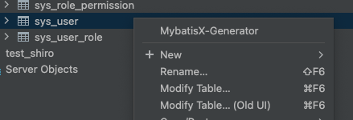

# 🍎 简介

MybatisX 是一款基于 IDEA 的快速开发插件，为效率而生。

# 🍎 使用

## 🌲 安装

我们首先在IDEA商店搜索`mybatisx`进行安装


## 🌲 建表

这里以用户表为例

```sql
# 用户表
CREATE TABLE sys_user
(
    user_id     INT AUTO_INCREMENT COMMENT '用户id'
        PRIMARY KEY,
    nickname    VARCHAR(50)                        NULL COMMENT '昵称',
    username    VARCHAR(20)                        NULL COMMENT '用户名',
    password    VARCHAR(32)                        NULL COMMENT '密码',
    salt        VARCHAR(10)                        NOT NULL COMMENT '盐',
    status      INT      DEFAULT 0                 NULL COMMENT '状态: 0正常 1未激活 3冻结',
    create_time DATETIME DEFAULT CURRENT_TIMESTAMP NOT NULL COMMENT '创建时间',
    update_time DATETIME DEFAULT CURRENT_TIMESTAMP NOT NULL ON UPDATE CURRENT_TIMESTAMP COMMENT '修改时间',
    delete_time DATETIME COMMENT '逻辑删除时间',
    CONSTRAINT username_uindex
        UNIQUE (username)
) COMMENT '用户表' CHARSET = utf8mb4;
```

## 🌲 生成数据持久层

右键在数据库上, 点击`MyBatisX`



然后会弹出一个对话框, 我们参考我的进行填写, 我们在创建实体类的时候通常会去掉数据库的业务模块前缀, 比如我去掉了`sys_`, base package填写你要存放的报名, module path可以不用选择, 默认在主工程的根目录下生成, 生成完毕后我们拷贝到相应的位置就好了


然后点击Next


然后点击Finish生成完毕, 我们发现在项目根目录会生成出来整个的一个套件


我们可以看到它爆红了, 不要慌, 你把它们复制到我们相应的模块中就可以了, 复制完把根目录下面的src文件夹直接删除就好了


