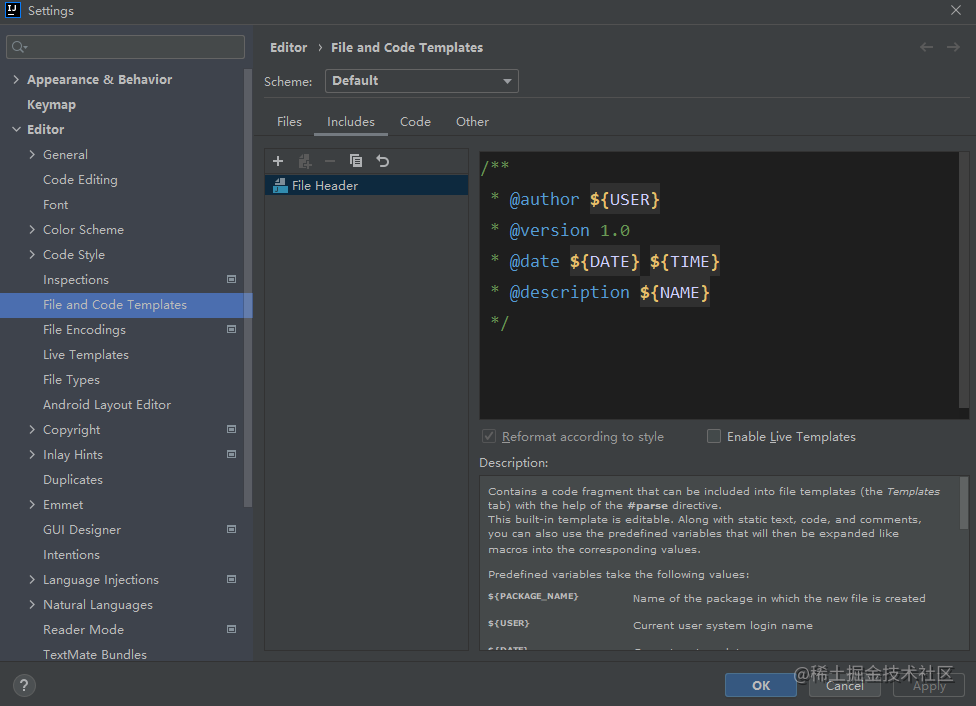
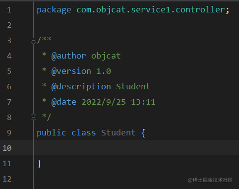
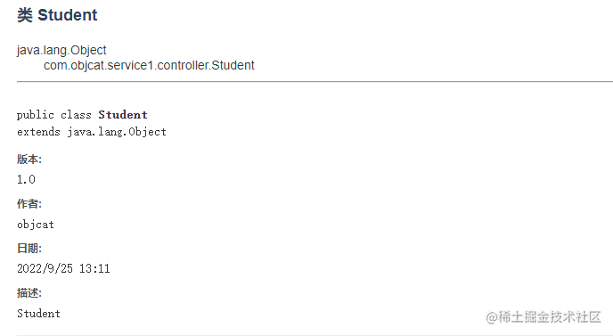
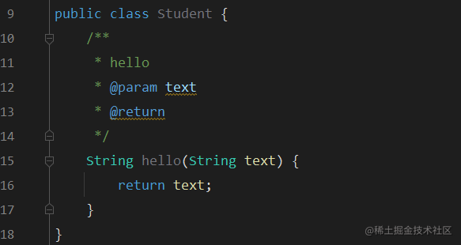
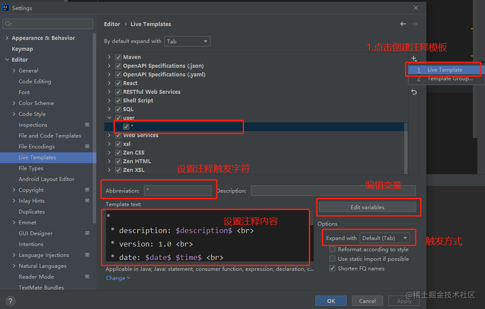
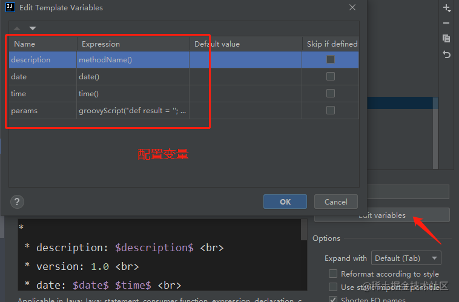
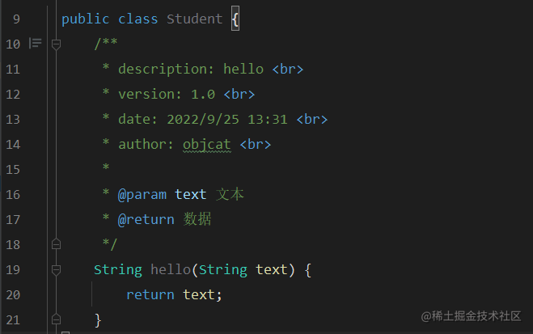
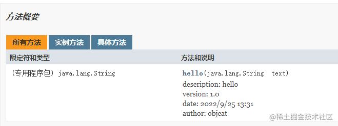
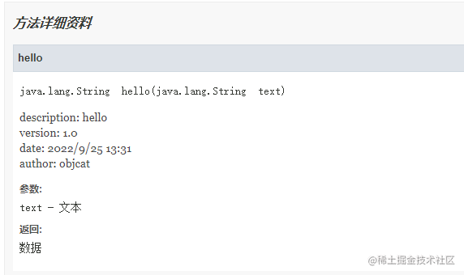
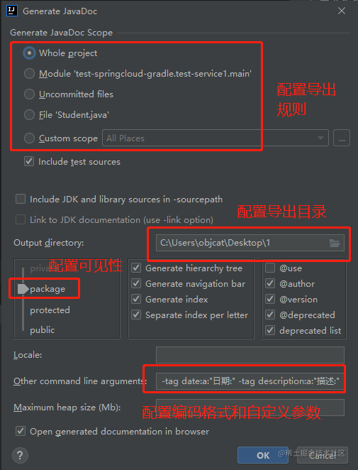

# 🍎 前言

`IntelliJ IDEA`是我们开发Java常用的IDE, 俗话说得好`规范 > 配置 > 编码`, 在写代码的过程中必须要有一套规范, 首先就是注释, 以下均为本人查阅互联网文章后自行摸索优化的, 转载请注明出处

# 🍎 文件注释

所谓文件注释, 就是当我们创建一个Java类的时候, 系统帮我们生成的一段注释, 在`IDEA`中是可以进行修改的, 修改方法如图所示`Settings -> File and Code Templates -> Includes -> File Header`



```
/**
 * @description ${NAME}
 * @version 1.0
 * @date ${DATE} ${TIME}
 * @author ${USER}
 */
```

然后我们来看一下配置注释后, 创建文件时的样子



我们可以看到创建出文件后, `IDEA`就给我们自动添加上了这些描述信息, 大可不必纠结这些描述信息的顺序和我们配置的不同, 因为`IDEA`会重新排列

我们来看一下生成`JavaDoc`之后的效果



# 🍎 方法注释

方法注释就是对我们类中的方法进行注释, 有些是工具类, 有些是接口, 正常情况下系统的方法注释十分简陋, 我们来看一下




这显然不是我们想要的注释(至少我不想要 - -)

下面我们就一起来配置一下`白猫`的注释方法吧




首先按照图中的方法进行配置

```
*
 * description: $description$ <br>
 * version: 1.0 <br>
 * date: $date$ $time$ <br>
 * author: objcat <br>
 *
$params$数据
 */ 
```

然后我们点击`Edit variables`编辑变量

我们可以看到`$date$ $time$`这些都是变量, 需要我们在`IDEA`中来指定




```
methodName()

date()

time()

groovyScript("def result = ''; def params = \"${_1}\".replaceAll('[\\\\[|\\\\]|\\\\s]', '').split(',').toList(); if (params.size() > 0){if (params[0] == ''){return ' * @return '};}; for (i = 0; i < params.size(); i++) {result += ' * @param ' + params[i] + '\\n'}; result += ' * @return ';  return result", methodParameters())
```

配置上去我们来看一看效果

在方法上输入`/**` + `tab键`就可以自动生成注释了




然后我们来生成`JavaDoc`试试吧







我们可以看到, 生成的注释一个不漏

可能到这里有人会问, 你为什么把`@return`配置成了静态文字`数据`, 那是因为返回类型如果带有泛型注释中就会存在`<String>`, 出现`尖角号`就无法生成JavaDoc了, 还有就是返回类型会自动生成在`JavaDoc`中, 所以对本字段的依赖较差, 不过出于技术讲解, 我这边也顺便教你怎么自动配置返回值吧

```
*
 * description: $description$ <br>
 * version: 1.0 <br>
 * date: $date$ $time$ <br>
 * author: objcat <br>
 *
$params$$return$
 */ 
```

其实很简单, 只要把`数据`修改为`$return$`变量

然后在`Edit variables`中配置为`methodReturnType()`即可

# 🍎 JavaDoc

JavaDoc是官方提供的一种生成文档的方式, 我们针对这篇文章来教大家如何生成

在`IDEA`中点击顶部菜单的`Tools -> Generate JavaDoc`就可以了, 参考图中进行配置即可



```
-charset utf-8 -encoding utf-8 -tag date:a:"日期:" -tag description:a:"描述:"
```

- `-charset utf-8` 配置编码格式
- `-tag date:a:"日期:"` 配置自定义标签
- `@author`是作者不勾选就不会生成作者
- `@version`是版本不勾选就不会生成版本

这两个字段是用于类文件注释的时候用的, 与方法注释无关, 所以我方法注释的时候并没有加`@`符号, 加了反而生成不出来

好的, 今天的讲解就到这里吧, 感谢观看

# 🍎 文章信息

## 🌲 作者

objcat

## 🌲 更新日志

### 🌸 2022.10.18

初始化文章