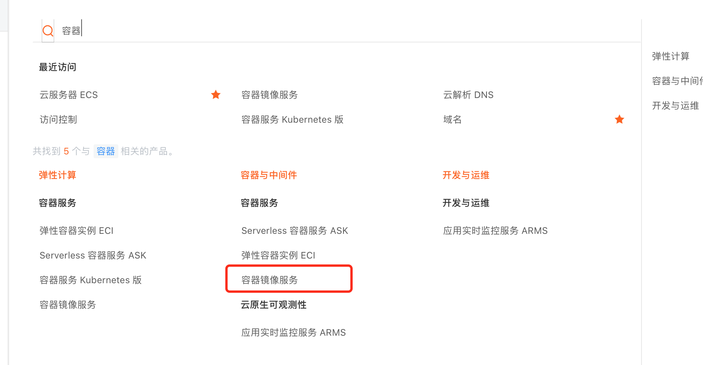
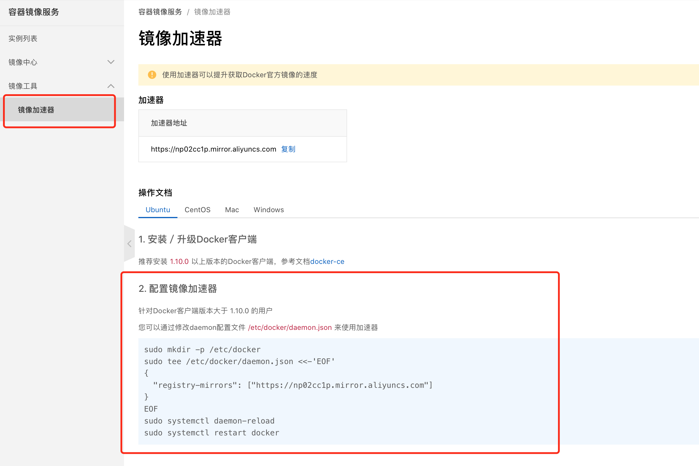
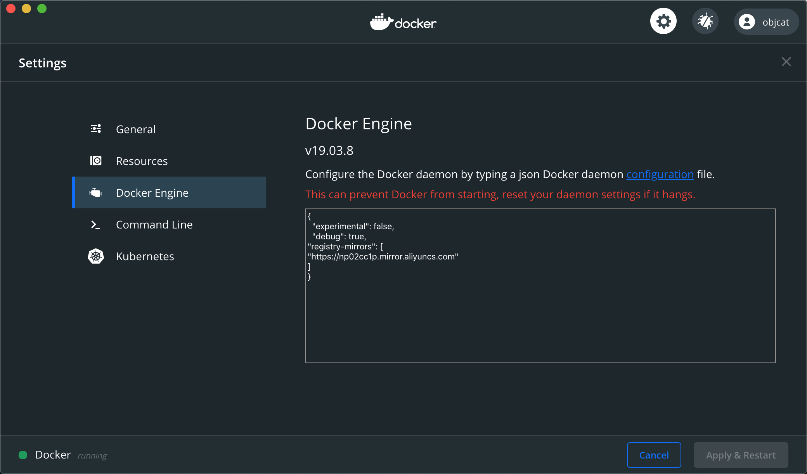
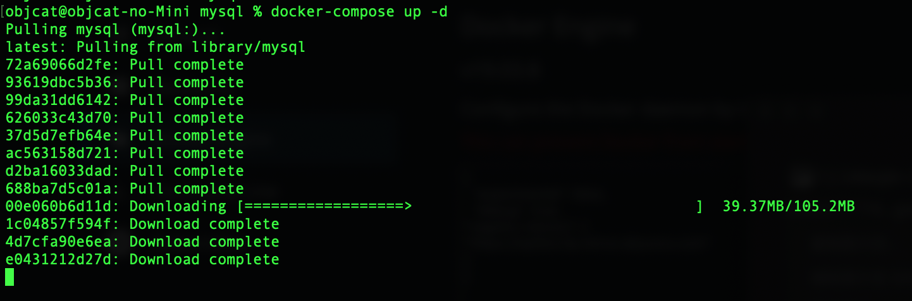

# 🍎 官方网站

https://www.docker.com

# 🍎 安装

## 🌲 MacOS

https://www.docker.com

直接去官网下载`Docker Desktop`


## 🌲 linux

首先安装必要工具

```shell
yum install -y yum-utils device-mapper-persistent-data lvm2
```

然后配置仓库

```shell
yum-config-manager --add-repo http://mirrors.aliyun.com/docker-ce/linux/centos/docker-ce.repo
```

查看所有docker-ce版本

```shell
yum list docker-ce --showduplicates | sort -r
```

开始下载

```shell
yum install docker-ce
```

开启docker

```shell
systemctl start docker
```

设置开机启动

```shell
systemctl enable docker
```

安装docker-compose

可以使用curl安装也可以使用python安装

> curl

```
curl -L "https://github.com/docker/compose/releases/download/1.29.2/docker-compose-$(uname -s)-$(uname -m)" -o /usr/local/bin/docker-compose

// 网络不好使用这个
curl -L "https://files.gitee.com/group1/M00/26/51/CgAAEmIyCEyAGB62AYzQAMysck8.no_ext?token=db019507806fcede44156b2d9526cf97&ts=1647446108&attname=docker-compose-linux-x86_64&disposition=attachment" -o /usr/local/bin
/docker-compose

// 把compose变成可执行文件
sudo chmod +x /usr/local/bin/docker-compose
```

> python

```
pip install docker-compose
```

# 🍎 配置镜像源

首先登录阿里云, 点击左侧菜单, 搜索框搜索到容器镜像服务, 收藏并进入



点击镜像加速器然后根据步骤配置即可



这里只演示Mac配置



```json
"registry-mirrors": [
  "https://np02cc1p.mirror.aliyuncs.com"
]
```

配置完可能是这样

```json
{
  "builder": {
    "gc": {
      "defaultKeepStorage": "20GB",
      "enabled": true
    }
  },
  "experimental": false,
  "registry-mirrors": [
    "https://np02cc1p.mirror.aliyuncs.com"
   ]
}
```

配置完毕后docker会让你重启, 然后拉取镜像试试吧



速度起飞