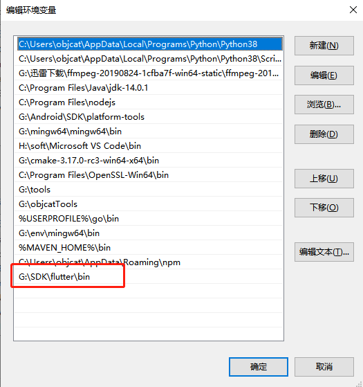
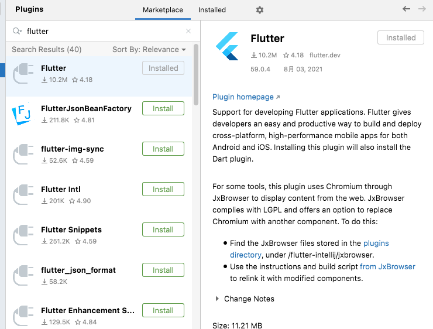
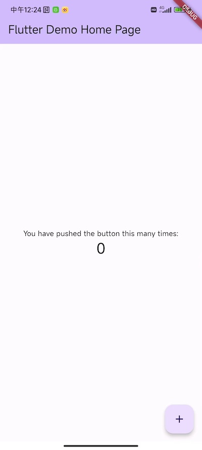
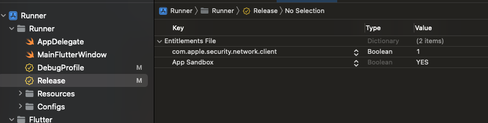
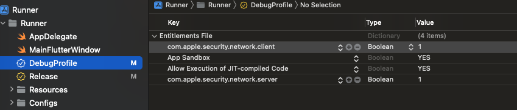
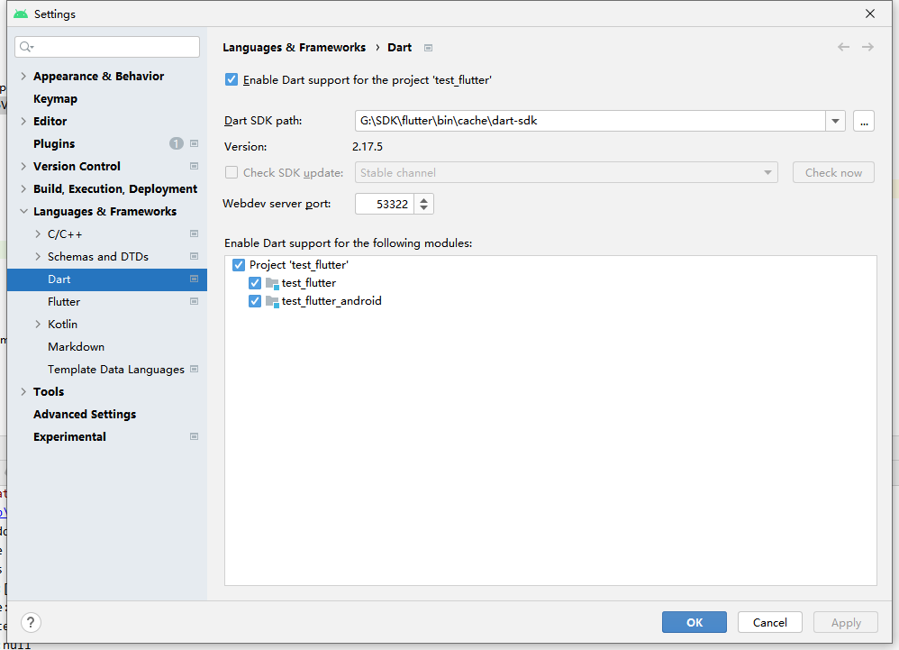

# 🍎 简介


Flutter是Google开源的构建用户界面（UI）工具包，帮助开发者通过一套代码库高效构建多平台精美应用，支持移动、Web、桌面和嵌入式平台。 [5]Flutter 开源、免费，拥有宽松的开源协议，适合商业项目。

# 🍎 环境搭建

## 🌲 官方网站

https://flutter.cn
https://flutter.cn/docs/get-started/install

## 🌲 IDE下载

https://docs.flutter.dev/tools/android-studio

官方推荐`AndroidStudio`, 不过你也可以使用`vscode`

https://developer.android.google.cn/studio

## 🌲 下载flutter

https://flutter.cn/docs/get-started/install/macos

自行在官网下载, 注意对应平台

## 🌲 Apple芯片电脑需要安装一些工具

```
sudo softwareupdate --install-rosetta --agree-to-license
```

## 🌲 配置镜像源

因为国内的网络环境不好, 所以要配置镜像源

```
vim ~/.zshrc
```

然后按`i`开启输入模式, 粘贴进去, 保存wq

```
export PUB_HOSTED_URL=https://pub.flutter-io.cn
export FLUTTER_STORAGE_BASE_URL=https://storage.flutter-io.cn
```

## 🌲 配置环境变量

下载后配置环境变量

> Windows

常规的配置环境变量




> Mac
```shell
open -a xcode ~/.zshrc
# 写入
export PATH="/Users/objcat/sdk/flutter/bin:${PATH}"

# 或者直接追加
echo 'export PATH="/Users/objcat/sdk/flutter/bin:${PATH}"' >> ~/.zshrc
```

安装配置完之后可以运行, `flutter doctor`诊断一下, 如果都是绿色对号就是没问题, 如果跟我一样就是有问题


```shell
objcat@objcatdeMini ~ % flutter doctor

Doctor summary (to see all details, run flutter doctor -v):

[✓] Flutter (Channel stable, 3.13.1, on macOS 13.2.1 22D68 darwin-arm64, locale

    zh-Hans-CN)

[✗] Android toolchain - develop for Android devices

    ✗ Unable to locate Android SDK.

      Install Android Studio from:

      https://developer.android.com/studio/index.html

      On first launch it will assist you in installing the Android SDK

      components.

      (or visit https://flutter.dev/docs/get-started/install/macos#android-setup

      for detailed instructions).

      If the Android SDK has been installed to a custom location, please use

      `flutter config --android-sdk` to update to that location.

  

[✓] Xcode - develop for iOS and macOS (Xcode 14.3.1)

[✓] Chrome - develop for the web

[✓] Android Studio (version 2022.3)

[✓] VS Code (version 1.81.1)
```

哪里有问题就点哪里, 我是配置了一下sdk的路径, 如果你是新手没有安卓sdk就往下看, 先不用配置了

```shell
objcat@objcatdeMini ~ % flutter doctor                   

Doctor summary (to see all details, run flutter doctor -v):

[✓] Flutter (Channel stable, 3.13.1, on macOS 13.2.1 22D68 darwin-arm64, locale zh-Hans-CN)

[!] Android toolchain - develop for Android devices (Android SDK version 34.0.0)

    ! Some Android licenses not accepted. To resolve this, run: flutter doctor --android-licenses

[✓] Xcode - develop for iOS and macOS (Xcode 14.3.1)

[✓] Chrome - develop for the web

[✓] Android Studio (version 2022.3)

[✓] VS Code (version 1.81.1)

[✓] Connected device (2 available)
```

缺失的`cmdline-tools`你可以这么安装


勾选后会跳出下载页面


然后再运行就会发现可以了

```shell
objcat@objcatdeMini ~ % flutter doctor                   

Doctor summary (to see all details, run flutter doctor -v):

[✓] Flutter (Channel stable, 3.13.1, on macOS 13.2.1 22D68 darwin-arm64, locale zh-Hans-CN)

[✓] Android toolchain - develop for Android devices (Android SDK version 34.0.0)

[✓] Xcode - develop for iOS and macOS (Xcode 14.3.1)

[✓] Chrome - develop for the web

[✓] Android Studio (version 2022.3)

[✓] VS Code (version 1.81.1)

[✓] Connected device (2 available)
```

## 🌲 查看版本

本教程使用的版本是最新的`3.13.9`

```shell
flutter --version
Flutter 3.13.9 • channel stable • https://github.com/flutter/flutter.git
Framework • revision d211f42860 (2 weeks ago) • 2023-10-25 13:42:25 -0700
Engine • revision 0545f8705d
Tools • Dart 3.1.5 • DevTools 2.25.0
```

## 🌲 版本升级

https://flutter.cn/docs/release/upgrade

如果你的版本比较久远可以选择更新, 不过更新要慎重, 因为实际工作中可能都用的是老版本, 更新可能会导致不兼容

```shell
flutter upgrade
```

默认就是`stable`

```
flutter channel
Flutter channels:
  master (latest development branch, for contributors)
  main (latest development branch, follows master channel)
  beta (updated monthly, recommended for experienced users)
* stable (updated quarterly, for new users and for production app releases)
```

如果你想测试, 那么也可以切换测试版本的

```
flutter channel beta
```

## 🌲 配置Flutter插件

然后打开`Android Studio`下载Flutter插件



安装完成后 可以在应用程序的主界面创建Flutter项目了, 如果你使用vscode在扩展商店里也能找到`flutter`插件

# 🍎 允许使用https

安卓和苹果对http默认都有限制, 我们在启动flutter项目后经常发现请求http接口网络不通, 这个时候我们就需要去原生端进行配置

## 🌲 安卓

我们可能会遇到这样的问题, 这是因为谷歌在安卓9之后为了加强安全默认就不允许使用http请求了

```shell
E/ExoPlayerImplInternal( 5051):   Caused by: com.google.android.exoplayer2.upstream.HttpDataSource$CleartextNotPermittedException: Cleartext HTTP traffic not permitted. See https://developer.android.com/guide/topics/media/issues/cleartext-not-permitted
```

不要慌, 看下面的网址就可以`android:usesCleartextTraffic="true"`配置进清单文件即可

```xml
<application
        android:label="test_flutter"
        android:name="${applicationName}"
        android:icon="@mipmap/ic_launcher"
        android:usesCleartextTraffic="true">
```

值得注意的是做完这个步骤你还有可能发现不好用, 那是因为缓存的原因, 杀掉App, 必要时候运行`flutter clean`, 然后重新运行即可, 明白了伐? 

## 🌲 苹果

iOS中也比较好配置


我们也可以直接在plist中使用代码配置


然后添加下面的代码进去

```xml
<key>NSAppTransportSecurity</key>
<dict>
	<key>NSAllowsArbitraryLoads</key>
	<true/>
</dict>
```

# 🍎 命令

## 🌲 拉取依赖

```shell
flutter packages get
```

## 🌲 打包

```
flutter build ios
```

## 🌲 生成模板

flutter在创建完成后会给我们生成一个安卓项目模板, 如果你不小心删掉了, 我们也可以创建

```shell
# 创建安卓模板
flutter create -a java .
flutter create -a kotlin .
# 创建iOS模板
flutter create -i swift .
```

# 🍎 快速开始

## 🌲 创建项目


然后选择你的sdk路径


然后起一个好听的名字, 我的叫`test_flutter`, 我这里比较习惯`java`和`oc`所以就这么选择了


创建完项目后如果想使用安卓来开发, 需要下载一个安卓SDK


如果没有你也可以下载一个


# 🍎 运行项目

我们直接在`Android Studio`中选择一个模拟器就可以运行了, 如果没有在你的设备里自己创建一个


运行后, 我们可以看到官方给我们写了一个demo, 点击按钮可以计数



如果一直卡在`Running Gradle task 'assembleDebug'`中, 那么你就可能要去原生项目中拉取一下依赖, 具体请查看`FAQ`

# 🍎 应用程序入口

这是创建`flutterApp`自带的代码

```dart
import 'package:flutter/material.dart';

void main() {
  runApp(const MyApp());
}

class MyApp extends StatelessWidget {
  const MyApp({super.key});

  // This widget is the root of your application.
  @override
  Widget build(BuildContext context) {
    return MaterialApp(
      title: 'Flutter Demo',
      theme: ThemeData(
        // This is the theme of your application.
        //
        // TRY THIS: Try running your application with "flutter run". You'll see
        // the application has a blue toolbar. Then, without quitting the app,
        // try changing the seedColor in the colorScheme below to Colors.green
        // and then invoke "hot reload" (save your changes or press the "hot
        // reload" button in a Flutter-supported IDE, or press "r" if you used
        // the command line to start the app).
        //
        // Notice that the counter didn't reset back to zero; the application
        // state is not lost during the reload. To reset the state, use hot
        // restart instead.
        //
        // This works for code too, not just values: Most code changes can be
        // tested with just a hot reload.
        colorScheme: ColorScheme.fromSeed(seedColor: Colors.deepPurple),
        useMaterial3: true,
      ),
      home: const MyHomePage(title: 'Flutter Demo Home Page'),
    );
  }
}

class MyHomePage extends StatefulWidget {
  const MyHomePage({super.key, required this.title});

  // This widget is the home page of your application. It is stateful, meaning
  // that it has a State object (defined below) that contains fields that affect
  // how it looks.

  // This class is the configuration for the state. It holds the values (in this
  // case the title) provided by the parent (in this case the App widget) and
  // used by the build method of the State. Fields in a Widget subclass are
  // always marked "final".

  final String title;

  @override
  State<MyHomePage> createState() => _MyHomePageState();
}

class _MyHomePageState extends State<MyHomePage> {
  int _counter = 0;

  void _incrementCounter() {
    setState(() {
      // This call to setState tells the Flutter framework that something has
      // changed in this State, which causes it to rerun the build method below
      // so that the display can reflect the updated values. If we changed
      // _counter without calling setState(), then the build method would not be
      // called again, and so nothing would appear to happen.
      _counter++;
    });
  }

  @override
  Widget build(BuildContext context) {
    // This method is rerun every time setState is called, for instance as done
    // by the _incrementCounter method above.
    //
    // The Flutter framework has been optimized to make rerunning build methods
    // fast, so that you can just rebuild anything that needs updating rather
    // than having to individually change instances of widgets.
    return Scaffold(
      appBar: AppBar(
        // TRY THIS: Try changing the color here to a specific color (to
        // Colors.amber, perhaps?) and trigger a hot reload to see the AppBar
        // change color while the other colors stay the same.
        backgroundColor: Theme.of(context).colorScheme.inversePrimary,
        // Here we take the value from the MyHomePage object that was created by
        // the App.build method, and use it to set our appbar title.
        title: Text(widget.title),
      ),
      body: Center(
        // Center is a layout widget. It takes a single child and positions it
        // in the middle of the parent.
        child: Column(
          // Column is also a layout widget. It takes a list of children and
          // arranges them vertically. By default, it sizes itself to fit its
          // children horizontally, and tries to be as tall as its parent.
          //
          // Column has various properties to control how it sizes itself and
          // how it positions its children. Here we use mainAxisAlignment to
          // center the children vertically; the main axis here is the vertical
          // axis because Columns are vertical (the cross axis would be
          // horizontal).
          //
          // TRY THIS: Invoke "debug painting" (choose the "Toggle Debug Paint"
          // action in the IDE, or press "p" in the console), to see the
          // wireframe for each widget.
          mainAxisAlignment: MainAxisAlignment.center,
          children: <Widget>[
            const Text(
              'You have pushed the button this many times:',
            ),
            Text(
              '$_counter',
              style: Theme.of(context).textTheme.headlineMedium,
            ),
          ],
        ),
      ),
      floatingActionButton: FloatingActionButton(
        onPressed: _incrementCounter,
        tooltip: 'Increment',
        child: const Icon(Icons.add),
      ), // This trailing comma makes auto-formatting nicer for build methods.
    );
  }
}
```

我们可以看到应用程序是使用下面代码启动的, 也就是我们的`runApp`, 这个函数是包含在`flutterSDK`中的`binding.dart`文件中

```dart
void main() {
  runApp(const MyApp());
}
```

所有视图的`根`是继承于`StatelessWidget`的`MyApp`, 它里面有一个`build`方法, 里面是初始化了一个`MaterialApp`来控制全局样式

如果想把App切换成iOS风格也是可以的 只需要使用`CupertinoApp`即可

```dart
class MyApp2 extends StatelessWidget {
  // This widget is the root of your application.
  @override
  Widget build(BuildContext context) {
    return CupertinoApp(
      title: 'Flutter Demo',
      home: MyHomePage2(title: 'Flutter Demo Home Page'),
    );
  }
}

class MyHomePage2 extends StatefulWidget {
  MyHomePage2({Key? key, required this.title}) : super(key: key);

  // This widget is the home page of your application. It is stateful, meaning
  // that it has a State object (defined below) that contains fields that affect
  // how it looks.

  // This class is the configuration for the state. It holds the values (in this
  // case the title) provided by the parent (in this case the App widget) and
  // used by the build method of the State. Fields in a Widget subclass are
  // always marked "final".

  final String title;

  @override
  _MyHomePageState2 createState() => _MyHomePageState2();
}

class _MyHomePageState2 extends State<MyHomePage2> {
  int _counter = 0;

  @override
  Widget build(BuildContext context) {
    // This method is rerun every time setState is called, for instance as done
    // by the _incrementCounter method above.
    //
    // The Flutter framework has been optimized to make rerunning build methods
    // fast, so that you can just rebuild anything that needs updating rather
    // than having to individually change instances of widgets.
    return CupertinoPageScaffold(
        child: Container(
          child: Column(
            mainAxisAlignment: MainAxisAlignment.center,
            children: [
              Text("123", style: TextStyle(backgroundColor: Colors.red),),
              Text("456", style: TextStyle(backgroundColor: Colors.red),)
            ],
          )
        ),
        navigationBar: CupertinoNavigationBar(middle: Text("123")));
  }
}
```

# 🍎 脚手架

`Scaffold`就是脚手架, 我们可以使用安卓的脚手架也可以使用`iOS`的脚手架, 他们是两种不同的风格

> Android

```dart
Widget build(BuildContext context) {
    // This method is rerun every time setState is called, for instance as done
    // by the _incrementCounter method above.
    //
    // The Flutter framework has been optimized to make rerunning build methods
    // fast, so that you can just rebuild anything that needs updating rather
    // than having to individually change instances of widgets.
    return Scaffold(
      appBar: ,
      body: 
    );
}
```

> iOS

```dart
return CupertinoPageScaffold(
      child: ,
      navigationBar: 
}
```

我们点开脚手架可以看到里面是有很多属性的

```dart
const MaterialApp({
    super.key,
    this.navigatorKey,
    this.scaffoldMessengerKey,
    this.home,
    Map<String, WidgetBuilder> this.routes = const <String, WidgetBuilder>{},
    this.initialRoute,
    this.onGenerateRoute,
    this.onGenerateInitialRoutes,
    this.onUnknownRoute,
    List<NavigatorObserver> this.navigatorObservers = const <NavigatorObserver>[],
    this.builder,
    this.title = '',
    this.onGenerateTitle,
    this.color,
    this.theme,
    this.darkTheme,
    ...
```

这些属性我不一一介绍了, 用到了再自己学, 不过有两个是非常重要的, 一个是`body`, 这个是放我们的内容, 一个是`appBar`, 这个是放我们的导航栏

# 🍎 导航栏

导航栏分为顶部导航栏和底部导航栏, 顶部导航栏叫`AppBar`底部导航栏叫`BottomNavigationBar`, 当然导航栏也分为两种风格, 安卓和iOS各不相同, 本文主要以安卓为主

## 🌲 配置顶部导航栏

添加导航栏非常简单使用`Scaffold`, 它是`flutter`提供的一套脚手架, 里面有一个属性叫`AppBar`

> Android

```dart
return Scaffold(
    appBar: AppBar(
	  // 标题样式
      title: Text(widget.title, style: TextStyle(color: Global.naviTitleColor)),
      // 背景颜色
      backgroundColor: Global.naviBgColor,
      // 图标颜色
      iconTheme: IconThemeData(color: Global.naviTitleColor),
    ),
};
```

> iOS

```dart
return CupertinoPageScaffold(
    navigationBar: CupertinoNavigationBar(middle: Text("123")));
};
```

## 🌲 配置底部导航栏

### 🌸 基础配置

在脚手架中有个`bottomNavigationBar`属性可以配置底部导航栏

```dart
return Scaffold(
        bottomNavigationBar: BottomNavigationBar(items: const [
          BottomNavigationBarItem(icon: Icon(Icons.home), label: "首页"),
          BottomNavigationBarItem(icon: Icon(Icons.category), label: "分类"),
          BottomNavigationBarItem(
              icon: Icon(Icons.settings), label: "系统设置"),
        ]),
```

就是这么简单, 就问你服不服? 我们运行项目看看


但是我们发现这几个导航栏都无法点击, 所以我们需要配置他们的跳转逻辑

### 🌸 选中逻辑

我们使用`BottomNavigationBar`中的`currentIndex`就可以设置点击选中哪个导航了, 我们定义一个`_currentIndex`变量为0, 然后把他赋值到`currentIndex`那么每次默认就是选中第1个导航, 当我们点击`BottomNavigationBar`后, 我们可以在value中获取到index, 从而使用`setState`来设置`index`就可以改变底部导航的选中了

```dart
class _MyHomePageState extends State<MyHomePage> {
  var _currentIndex = 0;

  @override
  Widget build(BuildContext context) {
    return Scaffold(
        bottomNavigationBar: BottomNavigationBar(
            currentIndex: _currentIndex,
            onTap: (value) {
              setState(() {
                _currentIndex = value;
              });
            },
            items: const [
              BottomNavigationBarItem(icon: Icon(Icons.home), label: "首页"),
              BottomNavigationBarItem(icon: Icon(Icons.category), label: "分类"),
              BottomNavigationBarItem(
                  icon: Icon(Icons.settings), label: "系统设置"),
            ]),
        appBar: AppBar(
          backgroundColor: Theme.of(context).colorScheme.inversePrimary,
          title: Text(widget.title),
        ),
        body: ListView(
          children: [
            Container(
              height: 50,
              color: Colors.amber[600],
              child: const Center(child: Text('Entry A')),
            ),
            Container(
              height: 50,
              color: Colors.amber[500],
              child: const Center(child: Text('Entry B')),
            ),
            Container(
              height: 50,
              color: Colors.amber[100],
              child: const Center(child: Text('Entry C')),
            ),
          ],
        ));
  }
}
```

### 🌸 跳转逻辑

更简单了, 一句话, 就是替换body, 我们之前的body是一个listView, 而加了导航页面, 那么我们的body就是各个页面了

```dart
class MyHomePage extends StatefulWidget {
  const MyHomePage({super.key, required this.title});

  final String title;

  @override
  State<MyHomePage> createState() => _MyHomePageState();
}

class _MyHomePageState extends State<MyHomePage> {
  var _currentIndex = 0;
  var pages = const [
    SecondPage(title: "第二个页面"),
    ThirdPage(title: "第三个页面"),
    VideoPage()
  ];

  @override
  Widget build(BuildContext context) {
    return Scaffold(
        bottomNavigationBar: BottomNavigationBar(
            currentIndex: _currentIndex,
            onTap: (value) {
              setState(() {
                _currentIndex = value;
              });
            },
            items: const [
              BottomNavigationBarItem(icon: Icon(Icons.home), label: "首页"),
              BottomNavigationBarItem(icon: Icon(Icons.category), label: "分类"),
              BottomNavigationBarItem(
                  icon: Icon(Icons.settings), label: "系统设置"),
            ]),
        body: pages[_currentIndex]);
  }
}
```

所以我就往里面塞了几个页面, 然后把原本的导航栏去掉, 否则导航栏会重复, 这就是页面跳转的逻辑了

# 🍎 Page

我们学习完脚手架, 就要学习页面了, 正如官方例子中一样, 我们需要创建一个`page`, 来代表我们的页面

```dart
class MyHomePage extends StatefulWidget {
  const MyHomePage({super.key, required this.title});

  // This widget is the home page of your application. It is stateful, meaning
  // that it has a State object (defined below) that contains fields that affect
  // how it looks.

  // This class is the configuration for the state. It holds the values (in this
  // case the title) provided by the parent (in this case the App widget) and
  // used by the build method of the State. Fields in a Widget subclass are
  // always marked "final".

  final String title;

  @override
  State<MyHomePage> createState() => _MyHomePageState();
}
```

- `StatefulWidget`说明页面的数据是可刷新的, 如果是`StatelessWidget`, 那么页面是无法刷新的, 因为我们的页面要点击按钮增加计数, 所以需要继承于前者

- `const MyHomePage({super.key, required this.title});`这个一看就知道, 这是我们`MyHomePage`的初始化方法, 用于传一个标题进来

# 🍎 State

我们可以看到一个关键性的代码`State<MyHomePage> createState() => _MyHomePageState();` 这个的意思是创建一个`_MyHomePageState`来管理面, 我们一起来看看这个页面

```dart
class _MyHomePageState extends State<MyHomePage> {
  int _counter = 0;

  void _incrementCounter() {
    setState(() {
      // This call to setState tells the Flutter framework that something has
      // changed in this State, which causes it to rerun the build method below
      // so that the display can reflect the updated values. If we changed
      // _counter without calling setState(), then the build method would not be
      // called again, and so nothing would appear to happen.
      _counter++;
    });
  }

  @override
  Widget build(BuildContext context) {
    // This method is rerun every time setState is called, for instance as done
    // by the _incrementCounter method above.
    //
    // The Flutter framework has been optimized to make rerunning build methods
    // fast, so that you can just rebuild anything that needs updating rather
    // than having to individually change instances of widgets.
    return Scaffold(
      appBar: AppBar(
        // TRY THIS: Try changing the color here to a specific color (to
        // Colors.amber, perhaps?) and trigger a hot reload to see the AppBar
        // change color while the other colors stay the same.
        backgroundColor: Theme.of(context).colorScheme.inversePrimary,
        // Here we take the value from the MyHomePage object that was created by
        // the App.build method, and use it to set our appbar title.
        title: Text(widget.title),
      ),
      body: Center(
        // Center is a layout widget. It takes a single child and positions it
        // in the middle of the parent.
        child: Column(
          // Column is also a layout widget. It takes a list of children and
          // arranges them vertically. By default, it sizes itself to fit its
          // children horizontally, and tries to be as tall as its parent.
          //
          // Column has various properties to control how it sizes itself and
          // how it positions its children. Here we use mainAxisAlignment to
          // center the children vertically; the main axis here is the vertical
          // axis because Columns are vertical (the cross axis would be
          // horizontal).
          //
          // TRY THIS: Invoke "debug painting" (choose the "Toggle Debug Paint"
          // action in the IDE, or press "p" in the console), to see the
          // wireframe for each widget.
          mainAxisAlignment: MainAxisAlignment.center,
          children: <Widget>[
            const Text(
              'You have pushed the button this many times:',
            ),
            Text(
              '$_counter',
              style: Theme.of(context).textTheme.headlineMedium,
            ),
          ],
        ),
      ),
      floatingActionButton: FloatingActionButton(
        onPressed: _incrementCounter,
        tooltip: 'Increment',
        child: const Icon(Icons.add),
      ), // This trailing comma makes auto-formatting nicer for build methods.
    );
  }
}
```

`Widget build`这里面最核心的代码就是它, 因为在`state`中需要使用这个方法来返回`UI`, 我们可以看到它返回了一个脚手架`Scaffold`, 否则页面会没有导航栏, 然后在`body`中它绘制了页面的视图

- `int _counter = 0;`它定义了一个计数变量来计数

`void _incrementCounter()`按钮点击后触发这个方法来给`_counter`加1

# 🍎 生命周期

提起生命周期, 移动端的开发者应该并不陌生, 它是应用从创建到更新到销毁的一个流程, 在这个流程中会经历很多方法, 那我们接下来就看一看生命周期吧, flutter中的widget分为两种, 有状态和无状态的

## 🌲 无状态widget

因为无状态页面最简单, 我们就先去搞这个页面, 我们打开`StatelessWidget`可以看到, 里面非常简单, 可以看到包含构造方法, 除此之外还有两个方法`createElement`和`build`

```dart
abstract class StatelessWidget extends Widget {
  /// Initializes [key] for subclasses.
  const StatelessWidget({ super.key });

  /// Creates a [StatelessElement] to manage this widget's location in the tree.
  ///
  /// It is uncommon for subclasses to override this method.
  @override
  StatelessElement createElement() => StatelessElement(this);

  /// Describes the part of the user interface represented by this widget.
  ///
  /// The framework calls this method when this widget is inserted into the tree
  /// in a given [BuildContext] and when the dependencies of this widget change
  /// (e.g., an [InheritedWidget] referenced by this widget changes). This
  /// method can potentially be called in every frame and should not have any side
  /// effects beyond building a widget.
  ///
  /// The framework replaces the subtree below this widget with the widget
  /// returned by this method, either by updating the existing subtree or by
  /// removing the subtree and inflating a new subtree, depending on whether the
  /// widget returned by this method can update the root of the existing
  /// subtree, as determined by calling [Widget.canUpdate].
  ///
  /// Typically implementations return a newly created constellation of widgets
  /// that are configured with information from this widget's constructor and
  /// from the given [BuildContext].
  ///
  /// The given [BuildContext] contains information about the location in the
  /// tree at which this widget is being built. For example, the context
  /// provides the set of inherited widgets for this location in the tree. A
  /// given widget might be built with multiple different [BuildContext]
  /// arguments over time if the widget is moved around the tree or if the
  /// widget is inserted into the tree in multiple places at once.
  ///
  /// The implementation of this method must only depend on:
  ///
  /// * the fields of the widget, which themselves must not change over time,
  ///   and
  /// * any ambient state obtained from the `context` using
  ///   [BuildContext.dependOnInheritedWidgetOfExactType].
  ///
  /// If a widget's [build] method is to depend on anything else, use a
  /// [StatefulWidget] instead.
  ///
  /// See also:
  ///
  ///  * [StatelessWidget], which contains the discussion on performance considerations.
  @protected
  Widget build(BuildContext context);
}
```

你可能会有疑问, 为什么会有这么简单的组件呢? 我认为这是因为分工不同, 无状态组件可以说它并没有生命周期, 就是根据外部传进来的数据去渲染视图, 这样简洁的设计可以让它比有状态组件拥有更高的性能

## 🌲 有状态widget

我们首先也来看一下源码

```dart
abstract class StatefulWidget extends Widget {
  /// Initializes [key] for subclasses.
  const StatefulWidget({ super.key });

  /// Creates a [StatefulElement] to manage this widget's location in the tree.
  ///
  /// It is uncommon for subclasses to override this method.
  @override
  StatefulElement createElement() => StatefulElement(this);

  /// Creates the mutable state for this widget at a given location in the tree.
  ///
  /// Subclasses should override this method to return a newly created
  /// instance of their associated [State] subclass:
  ///
  /// ```dart
  /// @override
  /// State<SomeWidget> createState() => _SomeWidgetState();
  /// ```
  ///
  /// The framework can call this method multiple times over the lifetime of
  /// a [StatefulWidget]. For example, if the widget is inserted into the tree
  /// in multiple locations, the framework will create a separate [State] object
  /// for each location. Similarly, if the widget is removed from the tree and
  /// later inserted into the tree again, the framework will call [createState]
  /// again to create a fresh [State] object, simplifying the lifecycle of
  /// [State] objects.
  @protected
  @factory
  State createState();
}
```

可以看到它也很简单, 但是你有没有发现它并没有`build`方法, 新增了`createState`方法, 它让有状态的`widget`创建出一个`状态管理器State`来管理页面状态和渲染页面, 做到分工明确

### 🌸 State

我们在上面提到过了`State`是状态管理器, 我们把它常用的生命周期都实现出来, 这样方便我们进行学习, 我们一切从简, 就从系统demo上修改

```dart

class MyHomePage extends StatefulWidget {
  const MyHomePage({super.key, required this.title});

  final String title;

  // 创建状态
  @override
  State<MyHomePage> createState() => _MyHomePageState();
}

class _MyHomePageState extends State<MyHomePage> {
  int _counter = 0;

  void _incrementCounter() {
    setState(() {
      // This call to setState tells the Flutter framework that something has
      // changed in this State, which causes it to rerun the build method below
      // so that the display can reflect the updated values. If we changed
      // _counter without calling setState(), then the build method would not be
      // called again, and so nothing would appear to happen.
      _counter++;
    });
  }

  // 初始化状态
  @override
  void initState() {
    super.initState();
    debugPrint("initState");
  }

  // 依赖项更改状态时调用
  @override
  void didChangeDependencies() {
    super.didChangeDependencies();
    debugPrint("didChangeDependencies");
  }

  // 本身要作为子组件, 当父组件重新构建时调用
  @override
  void didUpdateWidget(covariant MyHomePage oldWidget) {
    super.didUpdateWidget(oldWidget);
    debugPrint("didUpdateWidget");
  }

  // 停用时调用
  @override
  void deactivate() {
    super.deactivate();
    debugPrint("deactivate");
  }

  // 释放时调用
  @override
  void dispose() {
    super.dispose();
    debugPrint("dispose");
  }

  @override
  Widget build(BuildContext context) {
    debugPrint("build");

    return Scaffold(
      appBar: AppBar(
        backgroundColor: Theme.of(context).colorScheme.inversePrimary,
        title: Text(widget.title),
      ),
      body: Center(
        child: Column(
          mainAxisAlignment: MainAxisAlignment.center,
          children: <Widget>[
            const Text(
              'You have pushed the button this many times:',
            ),
            Text(
              '$_counter',
              style: Theme.of(context).textTheme.headlineMedium,
            ),
          ],
        ),
      ),
      floatingActionButton: FloatingActionButton(
        onPressed: _incrementCounter,
        tooltip: 'Increment',
        child: const Icon(Icons.add),
      ),
    );
  }
}
```

#### 🌵 第一次启动

项目第一次启动的执行顺序是`createState -> initState -> build`

#### 🌵 更新数据

一般更新数据要使用我们的`setState`, 执行后父视图中的`build`会被重新调用以刷新数据, 所以执行就是`setState -> build`

#### 🌵 销毁页面

销毁页面我们也可以模拟一下, 过程就是先push再pop, 看看生命周期如何执行

```dart
void _incrementCounter() {
Navigator.push(context, MaterialPageRoute(builder: (BuildContext buildContext) {
  return const MyHomePage(title: "第二个页面");
}));
}
```

我们把方法改一下, 点击`navigator`推出一个新页面, 当然我们还是使用`MyHomePage`这个类, 我们来看一下执行顺序

- push

```
I/flutter (10343): initState
I/flutter (10343): didChangeDependencies
I/flutter (10343): build
```

- pop

```
I/flutter (10343): deactivate
I/flutter (10343): dispose
```

我们可以看到push的时候执行顺序是我们了解的, 但是页面返回也就是做pop这个操作后, 页面会被销毁, 销毁的时候先执行`deactivate`后执行`dispose`

#### 🌵 子组件刷新

我们在上面的例子中看到, 还有一个生命周期方法没有被触发过, 那就是`didUpdateWidget`, 因为我们并没有使用子组件, 那么下面我们就创建一个子组件来体验一下这个生命周期方法, 我们创建一个`TestSubComponent`, 然后把生命周期函数写全

```dart
import 'package:flutter/material.dart';

class TestSubComponent extends StatefulWidget {
  final String title;
  const TestSubComponent({super.key, required this.title});

  @override
  State<TestSubComponent> createState() => _TestSubComponentState();
}

class _TestSubComponentState extends State<TestSubComponent> {

  // 初始化状态
  @override
  void initState() {
    super.initState();
    debugPrint("子组件initState");
  }

  // 依赖项更改状态时调用
  @override
  void didChangeDependencies() {
    super.didChangeDependencies();
    debugPrint("子组件didChangeDependencies");
  }

  // 本身要作为子组件, 当父组件重新构建时调用
  @override
  void didUpdateWidget(covariant TestSubComponent oldWidget) {
    super.didUpdateWidget(oldWidget);
    debugPrint("子组件didUpdateWidget");
  }

  // 停用时调用
  @override
  void deactivate() {
    super.deactivate();
    debugPrint("子组件deactivate");
  }

  // 释放时调用
  @override
  void dispose() {
    super.dispose();
    debugPrint("子组件dispose");
  }

  @override
  Widget build(BuildContext context) {
    debugPrint("子组件build");
    return Text(widget.title);
  }
}
```

然后把他放到首页中

```dart
body: Center(
        child: Column(
          mainAxisAlignment: MainAxisAlignment.center,
          children: <Widget>[
            const Text(
              'You have pushed the button this many times:',
            ),
            Text(
              '$_counter',
              style: Theme.of(context).textTheme.headlineMedium,
            ),
            TestSubComponent(title: title)
          ],
        ),
      ),
```

然后重新运行程序

```dart
I/flutter (10343): initState
I/flutter (10343): didChangeDependencies
I/flutter (10343): build
I/flutter (10343): 子组件initState
I/flutter (10343): 子组件didChangeDependencies
I/flutter (10343): 子组件build
```

我们发现子组件的生命周期与我们父页面几乎一致, 第一次加载的时候都是这样, 那当我们修改子组件的标题

```
I/flutter (10343): build
I/flutter (10343): 子组件didUpdateWidget
I/flutter (10343): 子组件build
```

会触发三个回调方法`父build -> 子组件didUpdateWidget -> 子组件build`

值得注意的是, 这个子组件必须是非`const`的, 才会重新构建, 如果是const, 那么已经是一个常量组件就不会受到状态的影响了, 掌握了这一点可以在搭建界面时节约性能

# 🍎 控件

`widget`在`flutter`中有很多名字, 英文翻译为`小器物，小装置，小玩意儿`, 我喜欢把它叫做控件, 你也可以把它叫做`组件`, `视图`, `页面`等, 他们可能是很大的一个页面, 也可能是很小的一个文本框, 但他们都是表示我们构建界面的一个基本构建单位或基本组成单位

https://flutter.cn/docs/ui/widgets

https://docs.flutter.dev/ui/widgets

https://flutter.cn/docs/ui/widgets/material

## 🌲 文本框

文本框用来显示一段文本

```dart
@override
Widget build(BuildContext context) {
return Scaffold(
	appBar: AppBar(
	  backgroundColor: Theme.of(context).colorScheme.inversePrimary,
	  title: Text(widget.title),
	),
	body: const Text("hello world", style: TextStyle(backgroundColor: Colors.red),));
}
```


完全没有难点, 我们还可以看到文本框的宽度是随文字长度改变的, 而不是占满一行, 这跟`html`中的行内元素类似, 比如`span`

## 🌲 布局控件(Layout widgets)

https://flutter.cn/docs/ui/widgets/layout

### 🌸 Container

https://api.flutter-io.cn/flutter/widgets/Container-class.html

A convenience widget that combines common painting, positioning, and sizing widgets.

最常用的布局控件, 主要是给其他控件增加一些功能, 比如间距, 背景颜色

[跳转 container](../layout/container/container.md)

### 🌸 Align

很简单的一个组件, 可以在控制child以什么方式来布局

```dart
Center(
child: Container(
  height: 120.0,
  width: 120.0,
  color: Colors.blue[50],
  child: const Align(
	alignment: Alignment.topRight,
	child: FlutterLogo(
	  size: 60,
	),
  ),
),
)
```

我们看一下效果, 是一个120和120的视图, 里面有一个logo


不过既然你使用了`Container`来做父视图, 我觉得大可不必使用`Align`了, 因为`Container`它本身就自带`aligment`, 实现的效果是一样的

```dart
Center(
child: Container(
  height: 120.0,
  width: 120.0,
  alignment: Alignment.topRight,
  color: Colors.blue[50],
  child: const FlutterLogo(
	size: 60,
  )
),
)
```

### 🌸 Padding

功能非常简单, 给嵌套的子组件增加间距

```dart
const Padding(
  padding: EdgeInsets.all(20),
  child: Text(
	"hello world!",
	style: TextStyle(color: Colors.white),
  ),
)
```

同样的我们也可以使用`Container`来增加间距, 可能`google`觉得`Padding`的功能少节约资源吧, 反正我是选择用`Container`

### 🌸 SizedBox

可以设置宽高的盒子, 想设置颜色必须内嵌`Container`

```dart
SizedBox(
  height: 100,
  width: 100,
  child: Container(
	color: Colors.red,
  ),
)
```


### 🌸 Center

居中控件, 我们一起来试试吧

```dart
@override
Widget build(BuildContext context) {
return Scaffold(
	appBar: AppBar(
	  backgroundColor: Theme.of(context).colorScheme.inversePrimary,
	  title: Text(widget.title),
	),
	body: const Center(
	  child: Text("hello world!"),
	));
}
```


### 🌸 Column

竖排布局控件

[跳转 column](../layout/column/column.md)

## 🌲 悬浮按钮

我们使用`demo`上面的自带的例子学习悬浮按钮是最好学的, 我们可以看到脚手架中有一个`floatingActionButton`属性, 说明我们可以直接放一个`FloatingActionButton`上去, 正如官方例子所示

```dart
floatingActionButton: FloatingActionButton(
	onPressed: _incrementCounter,
	tooltip: 'Increment',
	child: const Icon(Icons.add),
),
```

然后按钮有一个点击方法, 我们把它绑定在`_incrementCounter`

```dart
void _incrementCounter() {
    setState(() {
      // This call to setState tells the Flutter framework that something has
      // changed in this State, which causes it to rerun the build method below
      // so that the display can reflect the updated values. If we changed
      // _counter without calling setState(), then the build method would not be
      // called again, and so nothing would appear to happen.
      _counter++;
    });
}
```

我们使用`setState`刷新数据

## 🌲 按钮

按钮和悬浮按钮一样简单, 我们来看看吧

```dart
void _click() {
print("123");
}

@override
Widget build(BuildContext context) {
return Scaffold(
	appBar: AppBar(
	  backgroundColor: Theme.of(context).colorScheme.inversePrimary,
	  title: Text(widget.title),
	),
	body: Column(children: [
	  TextButton(onPressed: _click, child: const Text("TextButton")),
	  ElevatedButton(onPressed: _click, child: const Text("ElevatedButton")),
	  FilledButton.tonal(onPressed: _click, child: const Text("FilledButton.tonal")),
	  OutlinedButton(onPressed: _click, child: const Text("OutlinedButton"))
	],));
}
```


如果`onPressed`设置为`null`就可以把按钮变成禁用状态

```dart
class _MyHomePageState extends State<MyHomePage> {
  void _click() {
    print("123");
  }

  @override
  Widget build(BuildContext context) {
    bool enable = false;
    return Scaffold(
        appBar: AppBar(
          backgroundColor: Theme.of(context).colorScheme.inversePrimary,
          title: Text(widget.title),
        ),
        body: Column(
          children: [
            TextButton(onPressed: enable? _click : null, child: const Text("TextButton")),
            ElevatedButton(
                onPressed: enable? _click : null, child: const Text("ElevatedButton")),
            FilledButton.tonal(
                onPressed: enable? _click : null, child: const Text("FilledButton.tonal")),
            OutlinedButton(
                onPressed: enable? _click : null, child: const Text("OutlinedButton"))
          ],
        ));
  }
}
```


## 🌲 列表

列表包含在可滚动视图内, 是十分常用的组件

[跳转 listview](../widget/scrollable_widget/listview/listview.md)

## 🌲 下拉刷新

```dart
Future _onRefresh() async {
  _requestData();
}
  
RefreshIndicator(
	  onRefresh: _onRefresh,
	  child: Container(
```

## 🌲 网格(GridView)

网格布局

[跳转gridview](../widget/scrollable_widget/gridview/gridview.md)

## 🌲 图片

### 🌸 网络图片

```dart
Container(
  child: Image.network(
      "https://gimg2.baidu.com/image_search/src=http%3A%2F%2Fpic1.win4000.com%2Fwallpaper%2Fd%2F58e450229a55f_270_185.jpg&refer=http%3A%2F%2Fpic1.win4000.com&app=2002&size=f9999,10000&q=a80&n=0&g=0n&fmt=auto?sec=1659867182&t=26f4bf6be968e8490527930ff13cc224"),
  height: 100,
  color: Colors.yellow,
)
```

### 🌸 本地图片

首先在`pubspec.yaml`添加图片路径

```yaml
assets:
  - images/
```

然后使用图片组件导入图片

```dart
Container(
  child: Image.asset("images/house.jpg"),
  height: 100,
  color: Colors.yellow,
)
```

### 🌸 圆角图片

方法1

```dart
Container(
  width: 100,
  height: 100,
  decoration: BoxDecoration(
      color: Colors.blue,
      borderRadius: BorderRadius.circular(50),
      image: DecorationImage(
          image: NetworkImage(
              "https://gimg2.baidu.com/image_search/src=http%3A%2F%2Fpic1.win4000.com%2Fwallpaper%2Fd%2F58e450229a55f_270_185.jpg&refer=http%3A%2F%2Fpic1.win4000.com&app=2002&size=f9999,10000&q=a80&n=0&g=0n&fmt=auto?sec=1659867182&t=26f4bf6be968e8490527930ff13cc224"),
          fit: BoxFit.cover)),
)
```

方法2

```dart
ClipOval(
        child: Image.network(
  "https://gimg2.baidu.com/image_search/src=http%3A%2F%2Fpic1.win4000.com%2Fwallpaper%2Fd%2F58e450229a55f_270_185.jpg&refer=http%3A%2F%2Fpic1.win4000.com&app=2002&size=f9999,10000&q=a80&n=0&g=0n&fmt=auto?sec=1659867182&t=26f4bf6be968e8490527930ff13cc224",
  width: 100,
  height: 100,
  fit: BoxFit.cover,
))
```

### 🌸 背景图片

我们想要加一个全屏的背景图片要怎么做呢? 很简单, 只需要加一个`Container`即可

```dart
@override
Widget build(BuildContext context) {
return Scaffold(
	backgroundColor: const Color.fromARGB(220, 43, 45, 48),
	appBar: AppBar(
	  backgroundColor: Colors.black,
	  title: Text(widget.title),
	),
	body: Container(
	  height: MediaQuery.of(context).size.height,
	  width: MediaQuery.of(context).size.width,
	  decoration: const BoxDecoration(
		  image: DecorationImage(image: AssetImage("images/bg.webp"), fit: BoxFit.cover)),
	));
}
```

然后设置一个`BoxDecoration`上去, 添加一个`image`, 需要注意的是`images`文件夹需要配置到配置文件中, 否则无法加载

### 🌸 SocketException: Connection failed (OS Error: Operation not permitted, errno = 1)

根据错误信息，发现是没有网络权限，申请网络权限就行。
在macos/Runner/目录下，找到DebugProfile.entitlements和ReleaseProfile.entitlements，加入以下配置。





`com.apple.security.network.client`

## 🌲 图标

```dart
Icon(Icons.padding_outlined, color: Colors.white,),
Icon(Icons.abc, color: Colors.yellow,),
Icon(Icons.e_mobiledata, color: Colors.blue,),
Icon(Icons.back_hand, color: Colors.green,),
Icon(Icons.bike_scooter, color: Colors.pink,),
```

# 🍎 路由

路由

[跳转 navigator](../navigator/navigator.md)

# 🍎 组件

组件顾名思义就是组合在一起的控件, 我们可以把常用的控件组合在一起, 来达到一个随时随地复用的目的

[跳转 component](../component/component.md)

# 🍎 插件

也可以叫做第三方库, 我们可以借助官方或第三库来方便我们的开发

[跳转 plugins](../flutter_plugin/plugins/plugins.md)

# 🍎 自定义插件

插件顾名思义就是可插拔的组件, 在`flutter`中一般指借助原生能力来完成某些功能的库

[跳转 flutter_plugin_custom](../flutter_plugin/flutter_plugin_custom/flutter_plugin_custom.md)

# 🍎 包管理

flutter的包管理工具是`flutter pub`

https://pub-web.flutter-io.cn/

## 🌲 安装依赖

```shell
flutter pub add webview_flutter
```

安装完成后在`pubspec.yaml`中就会有这个依赖的配置写入

## 🌲 拉取依赖

在新项目中我们想拉取依赖就用下面的命令

```shell
flutter pub get
```

# 🍎 json解析

我们可以使用dart官方的框架来实现`json`转`model`

[json_serializable](../flutter_plugin/json_serializable/json_serializable.md)

# 🍎 skia和impller

skia是flutter的底层渲染引擎, 但由于在`app`端可能发生`jank`导致卡顿, 所以谷歌研发出了新的`impller`来解决`jank`问题

https://juejin.cn/post/7134950321595351047

# 🍎 FAQ

## 🌲 Running Gradle task 'assembleDebug'... 卡住

使用安卓跑`flutter`进行开发, 遇到的最常见的问题

```
Launching lib/main.dart on sdk gphone64 arm64 in debug mode...
Running Gradle task 'assembleDebug'...
Application finished.
```

网上说要改很多配置

https://juejin.cn/post/6844904202712383502
https://blog.csdn.net/zhangyiminsunshine/article/details/111137877

我做了之后发现并没有好, 但是我看到了一个评论说去`android`项目中`build`一下, 然后我打开了安卓项目


进来会先下载gradle


然后我发现无法下载, 搬个梯子, 或者手动下载就可以解决, 下载完`gradle`就是拉取依赖, 我们直接在`build.gradle`中配置依赖

```groovy
buildscript {
    ext.kotlin_version = '1.7.10'
    repositories {
        maven {
            url 'https://maven.aliyun.com/repository/public/'
        }
        maven {
            url 'https://maven.aliyun.com/repository/central'
        }
        google()
        mavenCentral()
    }

    dependencies {
        classpath 'com.android.tools.build:gradle:7.3.0'
        classpath "org.jetbrains.kotlin:kotlin-gradle-plugin:$kotlin_version"
    }
}

allprojects {
    repositories {
        maven {
            url 'https://maven.aliyun.com/repository/public/'
        }
        maven {
            url 'https://maven.aliyun.com/repository/central'
        }
        google()
        mavenCentral()
    }
}

rootProject.buildDir = '../build'
subprojects {
    project.buildDir = "${rootProject.buildDir}/${project.name}"
}
subprojects {
    project.evaluationDependsOn(':app')
}

tasks.register("clean", Delete) {
    delete rootProject.buildDir
}
```

然后点击最上面的小象进行同步


如果build成功了, 就回到flutter中, 你的项目很快就能跑起来了


## 🌲 Waiting for another flutter command to release the startup lock...

```
翻译：等待另一个flutter命令释放启动锁，也就是上一个 flutter 命令还未结束，又执行了另外一个 flutter 命令，或者刚启动项目时，项目还没有加载完毕，执行了一个 flutter 命令。
```

关闭vscode等待一会

## 🌲 Flutter SDK is not found in the specified location.


我们可以尝试删除cache文件夹


然后在命令行打`flutter`重新下载


然后发现还是不行, 最后是配置了`FlutterSDK`的路径解决了


配置`flutter`路径后, dart路径会自动带出来


我们检查一下发现没问题了

## 🌲 fatal: could not read Username for xxxxx

我们会遇到这样的错误, 这是因为pub上的仓库需要身份认证

```
Running "flutter pub get" in agency_flutter...                  

Git error. Command: `git clone --mirror http://git.centaline.com/centaline-mobile-fundation/flutter_cupertino_date_picker-1.0.11.git /Users/objcat/env/flutter2/.pub-cache/git/cache/flutter_cupertino_date_picker-1.0.11-a5437c838607ee2a7a5ffcf5838a35035e350c97`
stdout: 
stderr: Cloning into bare repository '/Users/objcat/env/flutter2/.pub-cache/git/cache/flutter_cupertino_date_picker-1.0.11-a5437c838607ee2a7a5ffcf5838a35035e350c97'...
fatal: could not read Username for 'http://git.centaline.com': Device not configured
exit code: 128
```

如果我们的账号拥有拉取权限, 那么我们就可以把自己的账号和密码配置进去, 来拉取仓库, 我没有找到配置账号密码的地方, 但是我们可以在`控制台`上先尝试拉取

```
git clone http://git.centaline.com/centaline-mobile-fundation/flutter_cupertino_date_picker-1.0.11.git
```

然后会让你输入用户名和密码进行认证, 认证完成后你cd到项目目录

```
flutter pub get
```

就可以了

## 🌲 Flutter SDK is not found in the specified location.

如果是打开旧的项目有可能要你去配置`dart`的SDK, 跟吃饭一样简单, 但是有个坑请看FAQ中的`Flutter SDK is not found in the specified location.`

 

## 🌲 The Flutter SDK installation is incomplete

```
The Flutter SDK installation is incomplete; please see: https://flutter.dev/get-started.
```

一般是由于`dart sdk`没有安装, 我们可以从新下载`flutter`

# 🍎 打开桌面开发

没打开之前不能勾选桌面开发的内容, 自己根据需求选择是否打开

```
flutter config --enable-macos-desktop
flutter config --enable-windows-desktop
```

# 🍎 旧工程添加桌面开发支持

```
flutter create --platforms=windows,macos,linux .
```

# 🍎 更新日志

https://flutter.cn/docs/release/whats-new

# 🍎 flutter添加到App

https://flutter.dev/docs/development/add-to-app

# 🍎 打包

https://docs.flutter.dev/deployment/android
