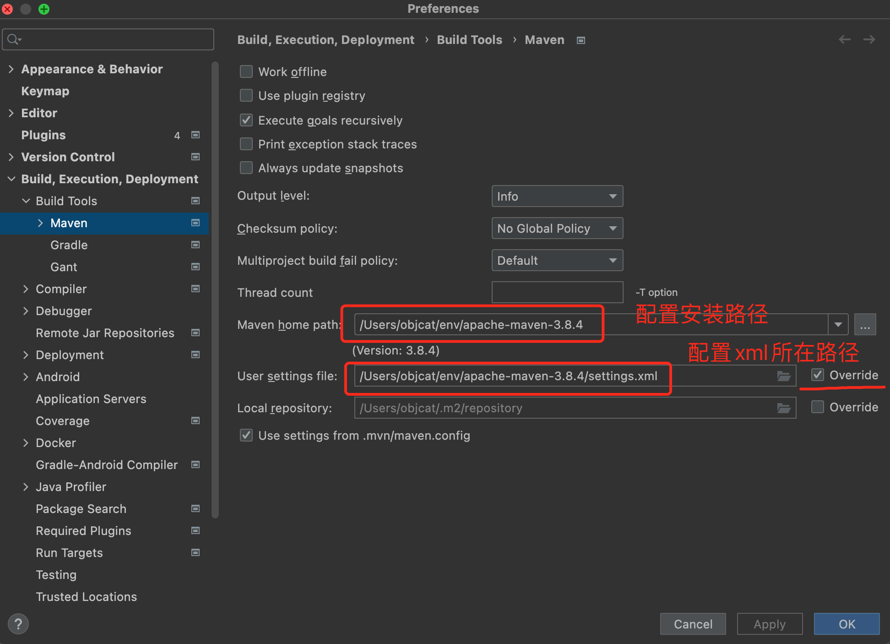
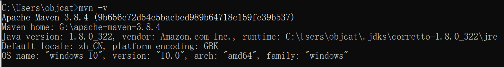

# 🍎 简介

Maven是我们常用的包管理工具和构建工具, 我们可以很轻松的在里面管理我们的第三方依赖库以及构建我们的项目, 但是由于它的仓库在国外, 所以国内使用还需要进行一下配置

# 🍎 官方网站

https://maven.apache.org

# 🍎 Mac安装

## 🌲 下载

首先要去官网下载maven, 这里推荐使用zip的压缩包, 下载后win和mac都能够使用

https://dlcdn.apache.org/maven/maven-3/3.8.6/binaries/apache-maven-3.8.6-bin.zip

## 🌲 解压

我们把压缩包解压出来, 可以看到Maven的目录结构


## 🌲 拷贝setting.xml

`setting.xml`是Maven的配置文件, 我们需要先将它备份一下, 首先我们在根目录下新建`maven`文件夹


然后把`conf`中的`setting.xml`拷贝到刚才新建的`maven文件夹`里面


拷贝完成后是这个样子


到这里配置文件备份成功了

## 🌲 配置国内镜像源

然后我们需要在里面配置一下镜像源, 因为maven仓库的地址是国外的, 国内拉取速度会很慢, 怎么配置呢? 

我们打开`maven`目录下的`setting.xml`, 然后在里面找到一个叫做mirror的标签


找到后我们把阿里云的Maven仓库粘贴进去

```xml
<mirror>
  <id>aliyunmaven</id>
  <mirrorOf>*</mirrorOf>
  <name>阿里云公共仓库</name>
  <url>https://maven.aliyun.com/repository/public</url>
</mirror>
```

然后保存就完事了

## 🌲 IDEA配置

我们现在就来配置一下IDEA吧, 它要怎么关联我们下载的Maven工具呢, 很简单啊, 首先打开设置页面, 如图所示,  我们只需要修改两个地方就可以了, 第一个是我们Maven路径, 刚刚解压的你不会忘了吧, 第二个就是我们刚才刚配置完的`setting.xml`文件, 先勾选override然后浏览路径把它选择上就可以了



注意`Local repository`可以不进行更改使用默认的配置, 也就是使用默认的`~/.m2/repository`

# 🍎 Windows安装

## 🌲 下载

https://maven.apache.org/download.cgi

https://dlcdn.apache.org/maven/maven-3/3.8.4/binaries/apache-maven-3.8.4-bin.zip

## 🌲 配置环境变量

下载完毕开始配置

首先配置maven的环境变量, 首先添加`MAVEN_HOME`


然后配置Path, 添加`%MAVEN_HOME%\bin`


然后使用`mvn -v`来检测是否配置成功



## 🌲 IDEA配置

配置成功后我们把idea和maven关联上, 首先配置路径


然后配置settings.xml, 在maven根目录下建立maven文件夹用于存放配置和仓库


复制`conf->settings.xml`到这个新建的文件夹, 再建立一个文件夹名字叫做`repository`, 如图所示


然后配置settings文件的镜像源


```xml
<mirror>
    <id>aliyunmaven</id>
    <mirrorOf>*</mirrorOf>
    <name>阿里云公共仓库</name>
    <url>https://maven.aliyun.com/repository/public</url>
</mirror>
```

配置完毕后, 把这两个目录配置到idea, 注意这两个路径中下面的路径推荐不用配置, 使用默认的`.m2/repository`


然后点击确定maven应该就开始工作了, 点击这个小按钮让他奔跑起来


速度嗷嗷的, 不一会就成功了


# 🍎 Maven仓库默认路径

## 🌲 IDEA配置

`/Users/objcat/.m2/repository`

# 🍎 镜像源集合

这里包含了国内大多数的镜像源, 如果有其中一个不好用了可以换成其他的

```xml
# 阿里
<mirror>
	<id>aliyunmaven</id>
	<mirrorOf>*</mirrorOf>
	<name>阿里云公共仓库</name>
	<url>https://maven.aliyun.com/repository/public</url>
</mirror>
# 阿里
<mirror>
    <id>alimaven</id>
    <name>aliyun maven</name>
    <url>http://maven.aliyun.com/nexus/content/groups/public/</url>
    <mirrorOf>central</mirrorOf>
</mirror>
# 华为
<mirror>
    <id>huaweicloud</id>
    <name>mirror from maven huaweicloud</name>
    <url>https://mirror.huaweicloud.com/repository/maven/</url>
    <mirrorOf>central</mirrorOf>
</mirror>
# maven china
<mirror>
    <id>maven.net.cn</id>
    <name>Mirror from Maven in china</name>
    <url>http://maven.net.cn/content/groups/public/</url>
    <mirrorOf>central</mirrorOf>
</mirror>
# os china
<mirror>
    <id>CN</id>
    <name>OSChinaCentral</name>
    <url>http://maven.oschina.net/content/groups/public/</url>
    <mirrorOf>central</mirrorOf>
</mirror>
```

# 🍎 仓库路径

我们项目中经常会用到一些第三方的依赖包, 就要去下面的网站去搜索

https://mvnrepository.com/

# 🍎 Bug

## 🌲 Cannot resolve xxx failed to transfer xxx

有可能是我删除.idea的原因, 后来重启一下idea就好了

```java
Cannot resolve cn.hutool:hutool-all:pom:5.8.8 failed to transfer from https://maven.aliyun.com/repository/public during a previous attempt. This failure was cached in the local repository and resolution is not reattempted until the update interval of aliyunmaven has elapsed or updates are forced. Original error: Could not transfer artifact cn.hutool:hutool-all:pom:5.8.8 from/to aliyunmaven (https://maven.aliyun.com/repository/public): transfer failed for https://maven.aliyun.com/repository/public/cn/hutool/hutool-all/5.8.8/hutool-all-5.8.8.pom
```


# 🍎 插件

## 🌲 配置POM

然后我们需要配置一下编译插件使用的Java版本, 这个需要新建项目的时候才能进行配置, 一般是自动就默认了Java8

```xml
<build>
	<plugins>
		<plugin>
			<groupId>org.apache.maven.plugins</groupId>
			<artifactId>maven-compiler-plugin</artifactId>
			<configuration>
				<source>8</source>
				<target>8</target>
			</configuration>
		</plugin>
	</plugins>
</build>
```