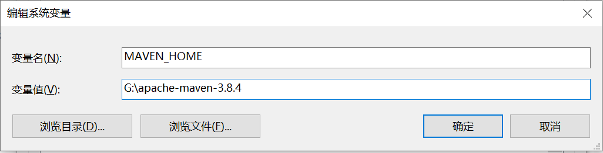
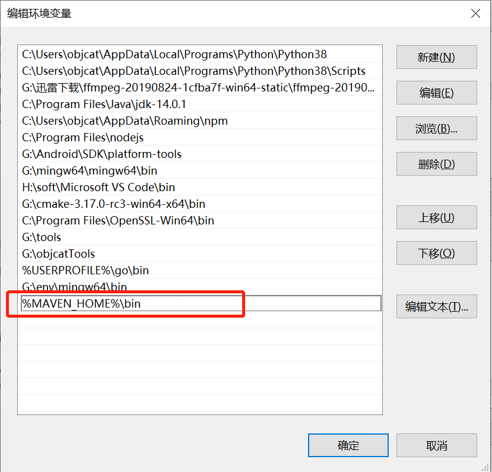
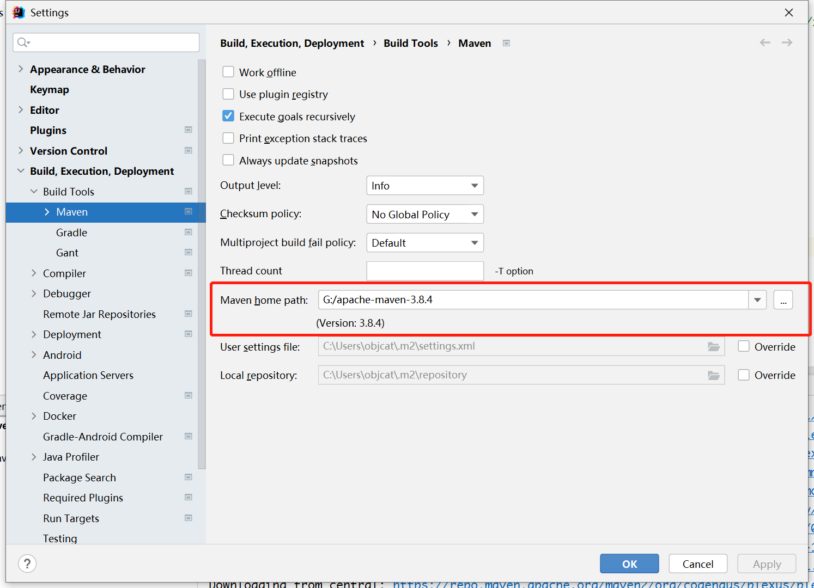
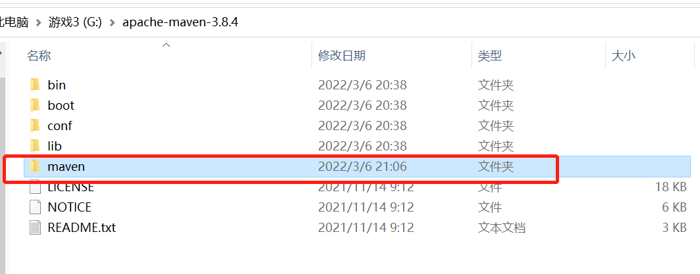
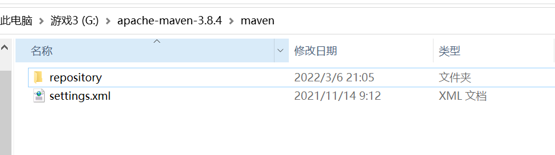
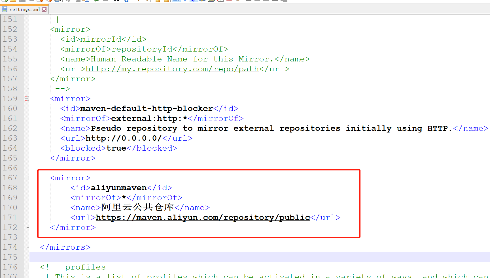
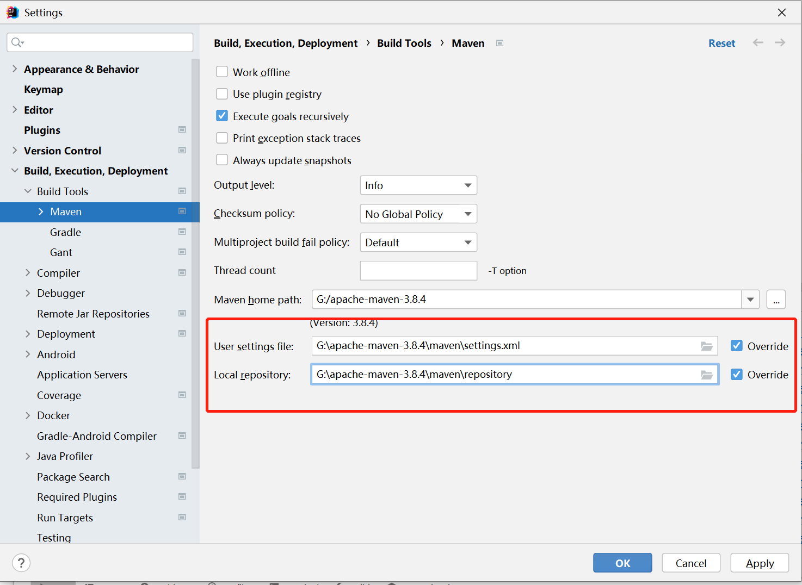
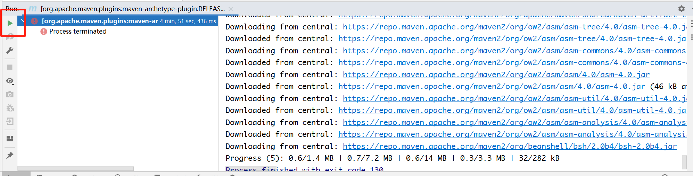
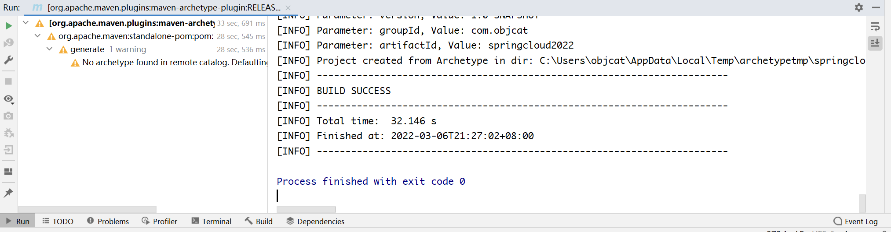

# 🍎 简介

https://maven.apache.org

Maven是我们常用的包管理工具和构建工具, 我们可以很轻松的在里面管理我们的第三方依赖库以及构建我们的项目, 但是由于它的仓库在国外, 所以国内使用还需要进行一下配置

# 🍎 Mac安装

## 🌲 下载

首先要去官网下载maven


然后选择一个版本


https://dlcdn.apache.org/maven/maven-3/3.9.4/binaries/apache-maven-3.9.4-bin.zip

## 🌲 解压

我们把压缩包解压出来, 可以看到Maven的目录结构


## 🌲 备份配置文件

`setting.xml`是`Maven`的配置文件, 我们需要先将它备份一下, 拷贝`setting.xml`为`setting_backup.xml`


## 🌲 配置国内镜像源

然后我们需要在里面配置一下镜像源, 因为`maven`仓库的地址是国外的, 国内拉取速度会很慢, 怎么配置呢? 

我们打开`maven`目录下的`setting.xml`, 然后在里面找到一个叫做mirror的标签


找到后我们把阿里云的Maven仓库粘贴进去

```xml
<mirror>
  <id>aliyunmaven</id>
  <mirrorOf>*</mirrorOf>
  <name>阿里云公共仓库</name>
  <url>https://maven.aliyun.com/repository/public</url>
</mirror>
```

然后保存就完事了

## 🌲 IDEA配置

就一个配置就行, 把`maven`的路径放上去


# 🍎 Windows安装

## 🌲 下载

https://maven.apache.org/download.cgi

这个我是下载的文件, 你看到文档的时候直接下载最新版就好, 我用`3.8.4`版本来演示
https://dlcdn.apache.org/maven/maven-3/3.8.4/binaries/apache-maven-3.8.4-bin.zip

## 🌲 配置环境变量

下载完毕开始配置环境变量, 怎么打开呢, 我的`电脑 -> 右键 -> 属性`


然后找到


在系统变量上点新建


首先配置`maven`的环境变量, 首先添加`MAVEN_HOME`



然后配置`Path`, 我们在系统变量中找到`Path`, 双击


点击新建, 添加`%MAVEN_HOME%\bin`



然后使用`mvn -v`来检测是否配置成功


## 🌲 IDEA配置

配置成功后我们把idea和maven关联上, 首先配置路径



然后配置settings.xml, 在maven根目录下建立maven文件夹用于存放配置和仓库



复制`conf->settings.xml`到这个新建的文件夹, 再建立一个文件夹名字叫做`repository`, 如图所示



然后配置settings文件的镜像源



```xml
<mirror>
    <id>aliyunmaven</id>
    <mirrorOf>*</mirrorOf>
    <name>阿里云公共仓库</name>
    <url>https://maven.aliyun.com/repository/public</url>
</mirror>
```

配置完毕后, 把这两个目录配置到idea, 注意这两个路径中下面的路径推荐不用配置, 使用默认的`.m2/repository`



其中`Local repository`保持原有的路径`.m2`也是可以的, 如果修改可能导致`Gradle`无法捕获`Mavne`包的问题, 如果你不用`Gradle`就不影响

然后点击确定`maven`应该就开始工作了, 点击这个小按钮让他奔跑起来



速度嗷嗷的, 不一会就成功了



# 🍎 命令

## 🌲 清理

```
mvn clean
```

## 🌲 打包

```shell
# 普通打包
mvn clean package
# 跳过测试打包
mvn clean package -Dmaven.test.skip=true
# 打包指定路径
mvn clean package -f ./renren-fast
```

## 🌲 打包详细参数

```
mvn clean package：

mvn：Maven 的命令行工具。
clean：清理项目，删除 target 目录，该目录包含编译后的类和其他生成的文件。
package：打包编译后的代码为可分发的格式，如 JAR 或 WAR 文件。
-pl flowable-service：

-pl 代表 "project list"（项目列表）。该选项允许你指定要构建的一部分项目/模块。在这里，它指定了 flowable-service 模块。
-am：

-am 代表 "also make"（同时构建）。该选项告诉 Maven 构建指定项目/模块的依赖项。这在一个项目/模块依赖于其他项目/模块时很有用，以确保它们也被构建。
-Dmaven.test.skip=true：

这个属性设置 maven.test.skip 为 true，意味着跳过构建生命周期中的测试阶段。这可以加快构建过程，但测试不会运行。
-U：

这个选项强制 Maven 更新依赖项的快照版本。它会检查远程仓库中快照版本的更新，并在必要时更新本地仓库。
-gs settings.xml：

-gs 用于指定全局设置文件的位置 (settings.xml)，该文件通常包含仓库的配置和认证信息。
-s settings.xml：

-s 用于指定用户级别的设置文件位置 (settings.xml)。通常用于覆盖全局设置或为特定构建提供自定义配置。
```

# 🍎 Maven仓库默认路径

## 🌲 IDEA配置

`/Users/objcat/.m2/repository`

# 🍎 镜像源集合

这里包含了国内大多数的镜像源, 如果有其中一个不好用了可以换成其他的

```xml
# 阿里
<mirror>
	<id>aliyunmaven</id>
	<mirrorOf>*</mirrorOf>
	<name>阿里云公共仓库</name>
	<url>https://maven.aliyun.com/repository/public</url>
</mirror>
# 阿里
<mirror>
    <id>alimaven</id>
    <name>aliyun maven</name>
    <url>http://maven.aliyun.com/nexus/content/groups/public/</url>
    <mirrorOf>central</mirrorOf>
</mirror>
# 华为
<mirror>
    <id>huaweicloud</id>
    <name>mirror from maven huaweicloud</name>
    <url>https://mirror.huaweicloud.com/repository/maven/</url>
    <mirrorOf>central</mirrorOf>
</mirror>
# maven china
<mirror>
    <id>maven.net.cn</id>
    <name>Mirror from Maven in china</name>
    <url>http://maven.net.cn/content/groups/public/</url>
    <mirrorOf>central</mirrorOf>
</mirror>
# os china
<mirror>
    <id>CN</id>
    <name>OSChinaCentral</name>
    <url>http://maven.oschina.net/content/groups/public/</url>
    <mirrorOf>central</mirrorOf>
</mirror>
```

# 🍎 仓库路径

我们项目中经常会用到一些第三方的依赖包, 就要去下面的网站去搜索

https://mvnrepository.com/

# 🍎 Bug

## 🌲 Cannot resolve xxx failed to transfer xxx

有可能是我删除.idea的原因, 后来重启一下idea就好了

```java
Cannot resolve cn.hutool:hutool-all:pom:5.8.8 failed to transfer from https://maven.aliyun.com/repository/public during a previous attempt. This failure was cached in the local repository and resolution is not reattempted until the update interval of aliyunmaven has elapsed or updates are forced. Original error: Could not transfer artifact cn.hutool:hutool-all:pom:5.8.8 from/to aliyunmaven (https://maven.aliyun.com/repository/public): transfer failed for https://maven.aliyun.com/repository/public/cn/hutool/hutool-all/5.8.8/hutool-all-5.8.8.pom
```


# 🍎 插件

## 🌲 配置POM

然后我们需要配置一下编译插件使用的Java版本, 这个需要新建项目的时候才能进行配置, 一般是自动就默认了Java8

```xml
<build>
	<plugins>
		<plugin>
			<groupId>org.apache.maven.plugins</groupId>
			<artifactId>maven-compiler-plugin</artifactId>
			<configuration>
				<source>8</source>
				<target>8</target>
			</configuration>
		</plugin>
	</plugins>
</build>
```