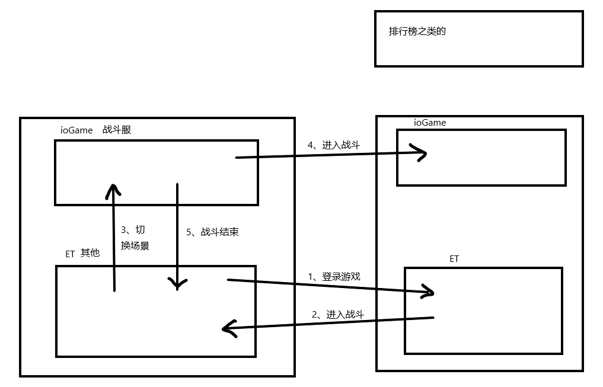

# 🍎 简介

这篇文档主要分析`重装机兵-霸主`项目, 中间会添加自己思考的方式, 也当是记录生活, 感谢作者`Dr隆鹰`

# 🍎 学习日志

| 日期         | 学习内容                                    | --   |
| ---------- | --------------------------------------- | ---- |
| 2025.08.11 | 没学, 拉取了一下项目加班去了                         | 第1天  |
| 2025.08.12 | 安装unity, 发现无法运行项目, 开始学习unity            | 第2天  |
| 2025.08.13 | 新建项目, 项目配置, 场景和层级, 灯光和摄影机, 创建游戏对象, 场景轴向 | 第3天  |
| 2025.08.14 | 练习1, 场景快捷键, 切换模式, 游戏窗口, 项目窗口, 控制台, 检查窗口 | 第4天  |
| 2025.08.15 | 打包模块, ET, HybridCLR                     | 第5天  |
| 2025.08.16 | 学习ET场景相关                                | 第6天  |
| 2025.08.17 | 学习ET中ESC的应用                             | 第7天  |
| 2025.08.18 | 分析霸主登录页面实现原理                            | 第8天  |
| 2025.08.19 | 学习ioGame框架, 了解对外服,网关,逻辑服                | 第9天  |
| 2025.08.20 | lie down and have a rest                | 第10天 |
| 2025.08.21 | 歇着                                      | 第11天 |
| 2025.08.22 | 开始项目总览模块                                | 第12天 |
| 2025.08.23 | 学习配表                                    | 第13天 |
| 2025.08.24 | 完成编译原理模块, 包管理模块                         | 第14天 |
| 2025.08.25 | 增加大地图分析模块, 分析了移动监听器                     | 第15天 |

# 🍎 快速开始

跟随教程一口气把项目跑起来, 先别管别的

## 🌲 安装指定版本`Unity`

打开项目我们需要与作者保持一样的`Unity`版本, 可以在团结引擎的`installs`选项中安装


在安装好`Unity Hub`的前提下, 点击下面的网页可以快速跳转到安装界面

https://unity.cn/releases


点击更多版本找到你想要安装的

## 🌲 打开项目


点击这个`Open`, 然后选择项目的`Unity`文件夹


经过漫长的加载就可以打开这个项目了

选择场景

项目打开后双击`Scenes`下面的`init`


然后我们就能在场景视图下面看到我们做游戏的场景了


## 🌲 尝试运行当前场景

我们尝试直接运行当前场景


发现是报错了, 有两个错误, 一个是没有找到`Unity.Model.dll.bytes`, 还有一个数据接收异常

## 🌲 尝试打包项目

这条路走不通我们换一个, 是不是可以直接打包个PC的项目看看呢


发现也是行不通的, 说我有东西没安装, 那我只能脑补一下, 有一个包管理器, 然后可以拉取package, 这条路也堵死了

## 🌲 调研运行错误

那我们尝试解决上面的`Unity.Model.dll.bytes`没找到的错误吧

```shell
System.IO.FileNotFoundException: Could not find file "D:\project\unity\zzjb2d\Unity\Assets\Bundles\Code\Unity.Model.dll.bytes"
File name: 'D:\project\unity\zzjb2d\Unity\Assets\Bundles\Code\Unity.Model.dll.bytes'
  at System.IO.FileStream..ctor (System.String path, System.IO.FileMode mode, System.IO.FileAccess access, System.IO.FileShare share, System.Int32 bufferSize, System.Boolean anonymous, System.IO.FileOptions options) [0x0019e] in <17d9ce77f27a4bd2afb5ba32c9bea976>:0 
  at System.IO.FileStream..ctor (System.String path, System.IO.FileMode mode, System.IO.FileAccess access, System.IO.FileShare share, System.Int32 bufferSize) [0x00000] in <17d9ce77f27a4bd2afb5ba32c9bea976>:0 
```

单凭现在的我是无法解决这个问题的, 我问了GPT它说是一个`热更新`用的东西, 就在一筹莫展的时候突然想起了前两天`霸哥`给发的文档, 顿时感觉我站在了巨人的肩膀上


第一步切换成`DEBUG`环境, 在我看来这个应该是可以切换成开发服务器的配置, 而开发服务器一般都是在自己本地的, 所以我推测有一个地方就可以配置本地的服务器+mysql+mango, 这里我就先切换过来, 配置的地方我先不去看 先解决问题

接下来`霸哥`说要安装`HybirdCLR`


我们点击`Installer`


点击`install`后卡住了, 说明程序是阻塞运行的, 我们耐心等一会看看


在这里可以看到已经安装好了, 但是我尝试运行了一下还是报一样的错误

我们跟随霸哥的文档去安装另一个, `IL2CPP`


在安装的过程中我查了一下

```
IL2CPP是Unity 官方的脚本后端（Scripting Backend）技术，全称是Intermediate Language To C++, 其作用是把C#代码转化成C++代码
```

安装完之后运行单个场景仍然会报错, 点击报错信息定位到了一个`CodeLoader`中

```cs
namespace ET
{
    public class CodeLoader : Singleton<CodeLoader>, ISingletonAwake
    {
        private Assembly modelAssembly;
        private Assembly modelViewAssembly;

        private Dictionary<string, TextAsset> dlls;
        private Dictionary<string, TextAsset> aotDlls;
        private bool enableDll;
        ...
```

我不知道这是干啥的, 但是大致可以推断出来就是程序启动的时候要进行`热更新`, 在这里找到出错的代码, 运行的时候无法找到这些`dll`

```cs
if (this.enableDll)
{
    byte[] modelAssBytes = File.ReadAllBytes(Path.Combine(Define.CodeDir, "Unity.Model.dll.bytes"));
    byte[] modelPdbBytes = File.ReadAllBytes(Path.Combine(Define.CodeDir, "Unity.Model.pdb.bytes"));
    byte[] modelViewAssBytes = File.ReadAllBytes(Path.Combine(Define.CodeDir, "Unity.ModelView.dll.bytes"));
    byte[] modelViewPdbBytes = File.ReadAllBytes(Path.Combine(Define.CodeDir, "Unity.ModelView.pdb.bytes"));
    this.modelAssembly = Assembly.Load(modelAssBytes, modelPdbBytes);
    this.modelViewAssembly = Assembly.Load(modelViewAssBytes, modelViewPdbBytes);
}
```

可以看到它是在本地文件去读取这个, 但是热跟新去读本地文件是没用的啊, 所以我觉得肯定没这么简单, 说不定是先所以我查看了`enableDll`是做什么用的, 找到了这行

```cs
this.enableDll = Resources.Load<GlobalConfig>("GlobalConfig").EnableDll;
```

然后点入属性

```cs
[CreateAssetMenu(menuName = "ET/CreateGlobalConfig", fileName = "GlobalConfig", order = 0)]
public class GlobalConfig : ScriptableObject
{
    public CodeMode CodeMode;

    public bool EnableDll;

    public BuildType BuildType;

    public AppType AppType;

    public EPlayMode EPlayMode;

    [HideInInspector] public string ServerIP = "xxx.xxx.xxx";
    [HideInInspector] public string ABundlesIP = "https://xxx";
    [HideInInspector] public string ABundlesVersion = "v1.0";

    [HideInInspector] public ConnectType ConnectType = ConnectType.Remote;
}
```

`敏感信息我隐藏了`, 虽然不懂这是什么, 但是从`GlobalConfig`字面意义上理解和对代码中出现了服务器地址`ServerIP`, 可以推断出就是相当于一个配置文件, 要从远程服务器上获取, 到这里线索中断了, 我不知道它为什么要在本地读取一个补丁

## 🌲 大佬一句话成功解决

后来大佬说要按一下`F6`来运行, 这个步骤其实就是调用的`ET`选项中的编译插件


可以看到`ET`栏目中的`Compile`


经过编译发现这些文件自动生成了, 然后点击运行发现可以了


## 🌲 解决方法2

上面可以满足启动项目, 但是`ET`那个编译插件有时候是`很慢的`, 或者你遇到了某些`奇奇怪怪`的问题, 那就推荐`Unity`和`ET`双编, 就是先打开`ET`编译一遍, 再打开`Unity`编译一遍即可, 详情看我的`ET`笔记中`🌲 编译项目`章节

[ET编译项目](../../../7-software/unity/ET/ET.md#🌲%20编译项目)

## 🌲 切换环境

切换环境也是用这个`GlobalConfig`配置文件, 把`Connect Type`选择为`Remote`即可


然后我们进入游戏看看


可以登录说明切换成功了, 但是我试过战斗服务器不能连接不知道为何

# 🍎 项目总览

先放一张大佬给的图



我简单理解一下, 我们都知道`ET`是一个双端框架, `客户端+服务端`都是`C#`编写, 另外我们还有一个战斗服务器, 使用`Java`+`ioGame框架`编写, 下文称服务器为`ET服`和`战斗服`

1. 登录游戏时我们使用的`ET服`认证进行登录, 登录成功选择角色后我们就可以进入`城镇`
2. 走出城镇会进入`野外场景`, 在场景中会`遇到怪物`这时会切换到战斗场景, 后台通过`战斗服`支撑, 战斗结束回到`ET服`的`野外场景`, 不同服务器负责不同的场景

# 🍎 开发计划

记录在群众讨论的开发计划

[开发计划浏览](../devplan/devplan.md)

# 🍎 代码分析

本模块在`代码`层面分析游戏中不同的模块是如何实现的, 新手分析, 仅供参考

## 🌲 登录页分析

[登录页分析](../login/login.md)

## 🌲 大地图分析

[大地图分析](../map/map.md)

# 🍎 FAQ

## 🌲 DOTween.Modules.dll

双编就能解决, 编译`霸主Unity`和`ET`

```
13>CSC: Error CS0006 : 未能找到元数据文件“D:\project\unity\zzjb2d\Unity\Temp\bin\Debug\DOTween.Modules.dll”
13>CSC: Error CS0006 : 未能找到元数据文件“D:\project\unity\zzjb2d\Unity\Temp\bin\Debug\game.dll”
13>------- Finished building project: Unity.HotfixView. Succeeded: False. Errors: 2. Warnings: 0
```

## 🌲 二义性错误

```
类型“AppellationConfigCategory”已经包含“Points”的定义
类型“AppellationConfigCategory”已经包含“Appellations”的定义
类型“AppellationConfigCategory”已定义了一个名为“GetAppellation”的具有相同参数类型的成员
在“AppellationConfigCategory.Points”和“AppellationConfigCategory.Points”之间具有二义性
在“AppellationConfigCategory.Appellations”和“AppellationConfigCategory.Appellations”之间具有二义性
类型“AppellationConfigCategory”已定义了一个名为“EndInit”的具有相同参数类型的成员
以下方法或属性之间的调用具有二义性:“AppellationConfigCategory.GetAll()”和“AppellationConfigCategory.GetAll()”
在“AppellationConfigCategory.Appellations”和“AppellationConfigCategory.Appellations”之间具有二义性
在“AppellationConfig.Points”和“AppellationConfig.Points”之间具有二义性
```


代码和最新的分支完全一样


群里大佬告诉我说`重新编译项目`和`重新生成配表文件`, 但是现在项目根本编译不起来, 菜单上面的`ET`都是不显示的, 那就无法去编译代码, 而想显示`ET`需要建议代码, 所以陷入了死循环, 开始想办法

### 🌸 替换dll

所以我在想是否可以把`Unity.Editor.dll`从别的工程拿过来, 是不是就能使用`ET`了

```
zzjb2d\Unity\Library\ScriptAssemblies
```


放进来了, 没用

### 🌸 分析源码

我们去分析一下导出`excel`的源码

```cs
namespace ET
{
    public static class ToolsEditor
    {
        public static void ExcelExporter()
        {
#if UNITY_EDITOR_OSX || UNITY_EDITOR_LINUX
            const string tools = "./Tool";
#else
            const string tools = ".\\Tool.exe";
#endif
            ShellHelper.Run($"{tools} --AppType=ExcelExporter --Console=1", "../Bin/");
        }
        
        public static void Proto2CS()
        {
#if UNITY_EDITOR_OSX || UNITY_EDITOR_LINUX
            const string tools = "./Tool";
#else
            const string tools = ".\\Tool.exe";
#endif
            ShellHelper.Run($"{tools} --AppType=Proto2CS --Console=1", "../Bin/");
        }
    }
}
```

可以看到它其实就是使用`Tool.exe`工具来进行`excel`的编译, 我我在想是否可以直接使用这个`exe`来给我编译

### 🌸 开始编译

命令都在这里呢, 首先我们找到`Tool.exe`路径

```
\zzjb2d\Bin
```

我们进入到这个目录执行命令, 两个都生成一下吧

```shell
Tool.exe --AppType=ExcelExporter --Console=1
Tool.exe --AppType=Proto2CS --Console=1
```

然后可以看到类被编译出来了


编译前是红色的, 编译后可以看到高亮了, 说明编译成功


然后运行项目还是不行, 但是解决了一部分问题了

### 🌸 对比

后来我对比的时候发现, 原包中有一个`Ignore.asmdef`, 而`zzjb2d`中没有这个`asmdef`文件, 导致了同一个类名打入了同样的dll


而且细思极恐的是这个文件如果误删是查不出来的, 因为系统默认忽略了它, 我好奇的是既然他在云端, 为什么忽略会生效


所以解决方案是把`Client和Server`中的`ignore.asmdef`补齐即可, 这样打包的时候就不会放到同一个`dll`中导致冲突了, 可以学到的是, `asmdef`不仅针对子工程, 针对某一个文件夹也是可以的, 唯一遗憾的是找这个问题浪费2小时

## 🌲 Reflection错误

刚解决完上面的问题就遇到了这个问题, 看上去是`IReLocationRequest`反射不到了, 也就是没有打包到`dll`中

```shell
System.Reflection.ReflectionTypeLoadException: Exception of type 'System.Reflection.ReflectionTypeLoadException' was thrown.
Could not resolve type with token 01000047 from typeref (expected class 'ET.IReLocationRequest' in assembly 'Unity.Core, Version=0.0.0.0, Culture=neutral, PublicKeyToken=null') assembly:Unity.Core, Version=0.0.0.0, Culture=neutral, PublicKeyToken=null type:ET.IReLocationRequest member:(null)
Could not resolve type with token 01000048 from typeref (expected class 'ET.IReLocationResponse' in assembly 'Unity.Core, Version=0.0.0.0, Culture=neutral, PublicKeyToken=null') assembly:Unity.Core, Version=0.0.0.0, Culture=neutral, PublicKeyToken=null type:ET.IReLocationResponse member:(null)
Could not load type of field 'ET.Client.RoleSelectFinish:action' (0) due to: Could not resolve type with token 01000099 from typeref (expected class 'ET.RoleSelectAction' in assembly 'Unity.Core, Version=0.0.0.0, Culture=neutral, PublicKeyToken=null') assembly:Unity.Core, Version=0.0.0.0, Culture=neutral, PublicKeyToken=null type:ET.RoleSelectAction member:(null)
```

第一时间想到的就是`F6`重新编译一下, 但我发现并不能解决这个问题, 所以只能从代码了求找一下了, 我们发现`IReLocationRequest`和`IReLocationResponse`

我们发现这三个`IRe`开头的接口在以前是没有定义过的

```cs
namespace ET
{
    public interface ILocationMessage: ILocationRequest
    {
    }

    public interface ILocationRequest: IRequest
    {
    }

    public interface ILocationResponse: IResponse
    {
    }
    
    public interface IReLocationMessage: IReLocationRequest
    {
    }

    public interface IReLocationRequest: ILocationRequest
    {
    }

    public interface IReLocationResponse: ILocationResponse
    {
    }
}
```

我们只能反编译一下`Unity.Core.dll`


我们发现确实是搜索不到的`IRe`开头的三个都没有


我们只能把这个`Unity.Core.dll`删除, 然后重新`F6`编译试试


然后发现可以搜索出来了, 看来是在编译之前必须先删除原来的, 可能是由于某些问题没有删除成功吧