# 前文链接
[Docker] 入门教程
https://www.jianshu.com/writer#/notebooks/20574865/notes/37511203

# 简介
MySQL是我们经常使用的数据库, 那么在Docker上如何安装呢, 下面就跟着我们的镜头一起来看吧

# 正文

###### 一.安装mysql
使用docker镜像, 我们可以方便的进行安装
```
docker pull mysql
```

输入上面的命令即可

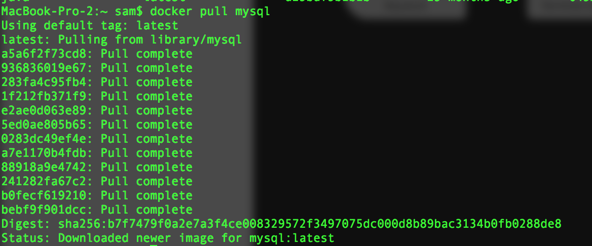

之后我们来查看一下镜像
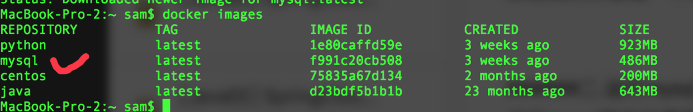

我们可以看到mysql已经安装完成了


###### 二.运行mysql
运行mysql我们只需要使用docker命令
```
docker run --name objcat-mysql -e MYSQL_ROOT_PASSWORD=123456 -p 3306:3306 -d mysql
```

之后我们使用`navicat`来连接一下数据库吧

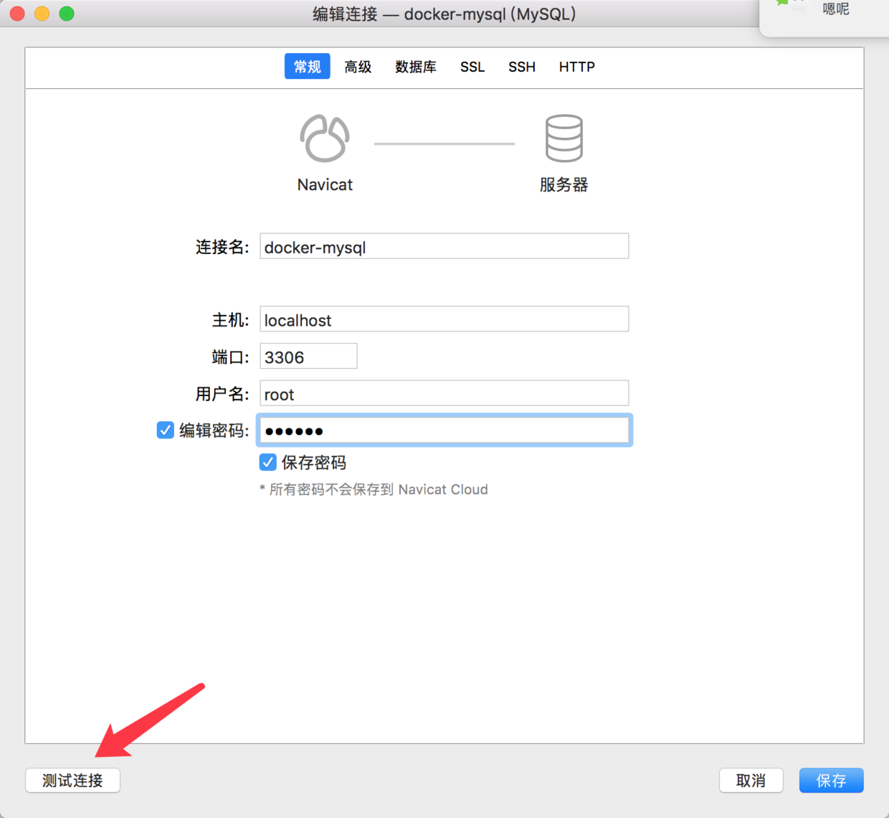

初始密码为`123456`

我们点击测试连接

之后你可能会遇到这样一种错误

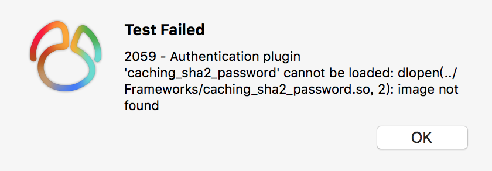

> 2059 - Authentication plugin 'caching_sha2_password' cannot be loaded: dlopen(../Frameworks/caching_sha2_password.so, 2): image not found

不要慌, 这是由于`mysql8.0`之后密码验证方式进行了一些改动, 最好的解决方案是升级`navicat`到12.1版本之后, 安装之后再次尝试登陆即可

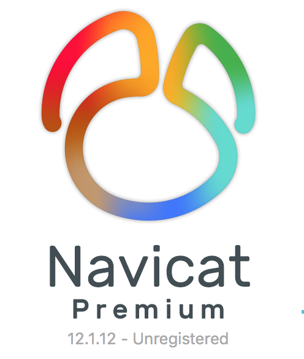

当然你如果有经历可以折腾换回之前的登录验证方式, 你可以自己去网上搜

还有可能遇到第二种错误

> ERROR 1045 (28000): Access denied for user 'root'@'localhost' (using password: NO)

这个错误就是说你密码写错了 重新填写 - -

好的解决了上述问题, 我们继续...

登陆数据库看一下

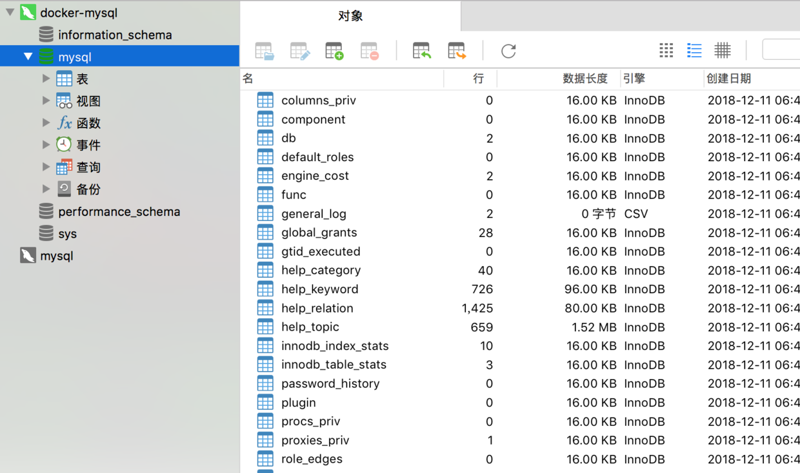

好的 表都在 这一部分结束.

###### 三.进入Docker中的数据库
我们已经可以启动和正常连接数据库, 接下来我们来进入docker虚拟机中的数据库, 这里使用`exec`命令

```
docker exec -it fe4fa833af66 /bin/bash
```

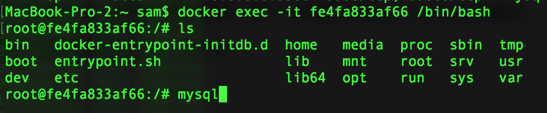

之后ls看一下文件目录 出现上图的效果成功进入虚拟机了

之后我们来登陆一下数据库
```
mysql -uroot -p123456
```
`-u` 用户名
`-p` 密码 默认:123456

我们来打印一下mysql的一些信息
```
status
```
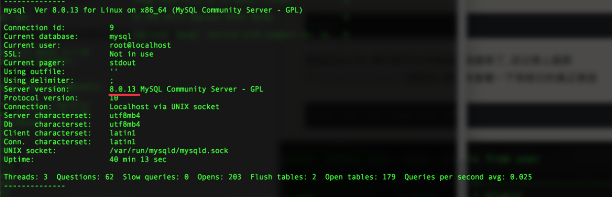

我们可以看到版本号和一些其他信息

首先我们切换到`mysql`系统数据库
```
use mysql
```

之后我们就可以开始操作数据库了, 还记得上面那个`caching_sha2_password`错误吗, 我们来查看一下导致它的真正原因
```
select user, host, plugin from user
```

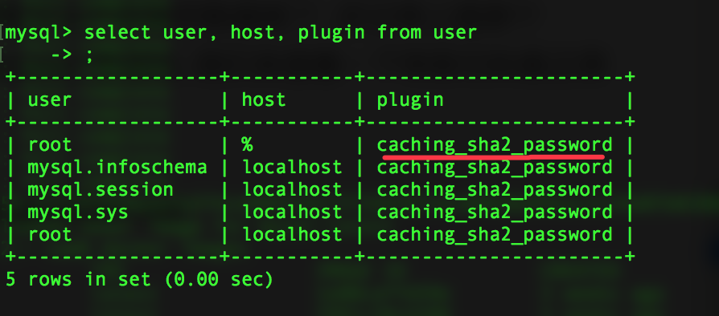

之后我们来看一下之前版本的mysql
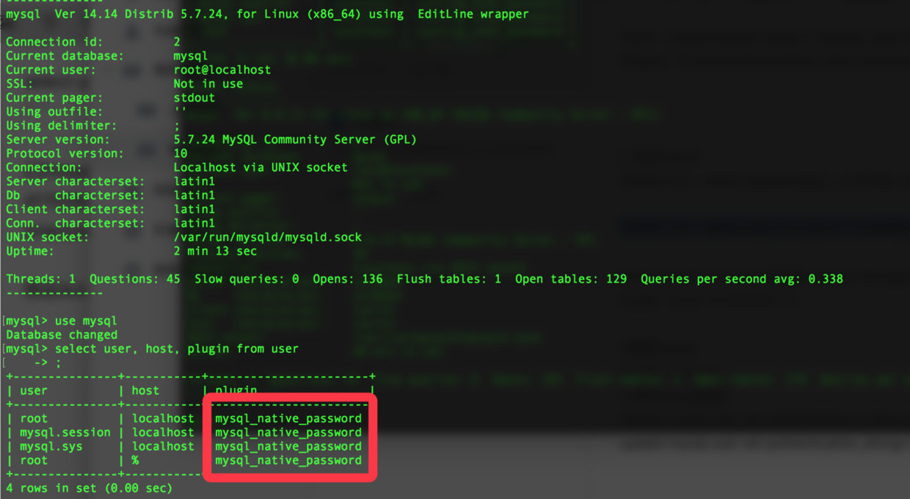

我们发现使用的密码格式都是`mysql_native_password`

接下来我们来修改一下密码, 将管理员密码修改成`111111`

```
alter user 'root'@'localhost' identified by '111111';
```

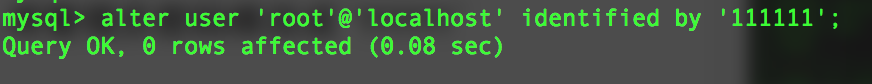

然后就修改成功了, 我们再次登录的时候就需要使用`111111`密码了
```
mysql -uroot -p111111
```

这里说一下, 有的人会使用下面的方式修改密码
```
update user set authentication_string=password("111111") where user='root';
FLUSH PRIVILEGES;
```

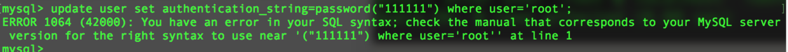

这个是以前的老命令版本(8.0.4)之前可以使用, 现在的版本(8.0.13)已经移除了改指令, 所以请使用新命令来执行, 否则会报错.

# finally enjoy it.
# by objcat
# 2018.12.11


