# 一.前言

最近玩了玩`Docker`, 从刚听说它到下载使用时间相隔了3年 - -, 因为最近刚刚学习完`SpringCloud`全家桶, 而网上的教程都比较混杂, 所以我准备写一篇`Docker`的教程, 提供给大家学习.

# 二.开始

##### 1.下载Docker
https://www.docker.com/get-started
这个页面向下拉 就可以看到下载的按钮了
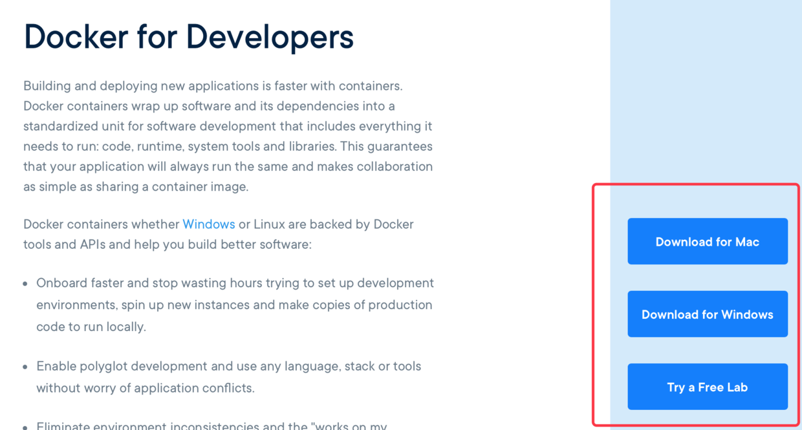

安装需要先注册账号 - **极大可能需要搬梯子**.

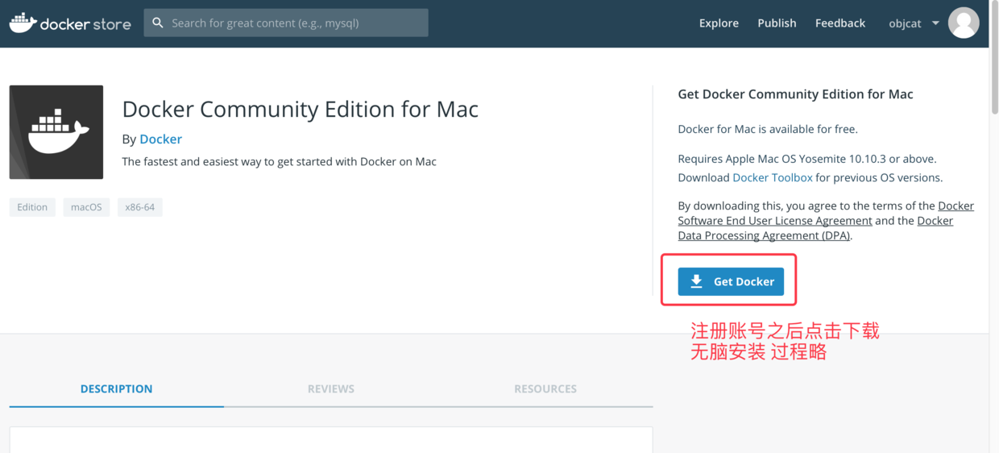

本文使用`MacOS`作为教程系统 , `Windows`请参考使用, 原理大致相同

##### 2.部署之前的准备

###### 1.启动docker
docker安装完成之后 我们要如何启动docker呢? 很简单, 我们安装docker后在`LaunchPad`中会出现一个`Docker`的应用, 点击会自动启动
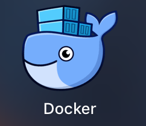

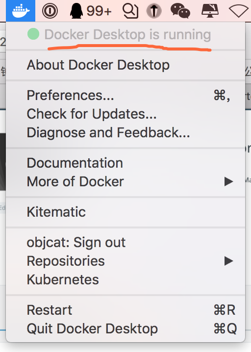

看到图上的显示`Docker Desktop is running`说明启动成功了!!!

如果是`centos`系统, 需要输入命令安装
```
yum install docker
```
然后启动
```
systemctl start docker
```
之后如果不出什么意外`Docker`就会启动.

###### 2.Docker的基础概念
这一节单独拿出来说, 可见重要性, 理论知识是你学好Docker的基础, 下面我说的话并不一定是最准确的, 但都是我最真实的理解.

###### 1.Docker是什么
> Docker 是一个[开源](https://baike.baidu.com/item/%E5%BC%80%E6%BA%90/246339)的应用容器引擎，让开发者可以打包他们的应用以及依赖包到一个可移植的容器中，然后发布到任何流行的 [Linux](https://baike.baidu.com/item/Linux) 机器上，也可以实现[虚拟化](https://baike.baidu.com/item/%E8%99%9A%E6%8B%9F%E5%8C%96/547949)。容器是完全使用[沙箱](https://baike.baidu.com/item/%E6%B2%99%E7%AE%B1/393318)机制，相互之间不会有任何接口。<sup> [1]</sup> - 摘自百度百科

你可以把`Docker`理解成一个轻量化的虚拟机, 在上面我们可以部署我们的后台项目, 而且部署后的项目可移植性非常强, 我们可以把他们导出为`Docker镜像`, 这个镜像可以运行在任何装有`Docker`的环境中,  几分钟就可以在别的系统上构建出一套一模一样的后台, 此处应有掌声 - - 

###### 2.镜像和容器的概念
镜像和容器是`Docker`中最重要的概念, 我把它们理解成`类`和`对象`, 一个镜像可以创建出无数的容器, 而每一个容器都是独立运行的一套系统环境, 镜像需要在`Docker`官网上下载(https://hub.docker.com/explore/), 容器需要依靠镜像创建出来, 然后我们就可以在容器上面部署`jar`包了 - -

##### 3.开始部署
###### 1.下载官方的java镜像
我们直接用命令行来下载官方为我们提供的镜像
```
docker pull java
```

之后请耐心等待

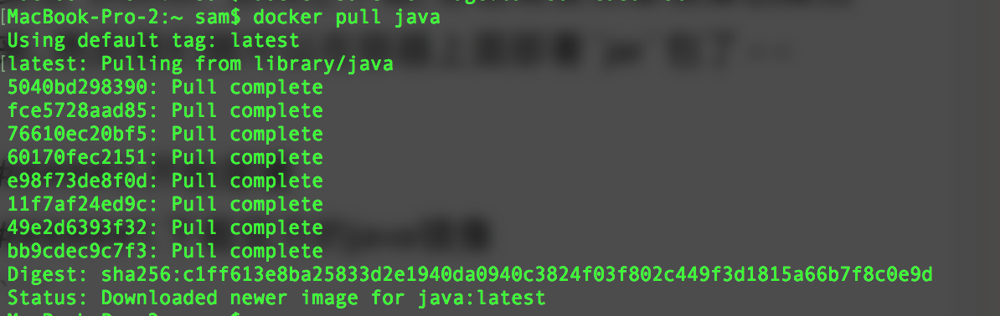

出现图上样子说明安装成功了 我们来查看一下java镜像

```
docker images
```

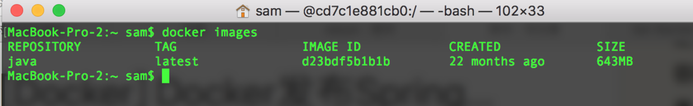

我们可以看到 java镜像在里面 其中包含了一下属性

`REPOSITORY` 名字
`TAG` 标签
`IMAGE ID` ID号

然后是创建时间和大小就不多加赘述了

###### 2.一行代码部署

等了这么久, 大家也累了, 我们直接来一行命令部署爽一下
```
docker run -itd -p 8082:8082 -v /Users/sam/Desktop/service-a.jar:/usr/service-a.jar --name service-a d23bdf5b1b1b java -jar /usr/service-a.jar
```
先把下巴合上, 口水擦一擦,  然后我们访问一下

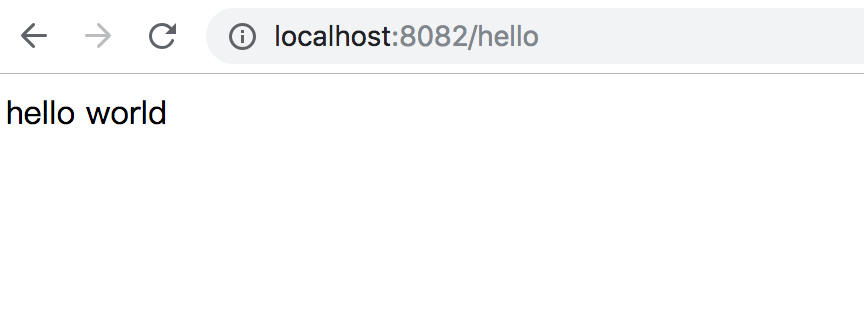

好的配置成功!!!

###### 3.原理剖析

我知道上面那一大坨你根本没明白 这里我就来剖析一下

想要配置上面的命令 你首先你要有一个jar包 如果没有我也不给你 - - 算了 你拿去吧 记得点赞
https://github.com/objcat/demo-jar-for-docker
如果想学你可以去看一下我的上一篇文章 如何打包
https://www.jianshu.com/p/935868c9141e

之后我们来解释一下命令:

`docker run`
 这是docker固有的命令 意思是运行一个镜像 镜像启动后就会自动生成一个容器 容器就是我们运行jar的环境

`-itd` 
```
-i, --interactive                    Keep STDIN open even if not attached
-t, --tty                            Allocate a pseudo-TTY
-d, --detach                         Run container in background and print container ID
```
`i`保持进程打开
`t`提供交互命令支持
`d`在后台开启进程 不加这个参数我们会在当前控制台运行jar


`-p 8082:8082` 
配置映射端口 `我的端口:虚拟机端口` 即把虚拟机中的8082端口映射到我的电脑上的8082上, 所以我们才能够访问

`-v /Users/sam/Desktop/service-a.jar:/usr/service-a.jar` 
将jar文件挂载到虚拟机中的目录, 冒号前后分别是自己的jar文件路径和挂载到虚拟机中的路径, `挂载`你可以理解成快捷方式 让虚拟机能运行你本地电脑里的jar

`--name service-a`
给容器起个名叫service-a

`d23bdf5b1b1b java -jar /usr/service-a.jar`
**d23bdf5b1b1b** 是java镜像的ID号 使用**docker images** 命令可以查看  
**java -jar /usr/service-a.jar** 是运行jar文件的命令 因为jar文件中包含tomcat所以直接运行就可以开启你的微服务了

好的 以上请认真阅读 我们继续

我刚才已经提到过了 启动镜像会自动创建出一个容器 这个容器中跑着我们的微服务接口 我们来查看一下容器
```
docker ps
```
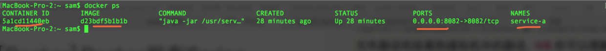

我么可以在图中看到 里面包含着我们的`容器ID`, `镜像ID`, `映射端口`和`容器名字`

好 我觉得它已经跑了很长时间了 我想关闭掉这个服务 我们直接关闭容器
```
docker stop 5a1cd11440eb
```
上面的字符串是容器ID, 千万别写成镜像ID了

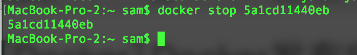

看到上图上显示的文字 就说明容器已经关闭了 我们使用`docker ps`来查看一下 发现什么都没有了

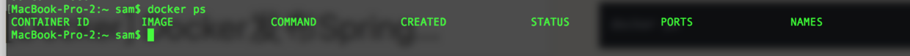

我们来访问一下刚才的接口
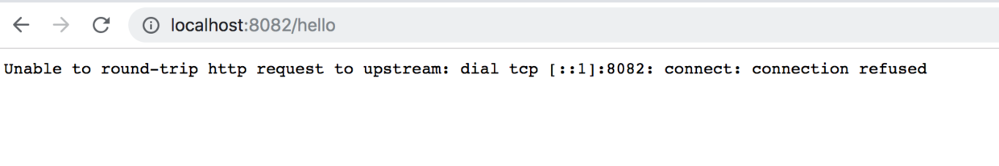

发现它果然已经关闭了

之后我大发慈悲 还想让刚才的那个服务再跑一会 所以我们来重新启动一下刚才的容器 首先我们查看所有的容器
```
docker ps -a
```
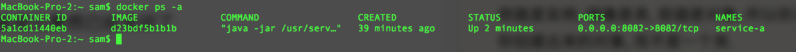

这时你可能有疑问 我不是把它停止了吗 它怎么还在?

看仔细了 我们使用的是`docker ps -a`查看所有`运行过`的容器, 即使关闭了也会显示出来, 你也可以把它当做历史记录来看

之后我们重新启动容器 恢复服务
```
docker start 5a1cd11440eb
```

**5a1cd11440eb** 为容器的ID

我们再次访问接口 发现服务可以正常访问了!

这就是最基本的启动与停止容器了.

##### 4.自定义镜像

###### 4.1 手动制作

如果我有这么一个需求, 就是我这套微服务接口,想拿到`windows`上部署运行, 要怎么做呢?

你可能会觉得这并不麻烦, 无非就是安装一个java环境然后配置环境变量, 然后运行jar包就可以了, 那么如果再算上mysql和redis呢? 这些你都能够那么快的配置好吗

以上这些问题, 我们使用自定义镜像的方式就都可以解决了, 我们可以把一整套环境直接搬到`pc`端去运行 不过这里只做简单配置

我们自定义镜像也可以比喻成是一个`类`, 你在实例化对象前, 都要先定义一个类, 然后再new出来一个对象, docker也如此, 先做一个镜像, 之后用这个镜像直接去运行你的服务即可

下面我们就从本文开始时下载那个`java`镜像说起了, 我们都知道java是一个环境, 它运行是依赖于操作系统的, 所以我觉得那个`java`可以更贴切的比喻成一个带linux的java环境, 而不仅仅是一个`jre`

接下来我们启动镜像

```
docker run -itd d23bdf5b1b1b
```
**d23bdf5b1b1b** 是java镜像ID 

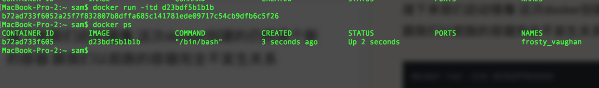

我们发现启动这个镜像会重新创建一个容器, 我们看容器id可以知道, 这是一个全新的跟其他容器都不发生关系.

之后我们使用`attach`命令来进入容器

```
docker attach b72ad733f605
```

之后请点两次回车 否则出不来...

我们使用`ls`看一下目录结构
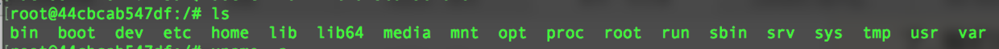

我们发现这就是我们熟悉的linux目录结构 我们使用`uname -a`查看一下系统信息
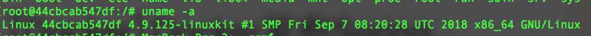

到这里可以证明 我们拉取的java镜像并不是一个简简单单的java, 而是一个安装了java的linux环境, 我们在外面执行的docker命令, 其实都被里面这位linux接收了, 也就是它帮助我们运行了项目, 并且你会发现这个linux启动是如此的快, 所以我们说它是一个轻量化的虚拟机.

好的接下来我们就知道怎么做了, 就是把`service-a.jar`这个包 放在linux系统里, 然后把这个系统做成`Docker`镜像, 在其他平台的`Docker`中运行就可以了.

我们现在在虚拟机里面 想回到自己本地的计算机 这里有几种方法
1.exit - 关闭容器并退出
2.ctrl + q + p  不关闭容器 从新定位到本地目录

现在的情况下 我们当然会选择第二种 因为我们要把jar包复制到虚拟机 所以虚拟机必须保持打开的状态

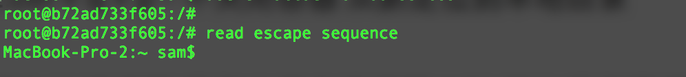

回到本地目录后 我们用`docker cp`命令来拷贝jar包到容器中

```
docker cp /Users/sam/Desktop/service-a.jar b72ad733f605:/usr/service-a.jar
```
id 为容器id

之后我们再进入容器中查看一下

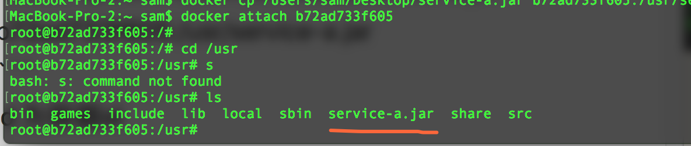

文件已经在容器中了 我们再退出容器

然后把我们的 `容器` 打包成 `镜像`
```
docker commit b72ad733f605 java/service-a
```
`docker commit`容器打包成镜像
`b72ad733f605 ` 容器id
` java/service-a` 打包后镜像的名称
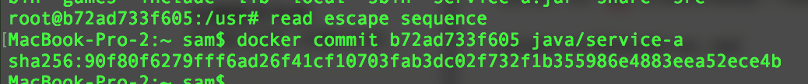

之后查看所有镜像

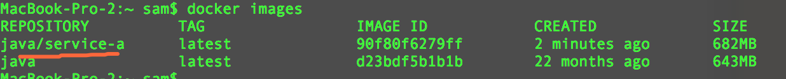

发现多了一个java/service-a 
你现在使用它来跑你的服务是完全没问题的 不过我们为了说明`docker`的可移植性 还需要经历接下来的步骤

我们把它导出成`tar`文件, `tar`文件可以直接被`Docker`安装
```
docker save -o service-a.tar 90f80f6279ff
```

导出之后我们就可以在任意`Docker`上安装了!!! 默认导出路径就是你所在目录.

我们这里在本地安装一下 试试 首先我们把本地的java/service-a这个镜像删除
```
docker rmi 90f80f6279ff
```

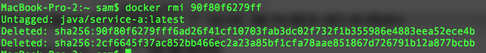

删除之后我们查看一下
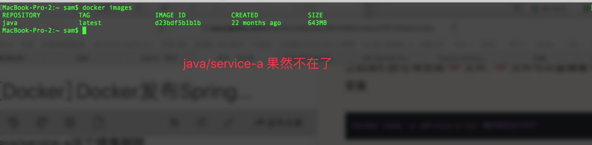

之后我们使用`docker load`命令来导入我们自定义的镜像
```
docker load -i /Users/sam/service-a.tar
```
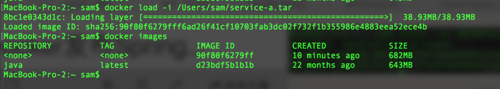

好的 我们发现导入成功了 但是导入的名字为`none` 这里我也不知道为什么 但是我们可以给它改个名字

```
 docker tag 90f80f6279ff java/service-a-daoru
```

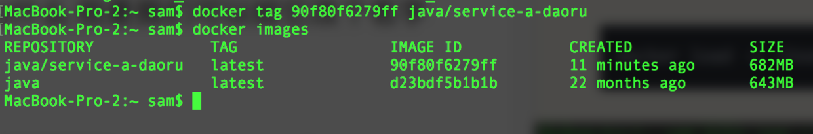

我们查看一下命令发现名字已经改过来了!!!

先别睡觉 我们还差最后一步了 就是把服务`service-a`重新启动起来 这次命令要简洁不少 因为不需要进行挂载了

```
docker run -idt -p 80:8082 --name service-a 90f80f6279ff java -jar /usr/service-a.jar
```

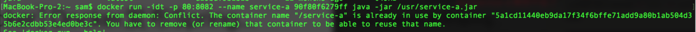

我们出了一个错误 说是我的service-a已经在使用了

我们把这个占用的容器移除 然后再次启动就可以了

```
docker rm 5a1cd11440eb9da17f34f6bffe71add9a80b1ab504d35b6e2cdbb53e4ed0be3c
```
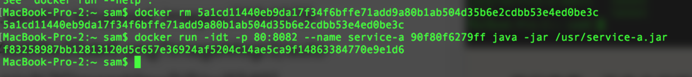

我们来访问一下试试吧

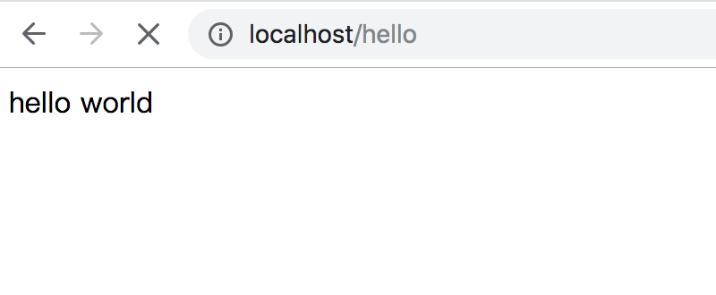

因为我这次映射的是80端口 所以不用输入端口号 直接就可以访问了

###### 4.2 Dockerfile
经过上面的学习 我们已经可以使用`容器`生成`images`再打包成`tar`导入到其他平台了, 你或许觉得手动操作起来有些不便, 毕竟如果很多命令的话, 每条都要自己记录, 复制黏贴也很消耗时间, 所以这里来介绍一种脚本生成镜像的方式`Dockerfile `

同样也很简单 我们一起来看一下吧 首先在你桌面上创建个文件夹 然后创建一个叫`Dockerfile `的文件, 需要一字不差
```
mkdir test
touch Dockerfile
```
之后我们吧`service-a.jar`拷贝到当前目录

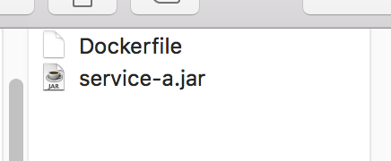

如图所示 那么接下来我们就要写脚本了 我们打开`Dockerfile ` 写入下面的脚本

```
# 基于哪个镜像源构建
FROM java
# 输入你的大名
MAINTAINER objcat
# 复制jar到镜像/usr目录
COPY service-a.jar /usr/service-a.jar
```

然后运行
```
docker build -t java/test .
```
注意千万不要忘了 **.**(点)   表示当前目录的`Dockerfile`

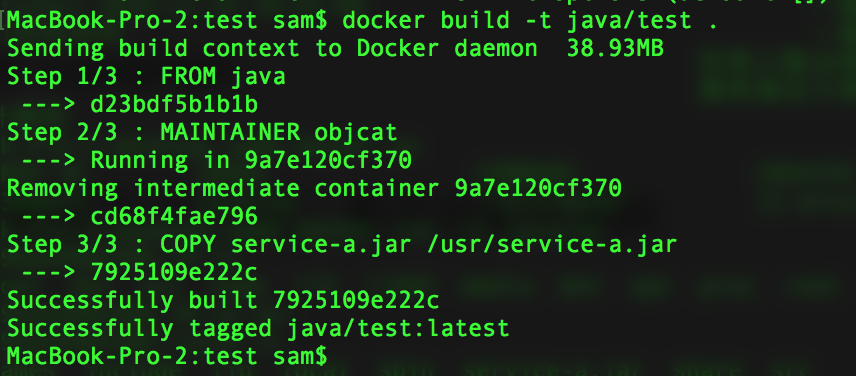

如上图所示 镜像制作成功了 使用`docker images`可以查看刚刚生成的镜像

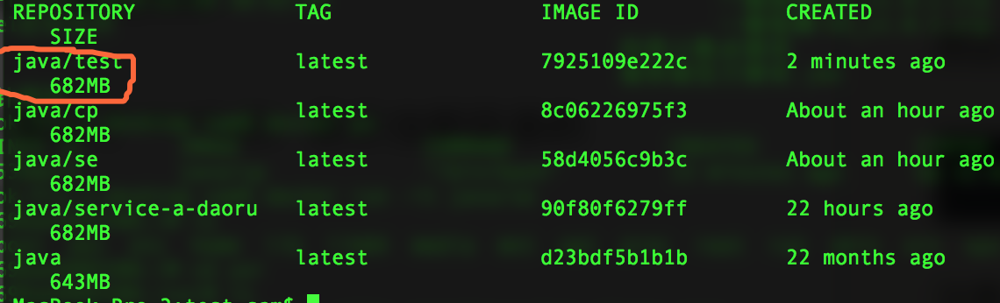

之后我们来启动一下吧 因为`service-a.jar`已经包含在镜像里面了, 所以我们并不需要挂载
```
docker run -idt -p 80:8082 --name service-a 90f80f6279ff java -jar /usr/service-a.jar
```

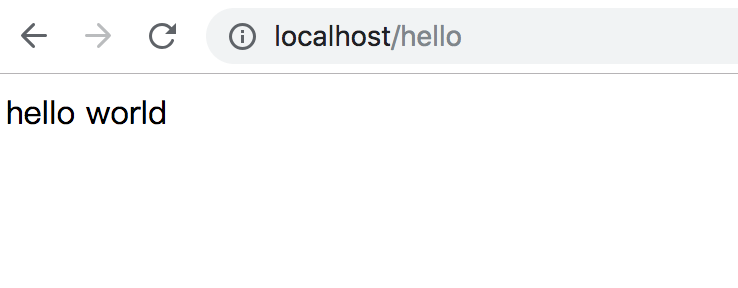

好的 访问成功 这就是最基本的`Dockerfile`的使用方法了


# 未完待续...
# finally enjoy it.
# by objcat 2018.11.29


  


 
