# 前文链接
[Docker] 入门教程
https://www.jianshu.com/p/7b3737df847d
ps: 不会安装的可以过来看看

# 前言
最近由于工作需要, 所以就着手研究了一下docker如何安装三条腿的猫, 所以下面就来记录一下.
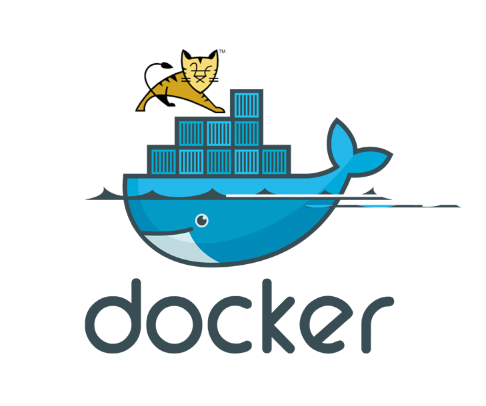

# 一.快速开始

这里介绍两种方法(官方镜像安装和Dockerfile安装):

###### 1.docker官方镜像安装

首先拉取镜像, 会自动拉取最新版本 - `docker pull tomcat`
```
[root@master ~]# docker pull tomcat
Using default tag: latest
Trying to pull repository docker.io/library/tomcat ...
latest: Pulling from docker.io/library/tomcat
ab1fc7e4bf91: Pull complete
35fba333ff52: Pull complete
f0cb1fa13079: Pull complete
3d79c18d1bc0: Pull complete
ff1d0ae4641b: Pull complete
8883e662573f: Pull complete
adab760d76bd: Pull complete
86323b680e93: Pull complete
14a2c1cdce1c: Pull complete
ee59bf8c5470: Pull complete
067f988306af: Pull complete
Digest: sha256:296b26baeee450a9814b2733e9d085f3d26af1c48e5fdc2000496ff7e12bc897
Status: Downloaded newer image for docker.io/tomcat:latest
```
查看镜像 - `docker images`
```
[root@master ~]# docker images
REPOSITORY                                            TAG                 IMAGE ID            CREATED             SIZE
objcat/tomcat                                         v1                  96ffa825838a        2 days ago          825 MB
docker.io/objcat/tomcat                               latest              2b0ce1615bdf        3 days ago          743 MB
docker.io/tomcat                                      latest              7ee26c09afb3        4 days ago          462 MB
docker.io/nginx                                       latest              42b4762643dc        5 days ago          109 MB
docker.io/centos                                      latest              1e1148e4cc2c        7 weeks ago         202 MB
registry.access.redhat.com/rhel7/pod-infrastructure   latest              99965fb98423        15 months ago       209 MB
```
我们可以看到有一个镜像叫`docker.io/tomcat `这就是docker的官方镜像.

接下来我们运行一下
```
docker run -idt -p 8081:8080 tomcat
```
这里把docker上tomcat的8080端口映射到本地的8081, 因此我们就可以本地的8081来访问三条腿的猫了.

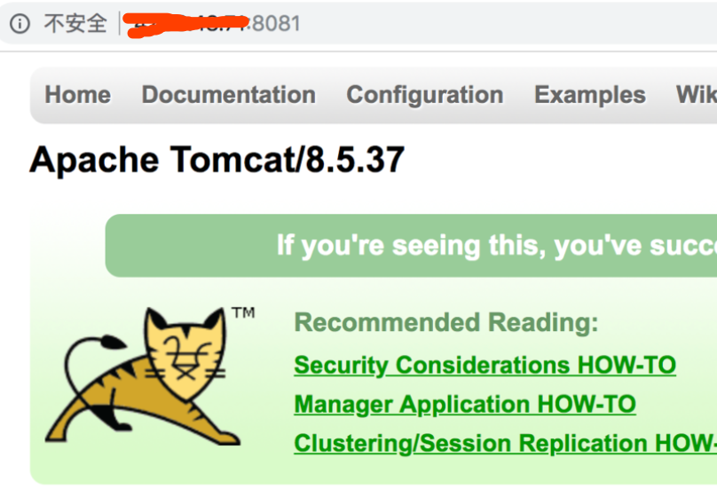

是不是非常简单呢? 

下面我们就来运行一个war包, 首先我们要了解一下tomcat在虚拟机中的文件目录, 所以我们先进入虚拟机
```
[root@master ~]# docker ps
CONTAINER ID        IMAGE               COMMAND             CREATED             STATUS              PORTS                    NAMES
b2efd725feed        tomcat              "catalina.sh run"   5 minutes ago       Up 5 minutes        0.0.0.0:8081->8080/tcp   frosty_pike
[root@master ~]# docker exec -it b2efd725feed bash
root@b2efd725feed:/usr/local/tomcat# ls
BUILDING.txt	 LICENSE  README.md	 RUNNING.txt  conf     lib   native-jni-lib  webapps
CONTRIBUTING.md  NOTICE   RELEASE-NOTES  bin	      include  logs  temp	     work
root@b2efd725feed:/usr/local/tomcat#
```

我们可以发现有一个叫做webapp的目录, 我们的war包放到这里就可以运行了

下面我们就来准备一个war包, 目录是这样的

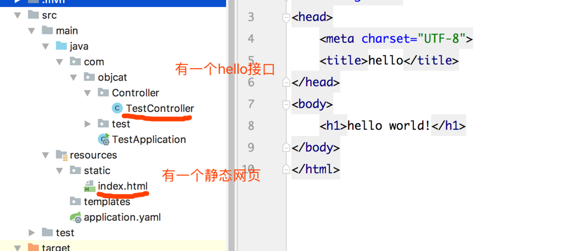

打包

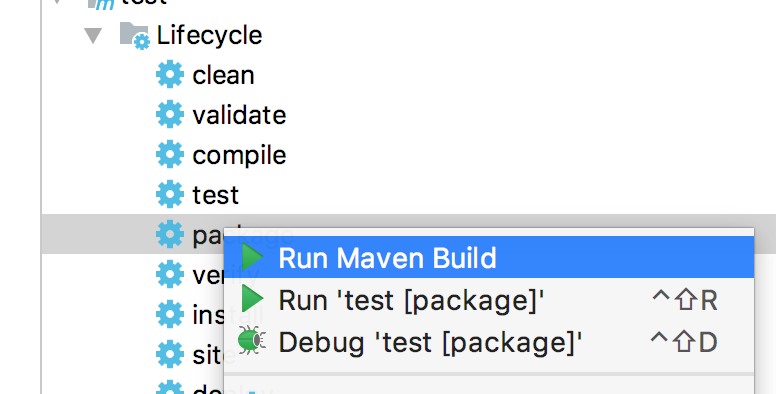

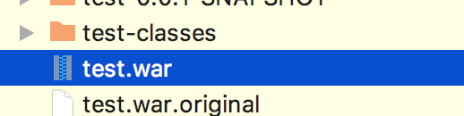

接下来我们就运行这个war, 首先要上传这个war, 因为我的war在本地而运行环境在云服务器上, 如果你的环境就在本地则不需要
```
scp /Users/objcat/IdeaProjects/test/target/test.war root@xxx.xxx.xxx.xxx:/test.war
```

`xxx.xxx.xxx.xxx`是你的ip地址, 如果文件就在本地可以不用这一步操作.

然后改写一下docker命令
```
docker run -idt -p 8081:8080 -v /test.war:/usr/local/tomcat/webapps/test.war tomcat
```

这里面的参数都是非常易懂的, 比如`-p`就是映射端口, `-v`就是挂载,意思是把本地的`/test.war`挂载到docker中的webapps目录, 如果实在不明白可以去文章开头看看前文的docker教程, 我们继续.

之后我们再次访问一下

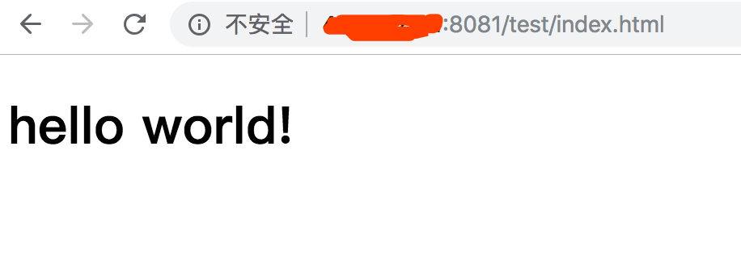

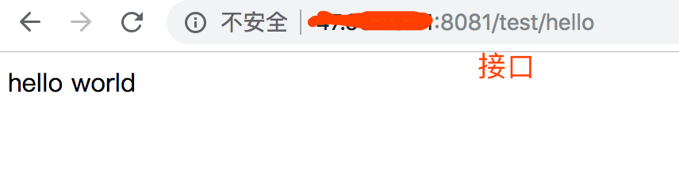

发现网页和接口都能访问通了, 证明配置是正确的, 本节结束.

###### 2.Dockerfile安装(自定义镜像)
这里直接上脚本了, 如果不知道Dockerfile的用法, 去文章开头学习.

首先新建`Dockerfile`文件

```
cd /
vi Dockerfile
```

写入脚本

```
# 基于镜像
FROM centos
# 作者
MAINTAINER objcat
# 安装环境
RUN yum install java -y \
&& curl -O http://mirrors.hust.edu.cn/apache/tomcat/tomcat-9/v9.0.14/bin/apache-tomcat-9.0.14.tar.gz \
&& tar -zxvf apache-tomcat-9.0.14.tar.gz \
&& mv apache-tomcat-9.0.14 tomcat \
&& rm -rf apache-tomcat-9.0.14.tar.gz
# 程序启动默认运行tomcat
CMD [ "/tomcat/bin/catalina.sh", "run" ]
```

然后编译生成镜像, 注意`.`一定别忘写了

```
docker build -t objcat/tomcat:v1 .
```

然后正常运行就可以了

```
docker run -idt -p 8081:8080 -v /test.war:/tomcat/webapps/test.war objcat/tomcat:v1
```

# 二.文章拓展

经过上面的文章, 想必你已经成功的搭建出了tomcat环境, 那么接下来我们就来拓展一些常用的功能.

温馨提示: 我使用的tomcat自己构建的, 你们的路径和我的不一定会相同, 所以请根据实际情况灵活应变.

#### 1.开启tomcat应用管理功能

这里使用两种方法来做:

**方法1: 在内部修改完成后commit**
**方法2: 使用-v挂载配置文件**


###### 方法1:

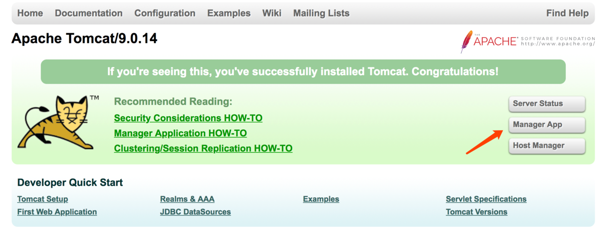

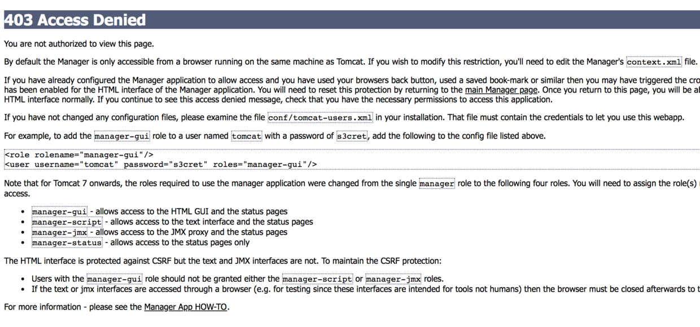

我们在做如图操作的时候经常是会出现上述的报错, 解决这个问题的方法很简单, 这里就简单的说一下, 首先复制上面的两行, 先修改一番, 把用户名和密码换成你喜欢的, 这里都换成了`tomcat`
```
<role rolename="manager-gui"/>
<user username="tomcat" password="tomcat" roles="manager-gui"/>
```

然后编辑容器内的tomcat配置文件
```
docker ps
docker exec -it 646ebb97b6ba bash
vi /tomcat/conf/tomcat-users.xml
```
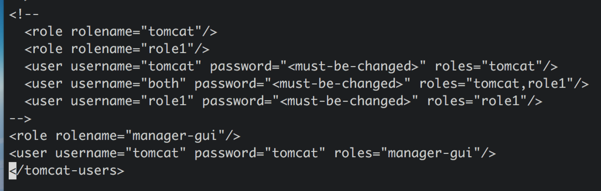

之后还需要修改ip访问规则, 否则无法访问
```
vi /tomcat/webapps/manager/META-INF/context.xml
```
注释掉这行即可
```
<Valve className="org.apache.catalina.valves.RemoteAddrValve"
         allow="127\.\d+\.\d+\.\d+|::1|0:0:0:0:0:0:0:1" />
```

之后我们使用commit来保存镜像
```
➜  ~ docker ps
CONTAINER ID        IMAGE               COMMAND                  CREATED             STATUS              PORTS                    NAMES
6dbbd260e192        objcat/tomcat:v5    "/tomcat/bin/catalin…"   6 minutes ago       Up 6 minutes        0.0.0.0:8081->8080/tcp   awesome_bose
➜  ~ docker commit 6dbbd260e192 objcat/tomcat:v6
sha256:2da722c1a3dcdb88c07b63964661287d006cb768c93ee1849fc8c8dd1ee874ba
```

然后重新运行容器即可
```
docker run -it -p 8081:8080 objcat/tomcat:v6
```

###### 方法2:

方法2是直接挂载配置文件, 首先我们要找到两个配置文件的路径
```
/tomcat/conf/tomcat-users.xml
/tomcat/webapps/manager/META-INF/context.xml
```

然后我们要先把它复制到我们的电脑, 所以要启动docker
```
docker run -itd -p 8081:8080 objcat/tomcat8
```

然后复制文件, 到这里复制到桌面 `3cbb1c5e986a`是容器的id
```
➜  ~ docker cp 3cbb1c5e986a:/tomcat/conf/tomcat-users.xml /Users/objcat/Desktop/tomcat-users.xml 
➜  ~ docker cp 3cbb1c5e986a:/tomcat/webapps/manager/META-INF/context.xml /Users/objcat/Desktop/context.xml
```

之后我们就着手修改一下, 跟上面的修改方式一样

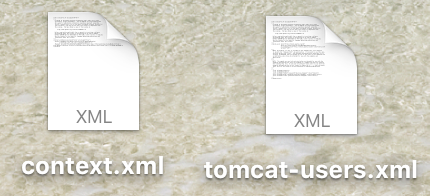

**tomcat-users.xml**

```
<role rolename="manager-gui"/>
<user username="tomcat" password="tomcat" roles="manager-gui"/>
```

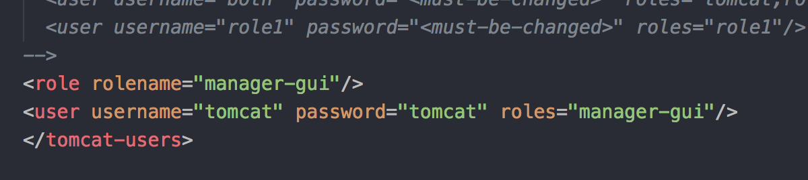

**context.xml** 注释掉中间
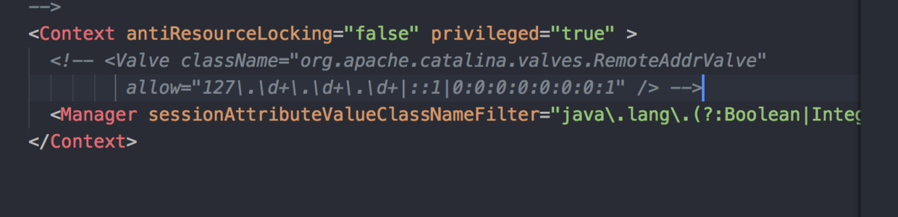

修改之后我们就重新启动tomcat并挂载这两个文件到上面去
```
docker run -idt -p 8081:8080 -v /Users/objcat/Desktop/tomcat-users.xml:/tomcat/conf/tomcat-users.xml -v /Users/objcat/Desktop/context.xml:/tomcat/webapps/manager/META-INF/context.xml objcat/tomcat8
```

然后我们启动tomcat浏览一下

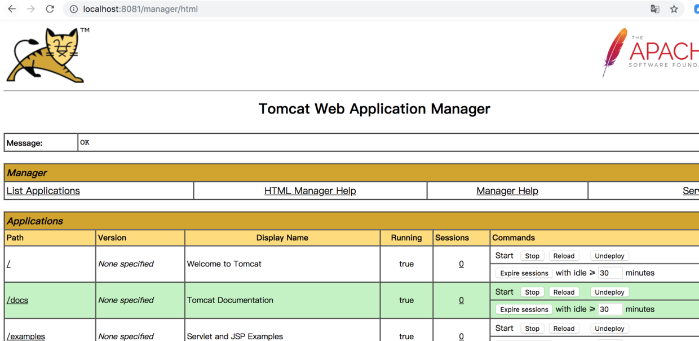

可以正常访问了! 


# finally enjoy it.
# by objcat 2019.1.28
