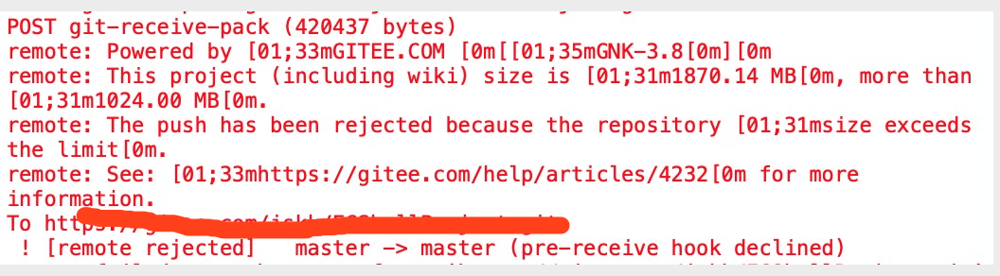
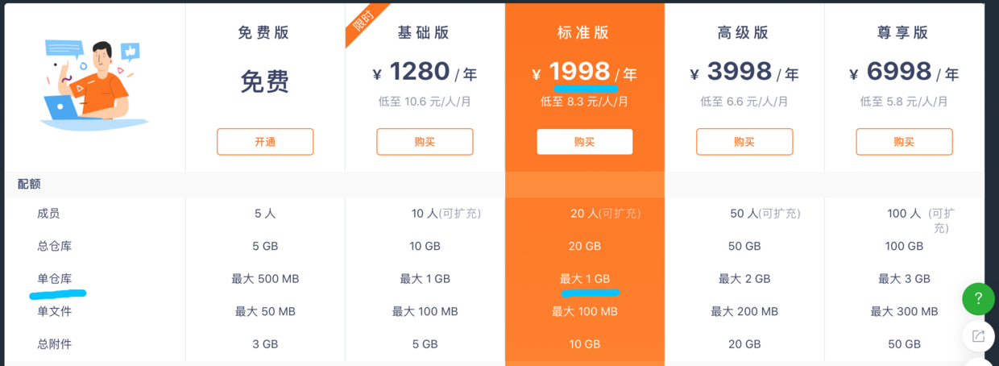
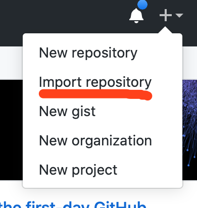
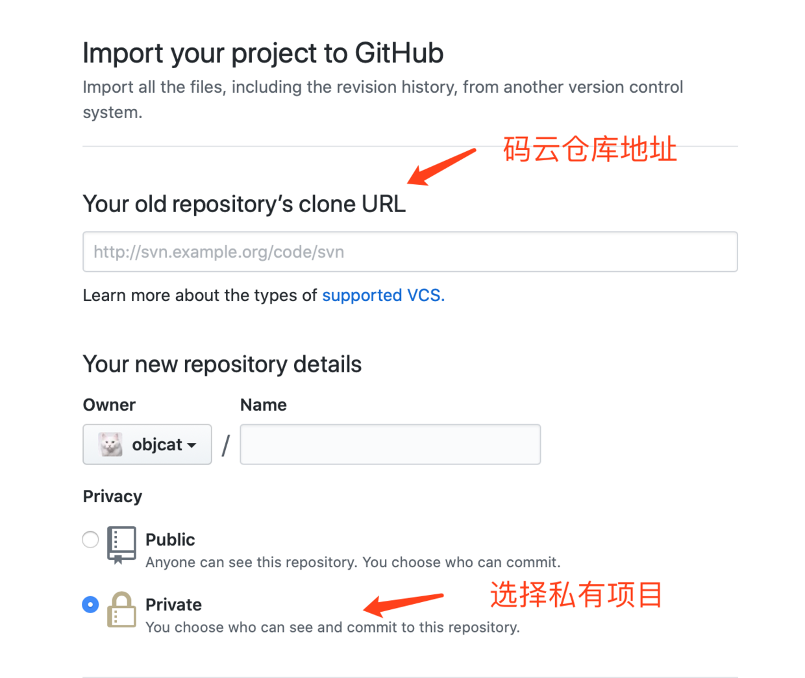
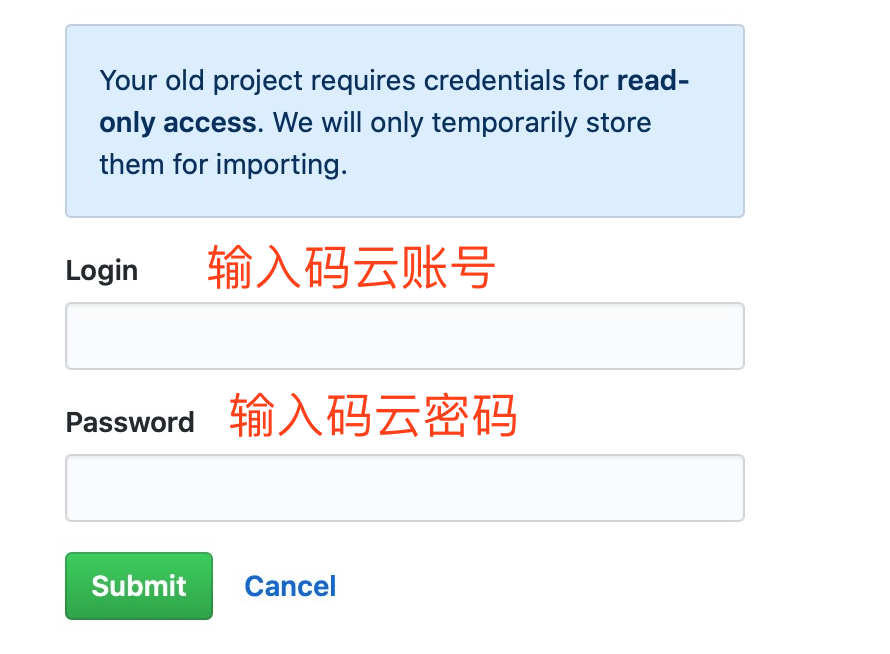
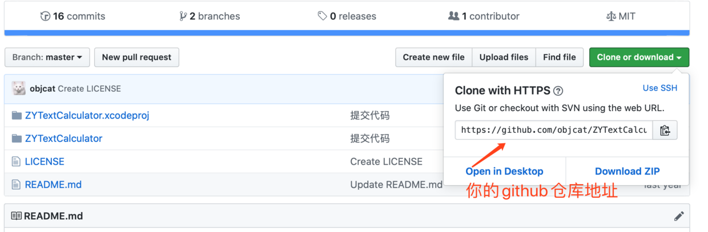
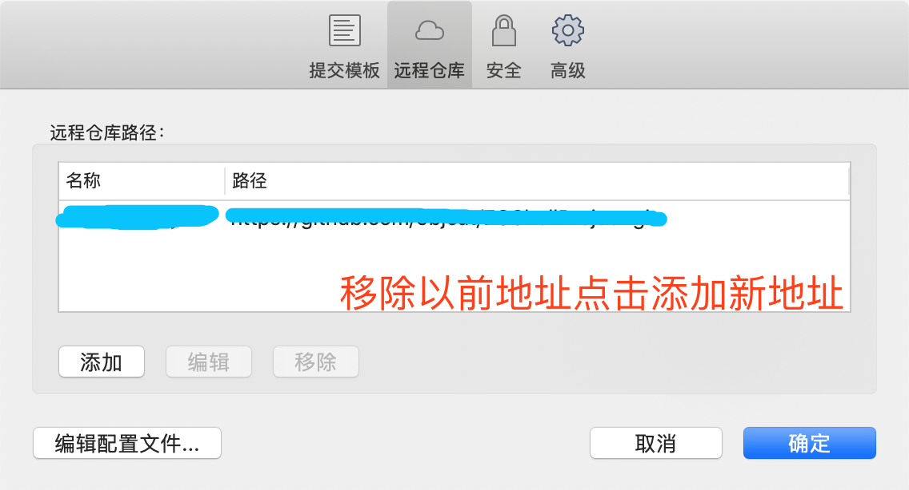
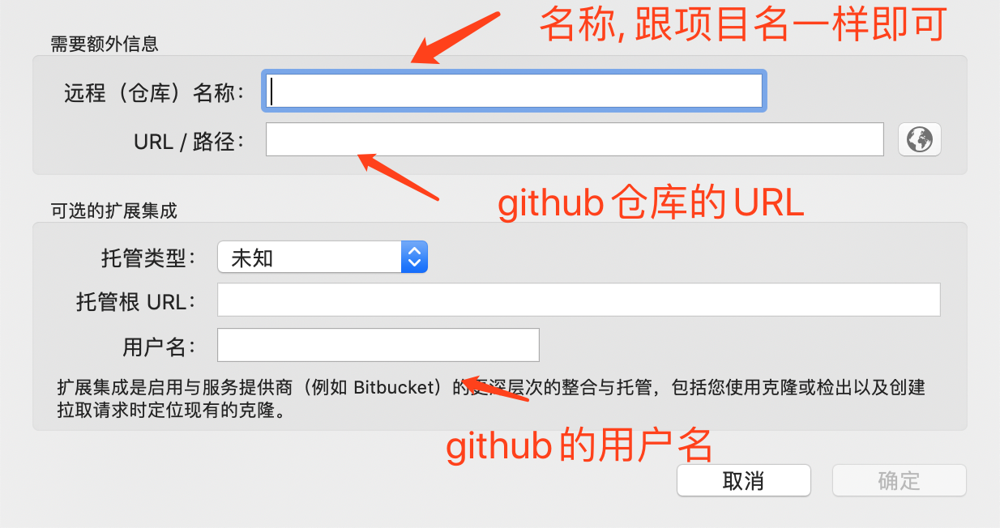
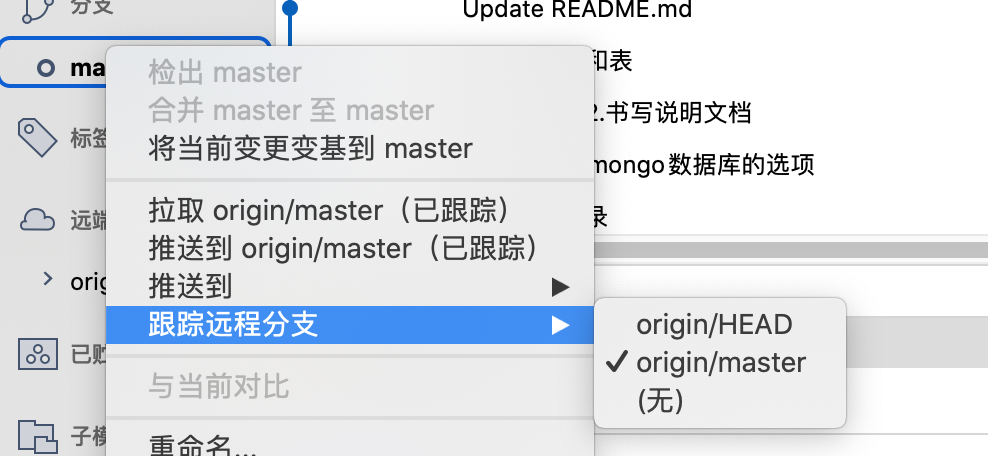

# 一.前言
最近由于码云的运营策略导致了超过1G的项目无法提交, 错误如下

而官方的付费套餐又无法满足我的需求, 非常的贵而且不实用

我们的项目非常容易超过`1个G`, 而`2个G`的套餐一年要`4000`块钱, 对此我感到十分难过, 不过还是要感谢码云这几年的陪伴.

# 二.快速迁移
#### 首先登陆Github

https://github.com

#### 然后选择导入

然后点击import就可以开始导入了, 导入的过程中可以刷新, 如果是私有项目会要求你输入`gitee`的`用户名`和`密码`, 需要刷新后进行查看

输入账号密码后项目就会开始导入, 等待导入完成即可.

完成后是这个样子 跟普通项目一个样 - -

# 三.更改远程仓库地址
有了`github`的地址我们就可以直接在`sourcetree`来更改远程仓库的地址达到换仓库的目的了, 注意这一步`不需要重新创建项目`, 在原来项目的基础上进行就可以了.

#### 移除以前地址点击添加

到了这一步就结束了, 可以跟gitee一样正常的推送和拉取了

# 四.常见问题

#### 1.替换完地址后每次推送的时候都需要重新选择
这里可以在`sourcetree`中设置默认推送分支, 设置一下即可

# finally enjoy it.
# by objcat 2019.11.13

