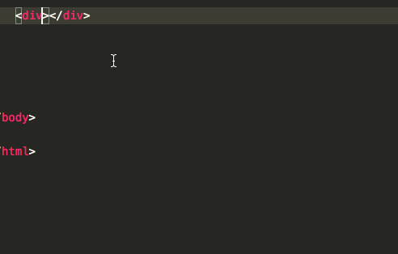
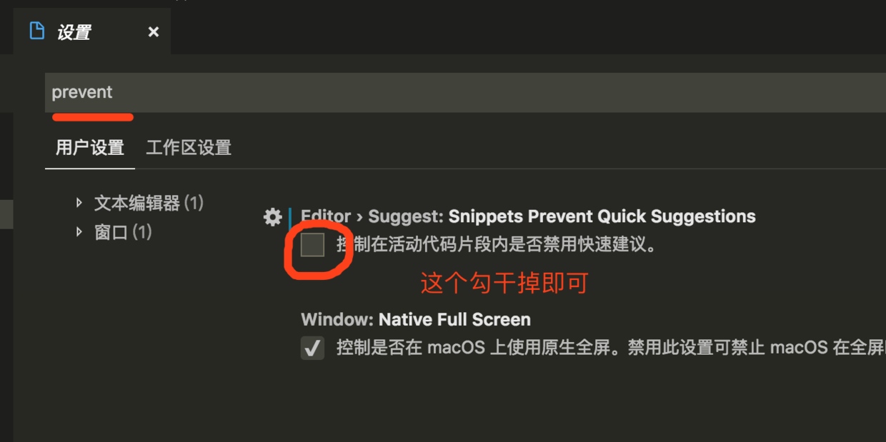
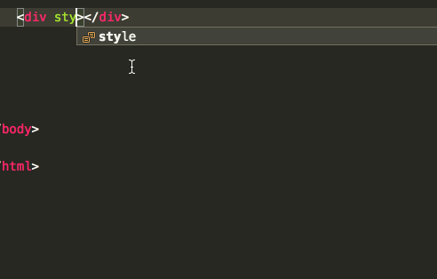

# 正文

最近因为工作需要开始着手使用`vscode`, 发现在写行内样式时并没有`代码提示`, 

#### 怎么解决呢? 

答: 一般都移动一下光标之后再继续写就能有代码提示了. 效果如图



之后一定有很多人不愿意这样做, 然后开始在网上搜解决方案.

~~我们最常看到的答案是这样的:~~

```
"editor.parameterHints": true,
"editor.quickSuggestions": {
"other": true,
"comments": true,
"strings": true
}
```

然而当你使用之后你会发现问题并没有解决...

# 完美解决方案

设置 -> 搜索`prevent` -> 把`Snippets Prevent Quick Suggestions` 勾掉即可



不需要重启, 立即生效!



# finally enjoy it.
# by objcat 2019.3.1


