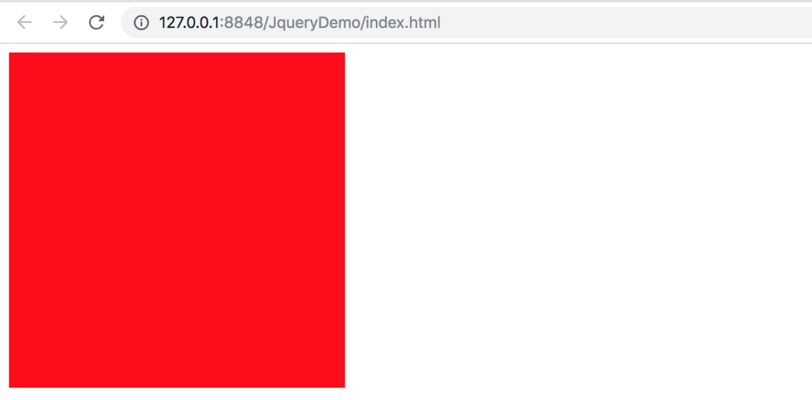

> 最近搞了搞`jquery`发现还是很好用的 所以决定写一篇文章来记录一下 jquery的主要通途是用来简化`dom操作`的 让开发人员写更少的代码就能操作html中的标签

#一.开始之前
开始之前你需要先新建一个`html`文件并写上初始代码
```
<!DOCTYPE html>
<html>
	<head>
		<meta charset="utf-8" />
		<meta name="viewport" content="width=device-width, initial-scale=1">
		<title></title>
	</head>
	<body>
		
	</body>
</html>
```
之后你需要下载一个jquery
https://code.jquery.com/jquery-3.3.1.min.js
把它保存到文本或者直接引入它即可使用
下边我是直接引用的网址并在里面创建了个`div`设置宽度300px高度300px

```
<!DOCTYPE html>
<html>
	<head>
		<meta charset="utf-8" />
		<meta name="viewport" content="width=device-width, initial-scale=1">
		<script src="https://code.jquery.com/jquery-3.3.1.min.js" type="text/javascript" charset="utf-8"></script>
		<title></title>
	</head>
	<body>
		
		<div id="test_id" class="test_class" style="width: 300px;height: 300px;background-color: red;">
			
		</div>
		
		<script type="text/javascript">
			//在这里写jquery语句
		</script>
		
	</body>
</html>
```
好的 我们来预览一下

在屏幕上可以看到一个红色的方块 好的我们接下来开始讲解jquery

####1.标签选择
jquery选择元素是使用`$`符号开始的 如下就是选择div标签并使用`.css`方法把背景颜色变成绿色
```
$("div").css("background-color", "green");
```
到了这里可能有人会问jquery方便在哪里
那接下来我们来看一下`DOM操作`的方法 来改变div的背景颜色

DOM操作

```
document.getElementsByTagName("div")[0].style.backgroundColor = "green";
```
我简单的说明一下代码的含义 首先使用`document.getElementsByTagName`获取页面上所有的div元素 然后取第1个元素也就是[0] 然后改变它的`css`样式 使用`.style` 然后是背景颜色 `.backgroundColor` 然后是颜色 `green`

是不是方便了很多呢 - -

####2.类选择
跟html的规范一下 使用 `.class` 来选择类 之后我们把颜色改成了橘黄色

```
$(".test_class").css("background-color", "orange");
```
DOM操作 `getElementsByClassName`是根据类名来选择元素
```
document.getElementsByClassName("test_class")[0].style.backgroundColor = "orange";
```


####1.id选择
跟html的规范一下 使用 .class 来选择类 之后我们把颜色改成了橘黄色
```
$("#test_id").css("background-color", "black");
```
DOM操作 `getElementById`是根据id来选择元素
```
document.getElementById("test_id").style.backgroundColor = "black";
```
到了这里可能有人会问 为什么`getElementById`不需要使用[0]来选择呢 很简单页面中一个id只能表示一个元素 所以id选择的元素是唯一的
