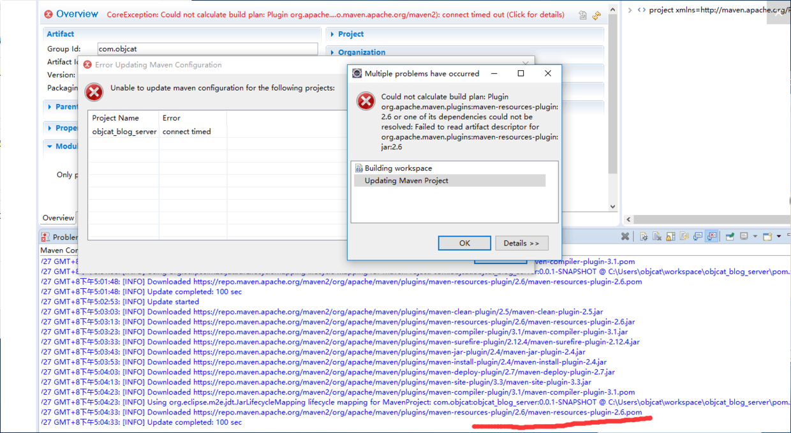
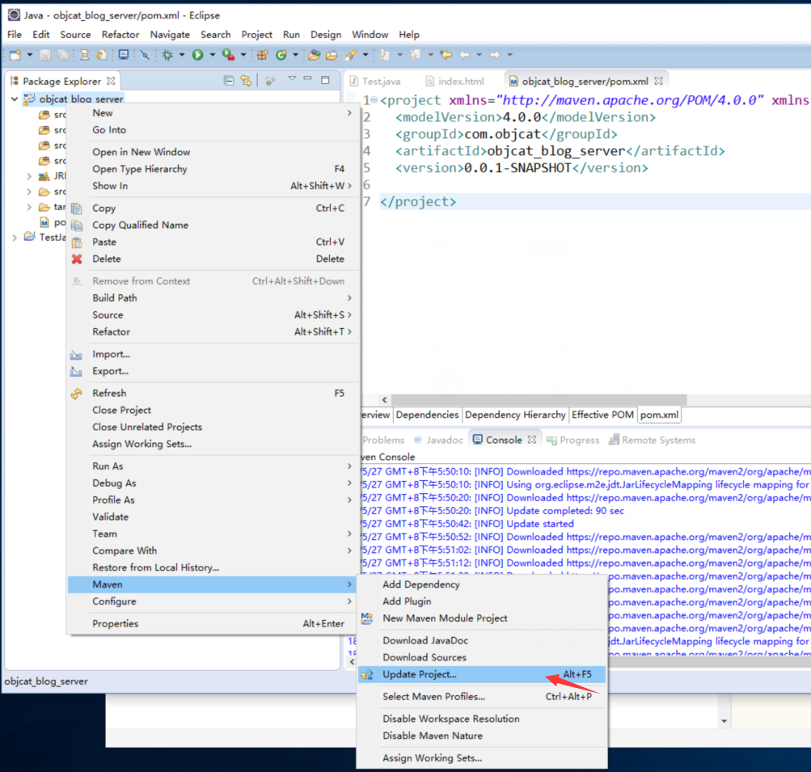
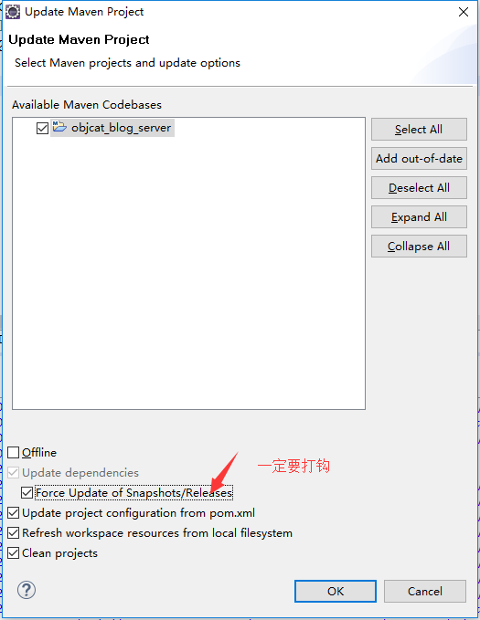

错误如图所示。



解决方案 修改配置文件直接替换maven源为阿里云路径

```
G:\apache-maven-3.5.3\conf\settings.xml
```

编辑 在里面找到<mirrors></mirrors>标签 插入图中配置


```
<mirror>  
	<id>alimaven</id>  
	<mirrorOf>central</mirrorOf>    
	<name>aliyun maven</name>  
	<url>http://maven.aliyun.com/nexus/content/groups/public/</url>        
</mirror> 
```


然后在eclipse中更新maven






#finally enjoy it
#by objcat 2018.5.27


