#一.文件注释
创建文件后, 编译器会在类名前面生成固定的注释, 来丰富代码的可读性, 在[阿里巴巴Java开发手册](https://yq.aliyun.com/articles/69327?spm=5176.10695662.1996646101.searchclickresult.5702131cv3rKsb)里也明确写到**所有的类都必须添加创建者和创建日期**.
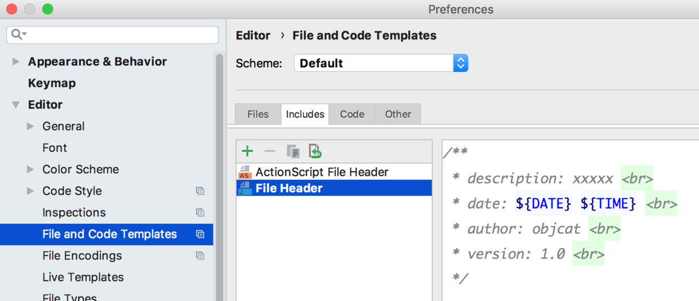

```
/**
 * description: ${NAME} <br>
 * date: ${DATE} ${TIME} <br>
 * author: ${USER} <br>
 * version: 1.0 <br>
 */
```
我们来看一下效果吧

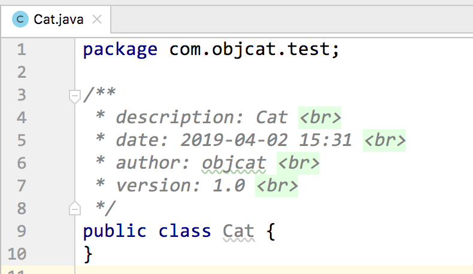

其中以$开头的都是IDE中的内置变量, 我们把它引用过来, 也可以自定义成常量.


#二.方法注释
写方法的时候也要带上相应的注释, 这样可以增加方法的可读性, 下面我们就来添加一个自定义注释模板, 方法注释的配置要比文件注释复杂一些

#### 1.创建一个group名字随便起
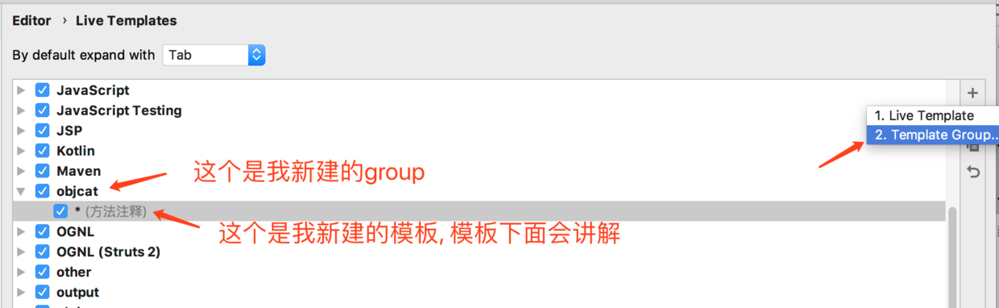

#### 2.选中group并新建一个模板

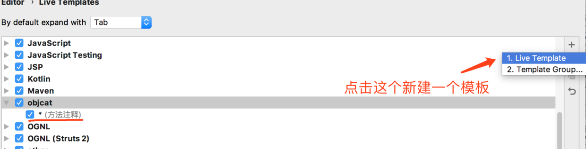

#### 3.选择模板类型

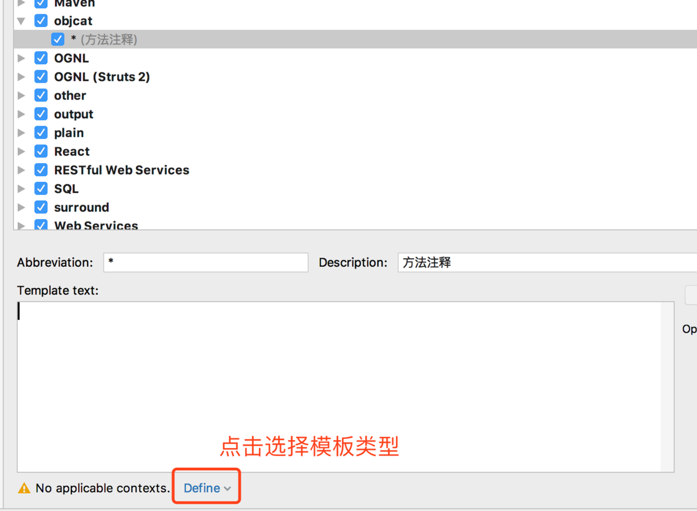

勾选java

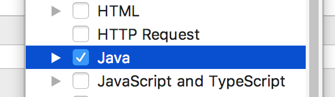

#### 4.填写模板内容

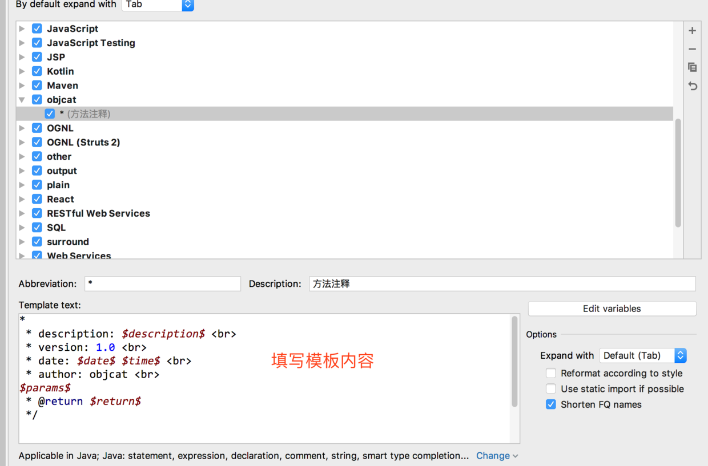

```
*
 * description: $description$ <br>
 * version: 1.0 <br>
 * date: $date$ $time$ <br>
 * author: objcat <br>
 * 
$params$
 * @return $return$
 */ 
```

注意上述文字一定要一个字不差的填写, 我的模板并没有`写歪`, 而是必须要这么写才能正常使用, 关键字需要用`*`, 不要改动.

添加快捷键与注释

`Abbreviation` 关键字
`Description` 模板说明

#### 5.关联变量

点击关联按钮
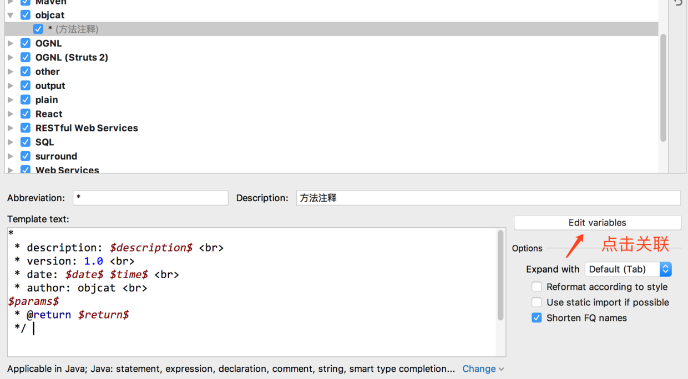

按照图中的方式去关联变量

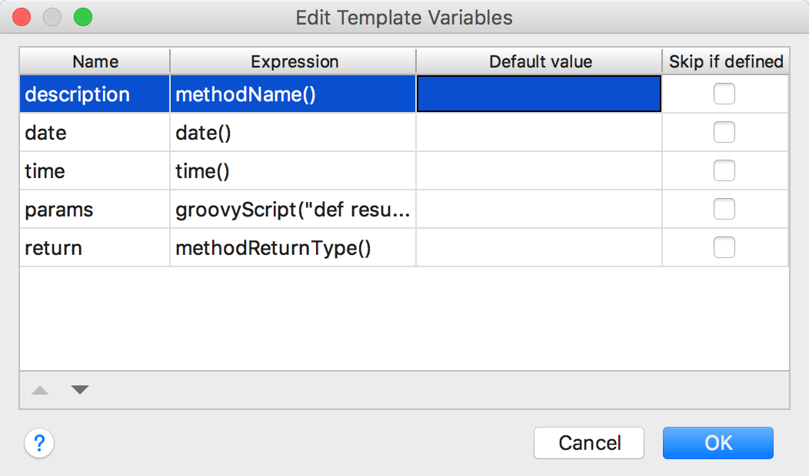

变量不用手打, 可以下拉选择

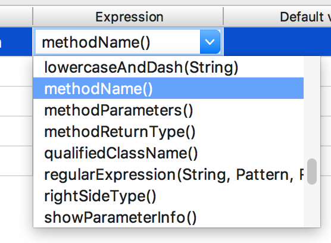

注意第三个参数是一个`groovy`脚本目的是把参数罗列出来

```
groovyScript("def result=''; def params=\"${_1}\".replaceAll('[\\\\[|\\\\]|\\\\s]', '').split(',').toList(); for(i = 0; i < params.size(); i++) {result+=' * @param ' + params[i] + ((i < params.size() - 1) ? '\\n\\b' : '')}; return result", methodParameters())
```
这里说一下为什么要关联变量 你应该可以发现在模板中有
`$date$` `$time$` `$params$ ` `$return$` 这些用`$`符号包括的代码 这些都是自定义变量, 而我想在写注释的时候实时获取这些, 比如`时间`, `日期`, `参数名`, `返回值类型` 所以需要关联编译器的变量自动填入.

到了这一步 设置都结束了

使用方法 只需要打 `/** + tab` 就可以了

好的我们来看一看效果吧

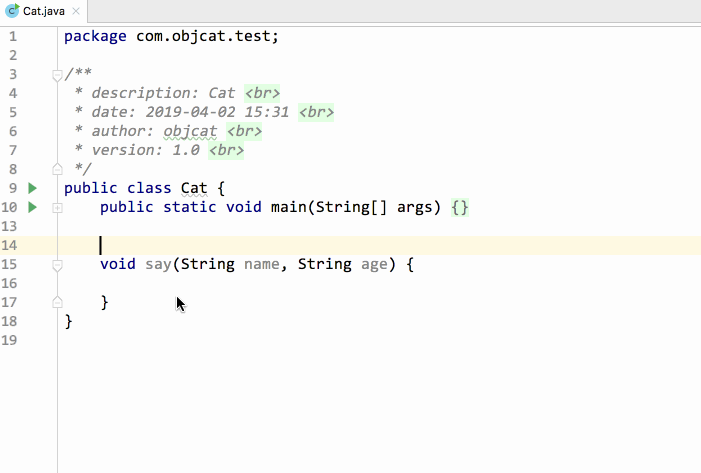

我们来生成一个`javadoc`看看效果
`Tools` -> `Generate JavaDoc`

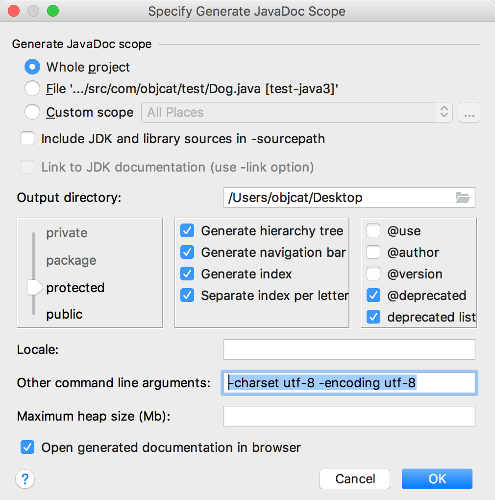

如果出现编码问题请如图填入下面这句话(屏幕一大堆问号)

```
-charset utf-8 -encoding utf-8
```

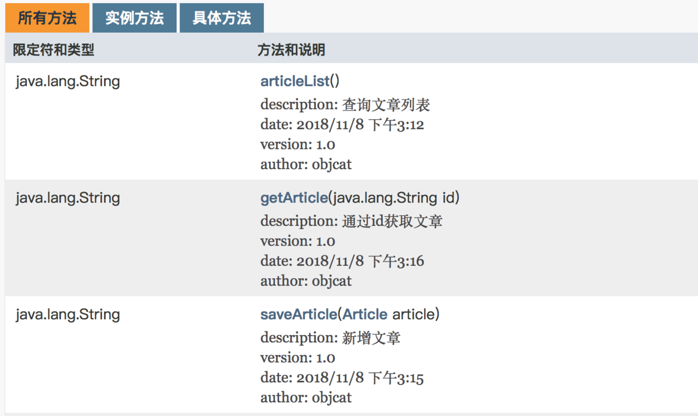

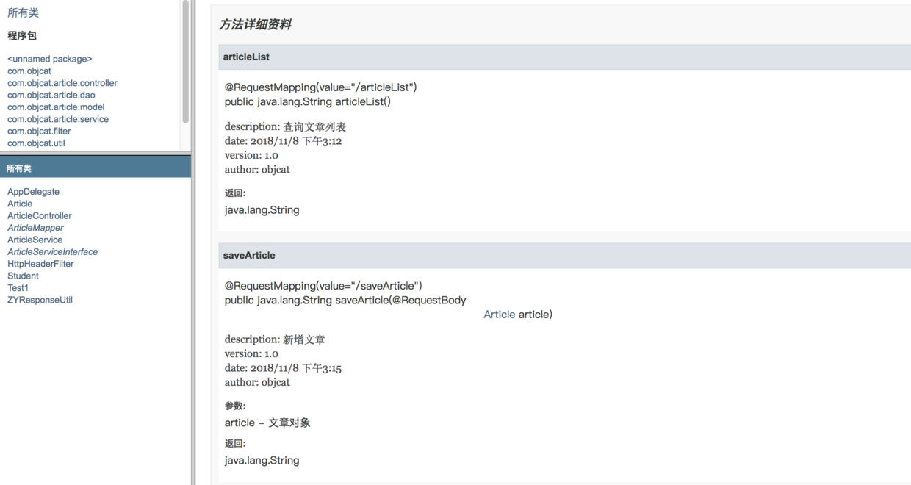


#finally enjoy it
#by objcat 2018.11.8
##### 更新日志
##### 2019.04.02 修正了模板无法识别函数变量的问题