# 前文链接
[JavaEE] 搭建SpringCloud环境 进入微服务时代
https://www.jianshu.com/p/a0365a635975
温馨提示:本文是基于前文的扩展 没有基础的新手可以先去学习上文

# 相关链接
项目地址:
https://github.com/ctripcorp/apollo
快速构建脚本:
https://github.com/nobodyiam/apollo-build-scripts
Java客户端使用指南:
https://github.com/ctripcorp/apollo/wiki/Java

# 一.简介
> Apollo（阿波罗）是携程框架部门研发的分布式配置中心，能够集中化管理应用不同环境、不同集群的配置，配置修改后能够实时推送到应用端，并且具备规范的权限、流程治理等特性，适用于微服务配置管理场景。

上面说的你可能并不理解, 这里说一下, 所谓分布式配置中心就是把应用内的配置文件通过技术手段放在云端, 在云端配置过后可以在不发包的情况下立刻让配置生效从而节省了大量`打包`, `发包`, `重启服务`的时间.

看了看官方给的文档, 确实很不错, 但是面向的用户都是行内人员, 新手用起来是非常不方便的, 甚至你看完整篇官方文档, 也不能实现你想要的效果 所以这里写一篇简洁的文章来记录一下, 这里提供两种安装方式, `常规安装`与`Docker安装`.

# 二.常规安装

## 1.下载安装脚本
官方给我们提供出一套构建脚本 首先下载到本地
https://github.com/nobodyiam/apollo-build-scripts

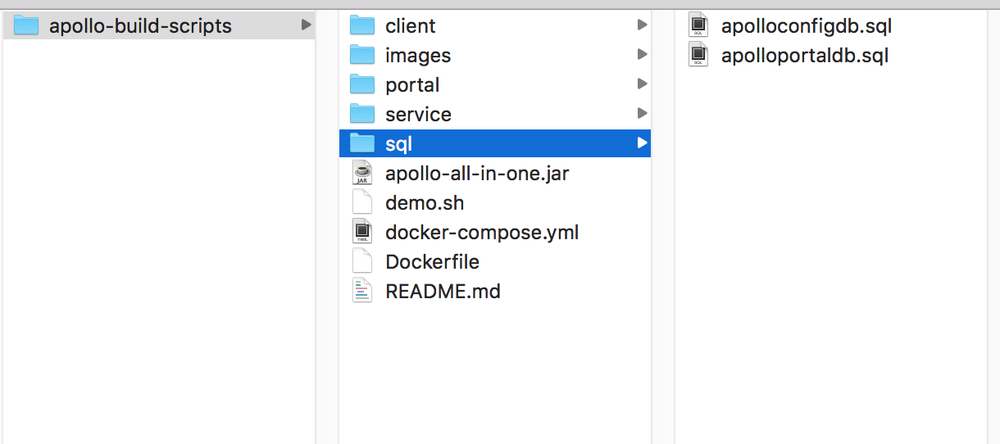


## 2.安装Mysql
因为`Apollo`的数据存储是基于`mysql`的所以需要在本地安装一下 `windows`用户自行安装, `mac`下可以参考我的另一个文章

[MySQL] Mac下安装MySQL并初始化数据库密码
https://www.jianshu.com/p/4d232bcb0114

这里有可能需要使用一个软件 就是 `Navicat Premium`, 是一款图形化操作数据库的软件 我的教程中也有写到过 数据库安装到此为止

## 3.导入数据库


我们可以看到 目录中有两个`.sql`文件, 这两个东西就是阿波罗启动时需要用到的表 我们先把他们导入数据库 

这里只演示mac上的导入过程

首先登陆数据库
```
/usr/local/mysql/bin/mysql -u root -p
```

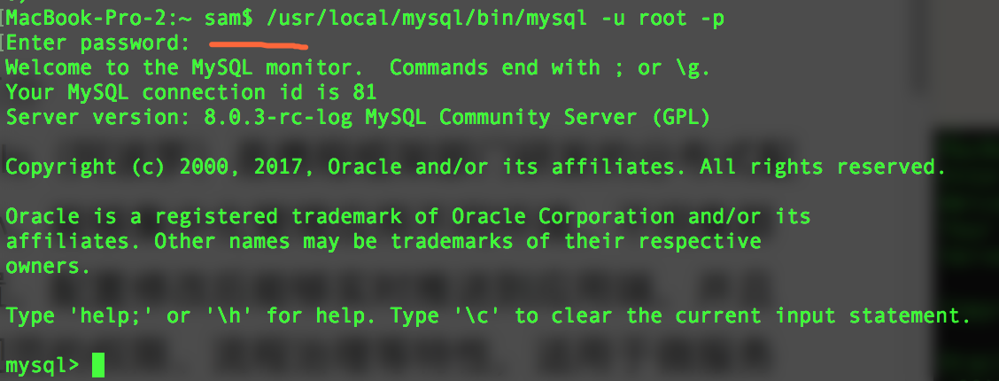

然后输入密码就成功登陆到数据库了 之后我们用`source`命令来导入sql文件, `路径`请替换成你自己的文件路径

```
source /Users/sam/123/apollo-build-scripts/sql/apolloconfigdb.sql
```

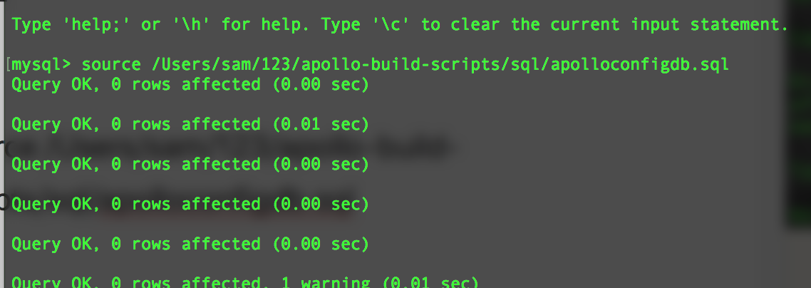

导入成功是这个样子

之后我们来导入另一个数据库 一共有两个
`apolloconfigdb.sql`, `apolloportaldb.sql`

然后我们打开`Navicat Premium`查看一下

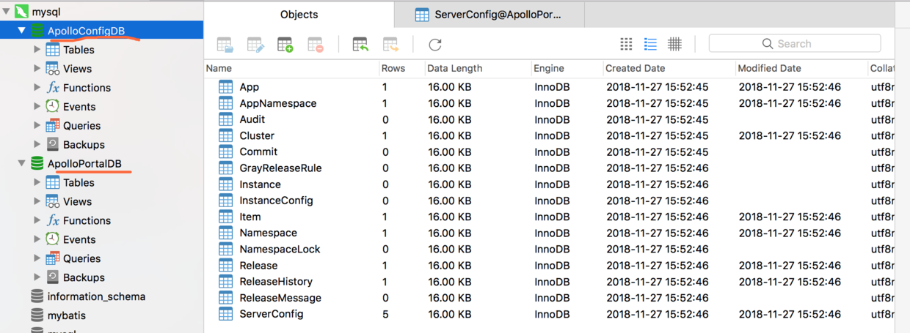

我们可以看到这两个数据库都导入完成了 OK 进行下一个阶段

## 4.启动服务

在启动之前我们需要配置一下`demo.sh`文件 主要配置一下数据库

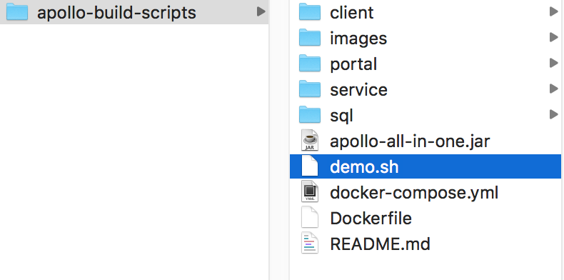


```
# apollo config db info
apollo_config_db_url=jdbc:mysql://localhost:3306/ApolloConfigDB?characterEncoding=utf8
apollo_config_db_username=root
apollo_config_db_password=000000

# apollo portal db info
apollo_portal_db_url=jdbc:mysql://localhost:3306/ApolloPortalDB?characterEncoding=utf8
apollo_portal_db_username=root
apollo_portal_db_password=000000
```

配置成功之后, 我们就可以尝试启动阿波罗了, 在终端输入命令

首先cd到目录
```
cd /Users/sam/123/apollo-build-scripts 
```

然后执行`shell`
```
sh demo.sh start
```
执行成功会出现下方提示 需要耐心等待 服务会依次启动
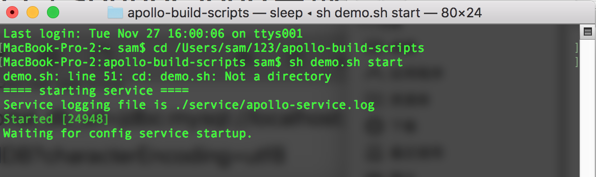

出现下方的提示就说明启动已经成功了

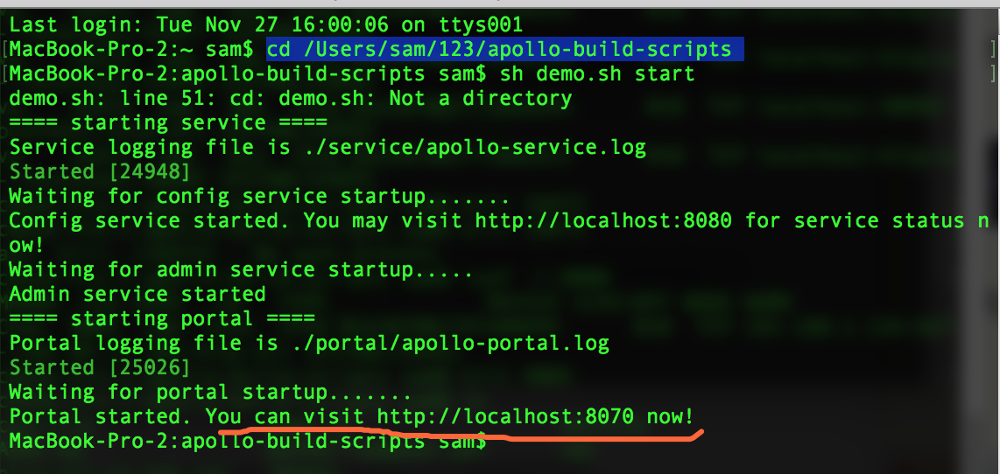

之后我们来访问一下阿波罗试试吧
http://localhost:8070

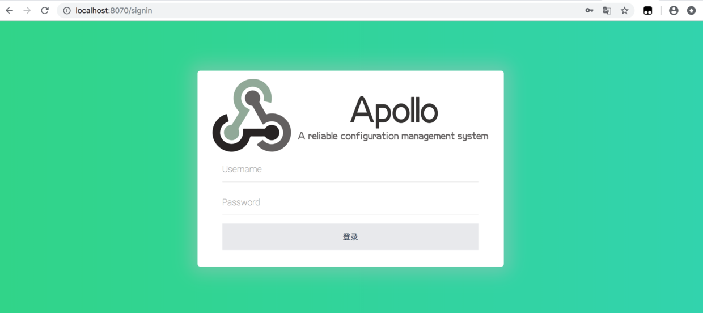

用户名:`apollo`
密码:`admin`

登陆成功是这个样子


到这里阿波罗就搭建完成了!

下面我们就来做一个`service-a`的配置中心 

点击新建项目

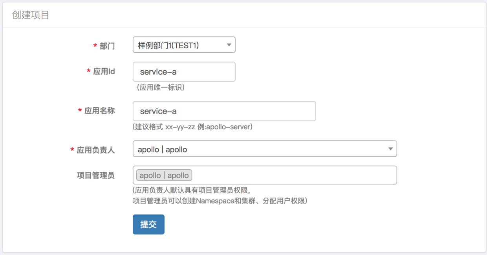

填写如上配置, 注意`应用id`这个属性很重要, 我们之后在客户端中也需要用到这个配置, 所以请妥善配置

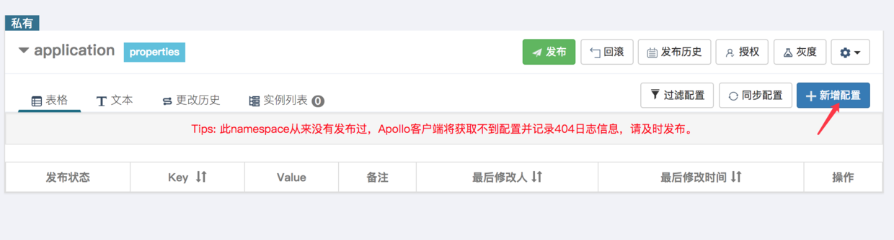


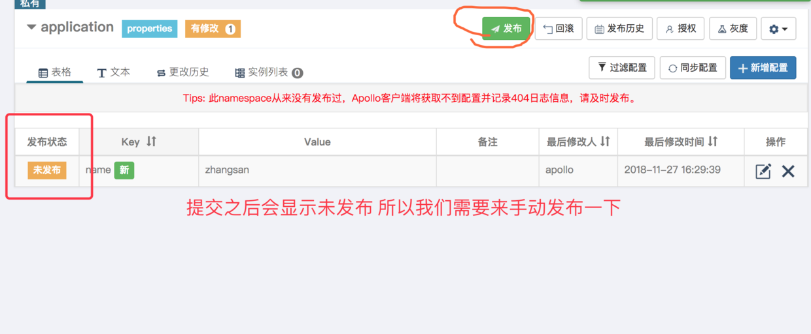

发布之后 我们的配置中心就配置完成了! 接下来我们配置客户端来使用这个配置中心.

###### 5.Java客户端配置

到了这一步 其实就非常简单了 首先我们使用maven导入包
```
<dependency>
    <groupId>com.ctrip.framework.apollo</groupId>
    <artifactId>apollo-client</artifactId>
    <version>1.1.0</version>
</dependency>
```

这里有可能提示一个错误信息, `maven`无法导入包 解决方案是修改一下`setting.xml`的镜像源配置
```
<mirror>
    <id>repo2</id>
    <mirrorOf>central</mirrorOf>
    <name>Human Readable Name for this Mirror.</name>
    <url>http://repo2.maven.org/maven2/</url>
</mirror>
```
如果没有遇到可以不用修改

之后我们在入口文件中加入`@EnableApolloConfig`来开启配置中心服务
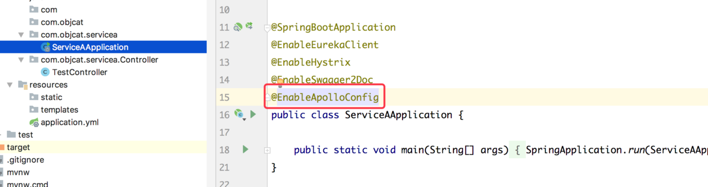

我们在`application.yml`中配置一下 我们之前创建的`应用id`和地址就可以了 

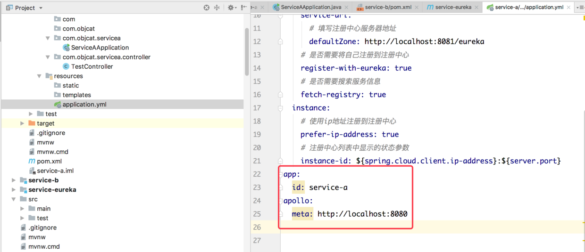

```
app:
  id: service-a
apollo:
  meta: http://localhost:8080
```


地址可以在`demo.sh`中找到

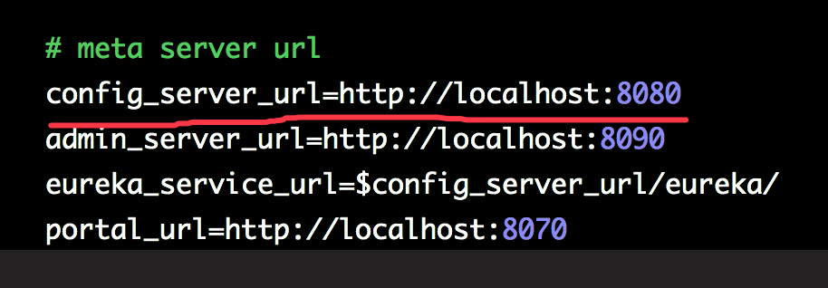

配置好之后 我们的`service-a`会自动关联阿波罗

我们来写一个接口测试一下吧

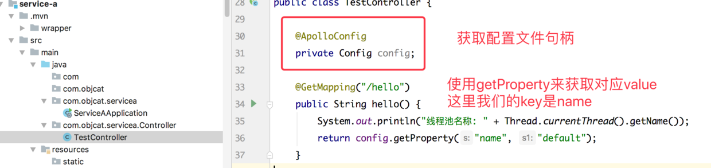

```
    @ApolloConfig
    private Config config;

    @GetMapping("/hello")
    public String hello() {
        System.out.println("线程池名称: " + Thread.currentThread().getName());
        return config.getProperty("name", "default");
    }
```

我们访问一下接口


我们发现确实我们刚才在配置中心配置的值

接下来我们来修改一下

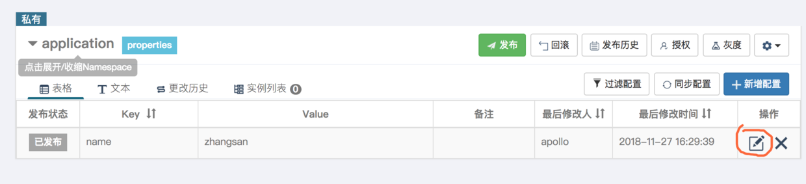

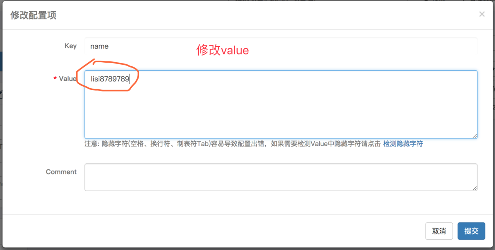

之后我们点提交

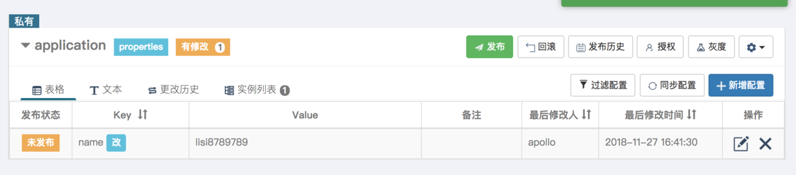

我们再次访问接口


我们发现接口中的文字并没有改变

仔细想想到底是哪出了问题呢? ??

对了 是修改的值还没有发布出来 - - 

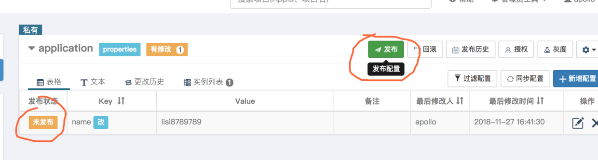

我们点击发布后再次访问一下接口


这次我们发现接口中的值已经改变了 这就是分布式配置中心最基础的用法了.

# 三.使用Docker安装
官方建议使用`Docker`安装需要先学习基础, 这里推荐一篇自己的文章

[Docker] 入门教程
https://www.jianshu.com/p/7b3737df847d
[Docker] docker-compose使用教程
https://www.jianshu.com/p/4fbe3de8f416

再看下面的文章时, 我已默认你有了一些`Docker`基础, 我们继续:

## 1.下载安装脚本 
https://github.com/nobodyiam/apollo-build-scripts

## 2.修改配置文件
压缩包解压, 在文件夹中可以找到下图中的脚本

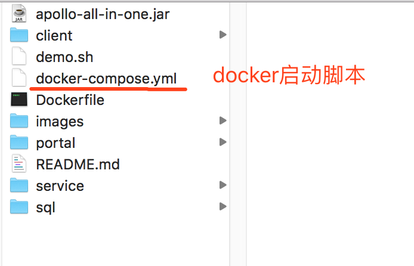

我们来看一下它的内容
```
version: '2'

services:
  apollo-quick-start:
    image: apollo-quick-start
    container_name: apollo-quick-start
    depends_on:
      - apollo-db
    ports:
      - "8080:8080"
      - "8070:8070"
    links:
      - apollo-db

  apollo-db:
    image: mysql:5.7
    container_name: apollo-db
    environment:
      TZ: Asia/Shanghai
      MYSQL_ALLOW_EMPTY_PASSWORD: 'yes'
    depends_on:
      - apollo-dbdata
    ports:
      - "13306:3306"
    volumes:
      - ./sql:/docker-entrypoint-initdb.d
    volumes_from:
      - apollo-dbdata

  apollo-dbdata:
    image: alpine:latest
    container_name: apollo-dbdata
    volumes:
      - /var/lib/mysql
```

之后我们来执行这个脚本

```
zhangyideMacBook-Pro:~ objcat$ cd /Users/objcat/Downloads/apollo-build-scripts-master
zhangyideMacBook-Pro:apollo-build-scripts-master objcat$ docker-compose up
Pulling apollo-quick-start (apollo-quick-start:)...
ERROR: The image for the service you're trying to recreate has been removed. If you continue, volume data could be lost. Consider backing up your data before continuing.

Continue with the new image? [yN]y
Pulling apollo-quick-start (apollo-quick-start:)...
ERROR: pull access denied for apollo-quick-start, repository does not exist or may require 'docker login'
```
我们会发现上面报错说`apollo-quick-start`这个镜像没找到, 所以这个脚本是有错误的,`apollo-quick-start`并不是一个官方镜像, 所以你是无法直接拉取使用的, 我们现在来构造这个镜像.

 ###这里有两种方法:

####1.直接修改脚本

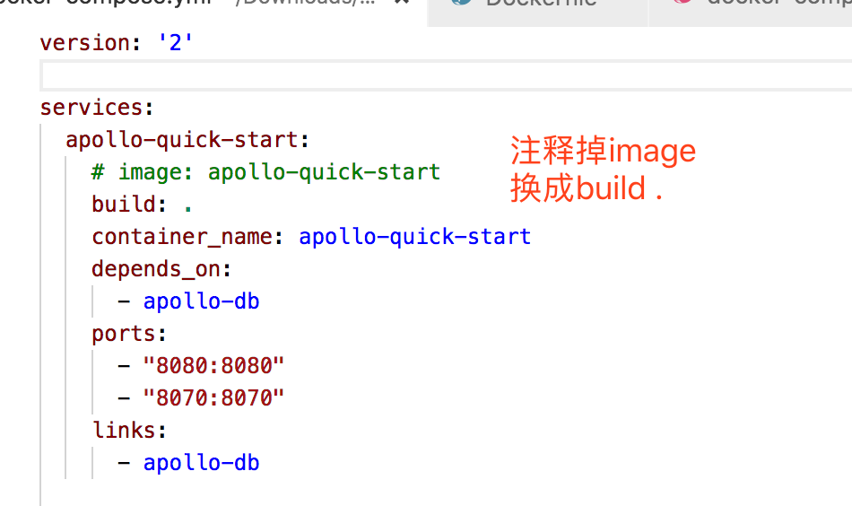

修改后我们再次执行命令即可, 阿波罗会自动启动
```
docker-compose up -d
```

####2.先编译镜像, 再执行启动脚本
先执行命令编译镜像`docker build -t apollo-quick-start .`
```
zhangyideMacBook-Pro:apollo-build-scripts-master objcat$ docker build -t apollo-quick-start .
Sending build context to Docker daemon  66.06MB
Step 1/10 : FROM openjdk:8-jre-alpine
 ---> d4557f2c5b71
Step 2/10 : MAINTAINER nobodyiam<https://github.com/nobodyiam>
 ---> Running in 94427a91dd60
Removing intermediate container 94427a91dd60
 ---> ded2912b15c0
Step 3/10 : COPY apollo-all-in-one.jar /apollo-quick-start/apollo-all-in-one.jar
 ---> 29112cd46c81
Step 4/10 : COPY client /apollo-quick-start/client
 ---> fd925059f358
Step 5/10 : COPY demo.sh /apollo-quick-start/demo.sh
 ---> 9b86e18f353d
```

编译完成后直接执行脚本即可

```
zhangyideMacBook-Pro:apollo-build-scripts-master objcat$ docker-compose up -d
Creating apollo-dbdata ... done
Creating apollo-db     ... done
Creating apollo-quick-start ... done
zhangyideMacBook-Pro:apollo-build-scripts-master objcat$ 
```

`-d`的意思是在后台执行, 不把`log`显示在终端上

启动之后, 我们来尝试访问一下

http://localhost:8070/

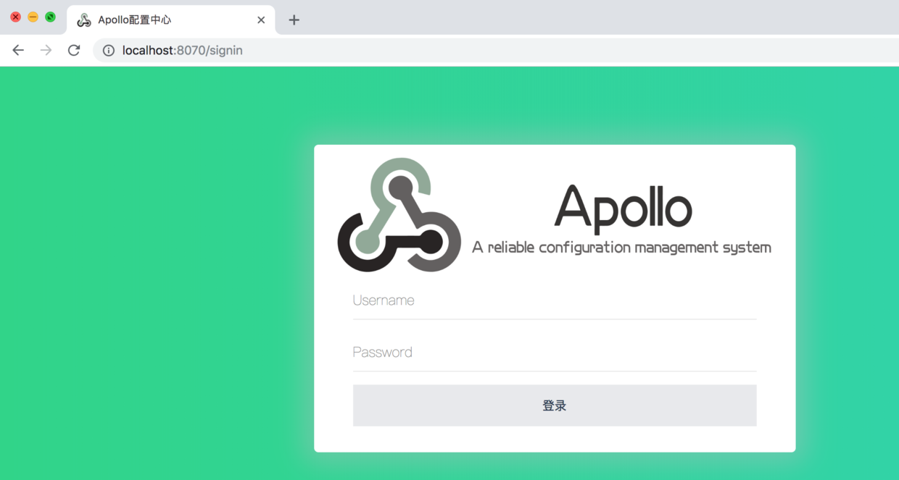

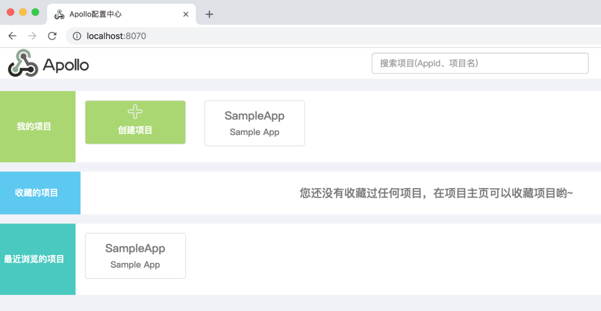

# 四.Demo
https://github.com/objcat/test-spring-cloud-demo.git

# finally enjoy it.
# by objcat 2018.11.27


