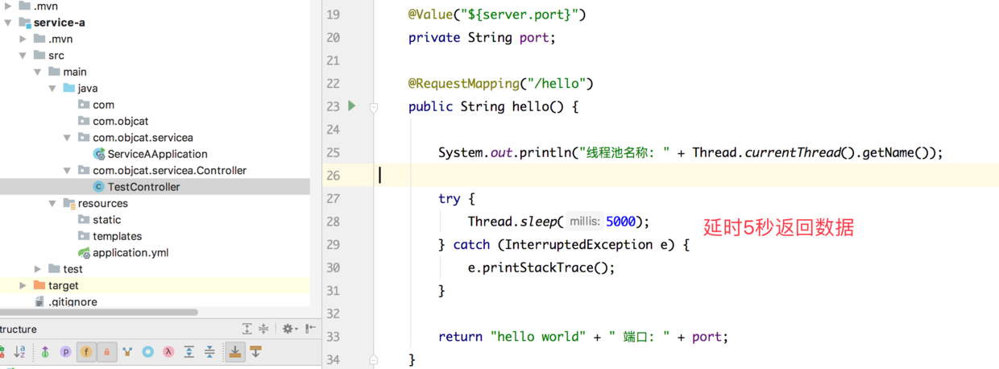
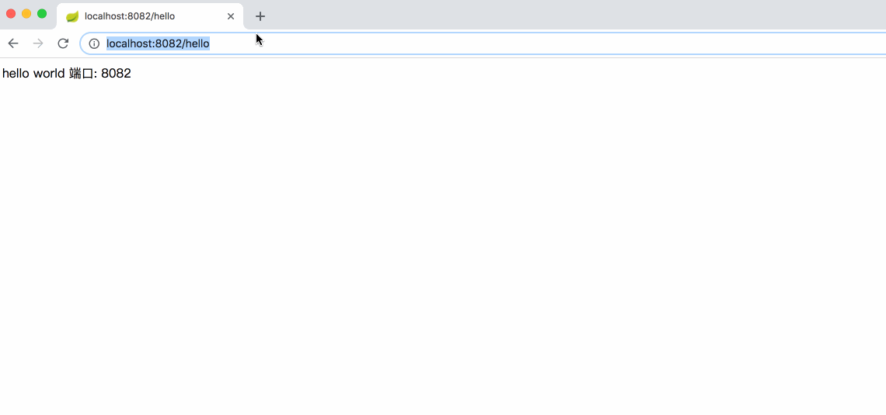
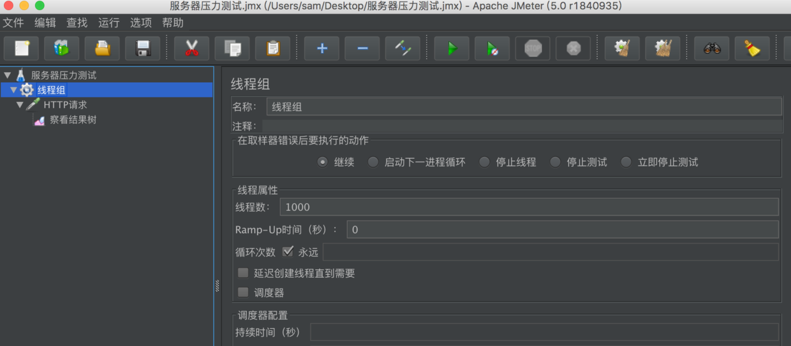
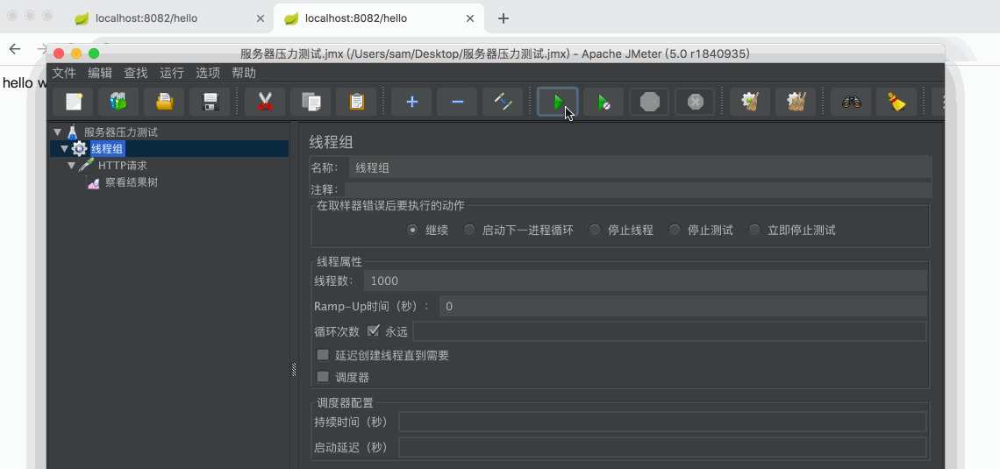
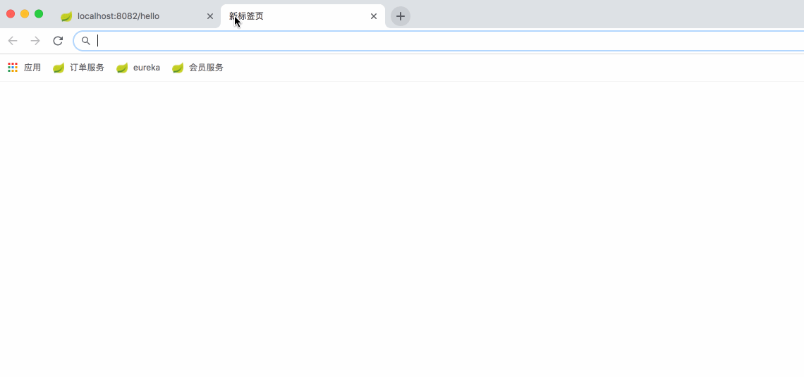
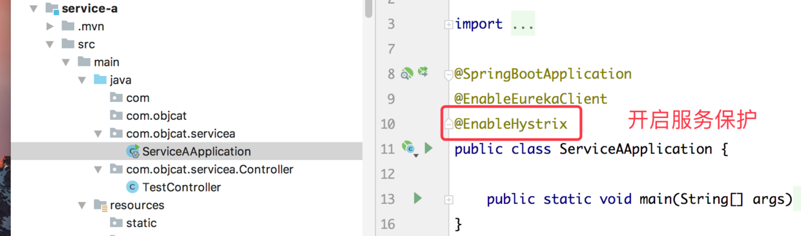
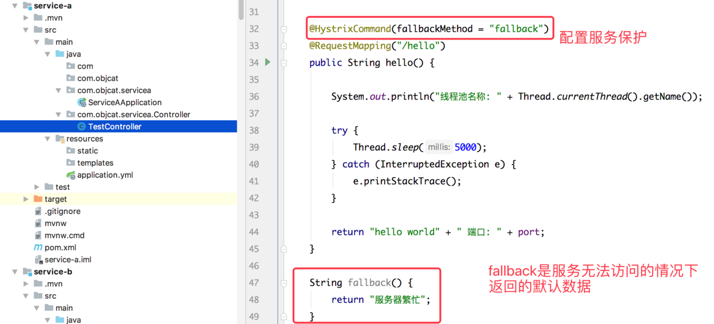
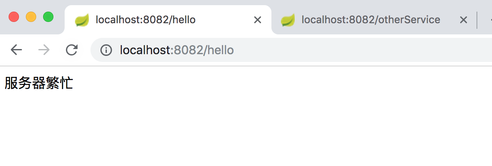
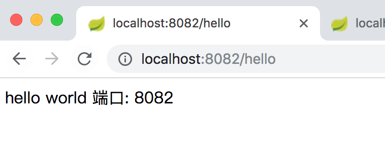
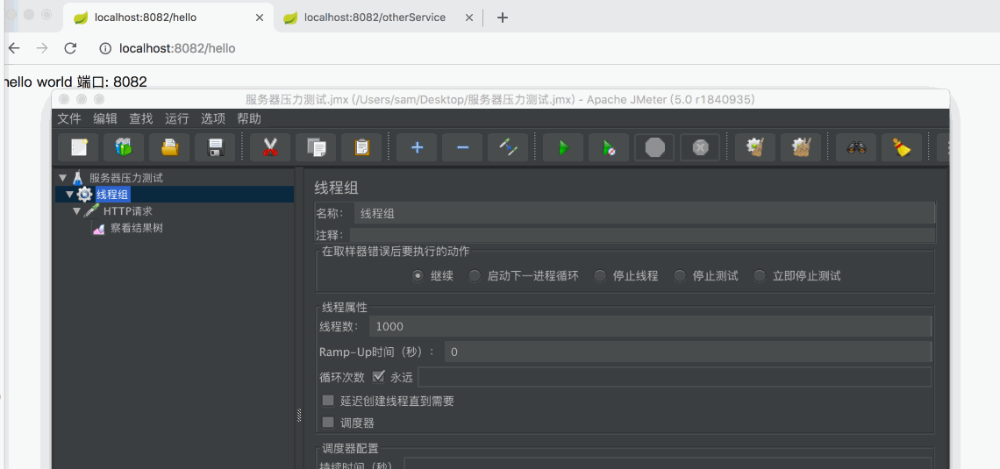

# 前文链接
[JavaEE] 搭建SpringCloud环境 进入微服务时代
https://www.jianshu.com/p/a0365a635975
温馨提示:本文是基于前文的扩展 没有基础的新手可以先去学习上文

# 一.简介
`Hystrix`是一套完善的服务保护组件, 可以实现`服务降级`, `服务熔断`, `服务隔离`等保护措施 使用它可以合理的应对高并发的情况 做到保护服务的效果
# 二.发现问题
有人可能会问 为什么要使用服务保护功能呢? 我的服务器明明跑的很好的... 好的 那这里 我就举个例子来说明一下 为什么要进行服务保护 设想这样一种情况 你的服务器由于用户量访问过大 而瘫痪 这样的例子不在少数 比如某宝`双11活动`或是`12306`过年抢票 都导致过网站崩溃 有的是`不能进行访问`, 有的是在那里一直`转圈加载`, 这样做显然是有问题的, 因为用户根本不知道你出了什么事, 春运是国人心中的大事, 不能买票更是让人心不安

我们现在就来模拟一下这种状况 这里使用阿帕奇的`JMeter`来做压力测试 我在`service-a`中把延时调整为5秒



然后我们访问一下接口 发现5秒之后可以顺利的返回数据




之后我们使用`JMeter`开1000个线程来访问这个接口


之后我们访问接口



我们发现服务10秒之后都无法访问 证明服务已经崩了 - -

之后我们再来看一个现象
我们在service-a中加入一个接口
```
@RequestMapping("/otherService")
    public String otherService() {
        return "我是其他服务";
    }
```
然后重新运行服务 我们再次对hello接口做压力测试


不幸的是你会发现`otherService`服务也无法访问了 - -
到这里你可能会问 我压力测试的接口是hello 为什么otherService接口也会崩溃呢? 这种现象就叫做服务器的`雪崩效应`, 因为`tomcat`启动之后会创建一个`线程池`来处理用户请求, 而线程池中的线程是有限的, 当超出承载的`最大请求数量`时, 那用户的请求可就要开始排队了, 所以就会出现一直转圈的情况, 所以虽然访问的是hello接口 但是他们两个是用了同一个线程池 所以都受到了影响

那我们要如何解决这个问题呢?

# 三.集成Hystrix

没错 接下来我们就要使用这篇文章开始就提到的`服务保护`来解决问题了, 我们使用`服务隔离`机制就可以轻松的解决`服务雪崩效应` 下面跟着我们的镜头一起来看吧!

#####一共分三步

######1.导入Maven依赖
```
<dependencies>
    <dependency>
        <groupId>org.springframework.cloud</groupId>
        <artifactId>spring-cloud-starter-netflix-hystrix</artifactId>
    </dependency>
</dependencies>
```

######2.在程序入口开启@EnableHystrix


######3.在接口上开启Hystrix服务保护



然后重新运行服务 我们来看看效果



我们发现没有开启压力测试接口仍为服务器繁忙 所以这里我们要进行一个配置 在`application.yml`中设置
```
hystrix:
  command:
    default:
      execution:
        timeout:
          enabled: false
```
这个配置的含义是忽略hystrix的超时时间 因为我们服务器配置延时5秒 hystrix默认就执行了fallback

之后我们再次运行服务 发现可以正常访问了


之后我们对这个接口做压力测试 看另外的服务是否会受到影响


我们可以看到 做压力测试之后` hello` 这个接口返回了我们设置好的 `服务器繁忙` 而另一个`otherService`接口正常运行 这就是所谓的`服务隔离机制` 原理就是把`hello`接口放入了`hystrix`自己创建的线程池里面 使主线程池不受到影响 不过开启服务保护需要消耗大量的CPU 所以只需要在高并发的接口上使用就可以了

我们在例子中可以看到 以前开启压力测试后的步骤是:

**开启hystrix前**

1.压力测试
2.访问hello接口
3.一直转圈

**开启hystrix后**

1.压力测试
2.访问hello接口
3.提示:服务器繁忙

当服务器无法处理服务 返回用户一个比较友好的提示 `服务器繁忙` 这种功能就叫做`服务降级`, 而在服务降级之后 系统是不会再跳入这个接口了 直接执行了`fallback` 这种现象就叫做`服务熔断`, 熔断了`hello`执行了`fallback`, 这个解释够明白吧, 可以参考保险丝来理解, 当家庭电器短路之后, 家里的保险丝会熔断, 断开电源来保证不会发生火灾.

# 四.Demo
https://github.com/objcat/test-spring-cloud-demo.git

# finally enjoy it.
# by objcat 2018.11.22


