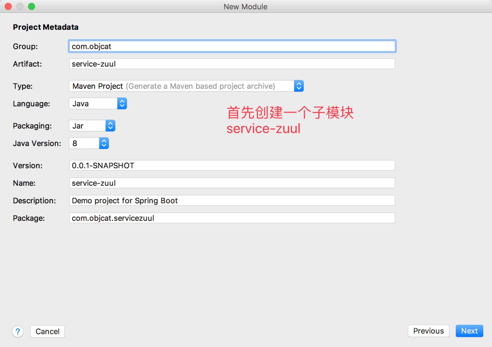
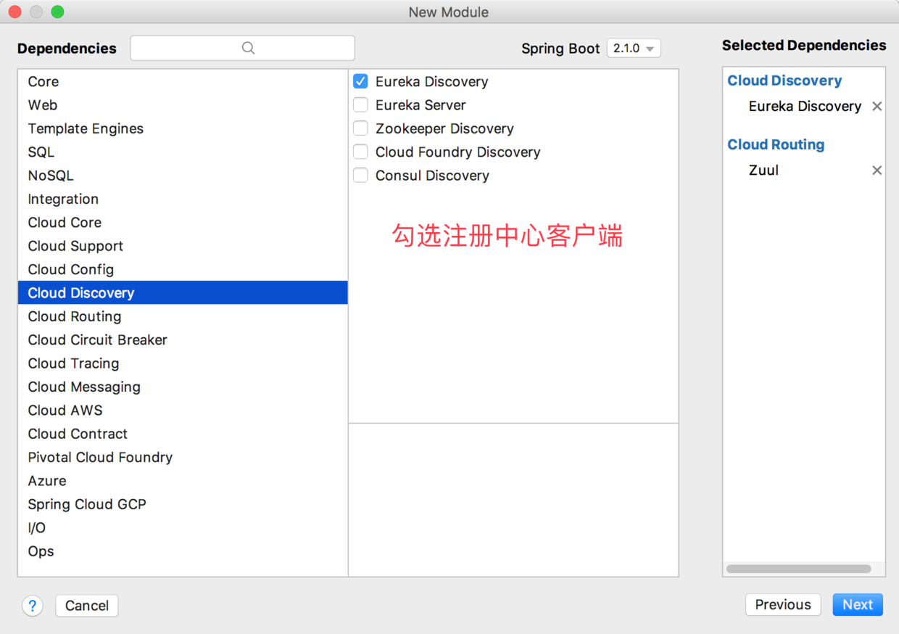
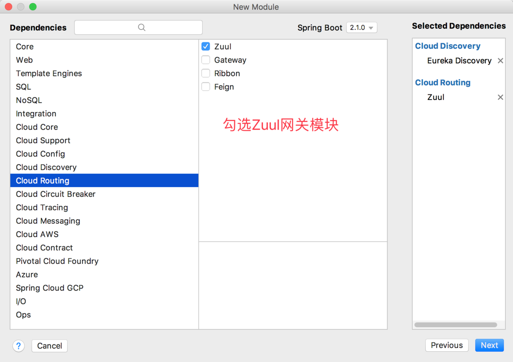
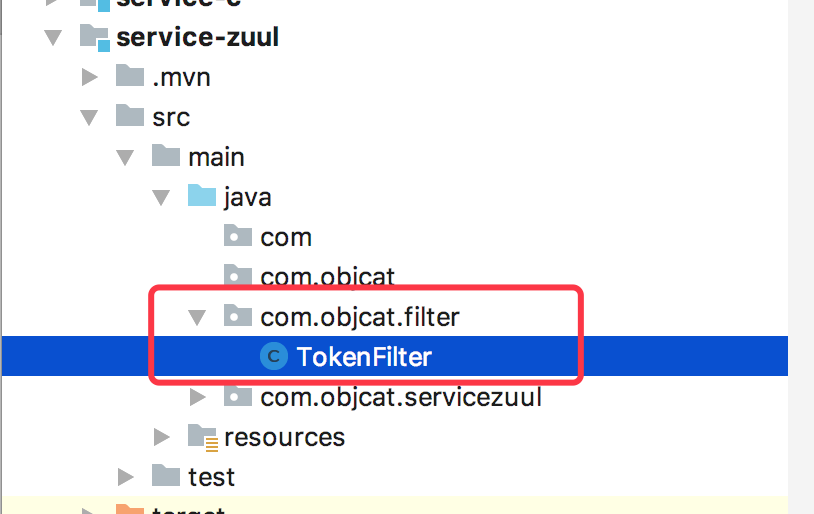
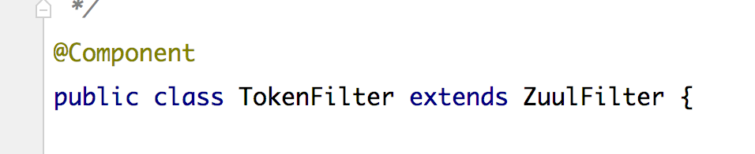
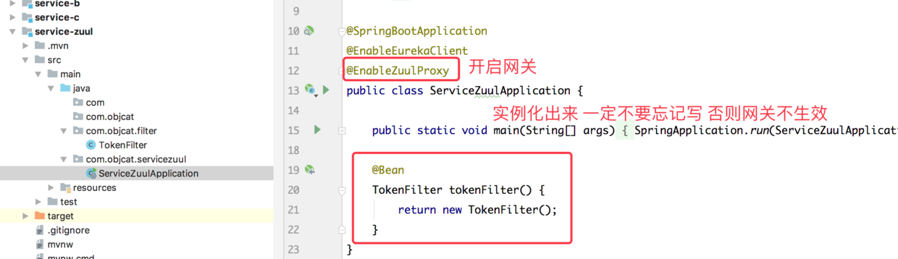
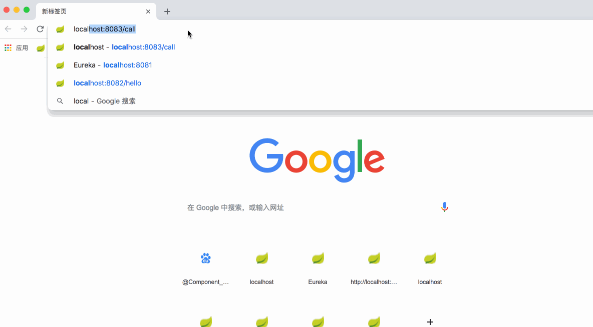

# 前文链接
[JavaEE] 搭建SpringCloud环境 进入微服务时代
https://www.jianshu.com/p/a0365a635975
温馨提示:本文是基于前文的扩展 没有基础的新手可以先去学习上文

# 一.简介

> 网关顾名思义很好理解 就是控制网络请求出入的关卡 生活中参考海关 有些东西可以通行 但是有些国家严令禁止的东西 是过不去海关的

因为我们很好理解 网关就是做一下`过滤或拦截`操作 让我们的服务更加安全 用户访问我们服务的时候就要先通过网关 然后再由网关转发到我们的微服务

# 二.快速开始

在`SpringCloud`全家桶中使用Zuul来搭建网关 下面我们就来创建一个网关吧!







之后我们配置一下网关的配置文件
```
server:
  #服务端口号
  port: 8085
spring:
  application:
    #服务名称 - 服务之间使用名称进行通讯
    name: service-zuul
eureka:
  client:
    service-url:
      #填写注册中心服务器地址
      defaultZone: http://localhost:8081/eureka
zuul:
  routes:
    #设置服务a 路径名称 随便起
    service-a:
      path: /service-a/**
      #这里写a服务的注册名字
      serviceId: service-objcat-a
    #设置服务b 路径名称 随便起
    service-b:
      path: /service-b/**
      #这里写b服务的注册名字
      serviceId: service-objcat-b
```



之后创建一个包 名字是`com.objcat.filter`
创建一个类`TokenFilter` 用来实现过滤规则



类需要继承于`ZuulFilter`之后我们重写`ZuulFilter`中的方法
```
/**
     * 过滤器类型 pre表示在请求之前进行逻辑操作
     */
    @Override
    public String filterType() {
        return "pre";
    }

    /**
     * 过滤器执行顺序
     * 当一个请求在同一个阶段存在多个过滤器的时候 过滤器的执行顺序
     */
    @Override
    public int filterOrder() {
        return 0;
    }

    /**
     * 是否开启过滤
     */
    @Override
    public boolean shouldFilter() {
        return true;
    }

    /**
     * 编写过滤器拦截业务逻辑代码
     */
    @Override
    public Object run() {
        return null;
    }
```

然后我们开始写过滤的逻辑
```
    /**
     * 编写过滤器拦截业务逻辑代码
     */
    @Override
    public Object run() {
        RequestContext currentContext = RequestContext.getCurrentContext();
        HttpServletRequest request = currentContext.getRequest();
        String token = request.getParameter("token");
        if (token == null) {
            currentContext.setSendZuulResponse(false);
            currentContext.setResponseBody("token is null");
            currentContext.setResponseStatusCode(401);
        }
        return null;
    }
```
逻辑很简单 就是校验客户端发来的请求token是否为空 如果为空就不能通过 返回 `token is null`

之后我们配置一下入口文件 这个地方千万不要忘记实例化出来`filter`否则不生效


```
package com.objcat.servicezuul;

import com.objcat.filter.TokenFilter;
import org.springframework.boot.SpringApplication;
import org.springframework.boot.autoconfigure.SpringBootApplication;
import org.springframework.cloud.netflix.eureka.EnableEurekaClient;
import org.springframework.cloud.netflix.zuul.EnableZuulProxy;
import org.springframework.context.annotation.Bean;

@SpringBootApplication
@EnableEurekaClient
@EnableZuulProxy
public class ServiceZuulApplication {

    public static void main(String[] args) {
        SpringApplication.run(ServiceZuulApplication.class, args);
    }

    @Bean
    TokenFilter tokenFilter() {
        return new TokenFilter();
    }
}
```

之后我们来运行服务试试吧



我们可以清晰的看到 我访问a服务 只需要使用 `网关的地址 + 网关的端口号 + 服务的别名路径(配置文件中配置) + api名称` 就可以访问了

[http://localhost:8085/service-a/hello](http://localhost:8085/service-a/hello)

当没有token的时候返回就是 `token is null`
当token有值的时候就可以正常进行访问了
然后我们来尝试访问以下service-a的原地址

[http://localhost:8082/hello](http://localhost:8082/hello)

这次有些人可能会有疑问 这个不用token就可以访问吗??
没错 聪明的你应该已经看出来了 这个请求并没有经过网关转发 是直接访问到目标服务器的 所以并没有做token验证

> 这种网关转发之后的请求 就叫做`反向代理`你可以隐藏你本地的服务器的真实地址 只暴露给外界网关的地址 然后由网关转发给服务器 从而做到安全性更高 

好了 到这里网关配置已经完成了.

# 三.Demo
https://github.com/objcat/test-spring-cloud-demo.git