# 前文链接
[JavaEE] 搭建SpringCloud环境 进入微服务时代
https://www.jianshu.com/p/a0365a635975
[JavaEE] SpringCloud集成Apollo分布式配置中心
https://www.jianshu.com/p/5606483c7fbf
温馨提示:本文是基于前文的扩展 没有基础的新手可以先去学习上文

# 前言
在这以前写了篇`Appollo`配置中心的文章, 虽然很实用但是安装步骤相对麻烦, 而且还需要安装数据库, 命令行运行, 属于一种重量级的分布式配置中心, 本篇文章介绍的是`SpringCloud`全家桶中的分布式配置中心`SpringCloudConfig`, 它使用`git`来管理配置文件, 在修改配置文件后只需要调用一个接口就可以让新配置生效, 非常方便.

# 一.快速开始
SpringCloudConfig分为两部分, 服务端和客户端, 服务端是用来`提供`配置文件信息的, 而客户端是用来`使用`配置文件信息的, 我们接下来就开始集成.

## 1.SpringCloudConfig服务端

新建一个`Module`

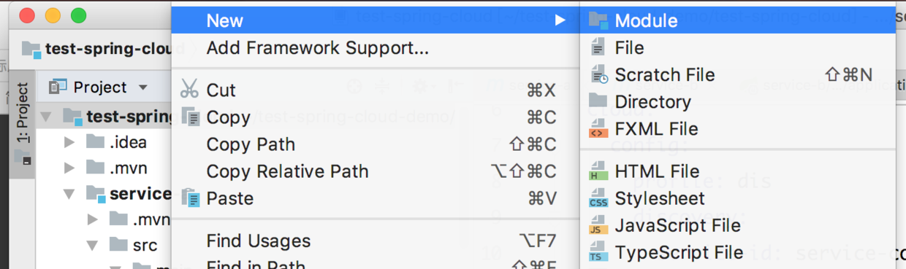

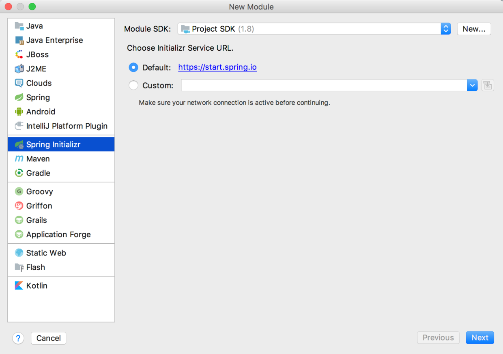

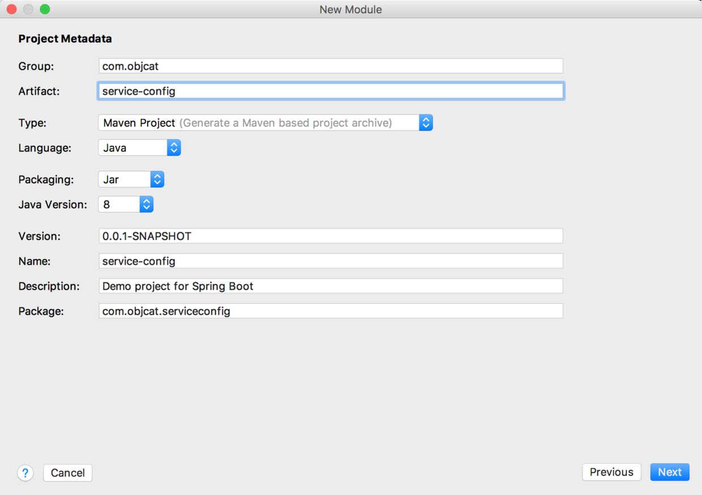

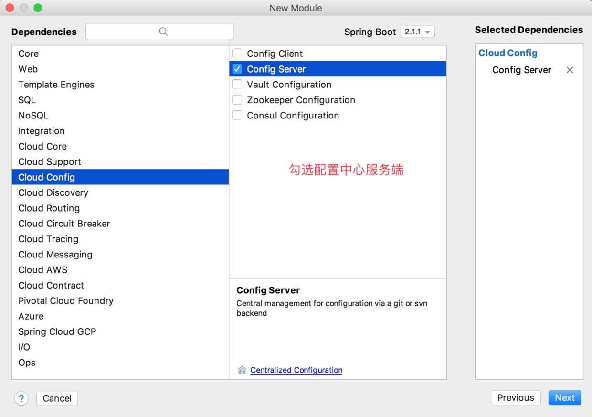

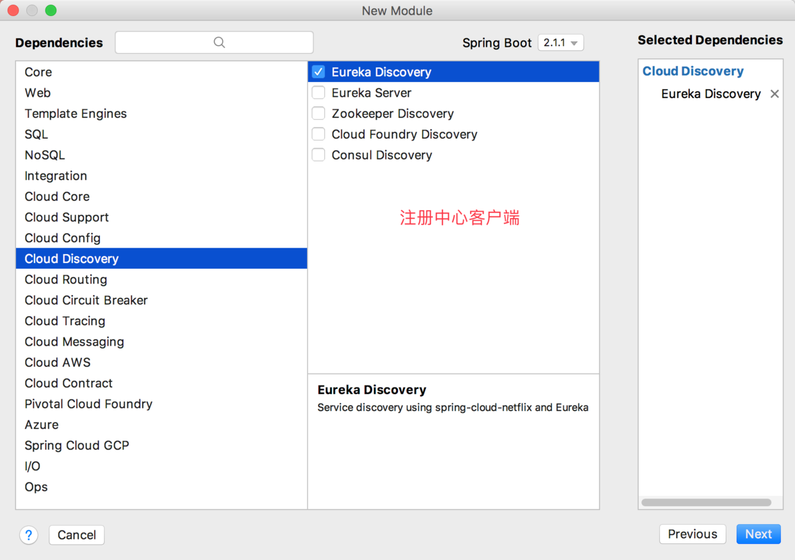

之后next, 完成项目创建, 工程目录是这样的, 别忘了`import changes`

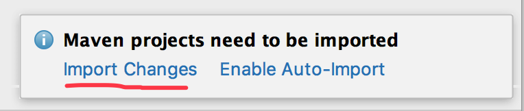

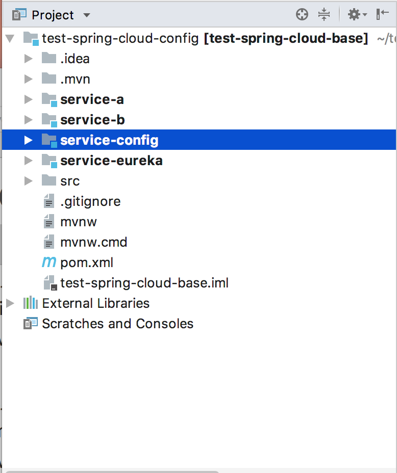

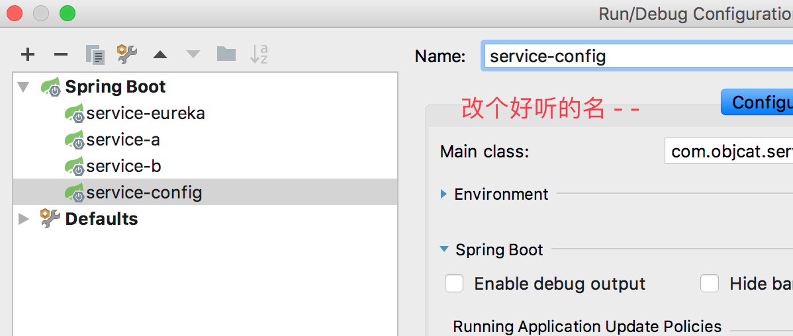

之后我们做简单的配置, 配置文件有两种格式`application.properties`和`application.yml`, 原理基本相同, 这里就不赘述了, 之前的文章都是用`yml`做教程, 我们这篇文章就用`.properties`来做

首先我们配置一下`application.properties`

```
# 服务端口
server.port = 8088
# 注册中心url
eureka.client.service-url.defaultZone = http://localhost:8081/eureka
# 注册中心名字
spring.application.name = service-config
# 配置存储地址(git)
spring.cloud.config.server.git.uri = https://gitee.com/jskk/spring-cloud-config.git
# 存储文件夹
spring.cloud.config.server.git.search-paths = myconfig
# git主分支
spring.cloud.config.label = master
```

每一项都有注释, 但是出于观看本文的人有可能并不懂`git`所以这里我就来简单演示一下如何创建git仓库和配置文件

##### 1.创建git账号

https://gitee.com

给你一个地址, 自己领悟.

##### 2.创建git仓库

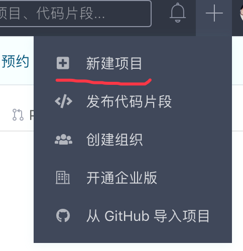

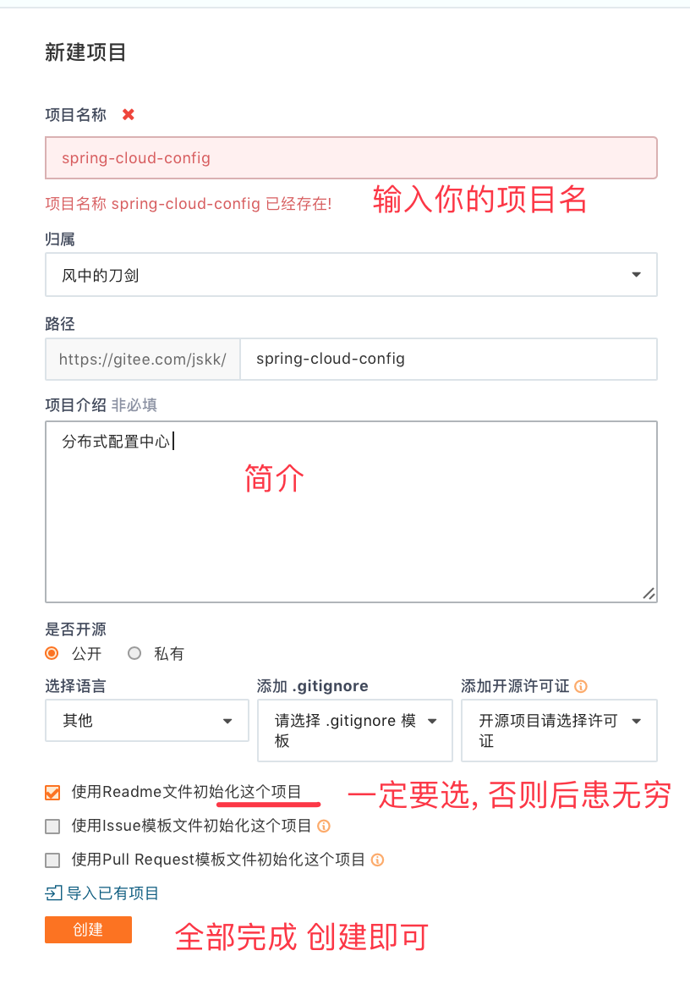


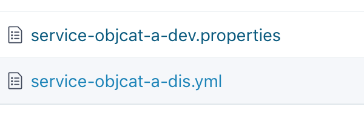

在文件夹中新建两个配置文件, 可以是`.properties`或`.yml`, 我们这里就两种格式都试试, 你在实际开发中选一种就好, 文件的命名是有规范的
> 服务名称-环境. properties

否则你的服务器无法读取配置文件, 我们来查看一下`service-a`的配置文件名称

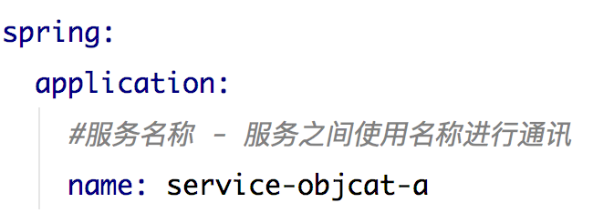

所以我们的配置文件应该叫
> service-objcat-a-dev. properties

配置文件的内容如下:

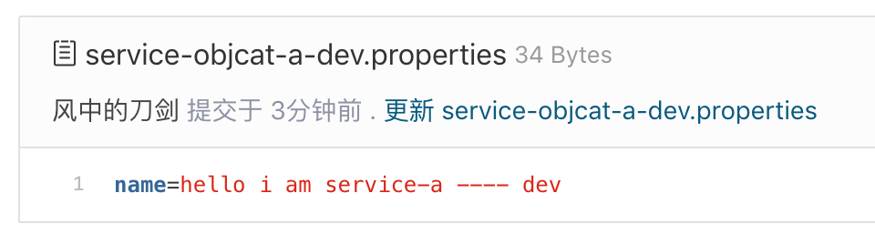

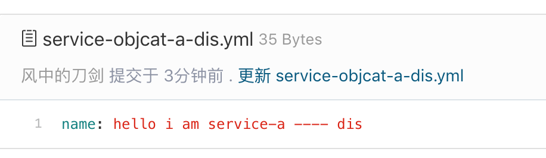


注意两种不同格式的配置文件, 语法是不同的, 但是基本原理是相同的, 注意别写错了.

之后我们在配置中心的入口写一下注释

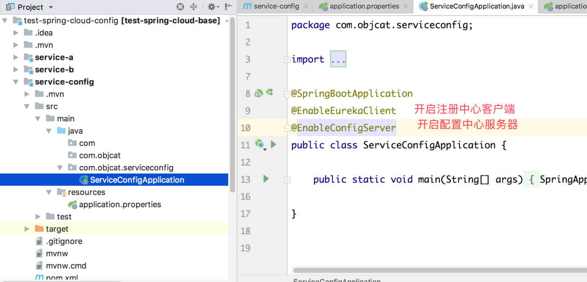

之后我们运行一下吧!

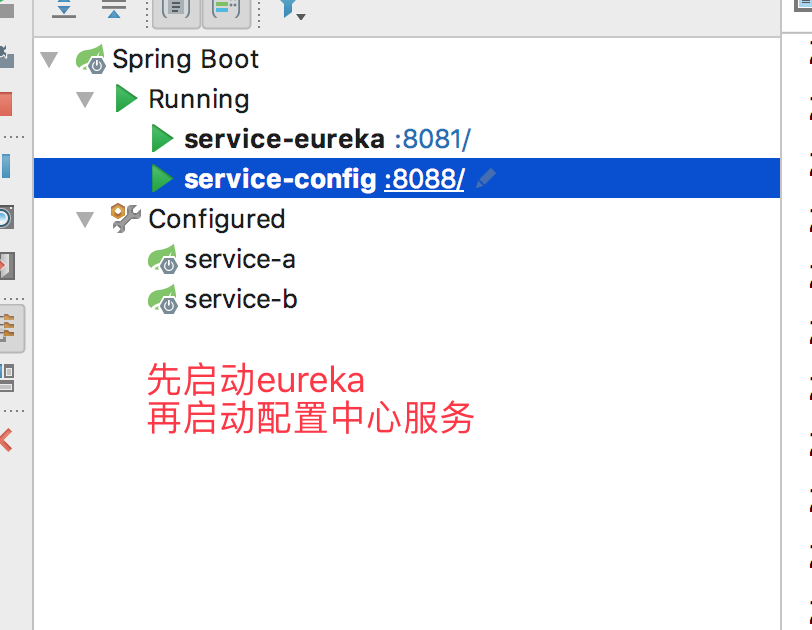

启动之后, 我们只需要输入下边的网址就可以访问你的配置中心

http://localhost:8088/service-objcat-a-dev.properties

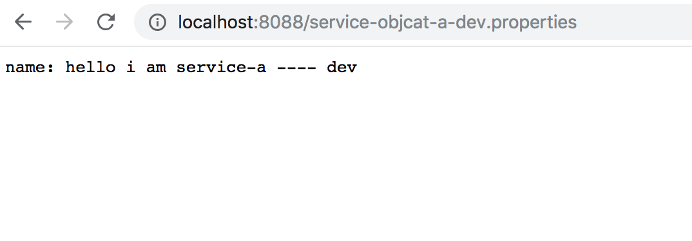

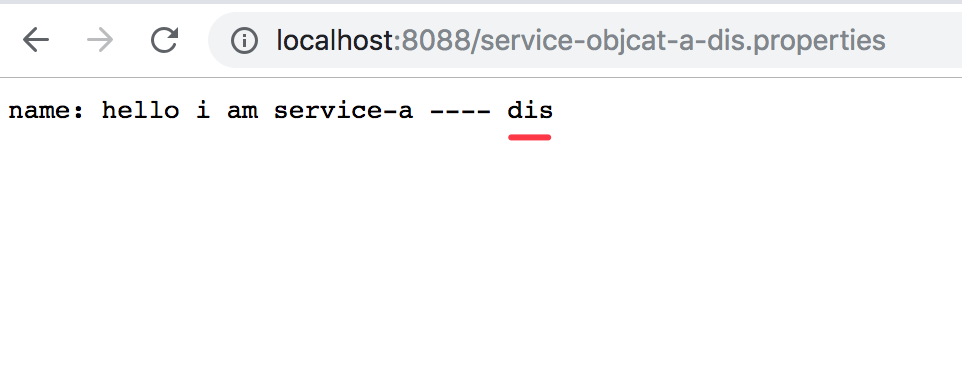

访问结果如上图.

如果上面可以访问, 证明配置中心服务器没有问题, 接下来我们就来使用分布式配置中心来动态修改配置吧.

我们就给`service-a`开启分布式配置服务吧!

首先我们在`pom`中添加依赖, 来导入分布式配置中心客户端的库, 我在开始的时候说过了, 分布式配置中心有客户端和服务端两种, 上文中服务端已经配置好了, 下面我们就来配置客户端
```
<dependency>
    <groupId>org.springframework.cloud</groupId>
    <artifactId>spring-cloud-config-client</artifactId>
</dependency>
```
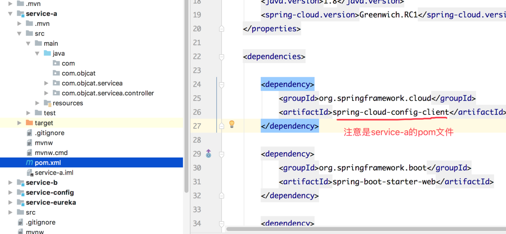

之后我们修改一下配置文件

把`application.yml`修改成`bootstrap.yml`这里说一下, 这两个名字都是应用的配置文件, 但是`bootstrap.yml`会先执行, 其次是配置分布式配置中心服务器的规范就是在`bootstrap.yml`中配置的, 这俩个配置文件可以共存, 这里为了方便起见, 所以直接就改名了, 我们继续

```
spring:
  application:
    #服务名称 - 服务之间使用名称进行通讯
    name: service-objcat-a
  cloud:
    config:
      profile: dev
      discovery:
        enabled: true
        service-id: service-config
eureka:
  client:
    service-url:
      #填写注册中心服务器地址
      defaultZone: http://localhost:8081/eureka
    #是否需要将自己注册到注册中心
    register-with-eureka: true
    #是否需要搜索服务信息
    fetch-registry: true
```

对比我们之前的配置文件可以看到, 关键就是下面的一段
```
server:
  port: 8082
spring:
  application:
    #服务名称 - 服务之间使用名称进行通讯
    name: service-objcat-a
  cloud:
    config:
      # 配置文件环境
      profile: dev
      discovery:
        # 开启配置中心
        enabled: true
        # 配置中心别名
        service-id: service-config
eureka:
  client:
    service-url:
      #填写注册中心服务器地址
      defaultZone: http://localhost:8081/eureka
    #是否需要将自己注册到注册中心
    register-with-eureka: true
    #是否需要搜索服务信息
    fetch-registry: true
```

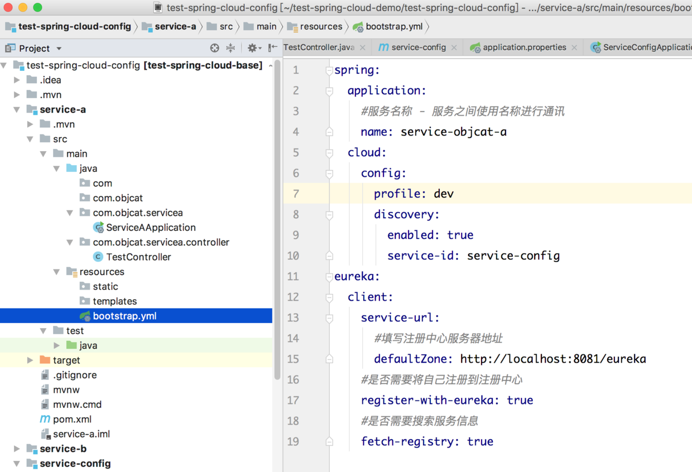


注意别名一定要跟你上面配置服务器的名称一致, `profile`千万不要乱写, 写你需要应用配置文件的环境, 还记得我们的配置文件命名方式吗`服务名-环境.yml `

到这里已经配置完成了, 我们来写个接口验证一下吧!

```
@Value("${name}")
private String name;

@RequestMapping("/hello")
String hello() {
    return name;
}
```

`@value`就是从配置文件中读取一个字段, 我们`name`这个字段是存在服务端的, 所以如果可以读取出来, 就证明分布式配置中心是可以用的, 之后我们来运行一下服务

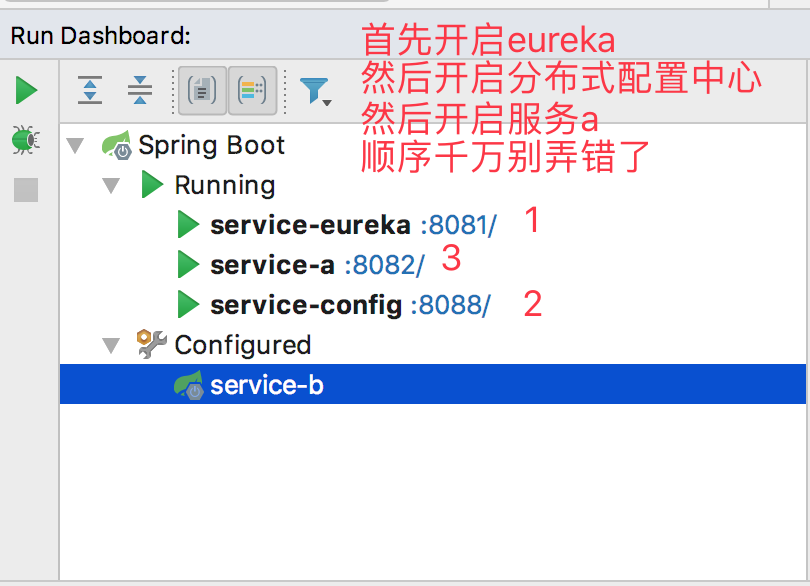

之后我们来访问一下接口

http://localhost:8082/hello

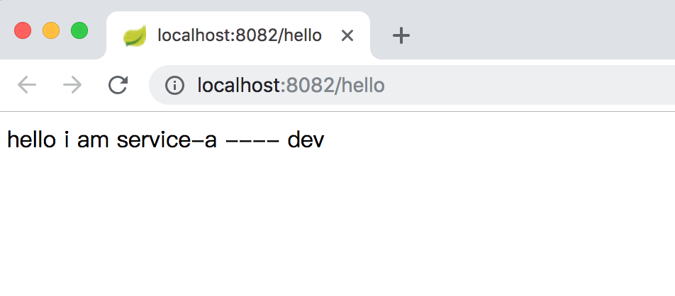

发现名字就是我们`git`上面配置的, 说明配置中心已经生效了, 之后我们修改配置中心上的内容, 看是否可以动态修改配置

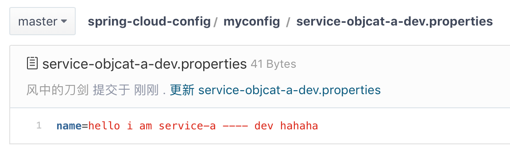

之后我们再次访问一下接口

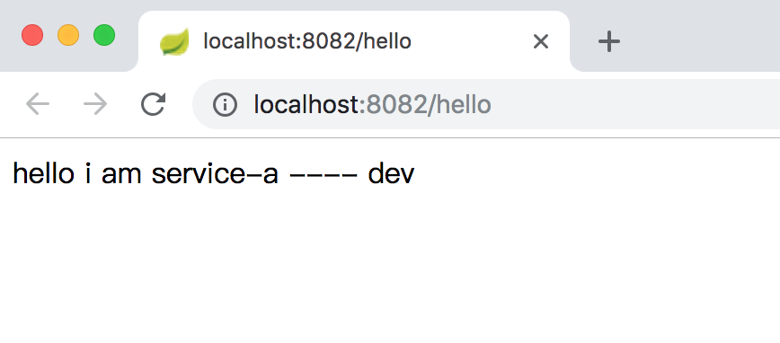

我们发现`name`字段并没有更新

这个想要更新其实很简单, 重启服务即可, 这个方法虽然管用但是使用起来非常不方便, 重启服务器就会造成用户无法访问, 这并不是分布式配置中心想要看到的

我们接下来要做的就是线上刷新字段, 不需要重启服务器, 我们首先给`service-a`导入`监控模块`的包

```
<dependency>
    <groupId>org.springframework.boot</groupId>
    <artifactId>spring-boot-starter-actuator</artifactId>
</dependency>
```

在配置文件中增加如下字段 暴露所有`endpoints`
```
management:
  endpoints:
    web:
      exposure:
        include: "*"
```

然后我们在控制器中配置刷新, 只有配置过刷新注解的控制器中的值才会被刷新.
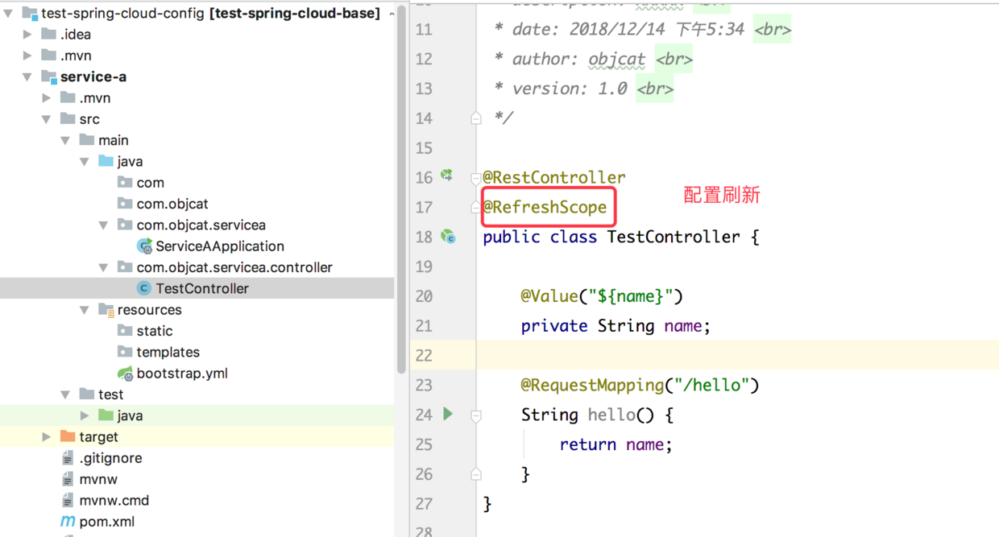


之后我们重启服务

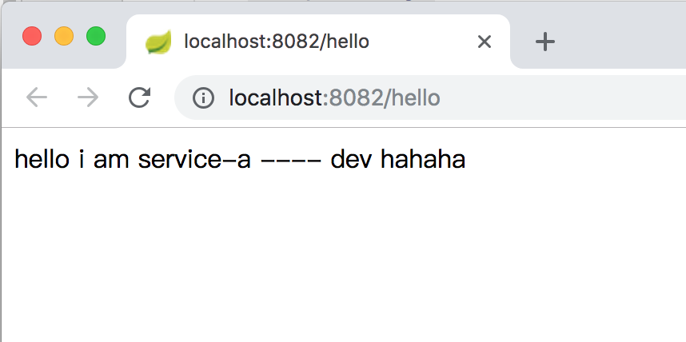

发现配置是生效的, 之后我们修改`git`上的配置文件

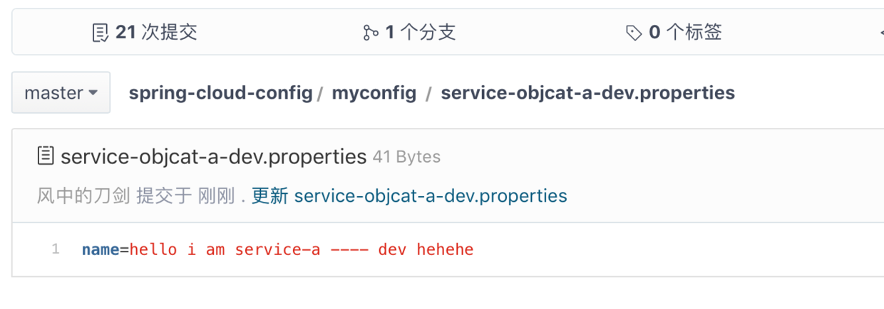

改成了hehehe, 这回我们访问接口, 毫无疑问肯定是没刷新的

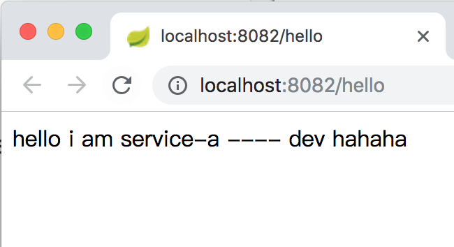

那我们如何让它刷新呢, 只需要调用一个刷新接口即可, 注意一定要使用`post`请求, 可以使用命令行或者`postman`.

命令行:
```
curl -X POST http://localhost:8082/actuator/refresh
```

postman:

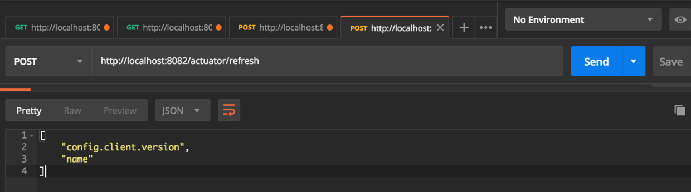

调用完毕之后如图所示

我们再次访问就可以看到刷新了

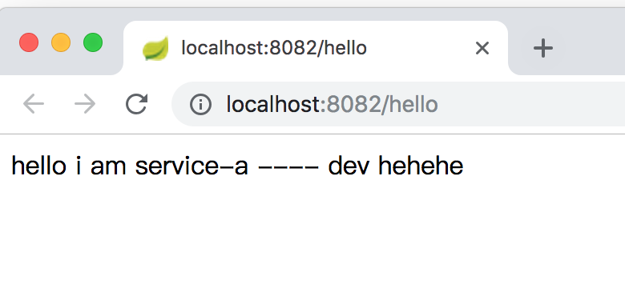

# 二.Demo
https://github.com/objcat/test-spring-cloud-demo.git

# finally enjoy it.
# by objcat 2018.12.18


