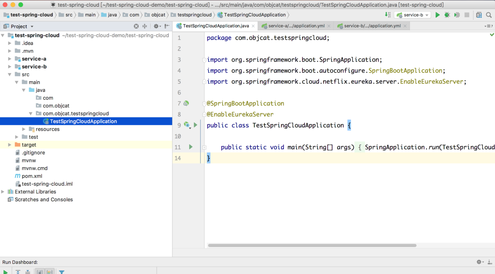
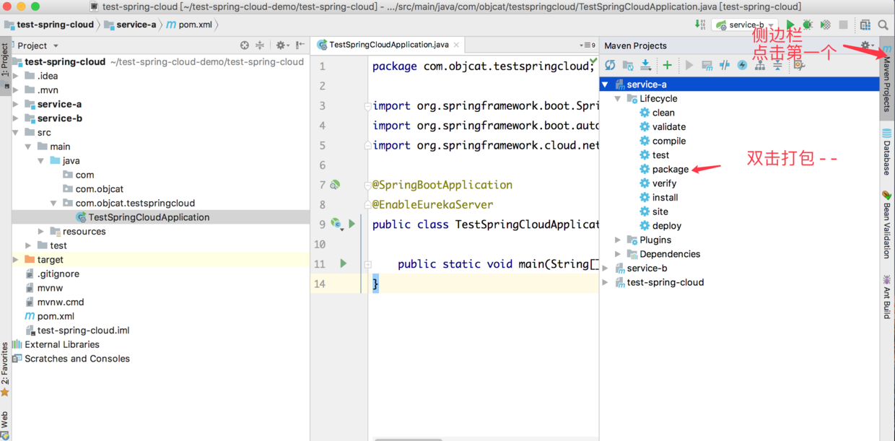
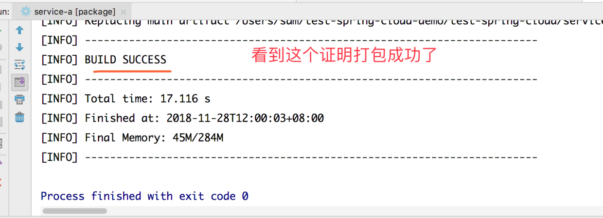
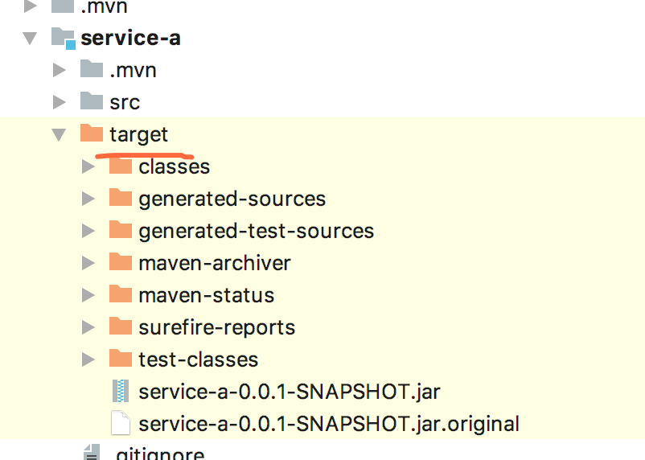
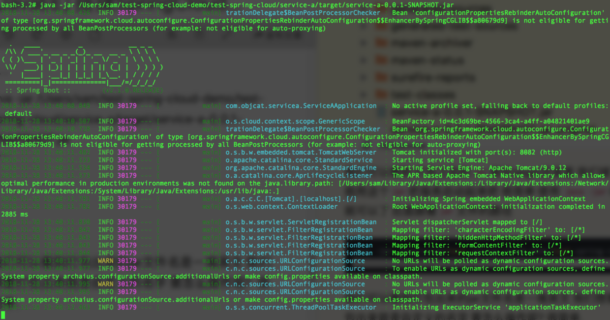
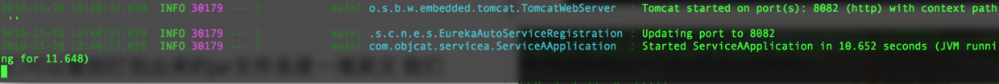
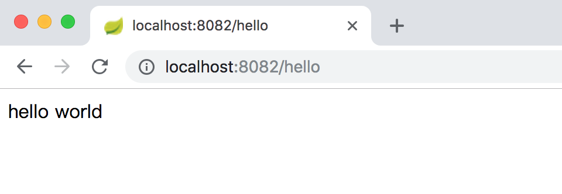
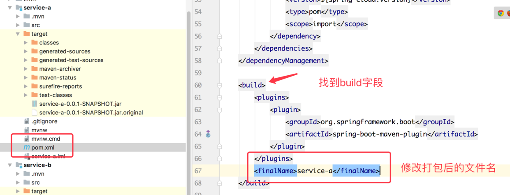

# 前文链接
[JavaEE] 搭建SpringCloud环境 进入微服务时代
https://www.jianshu.com/p/a0365a635975
温馨提示:本文是基于前文的扩展 没有基础的新手可以先去学习上文

# 1.前言

经过了这么长时间的学习 想必你已经对`springcloud`有了比较充分的了解 但是想要把项目发布去服务器运行 必须要进行`打包`, 那么怎么来打包呢? 下面跟着我们的镜头一起来看吧!

# 2.打包

###### 1.jar包

`springcloud`中内置了`tomcat`所以打包的时候是直接把`tomcat`打入jar包 之后就可以做到, `单独的服务`, ` 独立的jar包`, `独立运行`的效果了.

我们这次就用demo来举例 (demo获取请看文章开头文章的末尾 - -)

首先打开项目



打开后 我们开始打包 在界面上连按两次`command` idea右侧会出现一个侧边栏





那我们在哪里找到打包完成的`jar`包呢?



我们可以看到 打包之后的`jar`就在target目录里 我们接下来就用这个`jar`把服务启动起来吧 很简单 使用 `java -jar`命令就可以了 后面跟着`jar`文件的路径

```
java -jar /Users/sam/test-spring-cloud-demo/test-spring-cloud/service-a/target/service-a-0.0.1-SNAPSHOT.jar
```



我们可以看到启动过程是这样的



看到最后的提示 说明启动成功了!

我们来访问一下接口



有是熟悉的服务 熟悉的接口 我们在不知不觉中就学会了打包 - -


之后我们发现打包出来的`jar`文件名是一堆`英文和数字` 我们想要打包出来就是自定义的名字 要怎么操作呢?  很简单.



在`pom.xml`文件中找到`build`关键字添加`finalName`即可.

# finally enjoy it.
# by objcat 2018.11.28


