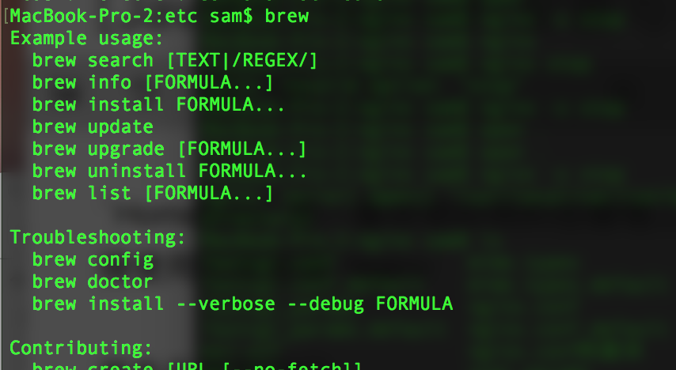
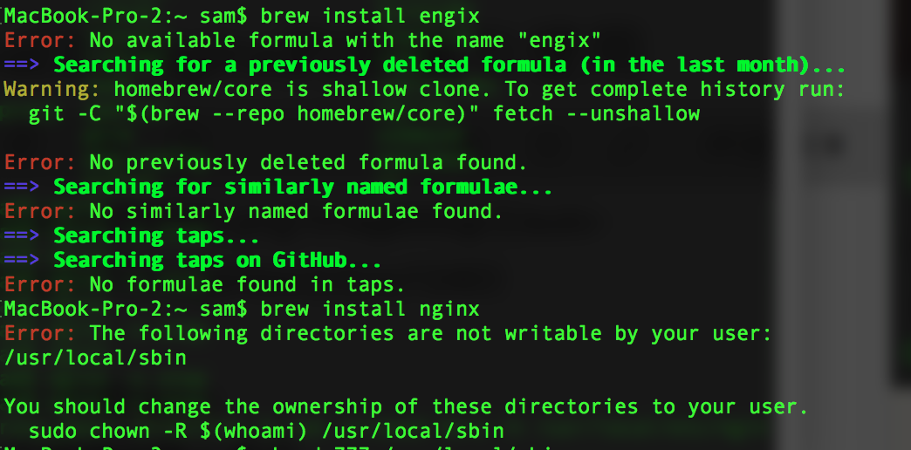
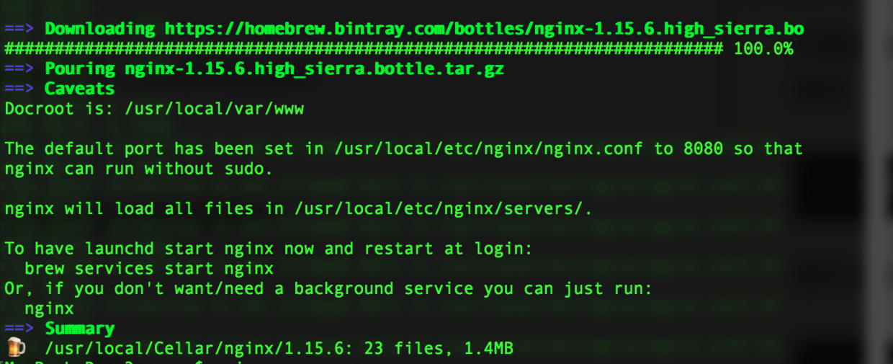
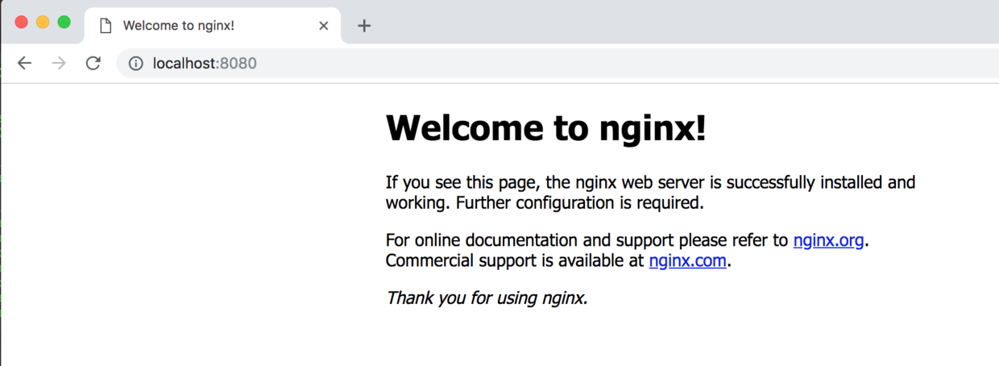
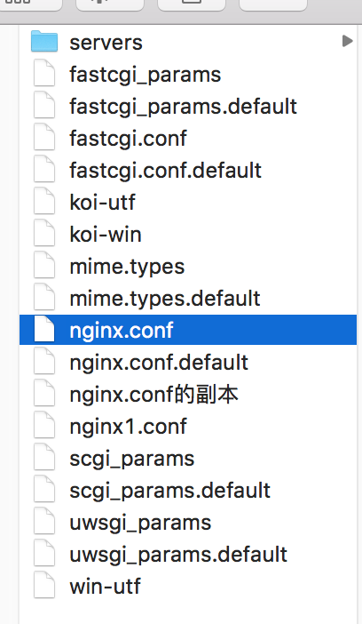
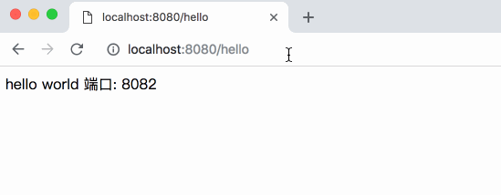

# 前文链接
[JavaEE] 搭建SpringCloud环境 进入微服务时代
https://www.jianshu.com/p/a0365a635975
温馨提示:本文是基于前文的扩展 没有基础的新手可以先去学习上文
# 一.简介
最近玩了玩`Nginx`感觉体验还不错 只是网上的文章有些让我迷惑 所以我来写一篇比较简洁的文章记录一下
> *Nginx* (engine x) 是一个高性能的[HTTP](https://baike.baidu.com/item/HTTP)和[反向代理](https://baike.baidu.com/item/%E5%8F%8D%E5%90%91%E4%BB%A3%E7%90%86/7793488)服务，也是一个IMAP/POP3/SMTP服务。Nginx是由伊戈尔·赛索耶夫为[俄罗斯](https://baike.baidu.com/item/%E4%BF%84%E7%BD%97%E6%96%AF/125568)访问量第二的Rambler.ru站点（俄文：Рамблер）开发的，第一个公开版本0.1.0发布于2004年10月4日。

通俗的讲 就是一个服务器 我们在开发中主要用于做`反向代理`与`负载均衡`功能 下面就跟着我们的镜头一起来看吧!


# 二.安装
`Nginx`官网: http://nginx.org/en/

本文基于的环境是macOS 10.13.6

所以这里只讲述`Mac`上的安装方法`Windows`请自行安装
###### 1.安装Homebrew

`Homebrew`是一套非常好用的包管理工具 我们可以直接使用它来安装`Nginx`

首先在终端执行
```
/usr/bin/ruby -e "$(curl -fsSL https://raw.githubusercontent.com/Homebrew/install/master/install)"
```
一行代码完事 安装好之后 输入`brew`查看是否安装正确


###### 2.安装Nginx
很简单 在终端中输入命令
```
brew install Nginx
```
但是在安装过程中有可能遇到一个错误 


问题出在了文件夹访问权限上 我们使用`chmod`命令来给文件夹授权

```
sudo chmod 777 /usr/local/sbin
```

授权之后再次执行安装即可

```
brew install Nginx
```

我们看到下图的提示就说明安装成功了


# 二.开始使用
###### 1.让我们跑起来
经过上述步骤 我们的`Nginx`已经安装完毕了 之后我们来启动一下吧 直接在终端中输入:
```
nginx
```
如果没有任何错误提示 证明已经启动成功了...
我们打开`localhost:8080`来访问一下



看到如上图的样子说明`Nginx`已经启动成功了 好了下课 - - (开玩笑的)

接下来你有可能会有疑问 接下来我们用它做啥子呢?

我在文章开头已经说过了`Nginx`主要实现两个功能`反向代理`和`负载均衡`

###### 2.反向代理
什么是反向代理呢? 其实很好理解 就是通过`Nginx`转发请求到你其他的接口 以达到隐藏服务器`真实地址`的功能

下面我们就来配置一下 首先定位到配置文件路径
```
/usr/local/etc/nginx/nginx.conf 
```
`command` + `shift` + `g`  直接追过去

之后我们会看到一个`nginx.conf`

先别急 首先我们把这个文件复制一份 防止改坏了(程序员必备思想 - -)

之后用文本编辑器打开 可以看到一大坨代码 我把注释的地方都删了

```

#user  nobody;
worker_processes  1;

#error_log  logs/error.log;
#error_log  logs/error.log  notice;
#error_log  logs/error.log  info;

#pid        logs/nginx.pid;


events {
    worker_connections  1024;
}


http {
    include       mime.types;
    default_type  application/octet-stream;

    #log_format  main  '$remote_addr - $remote_user [$time_local] "$request" '
    #                  '$status $body_bytes_sent "$http_referer" '
    #                  '"$http_user_agent" "$http_x_forwarded_for"';

    #access_log  logs/access.log  main;

    sendfile        on;
    #tcp_nopush     on;

    #keepalive_timeout  0;
    keepalive_timeout  65;

    server {
        listen       8080;
        server_name  localhost;

        #charset koi8-r;

        #access_log  logs/host.access.log  main;

        location / {
            root   html;
            index  index.html index.htm;
        }

        error_page   500 502 503 504  /50x.html;
        location = /50x.html {
            root   html;
        }
    }

    include servers/*;
}

```
我们可以看见有一个叫`server`的字段 我们在这里面就可以配置服务器相关的东西了

`localhost` 服务器监听端口号

好的我们接下来就来配置一下反向代理 我们只需要在`server`里面的`location`中添加一个`proxy_pass  [空格] 你的服务器地址`即可
```
server {
        listen       8080;
        server_name  localhost;

        #charset koi8-r;

        #access_log  logs/host.access.log  main;

        location / {
            proxy_pass http://localhost:8082;
            root   html;
            index  index.html index.htm;
        }

        error_page   500 502 503 504  /50x.html;
        location = /50x.html {
            root   html;
        }
    }
```
我这里在本地开了个`8082`端口的微服务 你们自行开启 如果不会 请学习我的`springcloud`文章5分钟搭建出微服务
https://www.jianshu.com/p/a0365a635975
 
我们修改完配置之后需要重新启动`Nginx`
首先结束进程
```
nginx -s stop
```
然后重新启动
```
nginx
```

好的 我们来试验一下效果吧 这里不要忘了 修改完配置文件必须重启`Nginx`才能生效


我们可以看到 我访问的是`Nginx`的`8080`端口 而我的服务是在`8082`上面的 这时`Nginx`会把请求转发到`8082`让我可以访问到服务 可以看到网页上写着`8082`这是我在服务内部打印的端口

我们成功访问了接口 但是并没有暴露出服务器的地址 这就是所谓的反向代理 你请求给`Nginx`它帮你转发到你的本地服务上去


###### 3.负载均衡

负载均衡就是把用户的请求 分摊到功能相同的不同服务器上去 来减轻单个服务器的压力 我想有些人到这里应该不太明白 我举个例子解释一下

`百度`这个网站每天有`几亿人`进行访问 这么庞大的访问量往往用一个服务器是不可能完成快速响应的 所以百度使用了集群策略 买了100台服务器 每个服务器都能提供搜索服务 用户访问百度的时候 会按照一定逻辑 随机访问其中一个 这样就不至于造成单个压力过大而宕机了 反过来说 即使单个服务器宕机后 还有99个服务器可以服务 所以搜索功能是不受影响的

这篇文章我用本地来模拟一下`负载均衡` 我从本地开两个服务:8082和:8083做集群

之后我们来简单配置一下`nginx.conf`文件
```
    upstream jiqun {
        server localhost:8082;
        server localhost:8083;
    }

    server {
        listen       8080;
        server_name  localhost;

        #charset koi8-r;

        #access_log  logs/host.access.log  main;

        location / {
            proxy_pass http://jiqun;
            root   html;
            index  index.html index.htm;
        }

        error_page   500 502 503 504  /50x.html;
        location = /50x.html {
            root   html;
        }
    }

```

配置中可以看到 首先声明两个服务 起个别名为`jiqun `之后我们修改`proxy_pass`为`http://jiqun`就可以了 这样我们访问接口的时候 就会随机转发到这两个相同的服务上去 实现负载均衡了



我们可以看到 访问同一个网址 会在两个不同端口的微服务之间来回切换 说明我们已经实现了`负载均衡`了

好的 接下来 我们来引入一个概念`权重`

假如我们有两个服务器 
一个处理能力强
一个处理能力弱

我们希望让处理能力强的服务器 多接收一些用户请求 所以我们就要给nginx配置权重
```
upstream jiqun {
        server localhost:8082 weight=2;
        server localhost:8083 weight=1;
}
```

`weight`就是权重 配置为2的权重要比1高 我们来实际看一下效果 好的重启`Nginx` 我们来看看效果


我看一下`图2` 
1.访问4次`8082`
2.访问2次`8083`
3.循环

而没有配置的权重的`图1`
1.访问2次`8082`
2.访问2次`8083`
3.循环

所以没有配置过权重 默认就是同样的权重 好了 这就是`Nginx`最基本的配置实现了

# finally enjoy it.
# by objcat 2018.11.21


