#一.安装tomcat

- step 1 下载tomcat服务器
无脑点开
http://tomcat.apache.org
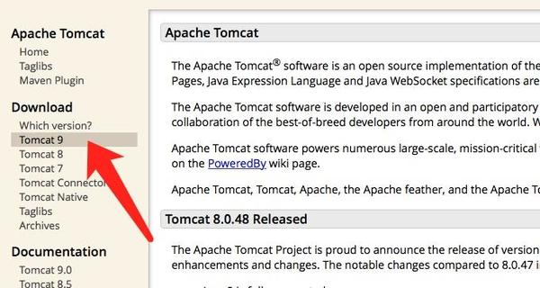
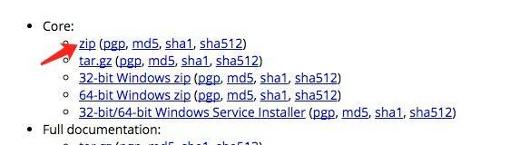

- step 2 安装
zip 解压出来是这么个东西
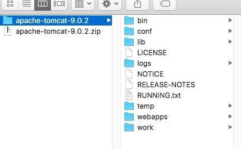

进入bin目录可以看到两个文件
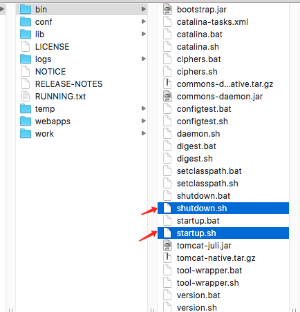

这两个文件就是启动和关闭服务器用的

下面我们cd到bin目录下 来启动服务器
```
cd /Users/hfcb/Downloads/apache-tomcat-9.0.2/bin 
sudo sh startup.sh
```

会出现如下错误
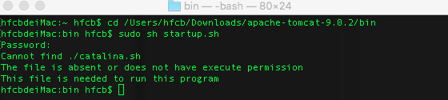


因此我们需要给文件权限
```
chmod 777 *.sh
```

这里再次运行 
```
sudo sh startup.sh
```
我们发现服务器可以正常启动了 出现如下命令行
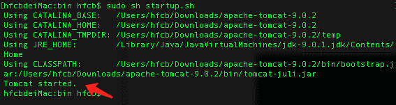


我们在web访问以下试试吧 出现如下页面即为成功启动服务器
http://localhost:8080
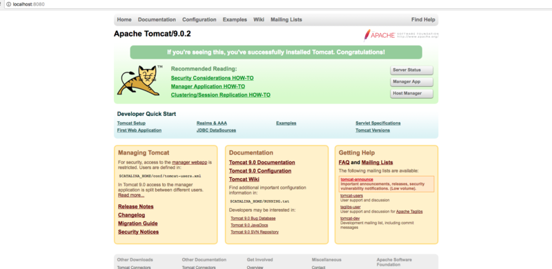


接下来我们点击 Server Status
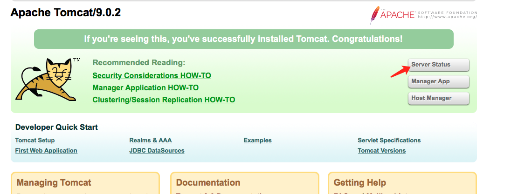

会出现输入用户名和密码  这里输入 
```
用户名: tomcat  
密码:tomcat
```
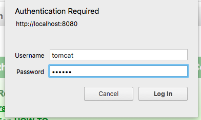

点击login

结果发现无法登陆  弹出一个空白的登陆窗口
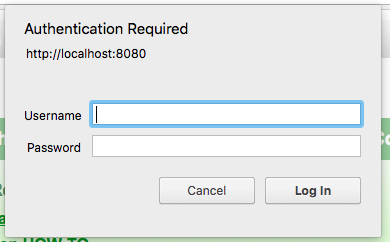


这时我们点击取消会出现401画面

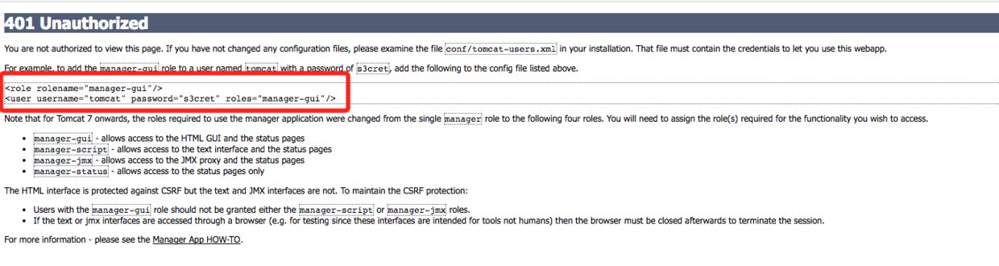

我们复制红框中的文字 打开如图所示目录下的文件
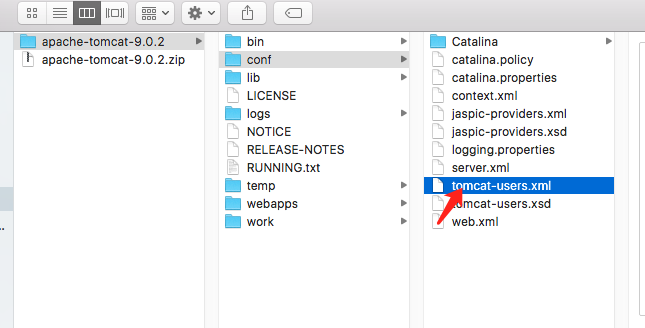

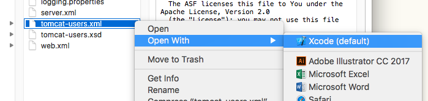

我们会看到如下页面 把文字复制到最下边 并修改用户名和密码都为 tomcat
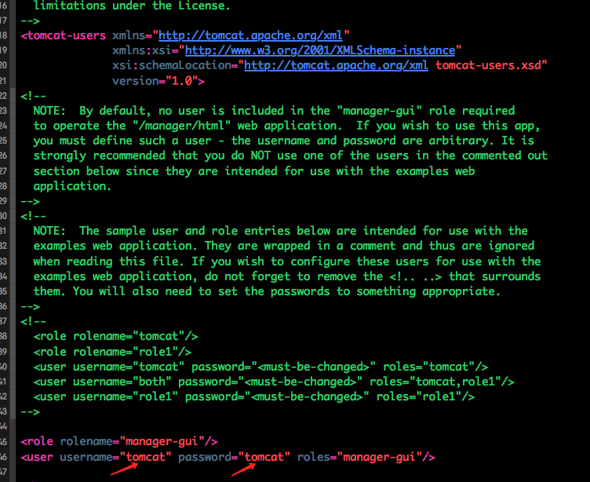


然后我们重启服务器

先关闭
```
sudo sh shutdown.sh
```

然后重新启动
```
sudo sh startup.sh
```


然后再次登录
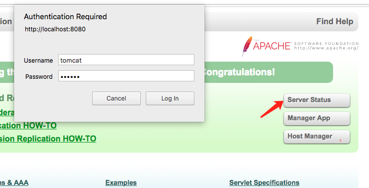

出现如下页面即为成功
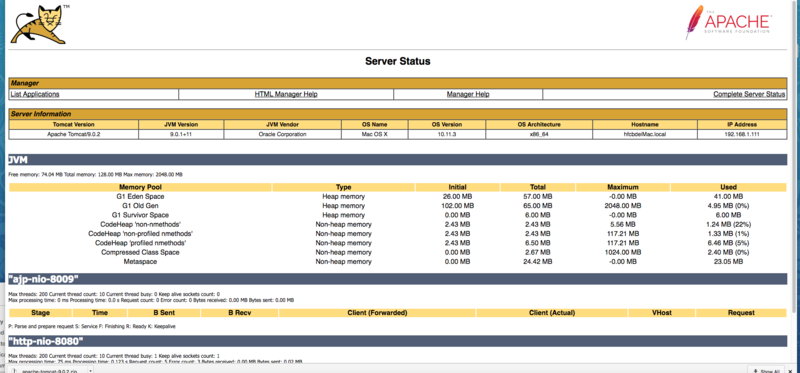


#一.安装eclipse
无脑点开 下载
https://www.eclipse.org/downloads/
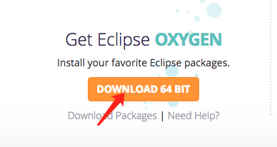

下载之后安装

在此之前请确保你已经安装过java环境  如果没安装去java下载一个jdk
http://www.oracle.com/technetwork/java/javase/downloads/jdk9-downloads-3848520.html

#安装过程略....


安装之后打开eclipse  cmd + , (cmd + 逗号) 打开设置页面 点击runtime Environments

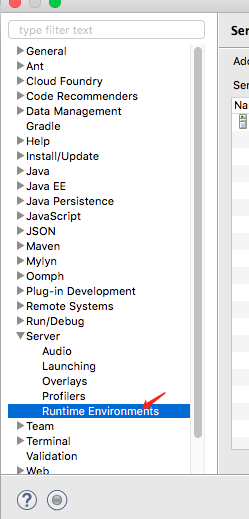

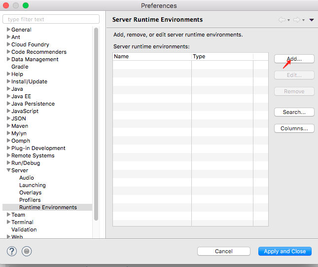


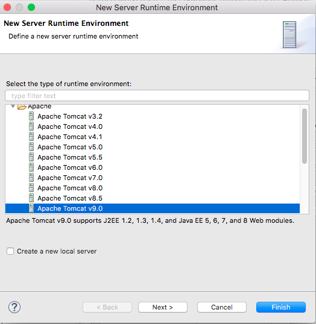

选择自己的服务器路径  finished
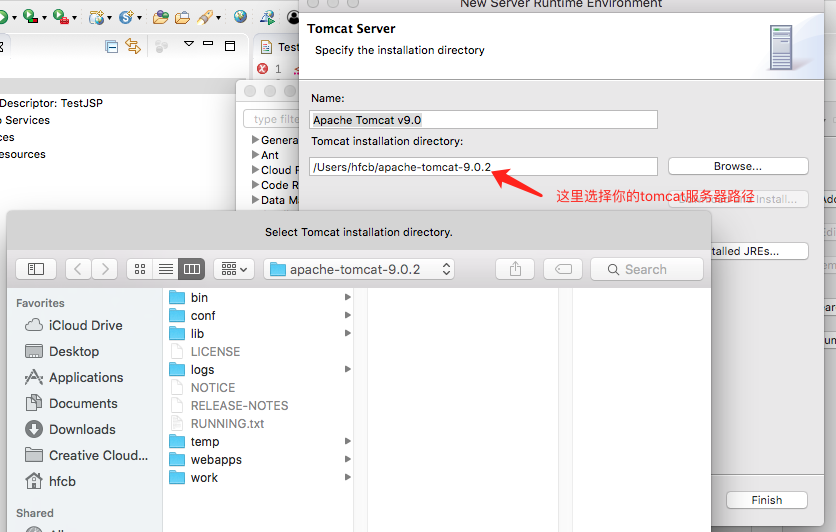


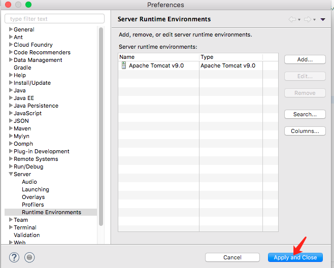


之后我们新建一个项目
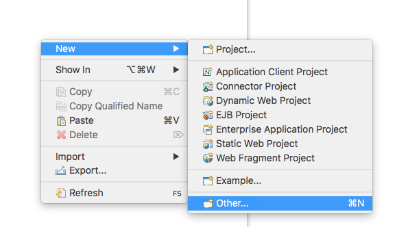


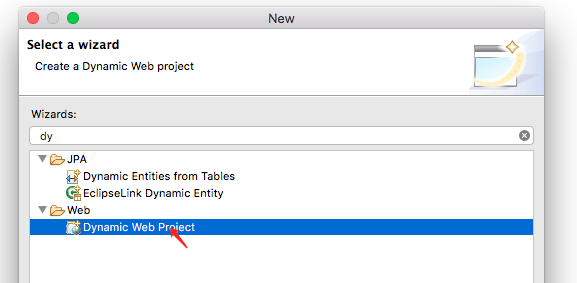

点击next

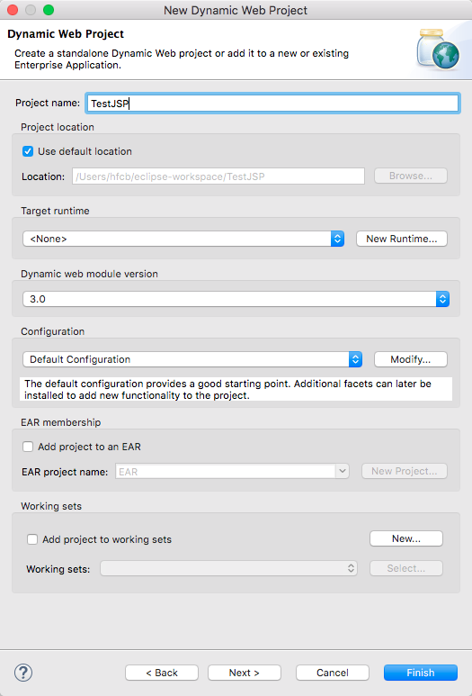


next

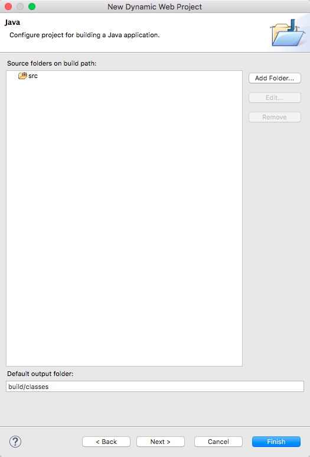


next

钩一定要钩上

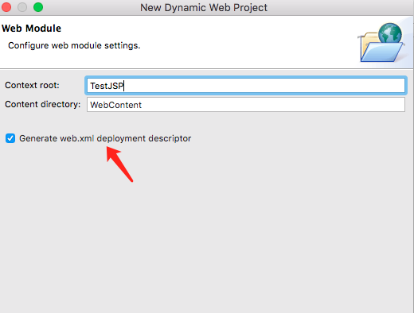


之后我们新建一个jsp文件
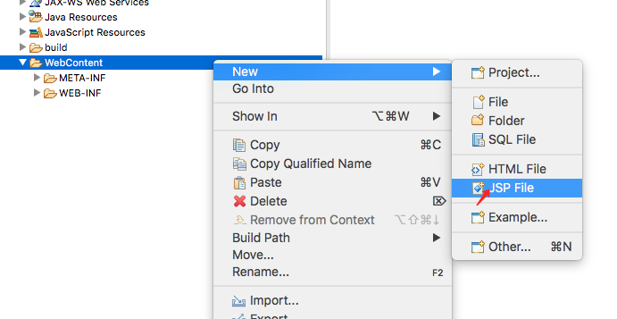

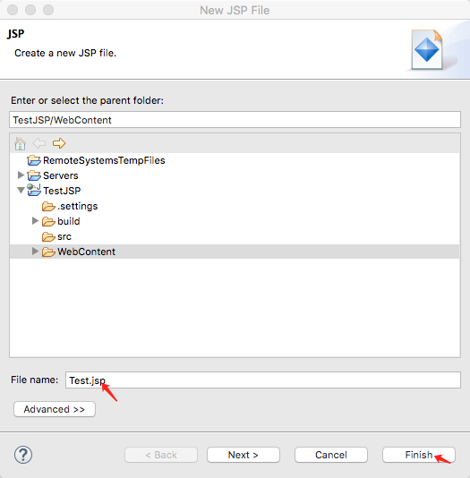

之后我们会发现报一个错11

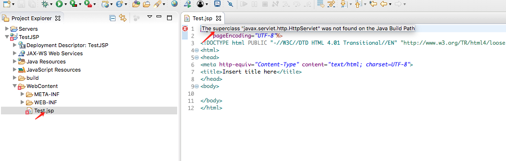

我们需要去配置一下 Build Path

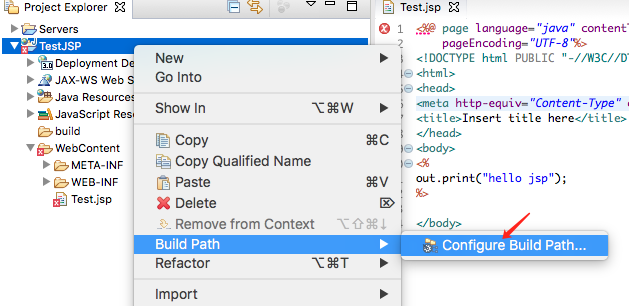

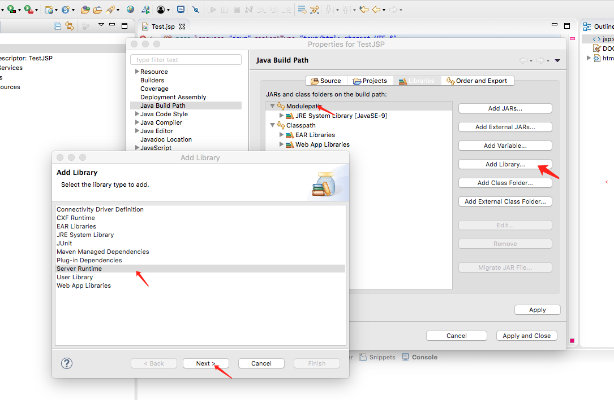

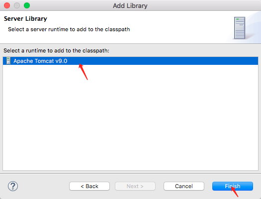


之后我们来测试一下把


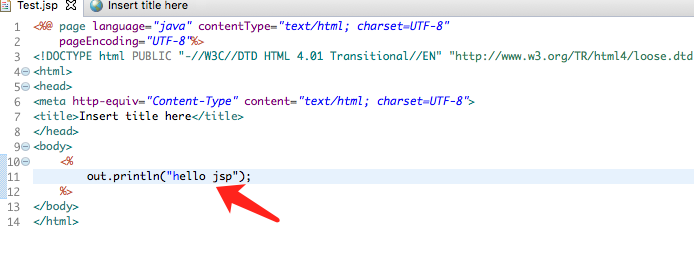

出现如下页面证明你的eclipse已经与tomcat关联成功了

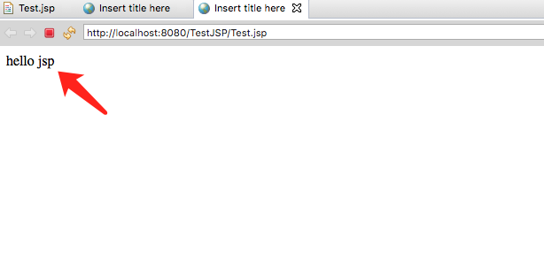


#    finally
#    enjoy jsp
#   write by objcat 2018.1.9


