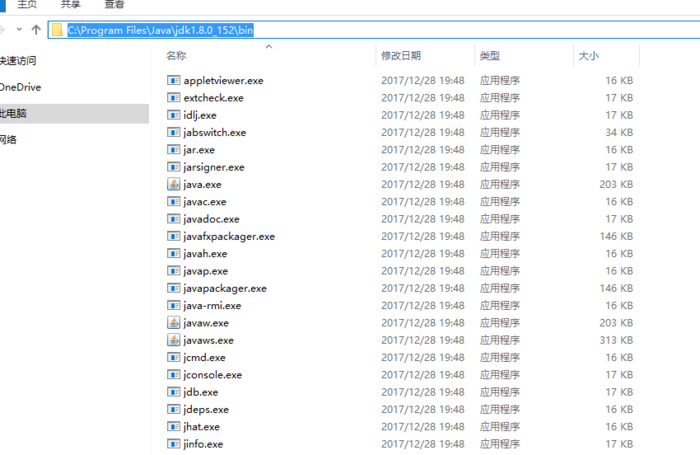
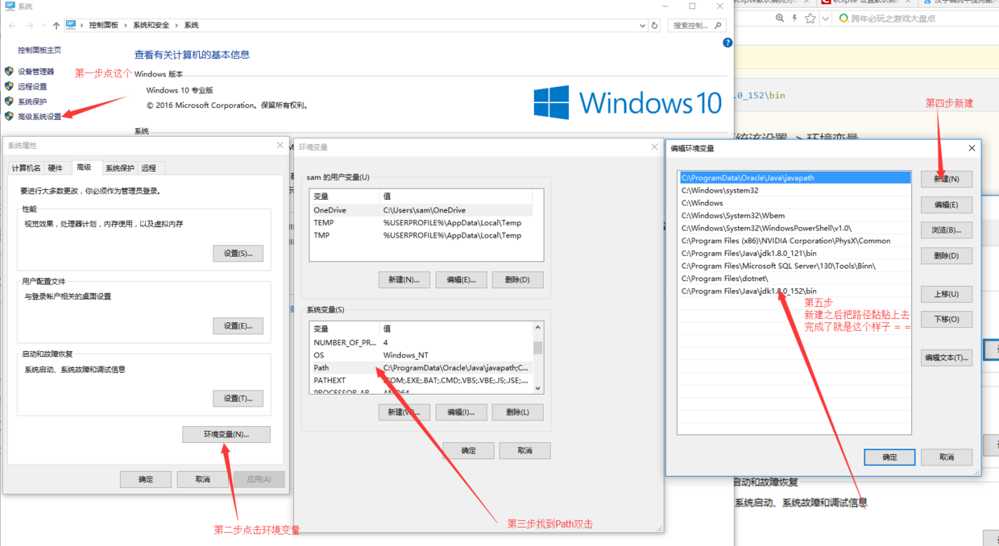
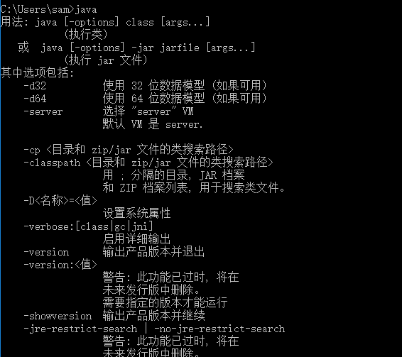

#一.上来就开始配置

非常简单, 环境变量其实就是个路径, 这个路径的用途就是告诉系统你想要直接使用指定路径下的文件, 而不用进入到文件夹内进行访问

- step 1 安装java 这个无脑安装 不讲解 = =.
http://www.oracle.com/technetwork/java/javase/downloads/jdk8-downloads-2133151.html

- step 2 找路径


```
C:\Program Files\Java\jdk1.8.0_152\bin
```


- step 3 配置环境变量 在桌面找到计算机 右键单击选择属性


- step 4 在控制台中输入java或javac 出现下面图片中的文字证明环境变量配置成功
 `- >win + r 运行 输入cmd 打开控制台 直接在里面输入java`
```
java
javac
```



- step5 享受java

