MySQL在Mac电脑下使用是个坑, 好了下面跟着我们的镜头一起来看吧.

#一.安装MySQL
下载地址
https://www.mysql.com/

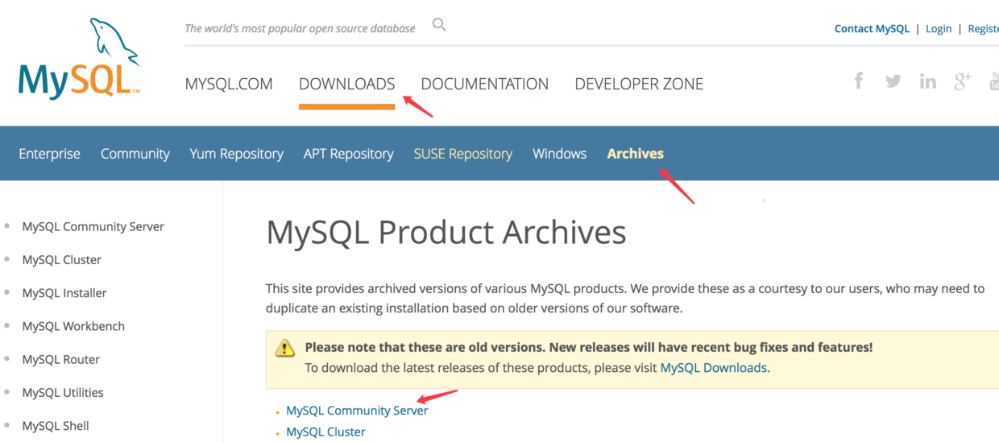

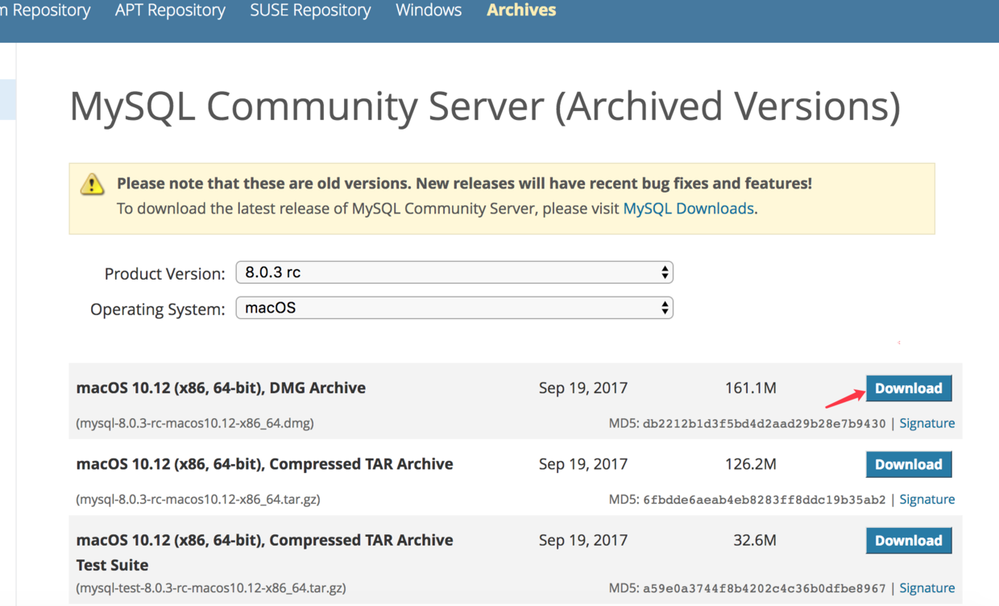

下载后安装 安装过程略.

#二.连接数据库
安装完成后我们会发现偏好设置里多了个MySQL
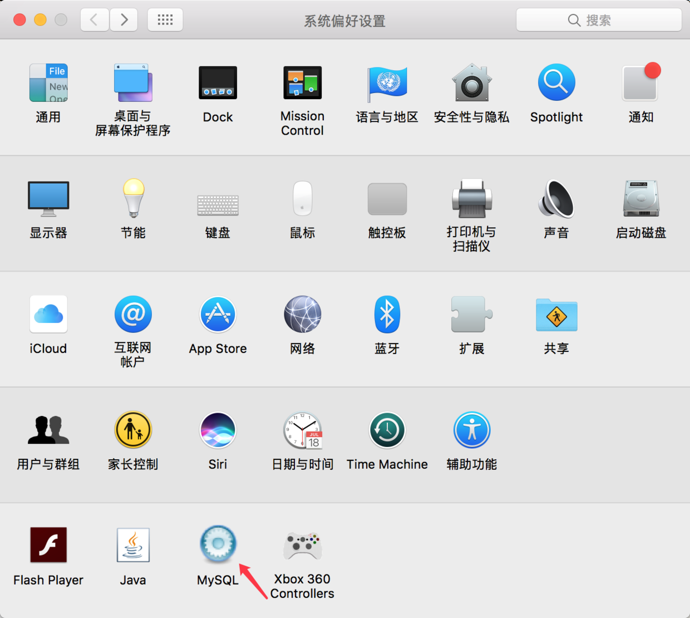

点开后是这样的
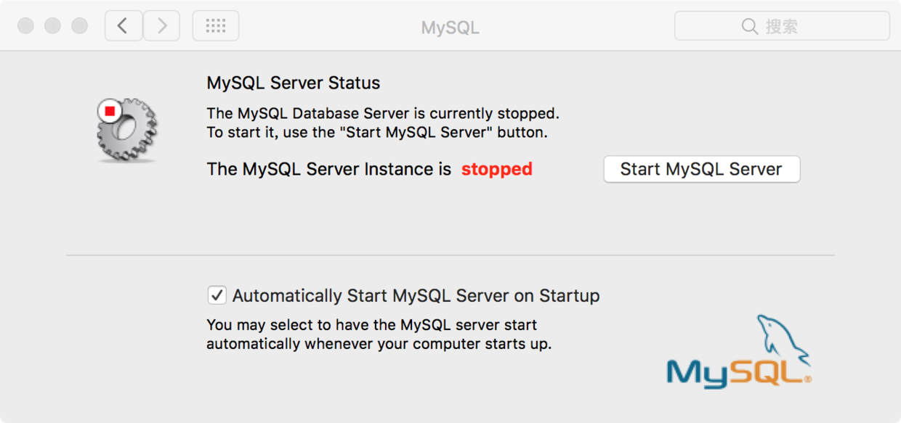

之后我们启动MySQL
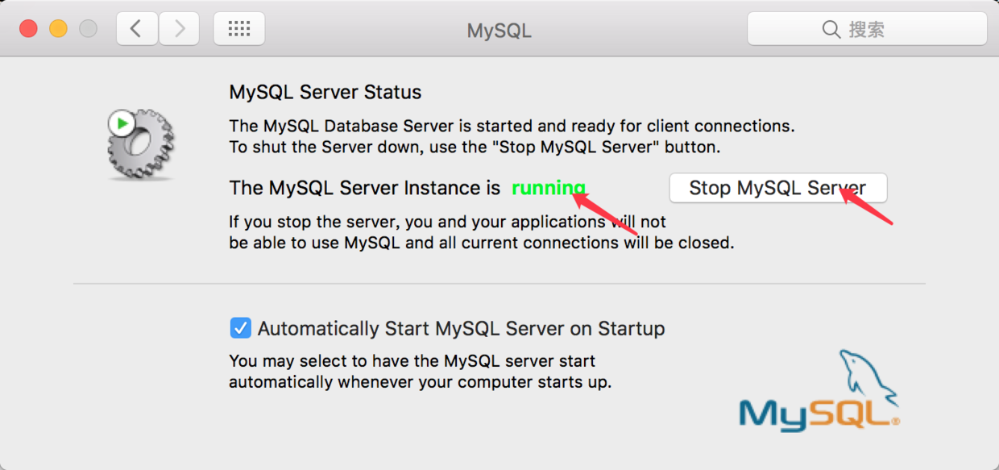


之后我们用Navicat连接一下MySQL

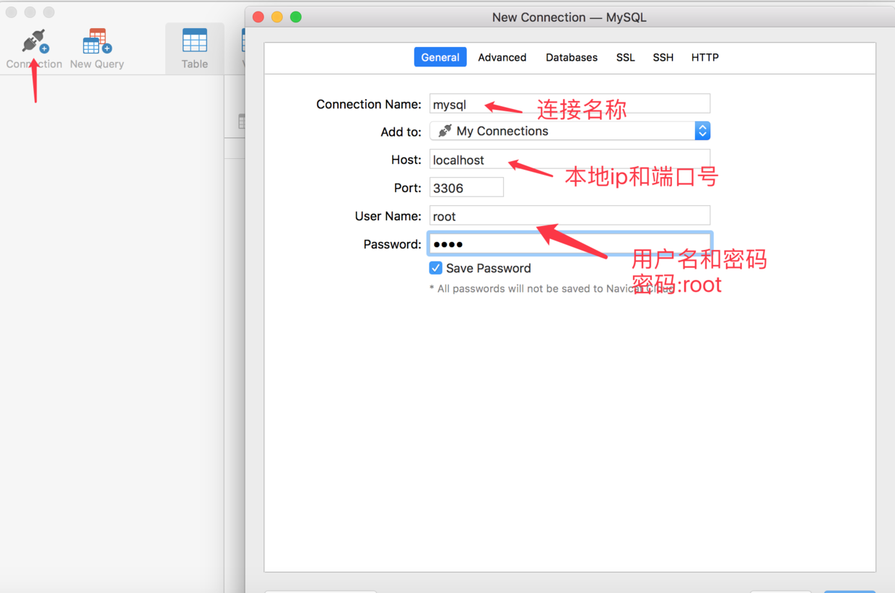


然后我们会发现无法连接数据库
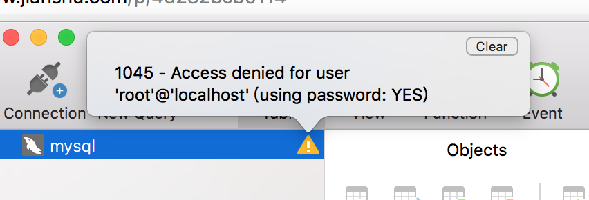

###上面的提示说密码不对 因此我们需要重新设置数据库密码

#三.修改数据库密码

###1.首先关闭数据库
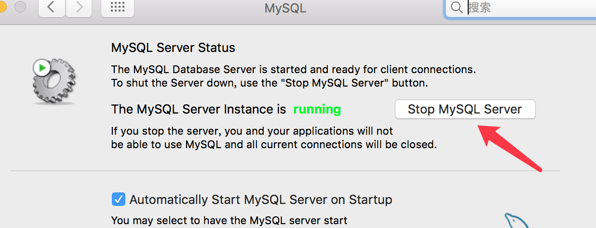

###2.使用安全模式启动数据库
```
sudo /usr/local/mysql/bin/mysqld_safe --skip-grant-tables
```
安全模式启动成功如下图
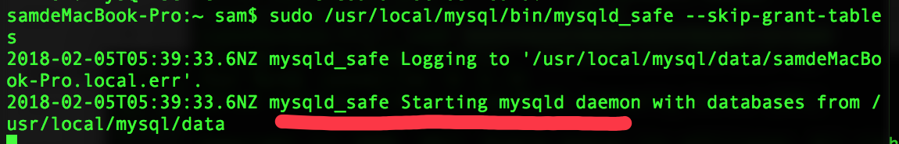


###3.打开一个新窗口登陆MySQL
```
/usr/local/mysql/bin/mysql -u root
```
登陆成功如下图
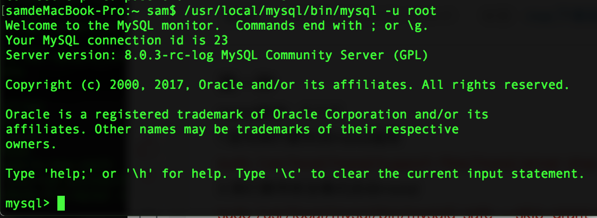


###4.修改数据库密码 密码为`234` 可以自行修改
```
UPDATE mysql.user SET authentication_string=PASSWORD('234') WHERE User='root';
```

修改成功如下图
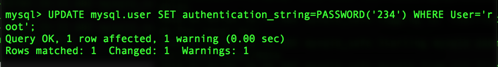
然后执行

```
FLUSH PRIVILEGES;
```

然后执行 \q 退出登录
```
\q
```

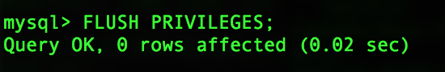


接下来我们停止MySQL服务
```
sudo /usr/local/mysql/support-files/mysql.server stop
```
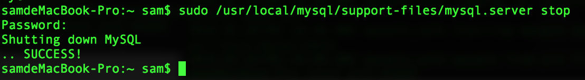


然后在偏好设置中手动启动MySQL
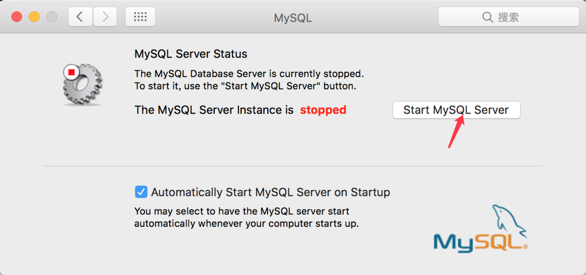

启动完成后 我们在用Navicat连接一下

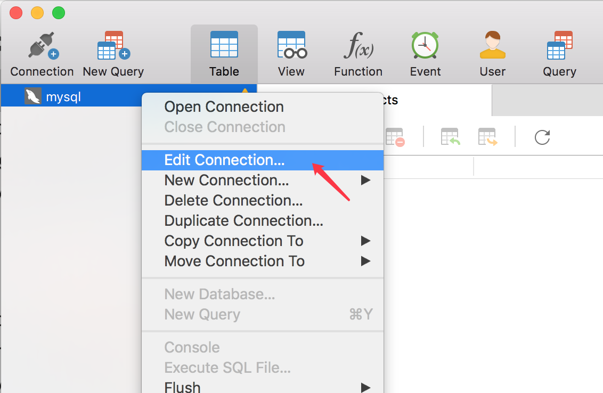


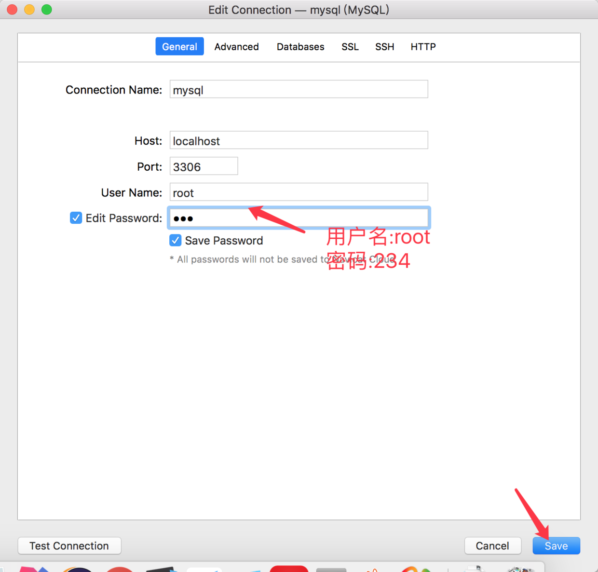


好我们发现成功了

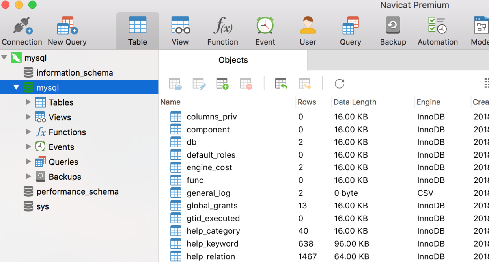


#finally enjoy it
#by objcat 2018.02.05


