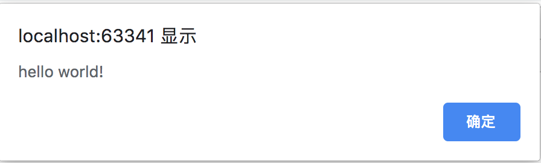
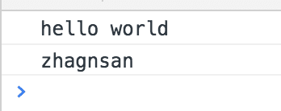

# 前言
Javascript是我们开发中比较常见的语言, 但是由于的一些特性比如, 定义过的变量还可以定义, 定义过的函数也可以定义, 并且重复之后还没有任何的错误提示, 从而导致程序中会经常会出现一些方法和变量被覆盖的错误, 为了解决这些错误程序中引入命名空间来区分不同作用域之间的函数, 但是js中并没有命名空间, 所以我们要用js中的其他特性来代替, 以解决代码中的重名问题.

# 正文
我们先看一个例子, 在浏览器环境中有个函数叫`alert("hello world!")`, 我们先看一下效果



之后我们来重写一下alert

```
function alert() {
        console.log("hahah i am alert");
}
```

我们发现原来的`alert`就被覆盖了, 而且没有任何错误提示或警告, 这在程序中经常会导致莫名其妙的错误, 接下来我们就着手开始优化代码, 让代码不那么容易重复.

**方法1:使用对象来解决问题**

```
var _person = {};
_person.name = 'red';
_person.say = function say() {
    console.log("hello world");
};
window.person = _person;
```


```
<script>
    person.say();
    console.log(person.name);
</script>
```

输出结果:



由于js中可以动态添加对象的成员和function所以我们利用这个特点来把函数封装起来, 这样就不太容易重复, 但是这么写多多少少也有些问题, `_person`是暴露在大庭广众之下的, 我们来给他添加一个作用域.

```
(function () {
    var _person = {};
    _person.name = 'zhagnsan';
    _person.say = function say() {
        console.log("hello world");
    };
    window.person = _person;
})();
```

我们使用下面写法来包裹一点代码, 这样就不会出现变量重名的问题了, 因为这个变量只活在自己的作用域中.
```
(function () {
   // your code
})();
```

这个东西在js中叫做`立即执行函数`, 举个例子


我们想要执行一个函数需要这样
```
function haha() {
    console.log(666);
}
haha();
```

我们用立即执行函数就可以这么写
```
(function () {
    console.log(666);
})();
```

由于函数都有自己的作用域, 所以在这里面的变量不用担心被覆盖的问题, 这也就是变相的实现了命名空间, 其实说白了就是创建了个对象, 让它去执行你要完成的功能, 这比暴露在大庭广众之下要好吧!

**方法2:使用函数来解决问题**

```
(function () {
    var _person = function () {};
    _person.prototype.name = 'lisi';
    _person.prototype.say = function () {
        console.log("hello world");
    };
    window.person = new _person();
})();
```

函数有个叫做`prototype`的属性, 可以动态的添加成员变量和方法, 所以也不会造成命名冲突的问题, 只要把对象起一个不常用的名字可以在很大程度上避免明明冲突问题, 如有错误请在留言中指出, 我会在第一时间修正.


# finally enjoy it
# by objcat 2019.03.28


