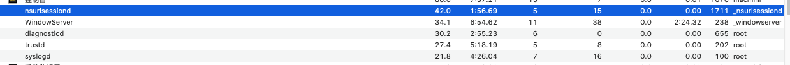
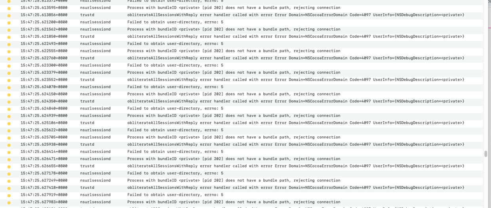
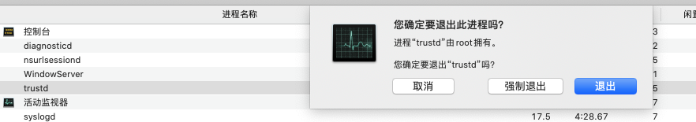

# 一.问题
由于苹果iCloud的Bug导致了死循环, 机器不断发热, 非常卡顿, 活动监视窗如下所示


我们可以在系统log中看到死循环



# 二.解决方案

### 1.在应用中选择


### 2.直接强制结束trustd



参考原因
```
Hi all,

I found the rout of the problem on my computer but everything was already backuped for a clean new install so I did it anyways. For me the problem came always back, also after I locked out of iCould or changed user accounts.
It seemed like a currupted keychain of icloud in the keychain manager caused trustd and nsurlsessiond to loop.
Go to the keychain acess and check if there are any corrupted (red) keys and delete them. After this everything was back to normal
```
```
大家好，

我在我的电脑上发现了这个问题的根源，但所有的东西都已经备份好，可以重新安装了，所以我还是做了。对我来说，这个问题总是会回来的，也是在我锁定了iCould或更改了用户帐户之后。

在密钥链管理器中，icloud的一个中断的密钥链似乎导致trustd和nsurlsessiond循环。

转到keychain acess并检查是否有任何损坏的（红色）密钥并将其删除。之后一切都恢复了正常
```


参考文章
https://forums.macrumors.com/threads/nsurlsessiond-process-going-crazy-on-catalina.2228994/?post=28372188#post-28372188
