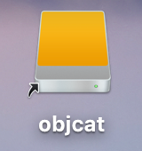

#一.前言
由于微软的版权Mac原生并没有开启NTFS读写，所以在读取NTFS格式U盘和移动硬盘时是很伤的，下面这个方法可以开启Mac上NTFS的读写，不需要借助第三方软件进行操作，非常方便，下面跟着我们的镜头一起来看吧。
#二.教程
1. 修改你的移动硬盘名称为一个英文或好辨认的名字。。。比如我的叫objcat


2. 打开fstab文件
```
sudo nano /etc/fstab
```
3. 写入文字  `注意objcat需要换成你的硬盘名`
```
LABEL=objcat none ntfs rw,auto,nobrowse
```
4. 重启吧兄弟！
重启后会发现硬盘识别不了，别担心在终端输入如下命令即可
```
sudo ln -s /Volumes/objcat ~/Desktop/objcat
```
####别忘了把objcat换成你的硬盘名
###别忘了把objcat换成你的硬盘名
##别忘了把objcat换成你的硬盘名
#重要的事情说三遍

>旋即在桌面上就会看见一个硬盘，存个东西试试吧。


#最后尽情享受使用NTFS存东西的感觉吧。


