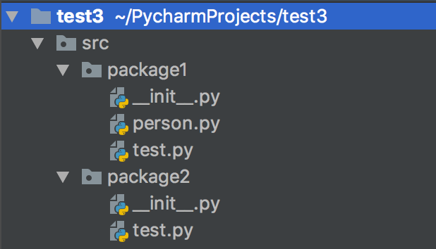
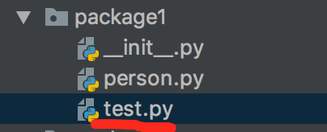
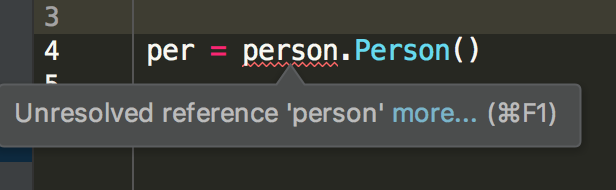
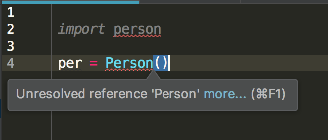
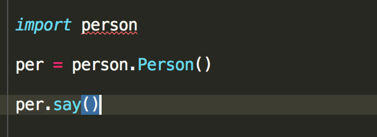
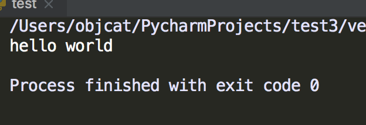
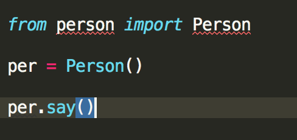
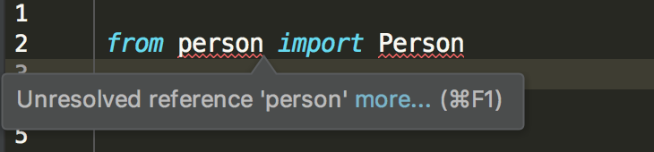
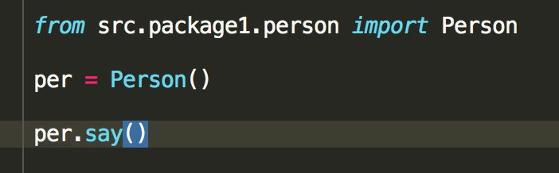
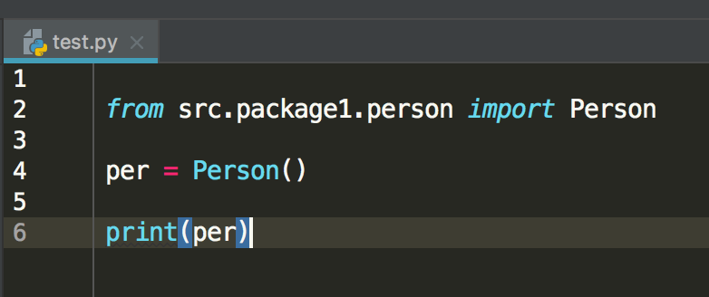

# 前文
最近玩了玩python, 结果发现文件引入与我经常写`objective-c`中完全不同, 有点难用, 但是仔细想了想, 这种引入思想还是有点道理的, 为了避免后人踩坑, 所以这里记录一下.

# 正文
我使用的环境是`pycharm`目录结构是这样的



我们可以看到项目名是`test3`, 然后是一个叫`src`的包, 包里面有一个`package1`和一个`package2`, `__init__.py`都是空的, `test.py`是我们测试代码用的.

`person`是我的自定义类
```
class Person():
    def say(self):
        print('hello world')
```

**开始表演:**


> 1.在包`package1.test`中引入person类






直接这么写是报错的, 很明显没有引入Person类



这么引入也不对? 按理说同级目录这么引入应该没问题, `person.py`装着`Person`类呀, 经过反复尝试我发现一种方法可以写的通





我们可以看到, `person类`其实是被当做了一个文件对象引入进来的, 你想使用`person`中的`Person`必须用`.`来引用, 但是这么使用我们还是觉得很不习惯, 所以可以换成另一种引用方法




运行一下仍然可以成功的, 这里是直接引入`person`文件中的`Person`类, 使用`from`+`文件名`, 使用`import`+`类名`, 只有这样才可以直接在当前文件中使用`Person`类.


那么到这里, 还是会存在一个问题, 不知道你是否注意到了, 上面引入文件会有报错呢?  




对此我也是很头疼, 目前发现唯一的解决方案就是使用完整路径来引入, 这可能是`IDE`的bug, 下面我们就改写成完整路径的版本



我们可以清晰的看到, 如图这样的写法是被编译器所允许的, 很好理解, 以项目为根目录(省略), 逐步爬到下面的每个包, 如果不理解可以自己写一写.

然后下面我们来写一下跨包的引用, 这个其实跟这个原理是一样的

比如我们在`package2.test.py`文件中引入`person`



直接使用完整路径即可, 到这里所有问题都解决.

留一道练习题吧, 我现在又不想直接引入`Person`类了, 我想使用`person.Person()`来实例化对象, 那么我要怎么引入呢?

# finally enjoy it
# by objcat 2019.03.26


