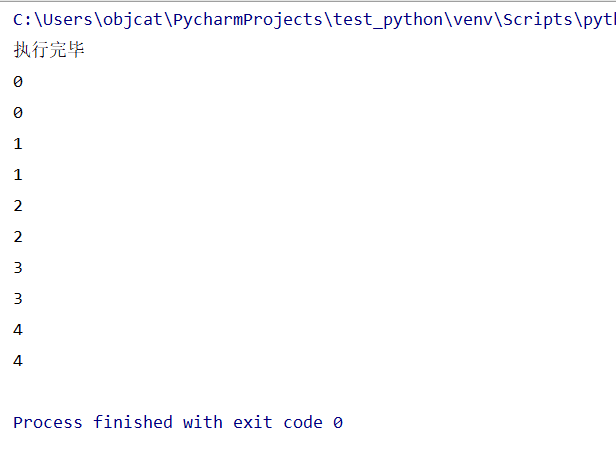

最近玩了玩python 写了个爬虫来爬泊学的视频 但是发现单线程下载视频太慢 所以想用多线程来并发下载视频 然后在网上找了半天多线程 看了很多文章 说的东西都不对 照着做并没有达到自己想要的效果 所以这里写个文章来记录一下

我们接下来用一个鲜明简洁的例子来实现Python中的多线程
废话不多说了 直接上代码
```
# coding: utf-8
# author: objcat

import threading
import time

# 写个循环方法 都明白对吧
def loop():
    for i in range(5):
        time.sleep(1)
        print(i)

# 写个类继承threading.Thread重写run方法
class MyThread(threading.Thread):
    # 在run方法中做你自己想做的事
    def run(self):
        loop()


if __name__ == '__main__':
    # 在主线程中直接开出俩子线程 这两个子线程会同时进行任务
    t1 = MyThread().start()
    t2 = MyThread().start()
    print("执行完毕")
```


下面来看打印结果



我们会发现:
1.执行完毕这个打印是在程序的末尾 但是最先执行 -> 可以看出来程序不是按照顺序执行的 这就是多线程!
2.我们发现两个循环是同时进行的 0 0 1 1 2 2 -> 也可以看出来程序不是按照顺序执行的  这就是多线程!

>结论 由此可证明程序是异步非阻塞进行的 这就是Python中最简单的多线程的运用. 

