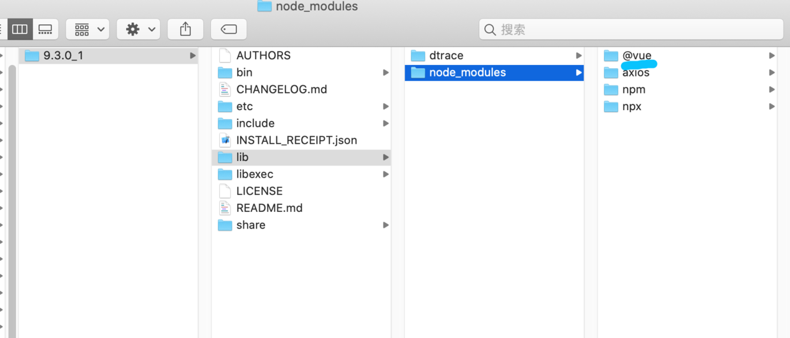

# 一.发现问题
今天又心血来潮研究了一下`vue`, 突然发现自己的`vue`版本很老, `vue -V`后显示`2.9.3`, 所以打算更新一下, 根据网上的更新教程
```
npm install @vue/cli -g
```
发现更新完毕之后还是 `2.9.3` 故事从此开始

之后我开始研究怎么卸载`vue`, 找到了毒瘤目录
```
/usr/local/lib/node_modules/vue
```
我把这个`vue`目录删掉后打`vue`就会提示找不到命令了
```
zsh: command not found: vue
```
这很正常 然后重新安装
```
npm install @vue/cli -g
```
安装之后发现仍然找不到命令...

# 二.解决方案
#### 直接掰饽饽说馅, 不墨迹!
> 导致错误的原因可能就是node的目录不知道什么原因被系统更改了
所以我们要配置新的node的环境变量 (至少我是这样的...)

首先找到新的node目录
```
/usr/local/Cellar/node/9.3.0_1
```

然后修改`~/.bash_profile`

```
# 使用Xcode打开 你也可以用别的打开 比如 vim ~/.bash_profile
open -a xcode ~/.bash_profile
```

加一行
```
export PATH="$PATH:/usr/local/Cellar/node/9.3.0_1/bin"
```

加完在命令行执行(让命令生效)
```
source ~/.bash_profile
```

之后我们输入vue 就发现可以使用了
```
Usage: vue <command> [options]

Options:
  -V, --version                              output the version number
  -h, --help                                 output usage information

Commands:
  create [options] <app-name>                create a new project powered by vue-cli-service
  add [options] <plugin> [pluginOptions]     install a plugin and invoke its generator in an already created project
  invoke [options] <plugin> [pluginOptions]  invoke the generator of a plugin in an already created project
  inspect [options] [paths...]               inspect the webpack config in a project with vue-cli-service
  serve [options] [entry]                    serve a .js or .vue file in development mode with zero config
  build [options] [entry]                    build a .js or .vue file in production mode with zero config
  ui [options]                               start and open the vue-cli ui
  init [options] <template> <app-name>       generate a project from a remote template (legacy API, requires @vue/cli-init)
  config [options] [value]                   inspect and modify the config
  outdated [options]                         (experimental) check for outdated vue cli service / plugins
  upgrade [options] [plugin-name]            (experimental) upgrade vue cli service / plugins
  info                                       print debugging information about your environment

  Run vue <command> --help for detailed usage of given command.
```

然后我们检查一下vue-cli的安装路径(如果里面没有@vue证明没有安装成功)



# 三.FAQ

> 1.重启终端配置就失效

这个问题可能是由于安装了`ohmyzsh`导致的, 终端启动后就不会执行`~/.bash_profile`了取而代之的是`~/.zshrc`, 所以新打开的终端仍然会找不到命令

解决方案是在`~/.zshrc`中添加一行命令(作用是在开启终端的时候执行`~/.bash_profile`)
```
open -a xcode ~/.zshrc
```
添加命令
```
source ~/.bash_profile ~/.bashrc
```
然后重启终端就可以了

# finally enjoy it
# by objcat 2019.11.21


