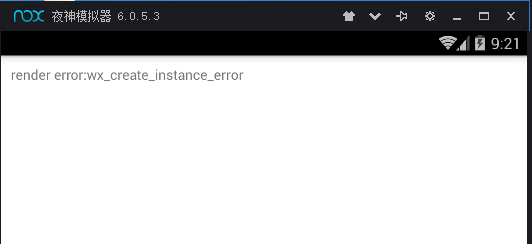
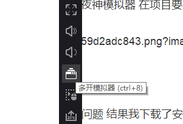
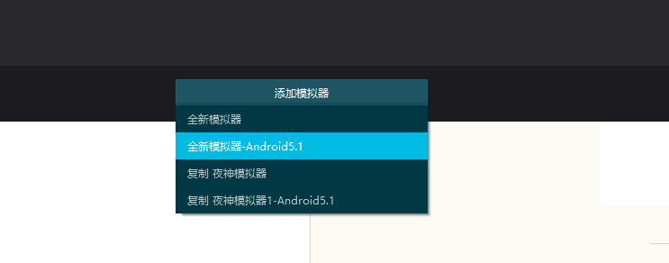
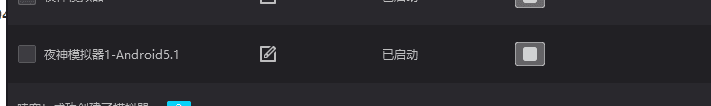
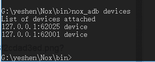
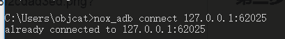
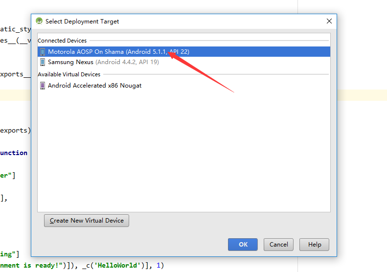
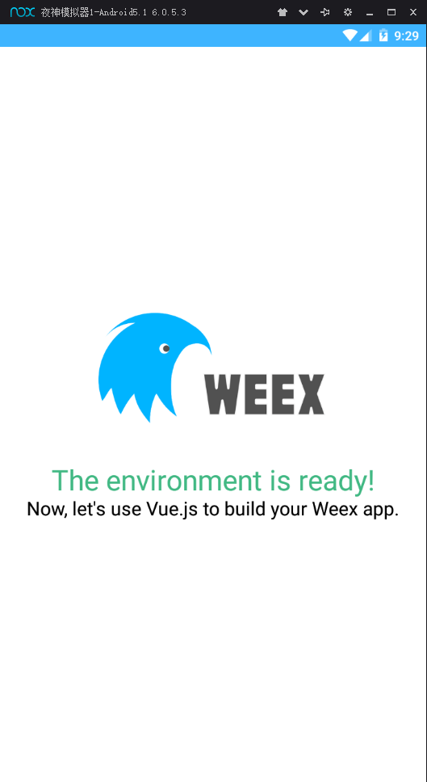

最近玩了一下weex在费了九牛二虎之力配置完Android Studio 并且连接了夜神模拟器 在项目要跑起来的一瞬间 TMD给我出了个白屏 上面一行错误提示:



在网上查了一圈  没有能解决该问题的 所以就想了一下 是不是模拟器版本问题 结果我下载了安卓官方模拟器顺利解决问题, 但是有人可能会问 夜神不行么? 

#我这里统一回答一下: 夜神可以并且牛逼的很!!!

跟着我们的镜头一起来看吧

##第一步 在夜神打开多开器



##第二步 添加5.1夜神模拟器

选择完毕会开始下载

##第三步 启动模拟器


##第四步 打开控制台 进入夜神模拟器根目录使用nox_adb连接android studio

查看设备
```
nox_adb devices
```



连接android studio
```
nox_adb connect 127.0.0.1:62025
```



到这一步就连接成功了

然后我们查看一下模拟器




然后我们跑起来




好的大功告成 


#finally enjoy it.
#by objcat 2018.3.24    