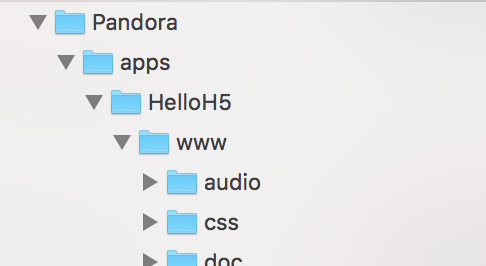
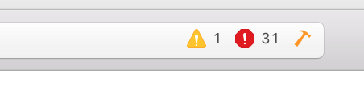
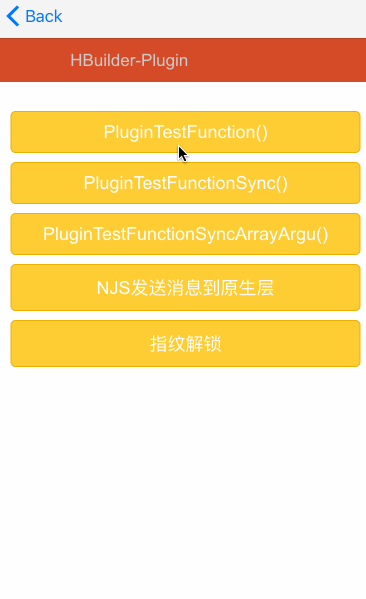
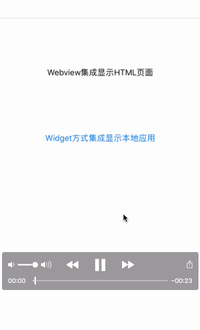
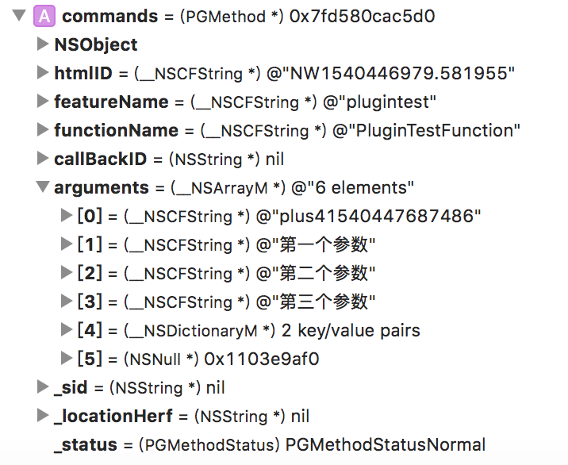

#前言

最近在研究 尝试把h5+环境单页面成到iOS端 也就是官方所说的`WebView集成模式` 但是当你照着官方文档 重新开一个新项目 把里面的静态库和系统库一个一个的导入进去 解决了所有报错问题后 你会得到一片空白 每当我看到官方文档那不严谨不规范的集成方式后 都气的浑身发抖 所以在这里写一篇文章来记录一下 因为篇幅可能比较大 我会从最基本的开始说起

#一.开始集成

在开始之前需要先准备一批网址 这里可以下载MUI官方Demo

- [MUI官网](http://www.dcloud.io/)
- [MUI集成原生应用文档](http://ask.dcloud.net.cn/docs/#//ask.dcloud.net.cn/article/83)
- [HTML5+SDK下载地址(官方demo)](http://ask.dcloud.net.cn/article/103)

####1.新建一个工程或使用已有的老工程
步骤省略.
####2.在工程中导入MUI基础静态库
静态库请前往官方网站下载iOS端的demo解压后找到`SDK` -> `Libs`在里面耐心搜索找到
```
liblibUI.a
libcoreSupport.a
liblibPDRCore.a
```
除了导入这四个基础静态库以外还需要导入一个`.bundle`文件也就是`资源文件` 可以在`SDK` ->  `Bundles`中找到
```
PandoraApi.bundle
```
接下来导入静态库的头文件(.h)
```
SDK -> inc 里面直接拖拽到项目中来
```
接下来导入页面资源 在官方demo中的`Pandora`文件夹以`folder`的形式引入 这个就是页面资源了 这里为了测试使用就都引入进来了


之后尝试`cmd+b`编译一下项目发现并没有报错
之后我们按照官方demo在AppDelegate中初始化5+环境
```
#import "PDRCore.h"

[PDRCore initEngineWihtOptions:launchOptions withRunMode:PDRCoreRunModeWebviewClient];
```
温馨提示:Xcode10的同学请在`file` -> `Project Settings`中把编译系统改成 `Legacy Build System`否则引入文件的时候没有代码提示

在编译一下发现有密密麻麻的`31`处错误


接下来就是导入系统库了 官方文档中所写的并不准确 经本人测试这些系统库可满足项目不会报错
```
libc++.tbd
StoreKit.framework
QuickLook.framework
AudioToolbox.framework
CoreTelephony.framework
MobileCoreServices.framework
JavaScriptCore.framework
MediaPlayer.framework
WebKit.framework
```
这里说明一下 因为`Xcode10`弃用`libstdc++.tbd`所以需要使用`libc++.tbd`代替
####3.修改工程配置
1.在`Build Phases` -> `Other Linker Flags` 添加 `-ObjC` 注意O和C需要大写
2.修改 `bitcode` 为 `NO` (否则你打包的时候会报错)
####4.代码部分
代码我们使用官方demo提供的示例 对应工程文件为`HBuilder-Integrate` 如果没有demo的可以在文章最开始的地方下载

首先打开 `HBuilder-Integrate` 之后注释掉AppDelegate中的`PDRCoreRunModeAppClient`所对应的这行代码或者把该枚举改成`PDRCoreRunModeWebviewClient`然后直接运行项目

看似正常的东西 我们点点看


经测试除了第四个功能可以使用 其余均有问题 而且没有任何错误提示

有的人会说 只有真机上有指纹 你真机测试一下

好跟着我们的镜头一起来看吧


没错 这就是你们看到的真机运行出来的效果 到这里你一定有几个疑问
1.为什么模拟器上和真机跑出来的效果不一样(导航栏不见了)
2.为什么官方demo会提示缺失组件

#容我吐槽一句 官方的demo质量真是垃圾的一批!!!

> 问题解决方案

好了我们从这里开始解决问题 首先我们看一下官方代码
```
- (void)viewDidLoad
{
    PDRCore*  pCoreHandle = [PDRCore Instance];
    if (pCoreHandle != nil)
    {
        
        NSString* pFilePath = [NSString stringWithFormat:@"file://%@/%@", [NSBundle mainBundle].bundlePath, @"Pandora/apps/HelloH5/www/plugin.html"];
        [pCoreHandle start];
        // 如果路径中包含中文，或Xcode工程的targets名为中文则需要对路径进行编码
        //NSString* pFilePath =  (NSString *)CFURLCreateStringByAddingPercentEscapes( kCFAllocatorDefault, (CFStringRef)pTempString, NULL, NULL,  kCFStringEncodingUTF8 );
        
        // 单页面集成时可以设置打开的页面是本地文件或者是网络路径
        // NSString* pFilePath = @"http://www.163.com";
        
        
        // 用户在集成5+SDK时，需要在5+内核初始化时设置当前的集成方式，
        // 请参考AppDelegate.m文件的- (BOOL)application:(UIApplication *)application didFinishLaunchingWithOptions:(NSDictionary *)launchOptions方法
        
        CGRect StRect = CGRectMake(0, 0, self.view.frame.size.width, self.view.frame.size.height);
        
        appFrame = [[PDRCoreAppFrame alloc] initWithName:@"WebViewID1" loadURL:pFilePath frame:StRect];
        if (appFrame) {
            [pCoreHandle.appManager.activeApp.appWindow registerFrame:appFrame];
            [self.view  addSubview:appFrame];
            [appFrame release];
        }
  
    }
}

```

我们可以看到 先初始化一个单例`PDRCore `这个东西是管理5+环境的核心组件 然后创建一个webView 也就是`PDRCoreAppFrame ` 之后添加到`self.view`上  如果使用arc模式 就是去掉 `release` `retain` 关键字就可以了 这里不一一赘述了

基本原理是这样 我们开始解决模拟器和真机跑出来效果不同的问题 (导航栏会产生缩进问题) 这里的解决方案是把导航栏设置为不透明色
```
 self.navigationController.navigationBar.translucent = NO;
```

```
#import "TestWebViewController.h"
#import "PDRCoreAppFrame.h"
#import "PDRCoreAppManager.h"

@interface TestWebViewController ()
@property (strong, nonatomic) PDRCoreAppFrame *appFrame;
@property (strong, nonatomic) NSString *url;
@end

@implementation TestWebViewController

- (instancetype)initWithTitle:(NSString *)title URL:(NSString *)URL {
    self = [super init];
    if (self) {
        self.navigationItem.title = title;
        self.url = URL;
    }
    return self;
}

- (void)viewDidLoad {
    [super viewDidLoad];
    // Do any additional setup after loading the view.
    self.view.backgroundColor = [UIColor whiteColor];
    
    PDRCore *pCoreHandle = [PDRCore Instance];
    if (pCoreHandle) {
        [pCoreHandle start];
        self.appFrame = [[PDRCoreAppFrame alloc] initWithName:@"WebViewID1" loadURL:self.url frame:CGRectMake(0, 0, [UIScreen mainScreen].bounds.size.width, [UIScreen mainScreen].bounds.size.height - 64)];
        if (self.appFrame) {
            [pCoreHandle.appManager.activeApp.appWindow registerFrame:self.appFrame];
            [pCoreHandle regPluginWithName:@"plugintest" impClassName:@"PGPluginTest" type:PDRExendPluginTypeFrame javaScript:nil];
            [self.view addSubview:self.appFrame];
        }
    }
    NSNotificationCenter *center = [NSNotificationCenter defaultCenter];
    [center addObserver:self selector:@selector(received:) name:@"SendDataToNative" object:nil];
}

- (void)received:(NSNotification *)noti {
    UIAlertController *alert = [UIAlertController alertControllerWithTitle:@"原生界面收到了通知" message:@"" preferredStyle:UIAlertControllerStyleAlert];
    UIAlertAction *determin = [UIAlertAction actionWithTitle:@"确定" style:UIAlertActionStyleDefault handler:^(UIAlertAction * _Nonnull action) {}];
    [alert addAction:determin];
    [self presentViewController:alert animated:YES completion:nil];
}

- (void)dealloc {
    [[PDRCore Instance] setContainerView:nil];
}
@end

```
注意这里指定的路径为
```
NSString *pFilePath = [NSString stringWithFormat:@"file://%@/%@", [NSBundle mainBundle].bundlePath, @"Pandora/apps/HelloH5/www/plugin.html"];
```
这个路径是官方示例中的交互demo 你可以查看该文件中的js代码来了解前后端交互需要调用的一些方法

之后我们开始解决官方demo组件丢失的问题 
上面的提示为`plugintest`模块 所以我们就从如何找回这个模块开始入手 经过一番周折 查到了官方相关的页面
http://ask.dcloud.net.cn/article/67
如果你有耐心可以自己看看 如果没有就算了 总之了一句话 使用交互之前需要先注册一下 直接上代码
```
[pCoreHandle regPluginWithName:@"plugintest" impClassName:@"PGPluginTest" type:PDRExendPluginTypeFrame javaScript:nil];
```
只有这一行代码还不够 还需要引入一个叫`PGPluginTest `的自定义类 这里强调自定义是你用任何一个新建的类都可以承担这个角色 我们搜索一下官方demo发现刚好有这个类 把它放入你的新工程 重新运行项目 发现终于可以交互了!!!

先别急着高兴 交互可以使用了 但是`NJS发送消息到原生层`在新工程中仍无法使用

所以我们需要导入相应的静态库
```
liblibPGInvocation.a
```
之后我们添加通知测试一下
```
[[NSNotificationCenter defaultCenter] addObserver:self selector:@selector(received:) name:@"SendDataToNative" object:nil];

- (void)received:(NSNotification *)noti {
    NSLog(@"原生界面收到了通知");
}
```

到这里h5+基本交互功能的web已经搭建完成了

下面我会介绍一下基础交互的方法

在上文中我已经提到了 h5+ 已经把交互的方法封装在了静态库中 我们使用的时候需要两个步骤

1. 在代码中注册交互实例
2. 在js中调用交互代码
3. 在原生自定义类中实现交互代码并处理事件

本文的交互实例名称为 `plugintest ` 负责交互的类是 `PGPluginTest ` 交互的html页面是 `plugin.html`

接下来我们打开`plugin.html`来查看具体的交互方法 我们可以查看到这样一段代码
```
plus.plugintest.PluginTestFunction
```
`plus`为5+环境的实例
`plugintest`为我们注册的交互实例
`PluginTestFunction`则是实例调用的方法

与此同时在 `PGPluginTest ` 中存在一个叫 `PluginTestFunction` 的方法
```
- (void)PluginTestFunction:(PGMethod *)commands
```

当`js`中调用该方法的同时 原生类中的方法也随着执行 你可以在这个原生类中做一些自定义操作 这就是所谓的js与原生交互

同样的交互过程中需要传递一下参数 我们把上文中的`js`补全一下 传递一些参数
```
var a = {
    "name": "第四个参数 - 名字",
    "age": "第四个参数 - 年龄"
}

plus.plugintest.PluginTestFunction("第一个参数", "第二个参数", "第三个参数", a, function (result) {
    alert(result[0] + "\n" + result[1] + "\n" + result[2] + "\n" + result[3].name + "\n" + result[3].age);
}, function (result) {
    alert(result)
});

```

这里需要说一下 官方这种交互方式支持用户自己传递4个参数 超出数量的参数会被舍弃 所以如果参数个数超过4个则可以使用`对象`的方式传递(例如代码中定义的a) 这样不仅可以节省参数空间 而且方便

我们可以看到方法中有两个`function`这两个均为异步回调 其中第一个`function `表示成功后的回调 第二个`function `表示失败后的回调

我们再回到原生`PGPluginTest `的代码中查看一下响应方法
```
- (void)PluginTestFunction:(PGMethod *)commands {
    if (commands) {
        // 异步方法的回调id，H5+ 会根据回调ID通知JS层运行结果成功或者失败
        NSString *cbId = [commands.arguments objectAtIndex:0];

        /**
         用户的参数会在第二个参数开始传回
         这里说一下 通过观察控制台可以发现 返回的arguments实际上是一个数组 无论你是否传值 都只有五个参数
         第一个参数为对调id是自动生成的
         所以用户可以控制的参数为实际上为4个 无论是否传值 均存在 若不传值 默认为 NSNull
         */
        NSString *pArgument1 = [commands.arguments objectAtIndex:1];
        NSString *pArgument2 = [commands.arguments objectAtIndex:2];
        NSString *pArgument3 = [commands.arguments objectAtIndex:3];
        NSDictionary *pArgument4 = [commands.arguments objectAtIndex:4];
        
        // 如果使用Array方式传递参数
        NSArray *pResultArray = [NSArray arrayWithObjects:pArgument1, pArgument2, pArgument3, pArgument4, nil];

        PDRPluginResult *result = [PDRPluginResult resultWithStatus:PDRCommandStatusOK messageAsArray: pResultArray];
        
        // 通知JS层Native层运行结果
        [self toCallback:cbId withReslut:[result toJSONString]];
    }
}
```

我们可以看到与js中相对应的方法中接收参数只有一个`commands` 在这个对象中 我们可以获取到传递参数的`arguments`

我们来看一下接收参数时的具体表现形式



可以看到`arguments `其实是一个数组 空间为6 我在里面传递的四个参数分别在它的 `1 2 3 4` 索引处 索引`0`所在的参数实际上是一个回调id 通过这个id可以回调到匿名的function中 索引`5` 指向一个NSNull对象 也就是说我们最多只能传递4个参数 如果再加一个参数是不会出现任何效果的 
`PDRCommandStatusOK `是代表成功的枚举 
`toCallback: withReslut: `就是回调方法 传递一个id和需要传递的内容就可以回调给js页面 withReslut参数是一个json类型的字符串 到js页面后会自动转化成js中的对象

温馨提示:在实际开发中可能并不需要那么多的参数 所以请酌情使用

```
PDRPluginResult *result = [PDRPluginResult resultWithStatus:PDRCommandStatusOK messageAsArray: pResultArray];
 [self toCallback:cbId withReslut:[result toJSONString]];
```

这两句话代码是回调一个数组 同样的你想回调一个字典对象也是可以的 如此即可 在另一面接收的result.key就可以接收到传递的值了
```
PDRPluginResult *result = [PDRPluginResult resultWithStatus:PDRCommandStatusOK messageAsDictionary:@{@"key": @"value"}];
```
到此js交互这一部分内容完结 不再一一赘述 


#二.功能拓展
经过上边的实践 我们已经可以调用最基本的交互了 h5+平台最大的特色就是可以调用封装好的原生交互 比如`相机` `二维码扫描` `系统相册` `录音播放` `调用原生界面` 等 在今后的时间里我会一一列举这些功能和导入的方式

因此学会功能拓展是非常重要的 功能拓展的思路就是
1.查看官方demo寻找需要的功能
2.导入功能所需要的静态库(需要耐心寻找)
3.使用官方实例html进行调试即可

下面我会挑选几个功能 列举一下 如何使用

##1.照相/录像
这个模块需要我们导入
```
liblibCamera.a
```
并导入系统动态库
```
Photos.framework
CoreMedia.framework
```
然后在`Info.plist`中开启拍照和麦克风权限
```
Privacy - Camera Usage Description
Privacy - Microphone Usage Description
```
然后指定路径为
```
[NSString stringWithFormat:@"file://%@/%@", path, @"Pandora/apps/HelloH5/www/plus/camera.html"]
```

运行之后发现提示`file`模块缺失  不要慌 导入下面静态库即可
```
liblibIO.a
```
运行之后发现拍照和录像都正常 但是照片和录像均无法播放 所以如果想实现在网页上播放的效果 需要自己实现点击方法 

#三.个人demo
个人demo未成品 只包含基础功能 持续更新中...
https://github.com/objcat/MUI-WebView-Demo

#finally enjoy it.
#write by objcat
#2018.10.24