#前言
打包提测是一个复杂的过程, 首先你要打包发给测试, 打包的过程三个步骤`build`, `archive`, `export`, 测试出问题后, 你再修改, 然后再重新发包, 这一流程重复10遍, 你打包的步骤就是30遍,  所以这里提供一个手动打包的方法, 可加快打包速度, 这个包仅限于`测试`使用. 不能提交到`AppStore`, 之前写过一个itunes打包的文章 不过随着itunes更新 已经很少人会回退到12.6版本进行打包了 所以特别写了此文章来科普一下app包的浅层原理.

#一.手动打包
#####1.配置在开发者中心下载的证书以及描述文件
注意一下请使用development证书打包（开发证书）
这里传授一个小技巧 只要填写好bundleId后 就可以直接选择你想要的描述文件 证书会自动进行匹配无需手动操作
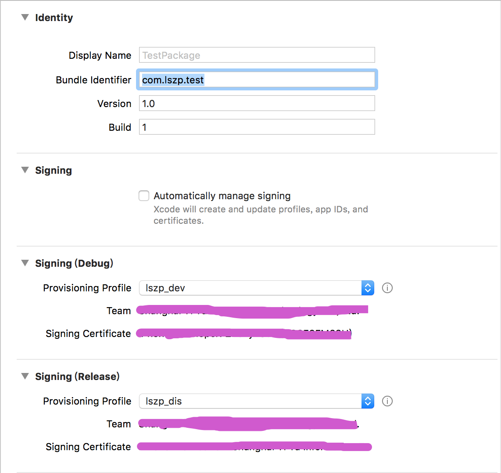


#####2.选择编译设备并编译
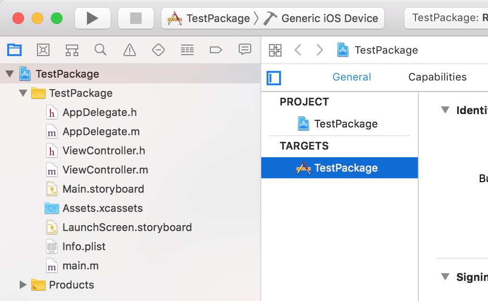


请注意一定要选择这个` Generic iOS Device`
只有这个编译出来的app是给真机使用的

编译的快捷键是 `cmd + b`

#####3.编译之后在Products文件夹中就会出现一个.app文件
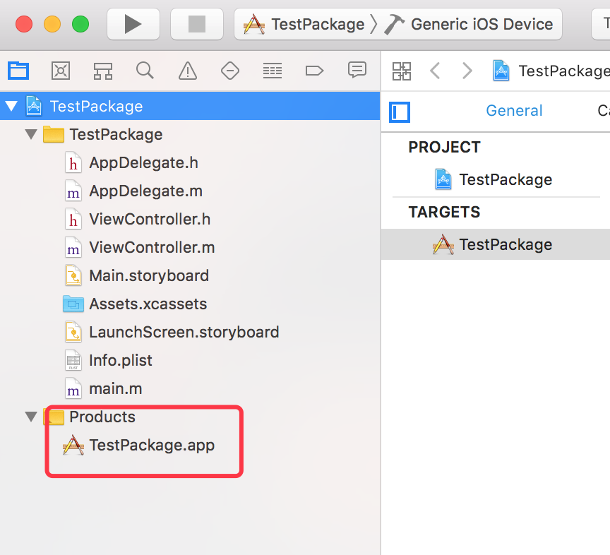


#####4.我们右键 `show in finder ` 就可以打开文件所在的目录
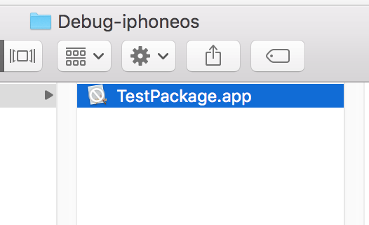

#####5.了解ipa包的目录结构
`ipa`的包结构其实很简单, 随便解压出一个打包好的`ipa`都可以看到, 就是一个`Payload`的文件夹装着一个`.app`, 而这个`ipa`还有另外一个名字`zip`, 既然知道了原理, 我们就开始打包.

#####6.开始打包

步骤为:
1.新建一个叫 Payload 的文件夹 需要一个字不差
2.把.app包放进去
3.用系统自带的zip压缩成.zip文件
4.把.zip后缀改成.ipa

上面的步骤你可以在`finder`里用界面来操作
不过使用命令行也同样很简单 我们来看一下

实现方法如下

```
mkdir Payload
cp -r xxx.app Payload
zip -r xxx.ipa Payload
```
注意
`xxx.app` 路径下的app名字 否则找不到文件
`xxx.ipa`  打包出来的包名 起一个即可

我们这就把命令逐行输入进去
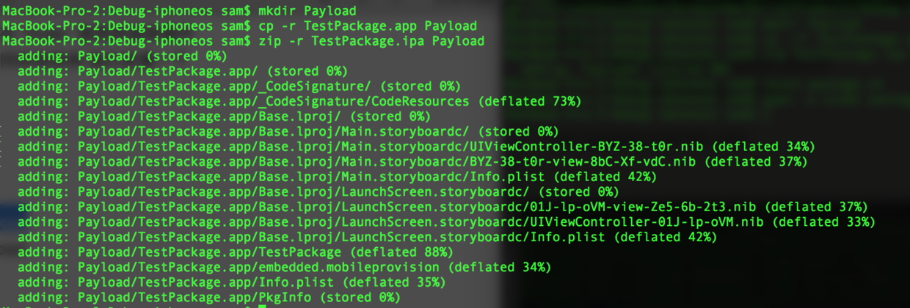


出现上面的画面就执行成功了

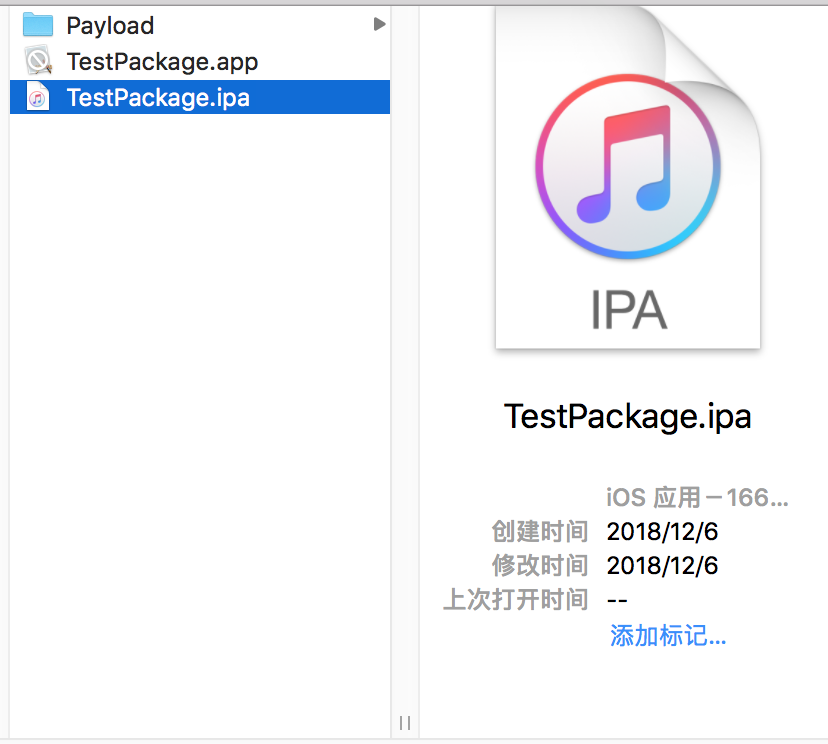

我们看一下`ipa`已经打包好了

同样的 你也可以简化一下操作步骤 把命令写成shell脚本 然后执行脚本

首先我们创建脚本

```
touch package.sh
```
然后用xcode打开
```
open -a xcode package.sh
```

然后配置好脚本

```
# 创建Payload文件夹
mkdir Payload
# 复制TestPackage.app到Payload
cp -rf TestPackage.app Payload
# 压缩Payload生成ipa
zip -r TestPackage.ipa Payload
```


然后执行我们刚开创建的脚本
```
sh package.sh
```

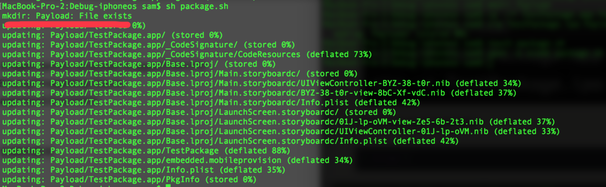


我们会遇到一个错误 上面说`Payload`文件夹已经存在了
那我们就来优化一下命令 在创建文件夹之前 先删除文件夹
```
# 删除Payload文件夹
rm -rf Payload
# 创建Payload文件夹
mkdir Payload
# 复制TestPackage.app到Payload
cp -rf TestPackage.app Payload
# 压缩Payload生成ipa
zip -r TestPackage.ipa Payload
```

如果你想直接打包到桌面的话 可以修改zip后面的路径 指定到桌面如
```
zip -r /Users/sam/desktop/TestPackage.ipa Payload
```

执行之后会在当前目录下看到ipa文件 这个文件可以直接上传 `fir或蒲公英` 进行测试了

到了这里 大功告成了！
> 如果打出来的包不能用请优先检查`证书`和`描述文件`并重新打包

#二.自动打包
手动打出来的包已经很快了 但是有些人可能还是会觉得不爽 我什么也不想做 只想编译之后就生成可以发给测试的包 下面我们来实现一下自动打包

首先我们在xcode项目配置中找到`Build Phases` 
之后点上面的加号 加一个自动执行脚本的模块
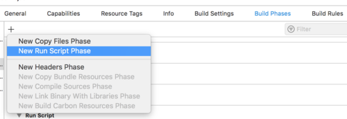

之后我们会发现 多出这样一个模块
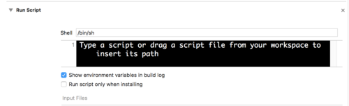

我们在下面输入框中贴入如下shell


```
# 如果是Debug环境并且目录存在
if [ "${CONFIGURATION}" = "Debug" ] && [ -d "${BUILD_ROOT}/${CONFIGURATION}-iphoneos" ]
then
# 打开工程目录
cd ${BUILD_ROOT}/${CONFIGURATION}-iphoneos
# 删除Payload避免重复
rm -rf Payload
# 创建Payload文件夹
mkdir Payload
# 拷贝app到Payload
cp -rf ${PROJECT_NAME}.app Payload
# 打包成ipa
zip -r ${PROJECT_NAME}.ipa Payload
# 打开目录
open .
fi
```

这里解释一下
`${BUILD_ROOT}` 是编译路径
`${CONFIGURATION} ` 是当前的编译环境
`${PROJECT_NAME}`  是项目名称

贴完之后是这样
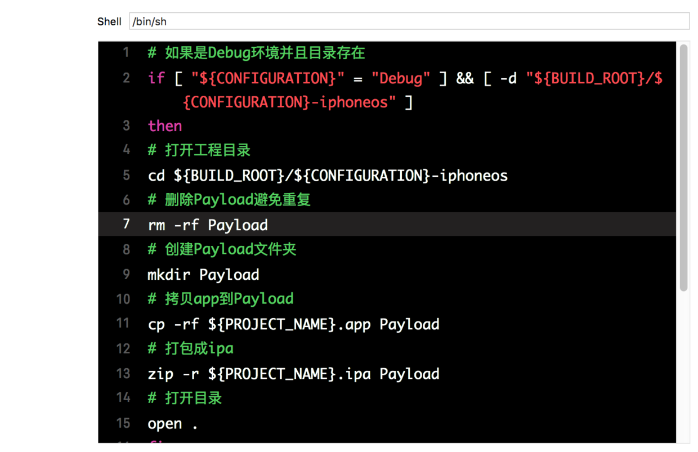

之后我们切换到Debug模式并选择设备为`Generic iOS Device` 
> 这里再次强调 这种打包方式只推荐打测试包提供测试 生产包还是用xcode原本的方式打 打包之前请自行配置证书和描述文件

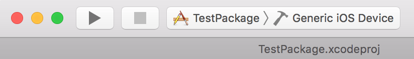

然后 `cmd + b` 编译 编译之后会自动打开编译目录 大功告成!

之后我在使用的过程中发现了一个小问题 就是清理过后的第一次打包会出现包无法签名的问题 目前我的解决方案是 编译两次 即再次使用`cmd+b`快捷键重新编译 编译出的文件会自带签名.

验证签名的方法:
######1.去`.app`中亲自寻找
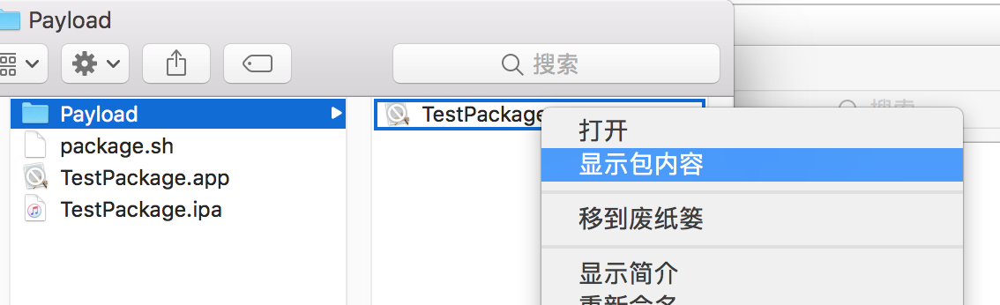

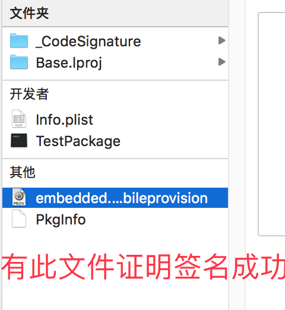

######2.上传fir进行验证
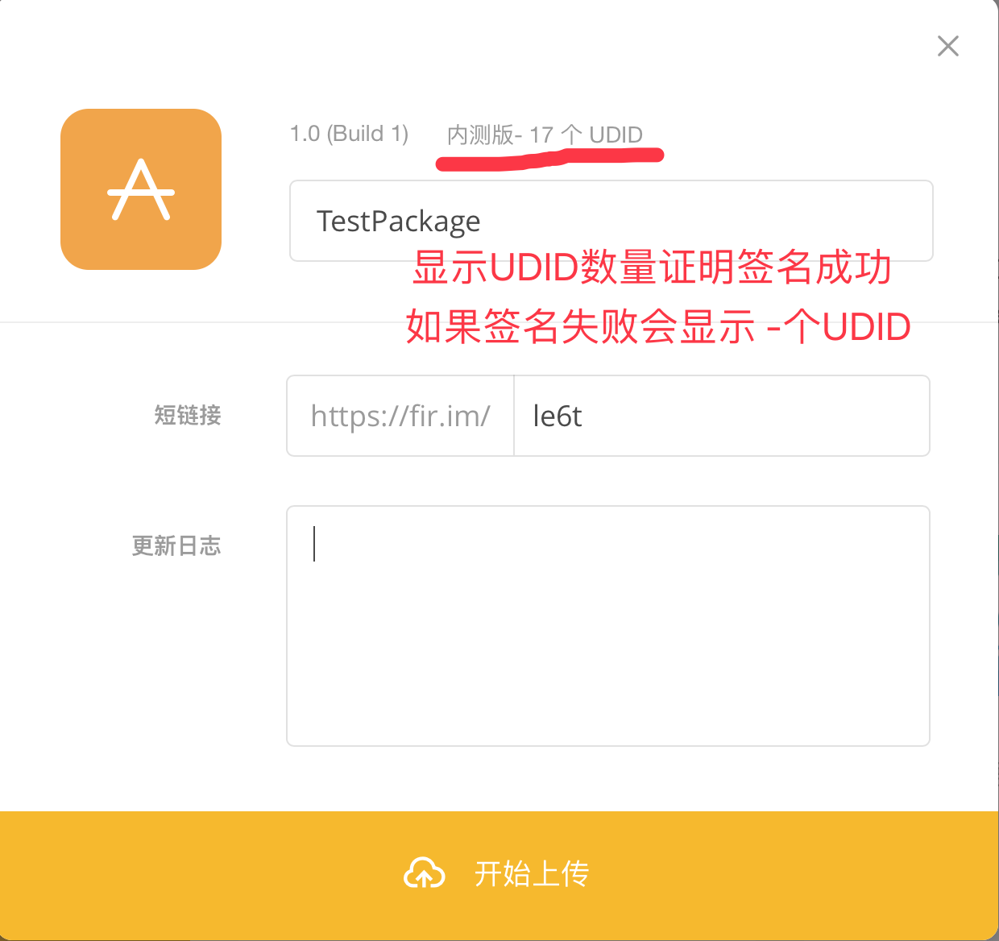


####9.FAQ

1.有些同学会问：猫哥 你的包是不是没签名呀
答：在你cmd+b编译的时候xcode就已经给做了签名了 签名的描述文件和证书都是你在第一步配置的 = =

2.如果打出来的包不能用请优先检查`证书`和`描述文件`并重新打包

3.如果检查无误还是不能用 那么这里要还是要赘述一下 开发包只能由`内部人员`使用 也就是你需要在`apple developer控制中心`中加入内
部人员设备 并重新生成`描述文件`并下载到本地 重新进行打包

4.如果上述过程都试了 还是不能用 请检查项目支持的`最低版本`

5.如何验证签名正确呢? 其实很简单 把你打出的包上传到fir只要能传上去 证明你的包一定是developer或adhoc包, 即打包的证书和描述文件并没有错误

6.如何得知签名中有你设备的id呢? 这个也很简单 在.app包上点`右键` 显示包内容 在里面找到`embedded.mobileprovision`文件 选中之后点空格 在最下方就能看到绑定的设备列表了 - -

7.有些人反映 有遇到使用`Xcode10`打包之后 在`iOS11`系统上不能显示本地图片的问题 之后我进行了测试 并没有重现 如果遇到此问题 请在下方留言给我你的Xcode版本 使用环境 和 iOS系统版本

8.如果尝试了所有方法，都操作没有失误的话，那就是苹果验证方式变了，推荐观看以下升级版文章
[iOS] 打包原理及脚本自动打包的实现
https://www.jianshu.com/p/6ea244222ee4

9.如打包出现一些其他问题 请自行阅读排查

#finally enjoy it
#by objcat 2018.09.29
######更新日志:
######2018.10.10
完善部分FAQ
######2018.12.07
优化冗余的打包代码 完善注释