#前文链接
[iOS]快速打包(仅限提测使用)
https://www.jianshu.com/writer#/notebooks/4525183/notes/34587852
#前言
9月份写了一篇- *iOS快速打包* , 广受好评, 但是它的缺点也是不言而喻, 其一就是就是打包方法`不官方`, 其二是无法应用于`AppStore`, 所以我们只用它来快速生成测试包, 这样做无伤大雅; 而本篇文章主要讲的是`Xcode`官方的打包方法, 也就是图形化操作打包背后的原理, 顺便实现一下脚本自动打包, 下面就跟着我们的镜头一起来看吧.

#一.打包原理
首先要说一下`Xcode`打包的过程, 我们写出的代码经过`llvm`进行`build`, 编译完成后会生成`.app`文件, 之后进行`Archive`归档, 然后进行`Export`导出, 这就是最基本的原理, 听起来是不是很简单, 那么我们下面就来用命令实现一个打包过程吧!

那我们可以简单总结一下步骤:

**一.编译**
**二.归档**
**三.导出**

上述就是官方的打包原理了, 接下来我们就开始逐一实现.

首先配置好你们的证书和描述文件
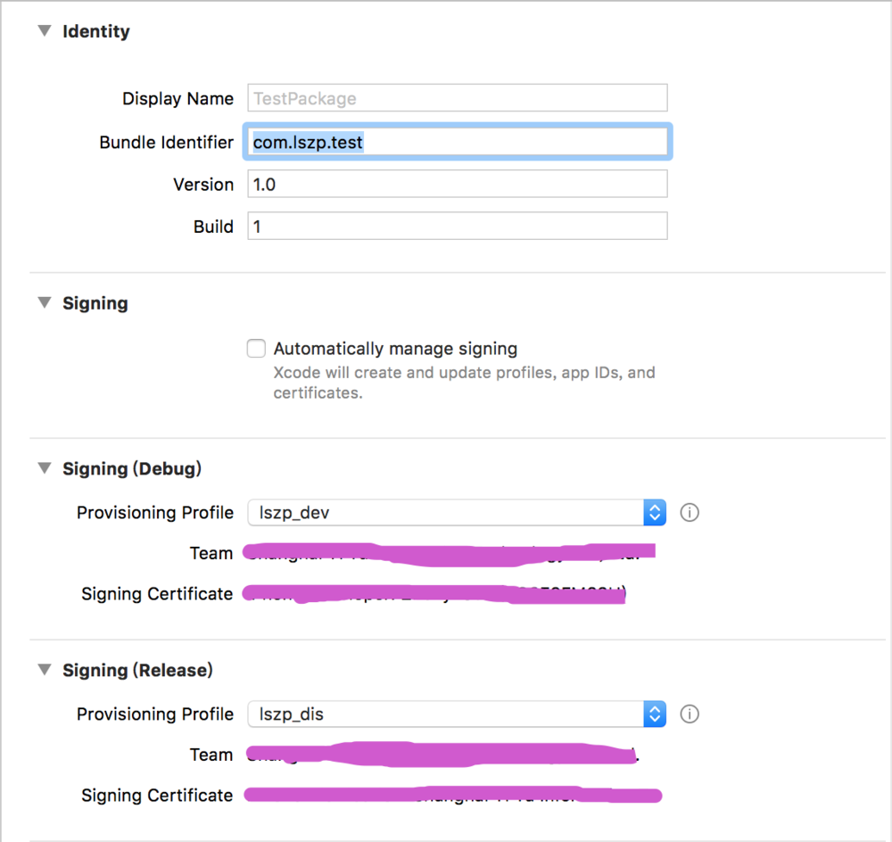


#####1.build(编译)
首先把证书和描述文件都选好, 之后执行命令`xcodebuild `, 工程文件分为两种, 不同类型的工程需要使用不同的命令, 一种是`.xcworkspace`工程文件, 我们经常使用的`cocoapods`导入依赖库后就会生成这样一个工作空间, 另一种是`.xcodeproj`也就是普通的`Xcode工程`
######workspace
```
xcodebuild -workspace "/Users/sam/Desktop/TestPackage-workspace/TestPackage.xcworkspace" -scheme "TestPackage" -configuration "Debug"
```
`xcodebuild `执行编译
`-workspace `编译基于 xcworkspace
`-scheme` 编译工程名
`-configuration` 编译环境 Debug Release

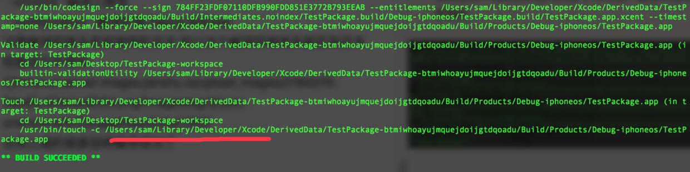

出现上面的画面说明编译成功了 如图所示可以查到到当中的编译文件生成路径 我们追过去看看吧
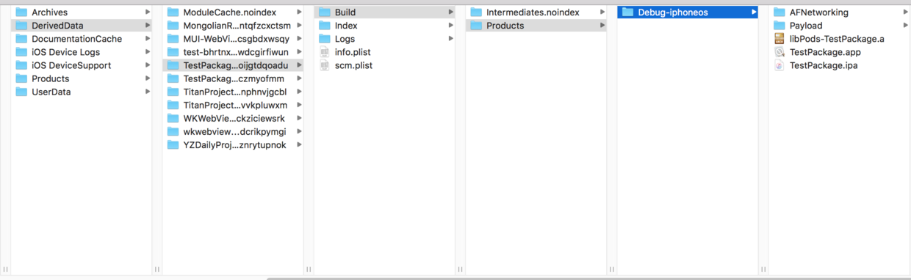

我们可以看到`.app`文件就是经过上面命令编译生成的, 证书和描述文件都记录在`TestPackage.xcodeproj `里面, 所以都是自动选择的, 我们来看一看它的签名 
**右键** -> **显示包内容**

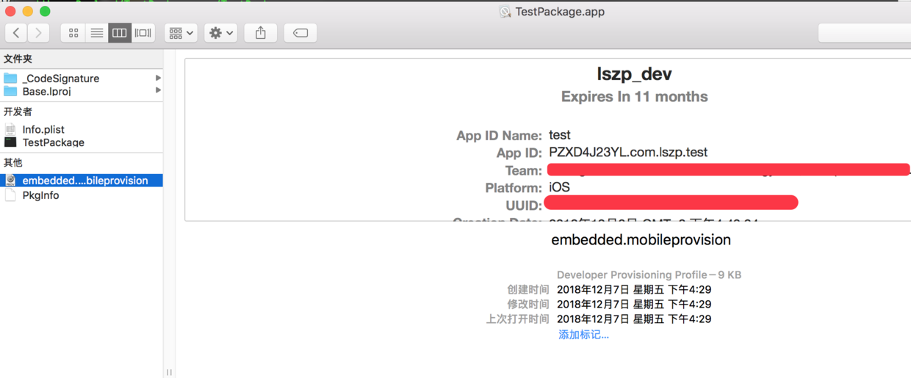

我们可以看到签名文件在这里 说明编译过程中就已经根据环境自动签名了 而且这个签名是编译器根据工程文件中配置的文件自动选择的


######xcodeproj
```
xcodebuild -project "/Users/sam/Desktop/TestPackage/TestPackage.xcodeproj" -configuration "Debug"
```
普通的xcode工程编译起来也很简单 就是把`-workspace`修改成`-project `本片文章以`.workspace`为例, 其他的自行参悟

#####2.Archive(归档)
`Archive`翻译为`存档`, `归档`, 是xcode记录打包结果的一种手段, 你有可能想不起来这个东西, 但是你认识这个么
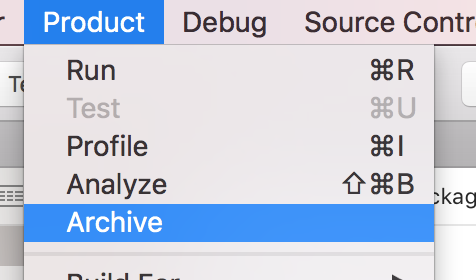
这个呢
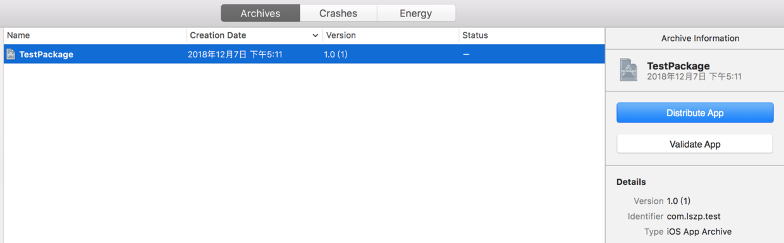

到这里你应该可以明白了, 你每次打包都会生成这么一个归档文件, 并且会以列表的形式显示出来, 这其实就是`Archive `文件, 它用来记录你的每次打包记录, 我先现在就看一看他在哪, 右键 `show in finder`
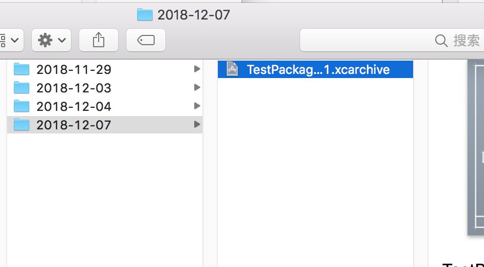


我们可以看到这个灰色图标的文件就是我们归档的包, 我们右键`显示包内容`来参观一下
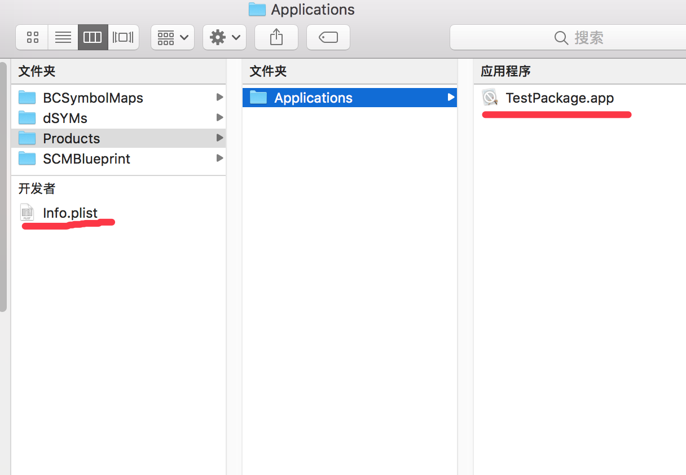

我们可以看到, 它实际上就是`.app`和`Info.plist`以及一些其他文件组成的, 你可能从来没拆过它, 但是你拆与不拆, 它还在那里... - -我们继续

之后我们就用命令来生成一个`.xcarchive`文件
```
xcodebuild -workspace "/Users/sam/Desktop/TestPackage-workspace/TestPackage.xcworkspace" -scheme "TestPackage" -configuration "Debug" -archivePath "/Users/sam/Desktop/TestPackage.xcarchive" archive
```
归档完成后就是这样
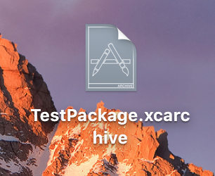

我们可以看到`归档`这个命令和`编译`差不多, 只是多了一个`-archivePath`归档路径和一个`archive`表示归档的命令

之后我们双击看看吧

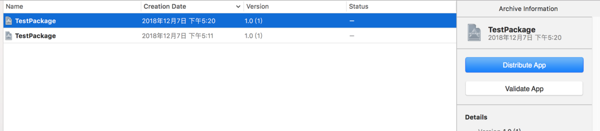

我们可以看到, 它自动加入到了我们的列表中, 到这里, 我相信你一定可以使用xcode来完成下面的导出操作了, 不过我们想要自动化构建项目一定是要用命令行来操作的, 我们继续往下看

#####3.Export(导出)
下面就是最激动人心的时刻了, 我们开始导出我们的项目
```
xcodebuild -exportArchive -archivePath "/Users/sam/Desktop/TestPackage.xcarchive" -exportPath "/Users/sam/Desktop/TestPackage_export" -exportOptionsPlist "/Users/sam/Desktop/TestPackage 2018-12-07 17-29-35/ExportOptions.plist"
```
`-exportArchive` 声明导出
`-archivePath` xcarchive文件路径
`-exportPath`导出文件夹路径 注意这里导出的并不是一个ipa而是一个文件夹
`-exportOptionsPlist` 导出配置

你可能会说前面几个参数你都懂, 但最后那个plist是什么, 怎么获取, 这个其实是最简单的, 首先你先用xcode手动导出个包 导出之后目录是这样的

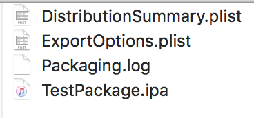

直接拷贝`ExportOptions.plist`路径拿过来用就可以了, 至于里面内容是什么, 自己去看 - -

之后执行命令 如果没有问题的话 是可以导出ipa的

好的我这里我们已经完成了所有步骤 我们接下来就用命令行导出一个`.ipa`上传到AppStore吧
1.手动操作打包获取`ExportOptions.plist`文件
2.使用打包命令来打包

我们写成一个脚本
这里可以看到 我直接使用了`archive `, 这是因为`archive `的作用是先`编译`后`归档`, 所以不用预先编译了  
```
# archive
xcodebuild -workspace "/Users/sam/Desktop/TestPackage-workspace/TestPackage.xcworkspace" -scheme "TestPackage" -configuration "Release" -archivePath "/Users/sam/Desktop/TestPackage.xcarchive" archive
# 导出ipa
xcodebuild -exportArchive -archivePath "/Users/sam/Desktop/TestPackage.xcarchive" -exportPath "/Users/sam/Desktop/TestPackage_appstore" -exportOptionsPlist "/Users/sam/Desktop/TestPackage 2018-12-07 17-43-02/ExportOptions.plist"
```

我们上传`AppStore`试试
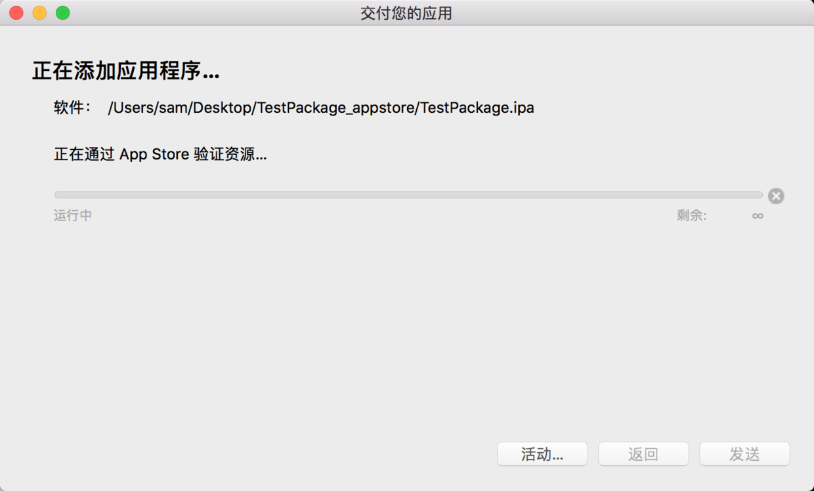

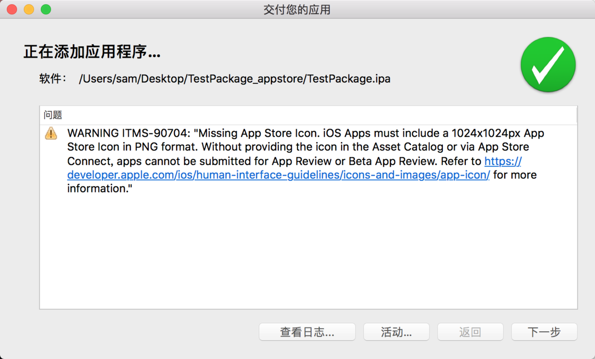

我们可以看到, 包是上传成功的, 证明这种打包方法是完全有效并且正规的.

之后我们去`AppStore Connect`查看一下吧


我们可以看到 项目已经在上面了 接下来我们就是用`TestFlight`来测试一下吧!

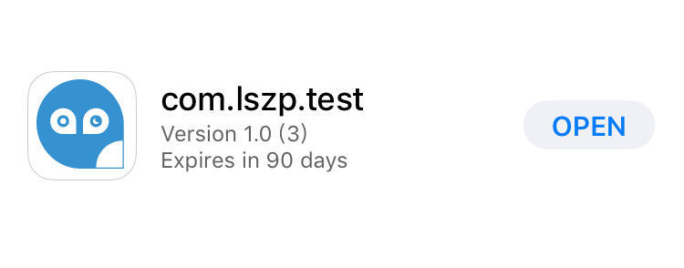


能在手机上运行可以证明这种方法是完全正确的.

之后我们对脚本进行一下优化, 试想有这样一种情况, 你有很多的app, 你不会为所有的应用都分别写一个脚本, 这样岂不是太麻烦了, 所以这里我们使用脚本传参的方式来优化一下.

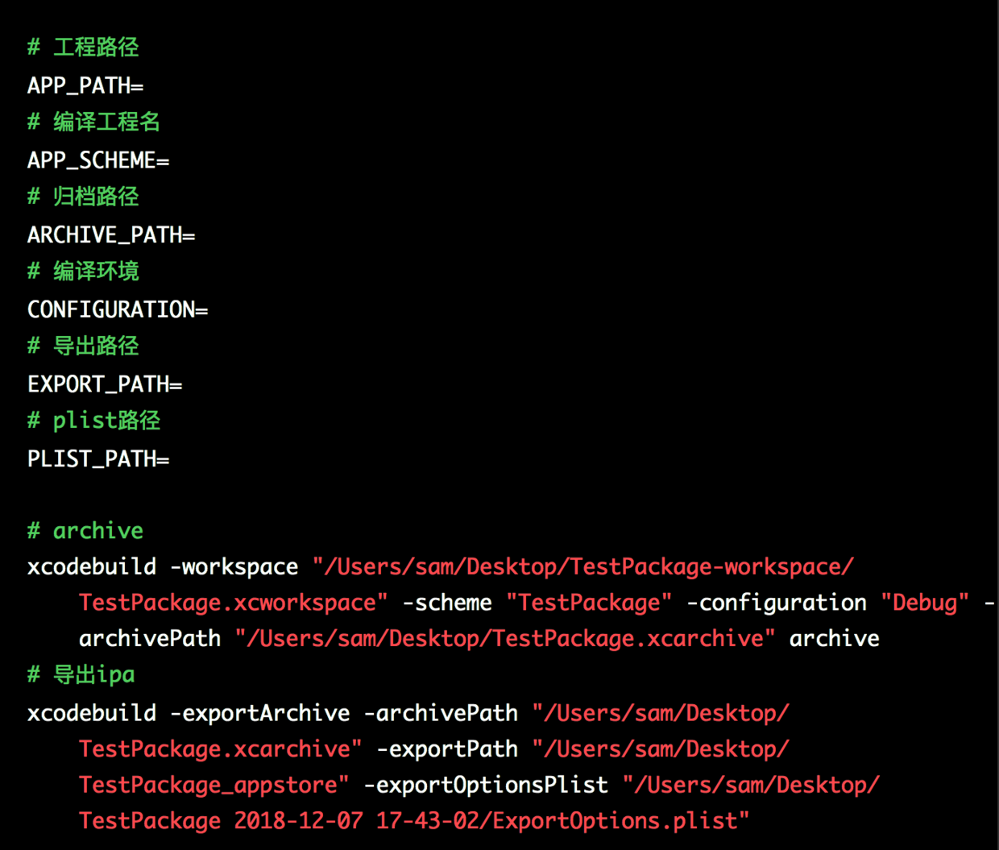


我们可以看到, 想要自动打包一个工程需要上面那些参数, 下面我们就来完善一下

```
# 工程文件路径
APP_PATH=$1
# 获取文件名与后缀 - xxx.xcworkspace
BASE_NAME=$(basename ${APP_PATH})
# 编译工程名
APP_SCHEME=${BASE_NAME%.*}
# 归档路径
ARCHIVE_PATH="/Users/sam/Desktop/${APP_SCHEME}.xcarchive"
# 编译环境
CONFIGURATION=$2
# 导出路径
EXPORT_PATH="/Users/sam/Desktop/${APP_SCHEME}_appstore"
# plist路径
PLIST_PATH=$3

# archive
xcodebuild -workspace "${APP_PATH}" -scheme "${APP_SCHEME}" -configuration "${CONFIGURATION}" -archivePath "${ARCHIVE_PATH}" archive
# 导出ipa
xcodebuild -exportArchive -archivePath "${ARCHIVE_PATH}" -exportPath "${EXPORT_PATH}" -exportOptionsPlist "${PLIST_PATH}"
```

然后运行脚本
```
sh package.sh /Users/sam/Desktop/TestPackage-workspace/TestPackage.xcworkspace Release /Users/sam/Desktop/TestPackage_ex/ExportOptions.plist
```

`$1`, `$2`, `$3`分别是命令中传递的三个参数, 之后我们运行脚本

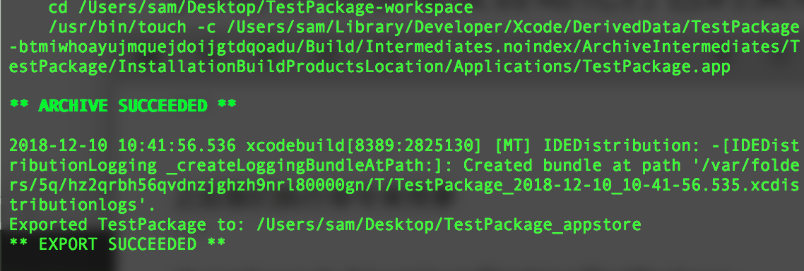

发现是可以打包成功的, 到这里已经实现了脚本自动打包了, 而且是官方正规方法, 那么接下来, 你有可能还是觉得不爽, 每次都执行这个命令行也太麻烦了! 这里提供一种解决方案使用`Alfred`的`Workflows`来执行脚本

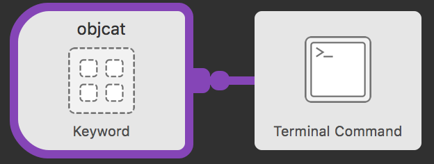

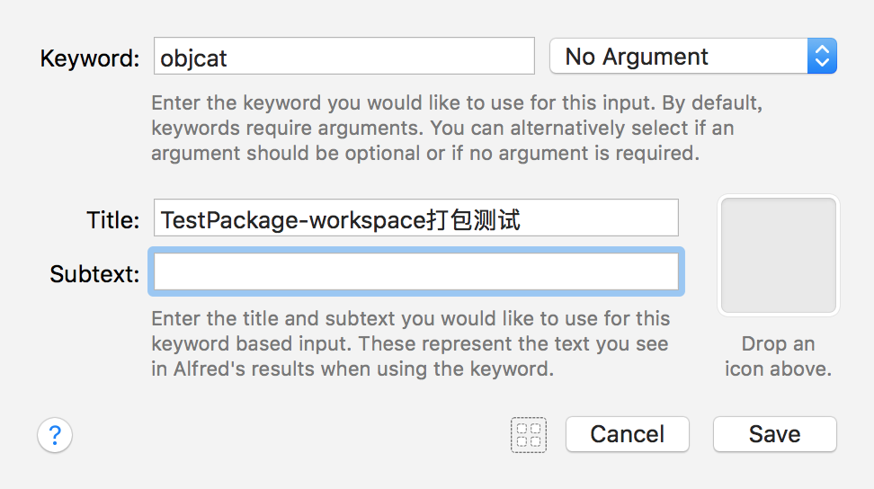

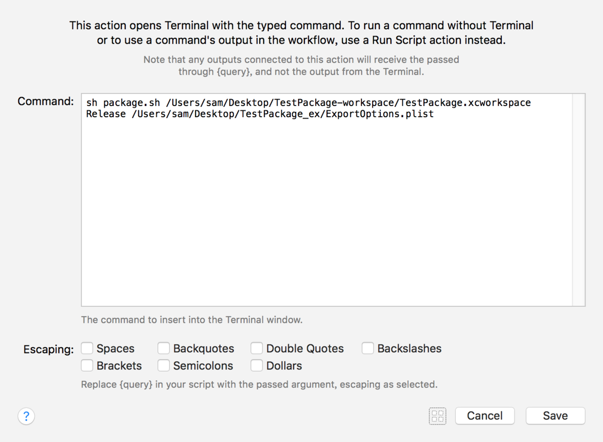

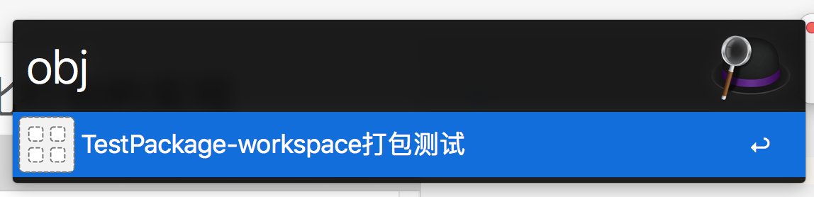


#finally enjoy it.
#by objcat
#2018.12.10


