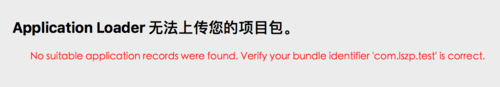
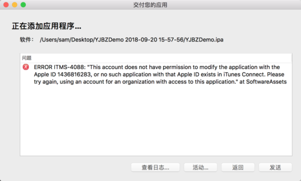

######1.No suitable application records were found. Verify your bundle identifier 'com.lszp.test' is correct.

> 问题很好解决，原因是 App Store Connect 中并没有创建上线项目

######2.ERROR ITMS-4088: "This account does not have permission to modify the application with the Apple ID 1436816283, or no such application with that Apple ID exists in iTunes Connect. Please try again, using an account for an organization with access to this application." at SoftwareAssets

>调查了好久 都没有结果 最后把的图标放进项目中就好了 看来没有logo还是不不允许上架的 = =

