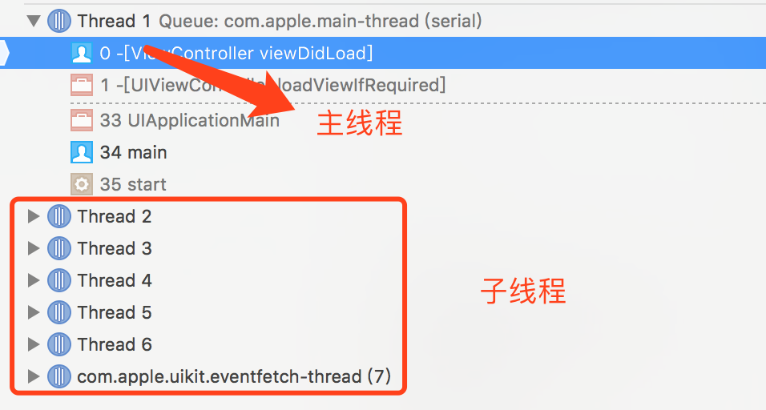
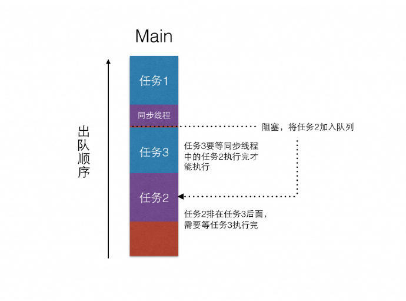
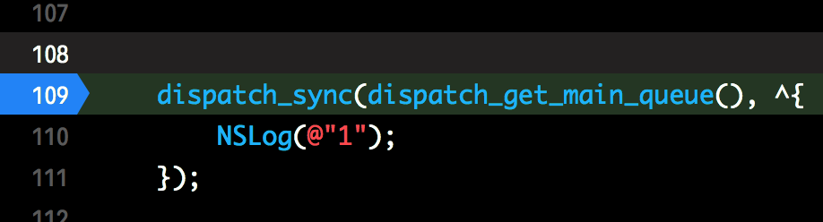

# 一.解题

今天在群里发现了一道比较有意思的题, 仔细想了一下, 还是值得深思的, 所以写出来记录一下, 以下均为本人对多线程的理解, 如果有误请留言指出, 我会第一时间进行改正.

已经有人指出了错误,  `dispatch_sync `同步调度不一定是主线程执行的, 这取决于当前的线程环境和抛入的队列, 下文中已经修复.

题干:

```
    __block int x = 0;
    __block int y = 0;
    dispatch_async(dispatch_get_global_queue(0, 0), ^{
        NSLog(@"%d", x++);
        dispatch_sync(dispatch_get_main_queue(), ^{
            NSLog(@"%d", ++y);
        });
        NSLog(@"%d", y++);
        NSLog(@"%d", x + y);
        while (1) {}
    });
```

**那么下面直接解答**

1.首先调用`dispatch_async `(异步调度)把我们的任务抛到`dispatch_get_global_queue`(全局并行队列), 这会让我们第一个`block`中的线程跳到子线程, 下文称`gq`.
2.打印`NSLog(@"%d", x++);`, 由于`++`在`x`后面, 分号结束才自增1, 所以打印出0.
3.调用`dispatch_sync `把`NSLog(@"%d", ++y);`任务同步调度到主线程队列中, 主线程会去执行该任务, 不死锁的原因是`dispatch_sync `并没有在主线程中创建, 而是在`dispatch_get_global_queue `中创建并等待任务执行结束, 由于它是子线程, 所以并不会阻塞.
4.下面就都是简单的逻辑运算了, 直到碰上`while (1) {}`死循环.

下面是答案

```
2019-03-07 15:21:14.471910+0800 [75481:2405428] 0
2019-03-07 15:21:14.476663+0800 [75481:2405369] 1
2019-03-07 15:21:14.476834+0800 [75481:2405428] 1
2019-03-07 15:21:14.476986+0800 [75481:2405428] 3
```

可能有些人对上面的子线程和主线程理解不太深刻, 这里我打印出block中的线程关系给大家看一下.

```
dispatch_async(dispatch_get_global_queue(0, 0), ^{
        NSLog(@"A --- %@", [NSThread currentThread]);
        dispatch_sync(dispatch_get_main_queue(), ^{
            NSLog(@"B --- %@", [NSThread currentThread]);
        });
        NSLog(@"C --- %@", [NSThread currentThread]);
        while (1) {}
    });
```

```
A --- <NSThread: 0x600002f836c0>{number = 3, name = (null)}
B --- <NSThread: 0x600002fd5400>{number = 1, name = main}
C --- <NSThread: 0x600002f836c0>{number = 3, name = (null)}
```

我们可以看到打印结果, 在执行`dispatch_async `后, 线程跳到了`number = 3`的子线程, 在子线程中进行同步方法的处理, 并不会阻塞主线程且阻塞子线程不会造成死锁, 所以这个理论是完全可以说得过去的.


# 二.拓展

通过上面的问题我又拓展一下关于`多线程`和`GCD`的知识, 你如果没看懂上面的解答, 不妨先了解一下基础知识.

通常上网络上对死锁的解释是


> 主线程队列是串行队列, 队列中的任务是一个执行完成后才去执行另一个, 用同步方法将任务1提交到主线程队列就会阻塞住主线程, 而这个刚提交的任务1必须等待主线程中的任务执行完毕才可以执行, 但这时主线程已经被阻塞了, 就是说要等任务1执行完成后才能去执行原有的任务, 所以双方在互相等待而卡住, 最后一个任务也没机会执行到, 就造成了死锁.

按照这种逻辑, 我也自动生成了一套自己的理解, 如果有不对的地方也请指出:

> 我认为主线程是永远都在执行任务的, 什么任务不重要, 这时候我们有一个任务要`dispatch_sync `同步抛到主线程`队列`中执行, 当我们抛进去的那一瞬间, 这个任务就捕获了主线程的控制权(或可以说成不阻塞), 但是主线程只能眼睁睁看着它却不能执行它, 因为主线程在等待之前的任务执行完毕, 这样双方都在等待主线程处理自己, 所以会造成死锁, 而我们的题目刚开始就跳到了子线程, 在子线程中等待不会捕获主线程控制权(或可以说成不阻塞主线程), 所以不会造成死锁.

**假设声明:**

这里还是要声明一点就是 `捕获了主线程的控制权` 是我自己假想出来的东西, 不真实, 没有任何依据, 只是凭空想象出这么一个东西来一定程度上的帮助理解, 如果思想不对也请指出.

##### 下面拓展一下队列的知识:

**队列的概念:**队列就跟我们排队一样, 从类型上一共分为两种串行队列和并行队列.

**串行队列**:  10个人在售票窗口买票, 中途不能插队, 任务是按照顺序进行的, 第一个执行完了才继续执行第二个一直到第10个.

**并行队列**: 10个人在10个自动售货机前买票, 同时进行, 至于谁先买完, 我们无从得知...

然后说一下`GCD`, 平时常用的调度方法包括下面两种`dispatch_sync `和`dispatch_async`下面我们就依次介绍一下.

我们首先来看一下iOS中的线程



`主线程`: 应用只有一个, 编号为1且名称为main, 在主线程中同步处理耗时任务会阻塞.

`子线程`: 应用中可能有多个, 编号不确定可能为1也可能不为1, 处理耗时操作不会阻塞.(因为发现过为1且名字不为main的线程, 所以这里还要大家来证实)

`dispatch_sync`: 翻译为同步调度, 在指定队列中同步扔进去一个任务(block), 该任务可能由主线程或子线程处理.

`dispatch_async`: 翻译为异步调度, 在指定队列中扔进去一个任务(block), 该任务可能由主线程或子线程处理.

所以在这里我结合队列总结一下, 在我们的程序中一共存在4种队列(我知道的), 分别是:

**1.主线程队列** 
```
dispatch_get_main_queue()

主线程队列是一个典型的串行队列, 里面最多只能容许一个线程来执行, 也就是主线程, 向里面插入任务, 无论是同步或异步, 该任务均由`主线程`执行, 但在主线程运行的队列中同步调度会死锁.
```
**2.全局并行队列**
```
dispatch_get_global_queue(0, 0)

全局并行队列是一个典型的并行队列.
```
**3.串行队列**
```
dispatch_queue_create("com.objcat.serial", DISPATCH_QUEUE_SERIAL);

串行队列是自己创建出的队列, 主线程队列一样, 任务也是一个一个来执行的.
```
**4.并行队列**
```
dispatch_queue_create("com.objcat.concurrent", DISPATCH_QUEUE_CONCURRENT);

并行队列是自己创建出的队列, 跟全局并行队列一样, 不同线程上的任务是一起执行的, 哪个先执行完并不一定.
```

> 所以到这里你应该会明白一个道理, 是否死锁与`线程的种类`和`调度的类型`有关, 当在主线程上同步调度任务的时候才会出现死锁.

网上还有这张图, 也给你拿来了



我们可以看到任务3卡在了任务2之前并阻塞了线程, 而任务2在等任务3, 任务3在等任务2, 所以就造成了死锁.


# 三.反思

有可能你认为刚才讲的故事不是特别通顺, 没错, 我同样认为在很多地方仍解释不通, 假如当前主线程队列中不存在任务, 我向其中插入一个任务为什么就不能执行呢? 

我尝试在死锁前面打断点来查看主线程队列中的任务




结果我发现任务是`viewDidLoad`, 证明确实有任务正在进行.

这样就可以解释通, 主线程一直在处理`viewDidLoad `的代码, 所以当我们强行插入一个任务的时候主线程队列就会因为这个任务的强行插入而转为互相等待状态因此会死锁.

# 四.参考文章
五个案例让你明白GCD死锁
http://ios.jobbole.com/82622/
彻底搞懂OC中GCD导致死锁的原因和解决方案
https://blog.csdn.net/abc649395594/article/details/48017245


