# 一.前言
最近一段时间在找工作也比较空闲, 所以又心血来潮写这一篇文章, `IJK`是B站开源的一款基于`ffmpeg`的播放框架, 那为什么要使用它呢? `iOS`自带的`AVPlayer`不香么? 答案是一定程度上来说自带的播放器很香, 但如果想要播放多种格式或者直播拉流就不能胜任了, 所以今天来讲一下这个播放器的应用.

# 二.从下载到编译再到集成
首先我们要把它下载到本地
[https://github.com/bilibili/ijkplayer](https://github.com/bilibili/ijkplayer)

```
https://github.com/bilibili/ijkplayer.git
```

没有安装`git`的自行去安装

下载完毕后我们可以看到它的目录

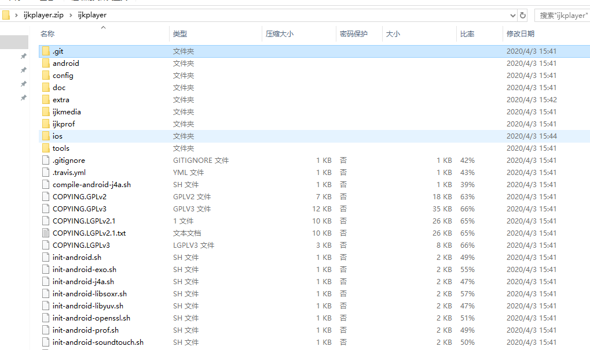


克隆完毕后 我们需要运行脚本, 脚本会自动下载`ffmpeg`到本地, 这个过程非常的漫长, 有`90%`的人都"死"在了这里, 
```
./init-ios.sh
./init-ios-openssl.sh
```
> 这里提供快速下载的解决方案, 如果你的网络不好请尝试云服务器上进行下载安装, 然后使用winscp或者filezilla移动到你本地电脑上

下载完毕后我们进入ios目录

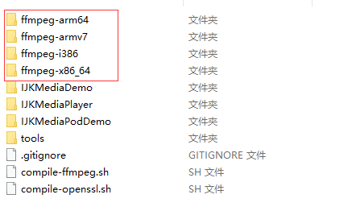

可以看到这么一大堆东西, 这些就是arm处理器下播放视频所需要的库, `armv7`, `arm64` 是指令集, 比如v7对应的机型就是`4s`, `arm64`对应的机型就是`5s, 6s`及之后的全部机型, 这里就不在过多赘述了, 接下来我们需要做的一步非常容易出错, 就是编译`ffmpeg`以提供给我们的`IJKPlayer`

首先我们要添加一句话 打开https支持

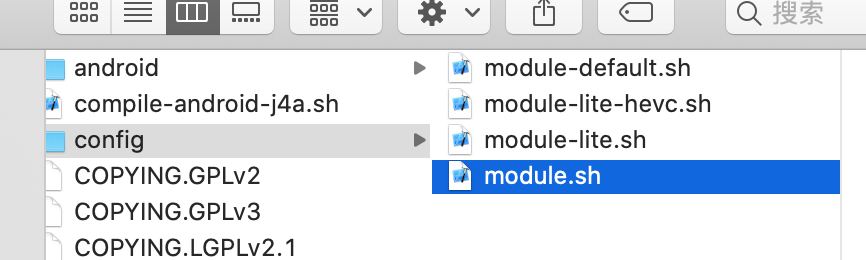

在这个文件中加入

```
export COMMON_FF_CFG_FLAGS="$COMMON_FF_CFG_FLAGS --enable-openssl"
```

然后开始编译

```
cd ios
./compile-ffmpeg.sh clean
./compile-ffmpeg.sh all
```

然后这里可能会报出一个错误

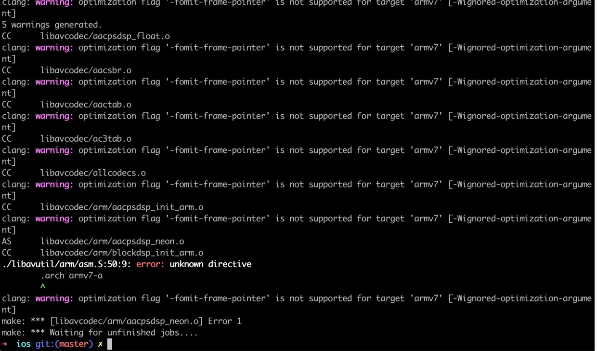

我们这里选择直接放弃32位处理器(5s及以上均为64位处理器)
所以我们修改文件 `compile-ffmpeg.sh`

```
第 24 行
FF_ALL_ARCHS_IOS8_SDK="armv7 arm64 i386 x86_64"
改为
FF_ALL_ARCHS_IOS8_SDK="arm64 i386 x86_64"
```

然后我们重新执行编译
```
./compile-ffmpeg.sh all
```

编译完成后是这个样子

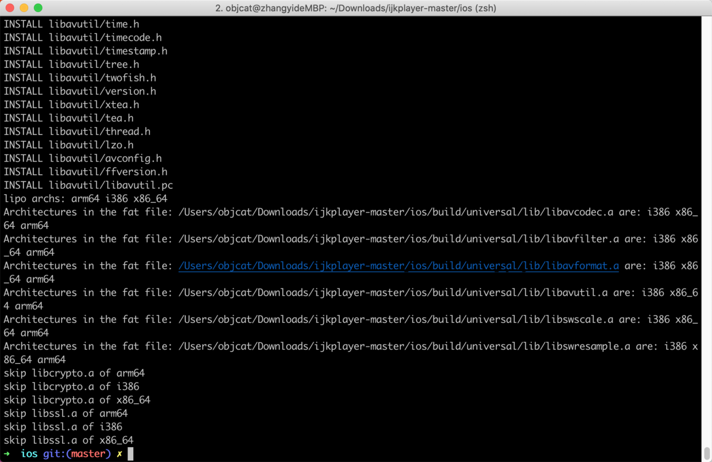

然后我们查看一下编译之后的库

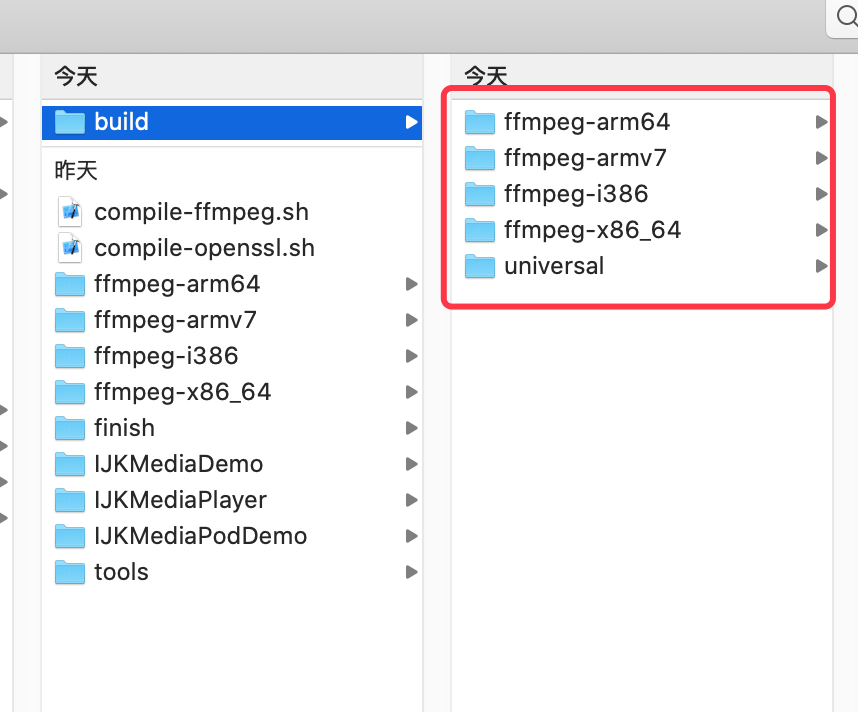

之后我们就可以进行下一步操作了 打开我们的`IJKMediaDemo`
选择好工程和设备
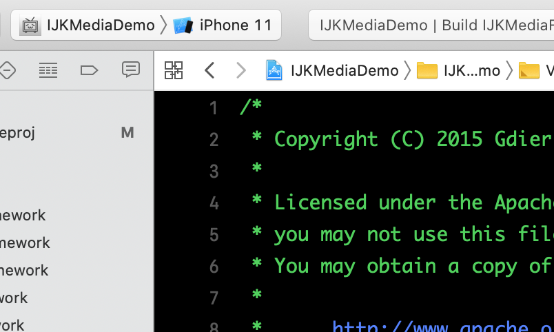

我们来运行一下 `cmd + r`

我们发现项目是可以跑起来的 视频也是可以播放的

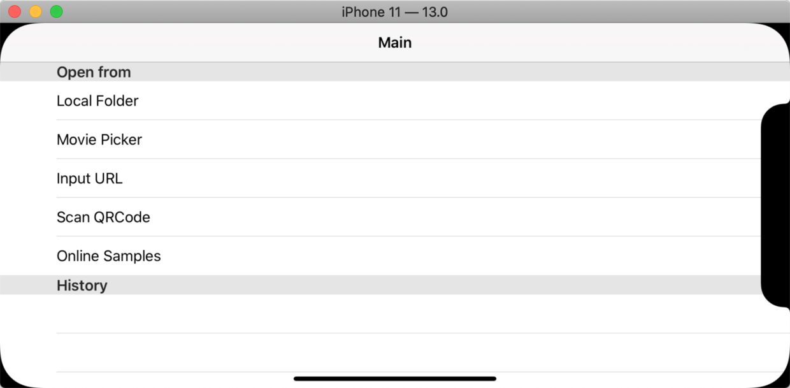

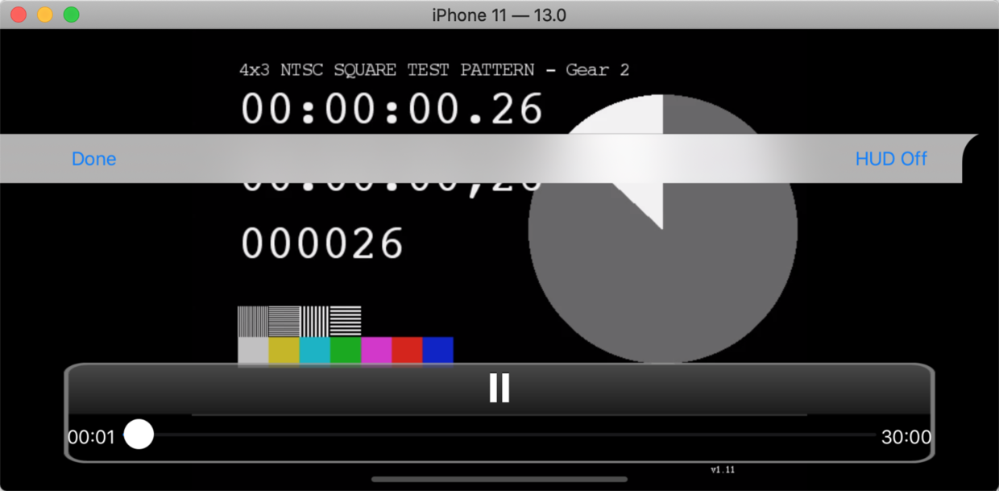


不要急 这只是我们成功的第一步 之后我们要把这个播放器集成到我们iOS项目, 这就需要把播放器打包成一个`framework`静态库

我们点击下拉列表把工程切换到`IJKMediaFramework`
然后切换成`release`模式

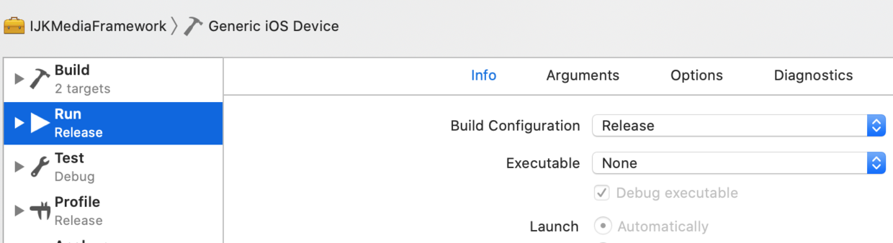

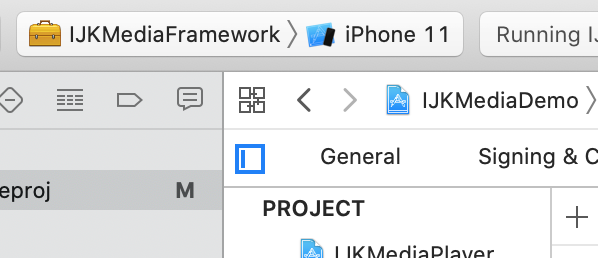

`cmd + b` 进行编译

模拟器版本的静态库编译非常成功


我们再来编译真机版本的

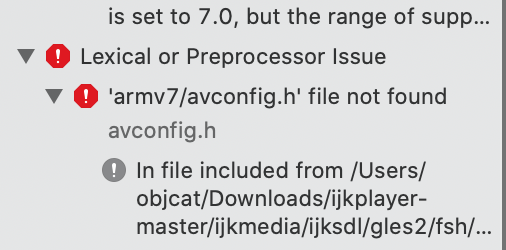

这次好像不太成功会出现这个报错, 索性我们追踪过去

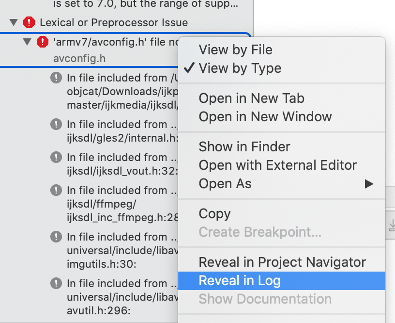

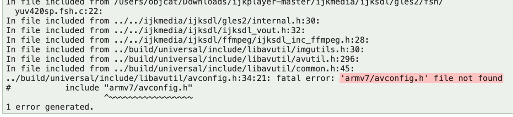

解决方案是去掉 `avconfig.h` 中的 armv7 指令集

我的路径是
```
/Users/objcat/Downloads/ijkplayer-master/ios/build/universal/include/libavutil/avconfig.h
```

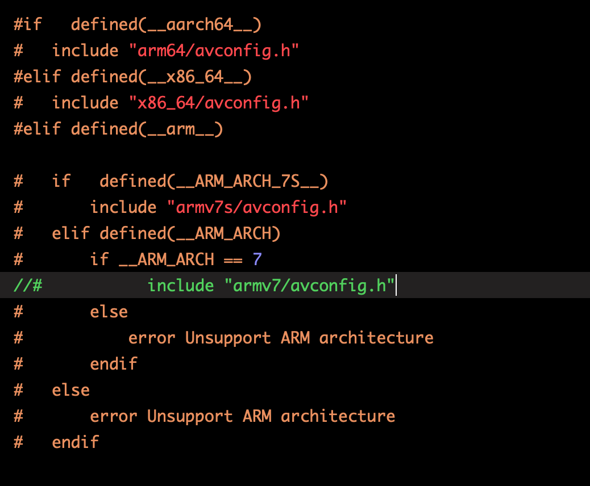

去掉之后我们再次编译, 发现会有另外一个错误

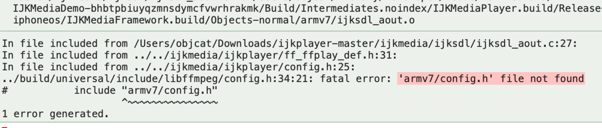

这次是`config.h`文件 我们追踪过去 干掉 armv7 指令集

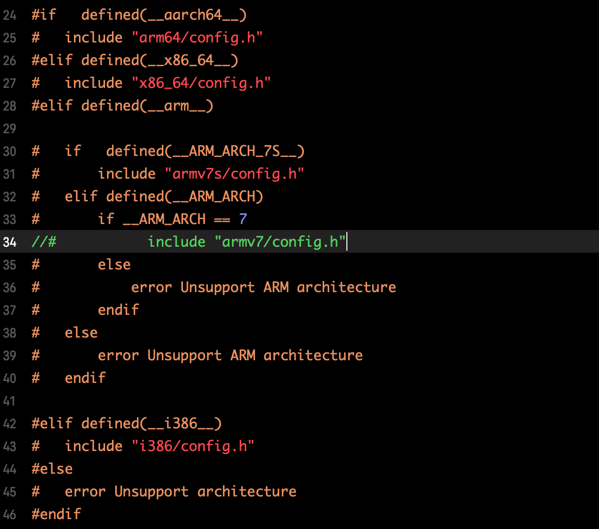

干掉后 我们再次编译

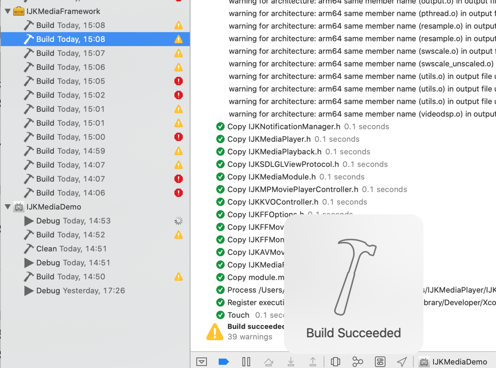

这次很顺利编译成功了

然后我们来查看一下编译完成的`framework`

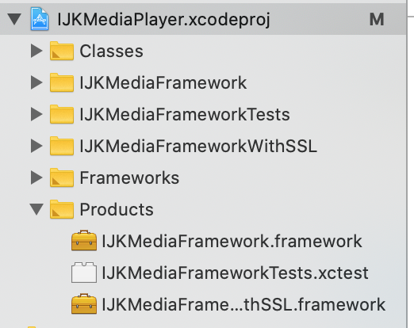

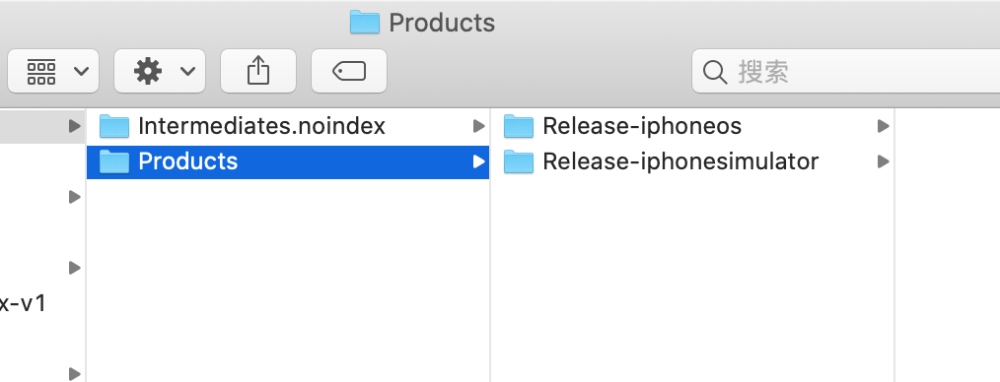

我们可以看到有两个`framework`, 其中一个是模拟器编译出来的是提供给模拟器用的, 另外一个是iOS设备编译出来的是真机使用的, 如果你分不清他们的区别, 我们就简单介绍一下, 首先我们进入目录

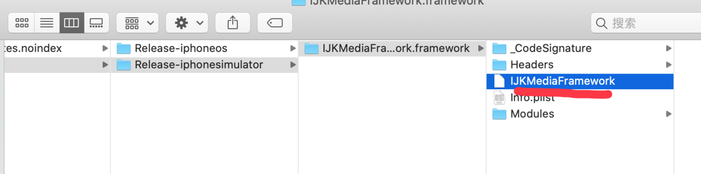

这个就是`framework`的静态库文件, 我们来查看一下它的架构

```
lipo -info IJKMediaFramework
```

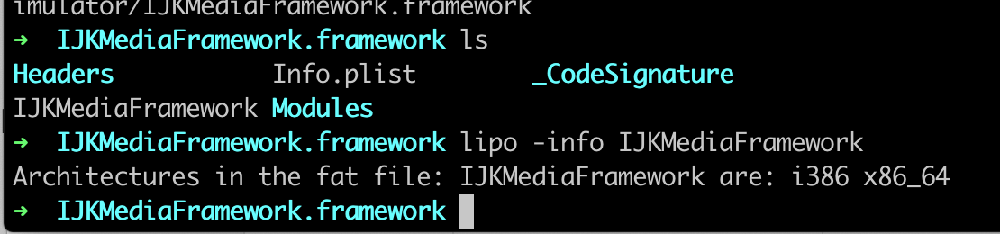

我们可以清楚的查看到它的指令集是 `i386`, `x86_64` 这是我们电脑cpu的指令集, 模拟器就是基于我们电脑cpu来运作的

我们再来看一下真机的静态库

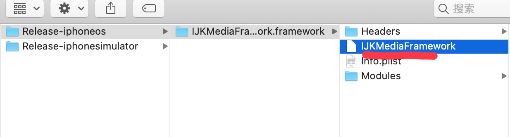

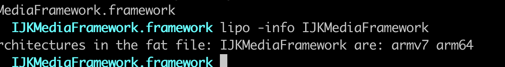

`armv7` `arm64` 可以看出来就是我们的手机需要用的指令集

接下来我们需要合并这两个静态库让我们既能在`pc`上面用也能在`真机`上面用

```
lipo -create framework1 framework2 -output framework3
```

```
# 回到桌面
cd ~/desktop
# 创建文件夹
mkdir result
# 合并静态库
lipo -create /Users/objcat/Library/Developer/Xcode/DerivedData/IJKMediaDemo-bhbtpbiuyqzmnsdymcfvwrhrakmk/Build/Products/Release-iphoneos/IJKMediaFramework.framework/IJKMediaFramework  /Users/objcat/Library/Developer/Xcode/DerivedData/IJKMediaDemo-bhbtpbiuyqzmnsdymcfvwrhrakmk/Build/Products/Release-iphonesimulator/IJKMediaFramework.framework/IJKMediaFramework -output ./result/IJKMediaFramework
```
到这里合并就完成了 我们去桌面查看一下

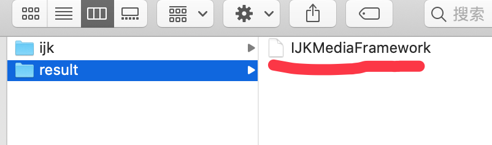

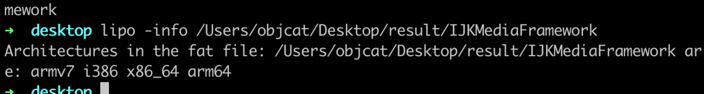

我们可以看到它包含了`模拟器和真机`的指令集, 到这里静态库制作成功了, 我们把这个文件随意塞到一个编译好的`framework`中

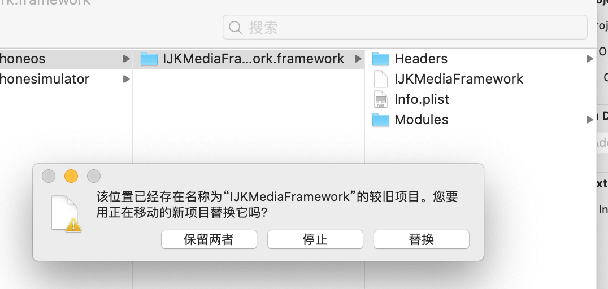

这个`framework`我们就可以直接在其他工程中使用了, 下面我就来演示一下

新建工程

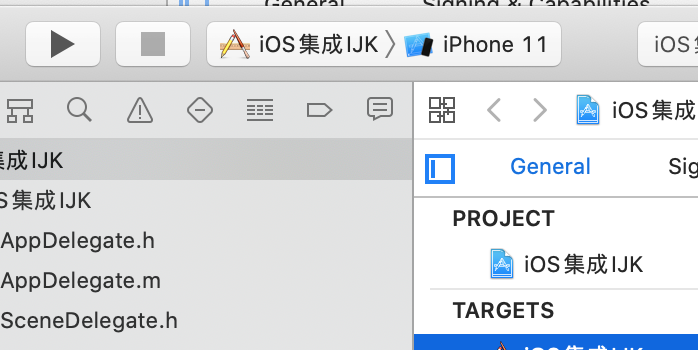

制作好的静态库放进来

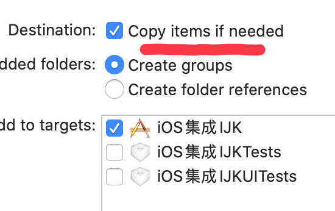

```
#import "ViewController.h"
#import <IJKMediaFramework/IJKMediaFramework.h>

@interface ViewController ()
/// 播放器
@property (strong, nonatomic) IJKFFMoviePlayerController *moviePlayer;
/// 播放配置
@property(nonatomic,strong) IJKFFOptions *options;
@end

@implementation ViewController

- (void)viewDidLoad {
    [super viewDidLoad];
    // Do any additional setup after loading the view.
    
    self.options = [IJKFFOptions optionsByDefault];
    NSString *filePath = [[NSBundle mainBundle] pathForResource:@"1" ofType:@"mov"];
    self.moviePlayer = [[IJKFFMoviePlayerController alloc] initWithContentURL:[NSURL fileURLWithPath:filePath] withOptions:self.options];
    self.moviePlayer.scalingMode = MPMovieScalingModeAspectFit;
    [self.moviePlayer prepareToPlay];
    [self.view addSubview:self.moviePlayer.view];
}
```

写好播放器代码后我们来运行一下

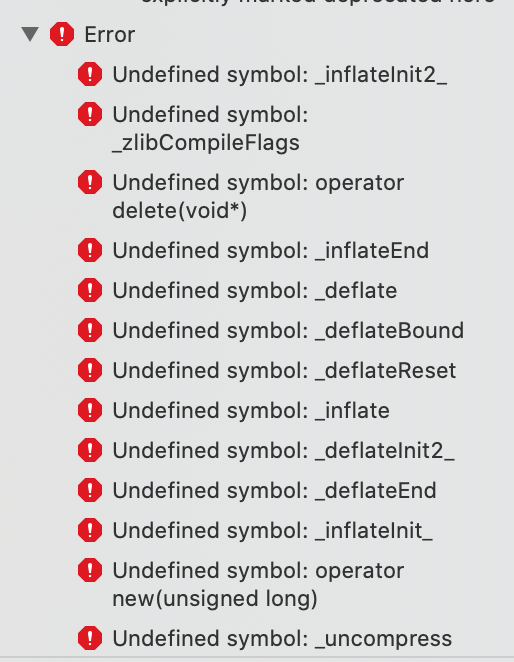

发现了一堆乱七八糟的错误哈 不要着急 这种问题显然是缺少动态库导致的

```
libc++.tbd
libz.tbd
```

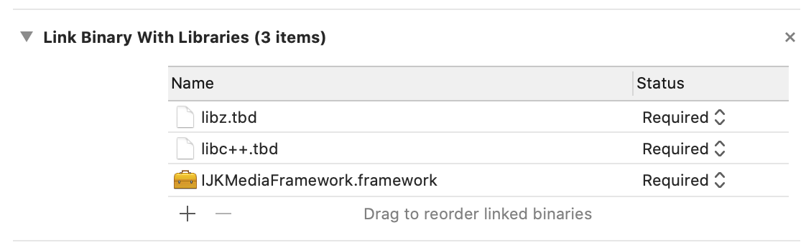

引入动态库后我们发现问题完美解决了

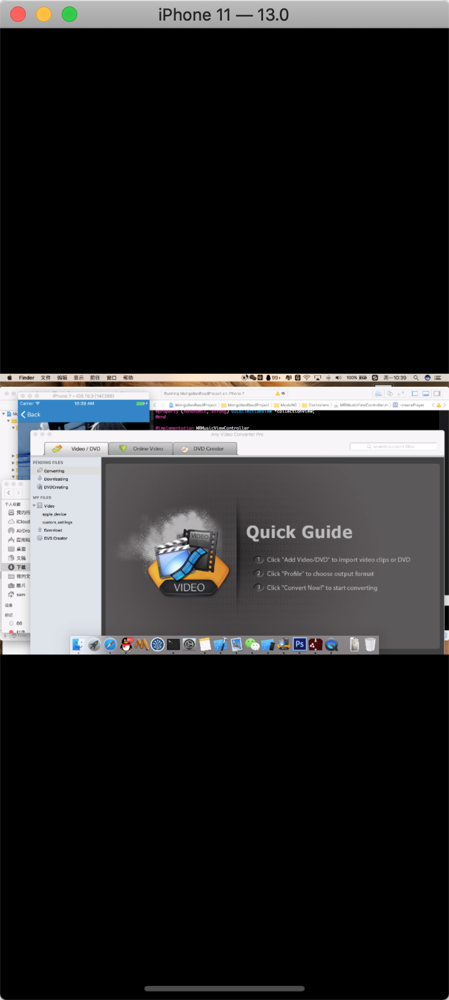

快播放的视频看看吧!

播放网络视频和很容易哦
```
self.options = [IJKFFOptions optionsByDefault];
self.moviePlayer = [[IJKFFMoviePlayerController alloc] initWithContentURLString:@"http://www.objcat.com:8083/1.mov" withOptions:self.options];
self.moviePlayer.scalingMode = MPMovieScalingModeAspectFit;
[self.moviePlayer prepareToPlay];
[self.view addSubview:self.moviePlayer.view];
```
播放视频这一块到此结束.

# 三.播放HTTPS地址
如果请求地址是`https`协议的, 这里会出现一个错误

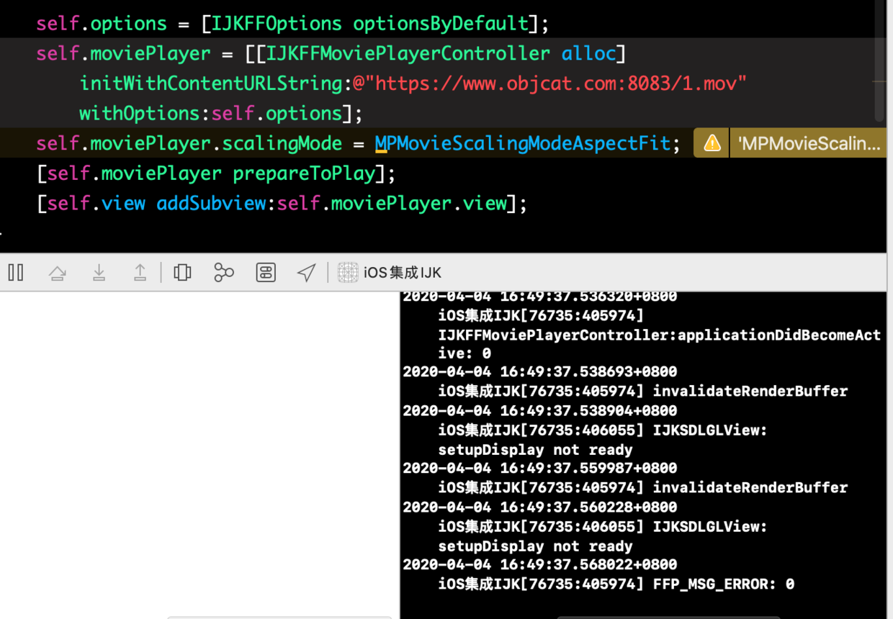

这时候我们就需要来添加`https`支持库
我们在安装的时候有执行脚本`init-ios-ssl.sh`
这个脚本就是帮助我们下载了`https`所需要的库文件

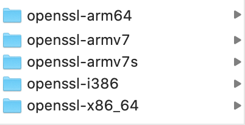

然后我们对它进行编译

```
./compile-openssl.sh all
```

编译完成后是这个样子

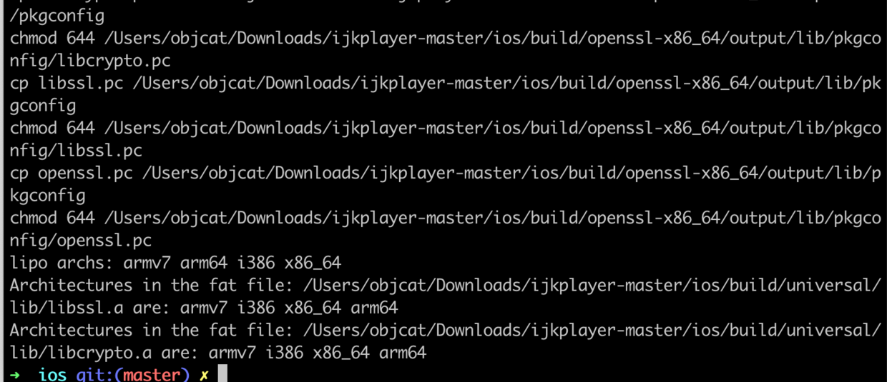

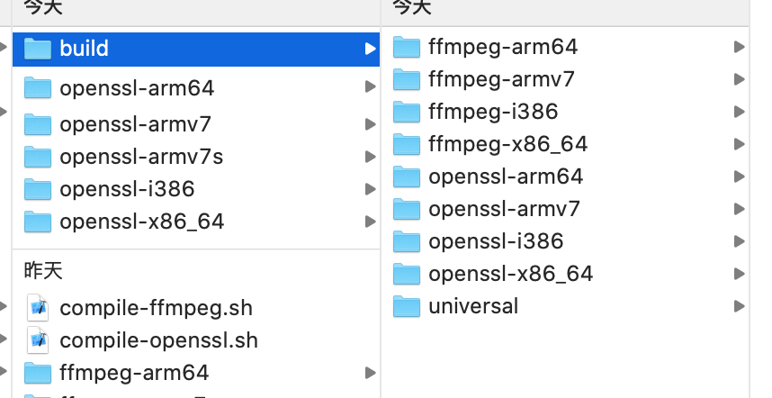

我们进入这个文件夹

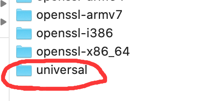

我们需要的库文件是

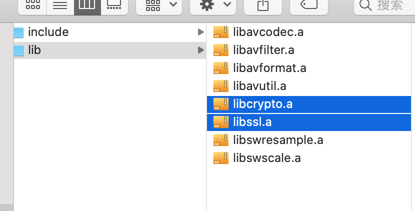

然后我们把这两个文件拖入到项目中去

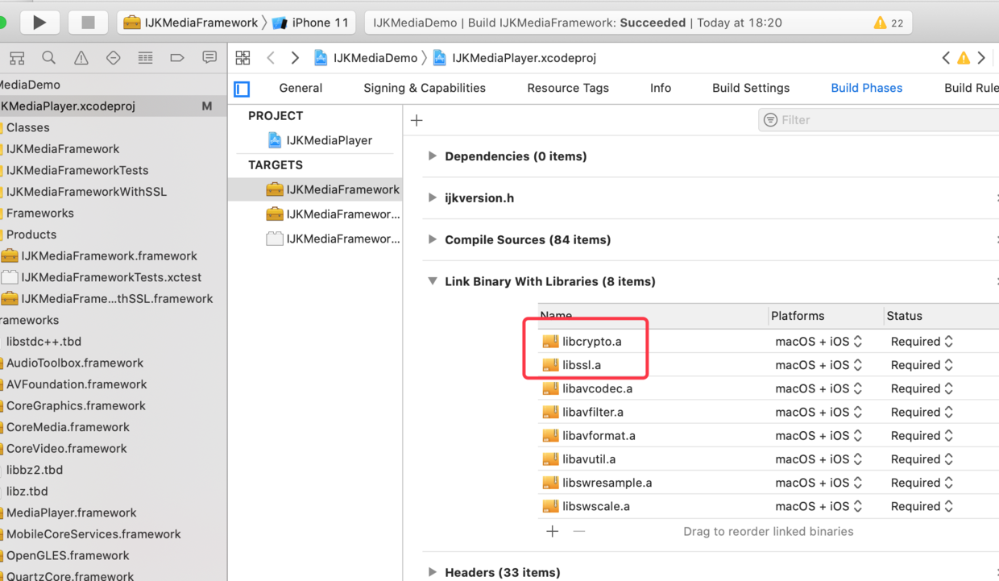

再次进行双编译就可以了 编译出的静态库是支持`https`的 如果你很迷茫不会编译 我这里也提供了百度云盘的下载链接 直接拿去使用

链接:https://pan.baidu.com/s/1uqrBrfuOSpiXZ93J5jlsow  密码:uimn

# finally enjoy it
# by objcat
# 2020.04.04


