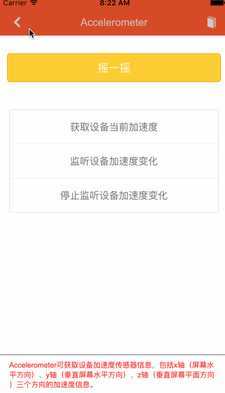
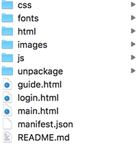
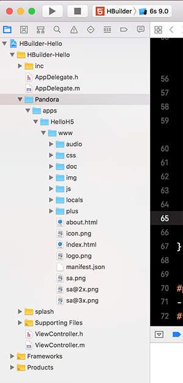
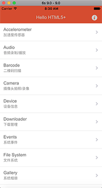
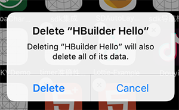
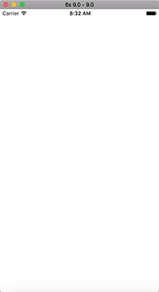
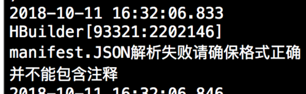
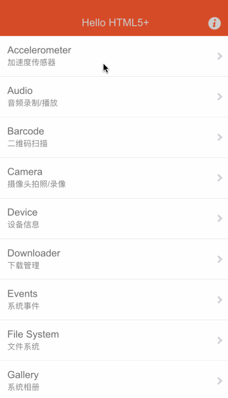

>今天研究了一下MUI的快速集成到iOS原生应用程序,发现有很多坑,所以写一个文章来记录一下

#####先来一批网址
- [MUI官网](http://www.dcloud.io/)
- [MUI集成原生应用文档](http://ask.dcloud.net.cn/docs/#//ask.dcloud.net.cn/article/83)
- [HTML5+SDK下载地址](http://ask.dcloud.net.cn/article/103)

看了文档后得知官网推出了三种模式来把MUI的项目集成到应用中去 它们分别是 `独立应用`, `Widget `, `WebView ` 下面我会一一说明它们的集成方式

###一.独立应用集成模式
所谓独立应用就是把原有在`hbuilder`中的项目完全移植到iOS平台 所对应的项目名称为`HBuilder-Hello`你需要做的是打开这个项目然后运行一下
所谓 `you say a jb without a gif` 下面直接上图

没错你看到的就是用iOS模拟器运行出来的效果 
那么问题来了 如何把自己的项目集成进去呢 一共需要两个步骤
1.把你以前工程目录中的文件复制一份



2.这一堆完全复制 拷贝到`HBuilder-Hello`项目中的www文件夹



然后我们来跑一下项目



发现项目跑的还是原来的那些东西 内容没有变化 - -
解决方法很简单 把原来的`卸载`再次运行项目即可



再次运行之后发现项目一片空白 - - 



好的 解决方法看日志 找到这么一行


原来导致的原因是manifest.json不能包含注释 好的兄弟们体力活把你们的配置文件中的注释全部去掉
10分钟后 - -
好的我们再次跑起来项目 跑之前不要忘记`卸载`并重新运行
好的 这就是独立应用的集成方式了

>温馨提示:
>不要妄想尝试新开一个项目手动集成 没有快速导入的cocoapods方法 你首先会遇到30多个错误 然后当你找到真正的依赖文档一个一个的把库引入进去之后 你会发现项目成功启动 但是页面为空白 这时你一定会很难受 - -

###二. Widget集成模式
这个模式对应的项目为` HBuilder-Integrate` 对应的页面为`WebAppController`
该模式与`独立应用模式`十分相似 目前发现两个不同点

1.独立应用模式是以应用程序启动为`入口`直接加载的;而Widget模式可以当你点击某个按钮的时候跳转到你的应用或一个模块 也就是说你可以在你应用里集成100个hbuilder项目都是没问题的

2.Widget模式的导航栏与状态栏有分离感

看到`状态栏`与`导航栏`之间的分界线了吗 这就是所谓的分离感 其他我无法解读 核心方法很简单 就是在`WebAppController`中配置一个路径 来指定你项目的入口位置
```
    // 设置WebApp所在的目录，该目录下必须有mainfest.json
    NSString* pWWWPath = [[[NSBundle mainBundle] bundlePath] stringByAppendingPathComponent:@"Pandora/apps/HelloH5/www"];
    
    // 如果路径中包含中文，或Xcode工程的targets名为中文则需要对路径进行编码
    //NSString* pWWWPath2 =  (NSString *)CFURLCreateStringByAddingPercentEscapes( kCFAllocatorDefault, (CFStringRef)pTempString, NULL, NULL,  kCFStringEncodingUTF8 );
    
    // 用户在集成5+SDK时，需要在5+内核初始化时设置当前的集成方式，
    // 请参考AppDelegate.m文件的- (BOOL)application:(UIApplication *)application didFinishLaunchingWithOptions:(NSDictionary *)launchOptions方法
    
    // 设置5+SDK运行的View
    [[PDRCore Instance] setContainerView:pContentVIew];
    
    // 传入参数可以在页面中通过plus.runtime.arguments参数获取
    NSString* pArgus = @"id=plus.runtime.arguments";
    // 启动该应用
    pAppHandle = [[[PDRCore Instance] appManager] openAppAtLocation:pWWWPath withIndexPath:@"index.html" withArgs:pArgus withDelegate:nil];
```
使用上述方法就可以顺利运行APP了
###三. WebView模式
这个模式对应的项目为` HBuilder-Integrate` 对应的页面为`WebViewController`
由于篇幅可能比较大 所以另开了一篇文章来详细说明
https://www.jianshu.com/p/d7b0bd44cecc
