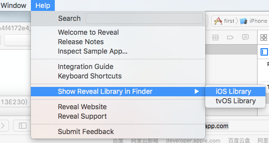
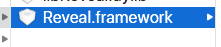
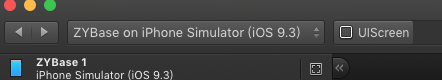

####1.在官方网站下载软件 
http://revealapp.com
#####2.安装软件运行 找到以下栏目 如图1所示.

####3.将下面的框架拖动到你的项目中 如图2所示.

####4.在 build Settings -> other Linker flags 下面添加字段 -ObjC
####5.在 build Phases -> link Binary With Libraries 添加 libz.tbd
####6.运行模拟器
####7.打开软件后点击图片位置按钮 如图3所示.

####8.尽情使用

