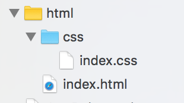

##一.开篇点题
造成原因: `.css文件路径问题`
解决方案: 如果你的css是放在文件夹里的 请把这个文件夹以folder的形式引入到XCode 这样应该可以解决你可问题 如图1所示.


 
##二.剖析原因
读取本地css显示失败的原因大多是无法读取到css文件(外链式CSS)
出现这个问题的原因与一句话有关:
```
<link href="css/index.css" rel="stylesheet" type="text/css">
```
这句代码的意思是寻找 `css` 文件夹中的 `.css` 文件, 这时你恰好是以`group`形式引入 然而它根本找不到 找不到的原因是group里的所有文件都视为同一目录 

##三.解决方案
###第一种解决方案
把css文件夹以`folder`形式引入来保持路径结构 也就是开头所述的方法.

###第二种解决方案
把css文件夹以`group`形式引入 并修改html中css文件路径为以下代码 
```
<link href="index.css" rel="stylesheet" type="text/css">
```
> 这样就可以读取本地的`.css`文件了

demo源码:
[https://github.com/iwgo/UIWebView-html-css.git](https://github.com/iwgo/UIWebView-html-css.git)
