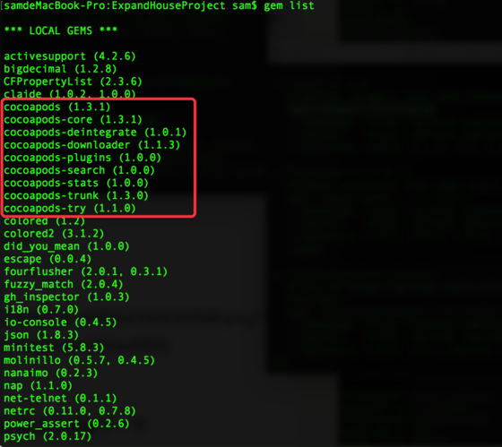
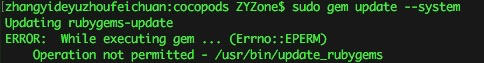
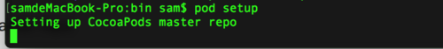
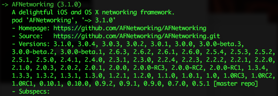
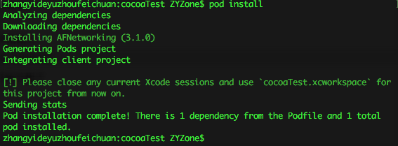
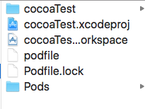
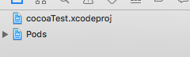
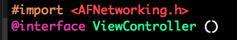

#一.安装
>cocoapods是一个在xcode上安装第三方工具的软件, 通过它可以很方便的安装第三方如AFNetworking, Masonry, SDWebImage 等工具, 但是它安装起来十分麻烦, 下面就来介绍在mac 10.11下如何安装cocoapods以及如何使用它.

#1.替换服务器地址

因为cocoapods是使用ruby写的 所以我们可以使用mac自带的gem来安装cocoapods, 因为gem在国外的服务器被墙, 所以先要将gem服务器替换成国内的地址

在终端输入命令:

`=> 查看当前使用地址`
```
gem sources​
```
`=> 移除国外地址`
```
gem sources --remove https://rubygems.org/​
```
`=> 加入国内地址`
```
gem sources -a http://ruby.taobao.org/​
```
`=> 查看当前使用地址`
```
gem sources​
```
#2.安装cocoapods
```
 sudo gem install cocoapods​
 ```
安装之后输入gem list就可以看见 一大堆带着cocoapods字样的文件了 说明安装成功了




#3.if上一步命令出现错误请看本节 else 请进入4

如果2中的命令没有成功:

(1).请检查命令  sudo gem install cocoapods 的cocoa不是coco

(2).如果(1)不管用 请升级gem
```
sudo gem update --system
```
这时有可能出现错误



这个错误造成的原因是ruby版本过低(至少我是这样的)

这里推荐使用brew更新ruby
```
brew install ruby
```
如果没安装homebrew是无法执行brew命令的

这时要先安装homebrew
```
/usr/bin/ruby -e "$(curl -fsSL https://raw.githubusercontent.com/Homebrew/install/master/install)"​
```
执行完这么命令 等待一会 ruby就安装成功了

这时再次执行
```
sudo gem update --system​
```
发现就可以顺利的进行安装了

#4.安装cocoapods后需要安装repo

```
pod setup​
```

打完这个命令屏幕上会出现




...  然后就卡住了 = =

这个命令会自动下载repo到 ~/.cocoapods路径

可以使用一下命令来检测下载进度
```
cd ~/.cocoapods
du -sh *​
```
这个文件大概是500M - 1G左右 所以要下载一个小时 这是一个漫长的过程

#5.使用方法

到了这一步安装就没有问题了 接下来是讲解如何使用

 - 开始写podfile

在终端输入命令

`=> 新建一个podfile文件`

```
touch podfile​
```
`=> 使用xcode打开文件`

```
open -a xcode podfile​
```
`=> 寻找自己需要的第三方 这里用AFNetworking为例`

```
pod search afnetworking​
```
输入之后等一会就出现如下画面



把pod 'AFNetworking', '~> 3.1.0'就是需要用到的 把它复制下来

然后在刚才打开的文件中写
```
platform :ios, '7.0'

target 'cocoaTest' do

pod 'AFNetworking', '~> 3.1.0'

end
```

 

platform 的意思是系统支持的最低版本

target是你的工程名

do开始  end结束

 

(5)写完之后在终端输入

```
pod install​
```
系统就会开始下载了 下载完成如图



之后我们会发现在工程目录中出现了一个workspace,双击那个白色的文件打开项目(workspace)



这时你或许会遇到第一个工程目录怎么也打不开



解决这个问题非常简单  选中xcode  cmd+q关闭所有窗口 然后再重新打开workspace就可以了
接下来是引入头文件  如图



用尖括号引入头文件


#二.卸载

- 干掉pod文件
```
sudo rm -rf /usr/local/bin/pod
```
- 干掉pod安装包文件

`=> 查看pod安装包文件列表`
```
gem list
```


`=> 逐条干掉`
```
gem uninstall cocoapods
gem uninstall cocoapods-core
gem uninstall cocoapods-deintegrate
gem uninstall cocoapods-downloader
gem uninstall cocoapods-plugins
gem uninstall cocoapods-search
gem uninstall cocoapods-stats
gem uninstall cocoapods-trunk
gem uninstall cocoapods-try
```

到这里 cocoapods 已经被干掉了。


#三. finally

enjoy it.
文章如果有错误 请不吝赐教.
write by objcat.


