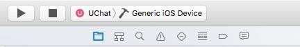
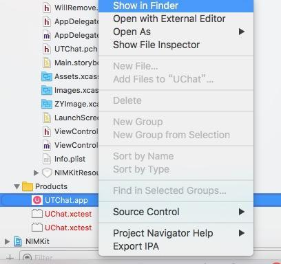
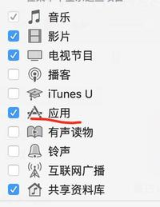
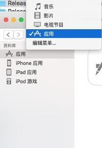
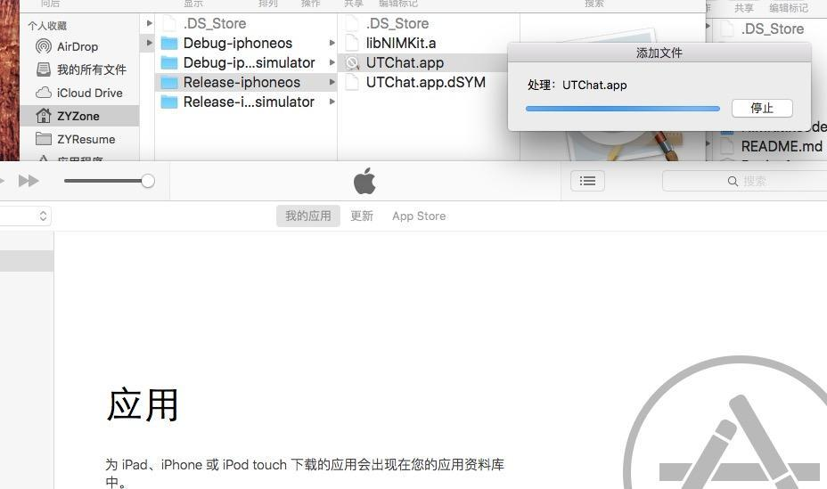
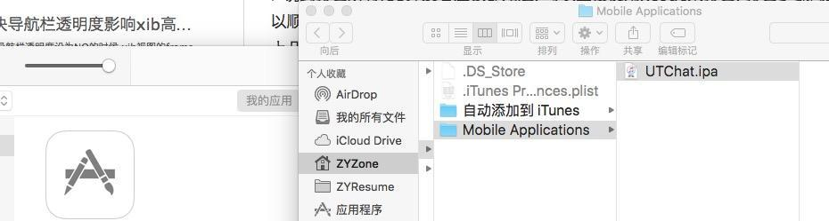

>说到打包所有iOS开发者应该都知道, 可以直接使用Xcode来打包, 打包步骤网上很多, 证书和描述文件对应就可以顺利的打包出来了, 但是在此之外还有另外一个方法就是使用iTunes来打包, 这么打包的好处就是比Xcode要快上几倍, 好了接下来就来说一下如何使用iTunes打包.

####1.配置好证书的描述文件后选择打包设备如图所示 然后使用cmd + B编译
这里需要说明一下, 这个打包推荐使用dev描述文件, 也就是开发测试用的, 正式上线打包还是推荐使用Xcode自带的打包

####2.编译成功后在bundle的Products文件夹中找到 xxx.app 然后 showInFinder 如图2所示, 这一步做完可以看到一个app包懒洋洋的躺在文件夹里 = =

####3.打开iTunes选择应用栏目 如图3所示.
如果没有应用栏目请点击编辑菜单把应用勾上

之后将找到的.app文件拖动到iTunes中 = = 如图4所示.

####4.执行成功后 你会发现itunes中会出现一个你应用 在应用上showinFinder就可以找到打包成功的ipa文件了.如图5所示.

####5.如何安装
其实安装的方法有很多种, 这里只是提供一下思路
1.使用PP助手安装 这个确实比较方便
2.使用itunes安装
3.使用fir.im或者蒲公英扫码安装

####6.如果安不上
1.请确认你的证书是dev打包(开发证书打包)
2.请确认apple官网上绑定了你当前设备的UDID
