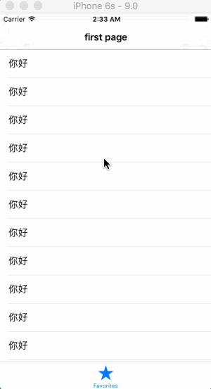

# 一.前言
对于一个前端来说, 布局在我们的开发中可以说是家常便饭了, 但是由于iOS本身系统设计的缺陷而导致布局变得困难, 由于统一性做的不好, 而导致布局五花八门, 有的人使用`autolayout`有的人使用`frame`, 对比安卓的布局文件来说, 劣势非常明显, 不是说布局文件比我们的layout优秀多少, 至少它统一了安卓布局.

# 二.正文
下文就以我的经验探究出一套相对完美的布局方法, 让后人少走些弯路.

如果你问我iOS系统中最毒瘤的功能是什么, 我绝对会回答你是`导航栏透明度在透明与不透明之间切换会影响布局坐标系`, 这是iOS系统底层的缺陷,  一直被世人所诟病, 不过无论什么系统都会有缺陷, 我们就来一步一步探究一下如何来解决这种布局问题.

首先我在开发中最常使用的是`autolayout`, 也就是开发者都中所说的约束, 这也是苹果开发出来代替传统`frame`布局的一个技术, 因为已经连续使用了几个年头了, 所以稳定性上得以肯定, 我们在开发中最好是遵循苹果这个布局规范, 本文并不是讲`autolayout的用法`, 重点是讲怎么解决布局这个问题.

下面我就引入一个开发中最常见的问题, `全屏布局`问题, 什么是全屏布局呢? 顾名思义就是把一个控件放在屏幕上占据整个屏幕, 在iOS11中引入`安全区域`概念, 这个区域的意思就是除去导航栏, 底栏, 状态栏, 底部横条(iPhoneX), 之后的区域, 说到这里可能有很多人一脸蒙圈, 我们来看一下例子把.

由于iOS上布局博大精深(坑多), 如果有不正确的地方还请指正.

首先说一下我们要实现的效果



这个效果看似简单, 其实当中隐含着很大的坑, 这个坑就是当外界环境改变的时候, 这个布局就有可能会出问题,  比如改变导航栏透明度或是改变页面所在位置, 均可导致问题, 那么我现在就直接开门见山, 直接搬出一个没有bug的布局方式`Masonry`, 直接上代码, 如果以前没见过这个第三方库可以在`github`上查阅.
https://github.com/SnapKit/Masonry
```
[self.tableView mas_makeConstraints:^(MASConstraintMaker *make) {
    make.top.equalTo(self.mas_topLayoutGuide);
    make.bottom.equalTo(self.mas_bottomLayoutGuide);
    make.left.right.equalTo(self.view);
}];
```

这个布局所用的原理是iOS原生的`autolayout`, 并使用了`layoutGuide`作为约束参考对象, 在稳定性上可以说是一流的, 但是这个东西的缺点也是显而易见的, 就对


