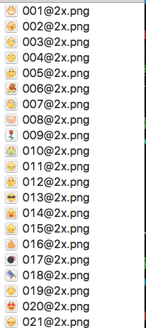
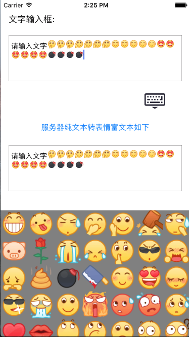
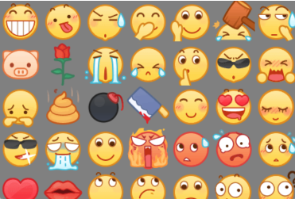
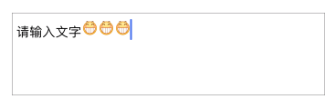

#一.前言
平常我们使用的表情包大多是emoji表情，而到了微信和qq上我们会见到更多更丰富的表情，那么这些表情是如何做的呢，下面就让我来带你们来揭晓答案。
>注: 方法都来自互联网, 在此鸣谢走在前面铺路的前辈们.

#二.准备阶段
准备一个表情包 就是一组表情如图1所示.



我这里借用了一下腾讯的表情包 一共是50个表情

#三.编写阶段, 这里只说明核心功能, UI简略说明.
##1.效果图(you say a jb without a picture) 如图2所示.




##2.先画一个表情键盘
从效果图上可以看出来  下面的就是表情键盘(非常简陋! 我想吐) 咳咳...  如图3所示.




这个表情键盘我是用collectionView画的(这个过程略), 使用过这个控件的人都知道, 我们还需要一个数据源来表示那些小表情, 接下来就是创建数据源的过程:

```
- (NSMutableArray *)faceArray {
    if (!_faceArray) {
        _faceArray = [NSMutableArray array];
        
        //创建一个标签数组
        NSArray *tagArr = @[@"[龇牙]", @"[吐舌]", @"[流汗]", @"[偷笑]", @"[再见]", @"[砸]", @"[擦汗]", @"[猪头]", @"[玫瑰]", @"[流泪]", @"[大哭]", @"[嘘]", @"[酷]", @"[抓狂]", @"[委屈]", @"[便便]", @"[地雷]", @"[菜刀]", @"[可爱]", @"[心心眼]", @"[害羞]", @"[帅气]", @"[吐]", @"[笑脸]", @"[生气]", @"[尴尬]", @"[惊吓]", @"[尴尬2]", @"[心]", @"[嘴唇]", @"[白眼]", @"[傲慢]", @"[难过]", @"[惊讶]", @"[疑问]", @"[睡觉]", @"[亲亲]", @"[憨笑]", @"[企鹅爱]", @"[衰]", @"[撇嘴]", @"[阴险]", @"[加油]", @"[发呆]", @"[睡着]", @"[抱抱]", @"[坏笑]", @"[飞吻]", @"[鄙视]", @"[晕]"];
        
        for (NSInteger i = 1; i < 51; i++) {
            //创建一个表情对象
            FaceAttachment *model = [[FaceAttachment alloc] init];
            //从第一张图片依次赋值
            model.imageName = [NSString stringWithFormat:@"%03ld", i];
            //刻上标签名 用途:上传服务器替换
            model.tagName = tagArr[i - 1];
            //将model装入数组
            [_faceArray addObject:model];
        }
    }
    return _faceArray;
}
```
下面是FaceAttachment
.h
```
#import <UIKit/UIKit.h>

@interface FaceAttachment : NSTextAttachment
@property(nonatomic, strong) NSString *imageName; /** 表情图片名 */
@property(nonatomic, strong) NSString *tagName; /** 标签名 */
@property(nonatomic, assign) NSRange range; /** 位置 */
@end
```
.m
```
#import "FaceAttachment.h"

@implementation FaceAttachment
- (UIImage *)image {
    return [UIImage imageNamed:_imageName];
}
@end
```
FaceAttachment的对象就是每个小表情, 这个model中有三个属性
1. imageName  图片名  其实我们看到的表情就是一个个的小图片
2. tagName 标签名 上传服务器时要将这些富文本中的表情 替换成普通的字符串标签才能上传
3. range 记录表情的位置

##3.控制键盘弹出逻辑
到这里有人会提出一个问题, 切换表情键盘后怎么让光标存在?
这个问题其实很简单, 只需要把表情键盘设置为textView.inputView就行了, 使用过程是先设置好inputView再弹出键盘, 不然inputView是不会自动切换的, 如果在键盘弹出状态下切换inputView也很简单, 方法就是先回收键盘 -> 切换inputView -> 再弹出即可 下面是表情与键盘的切换代码
```
- (IBAction)faceButton:(id)sender {
    
    if (!_keyBoardFlag) {
        
        [self.view endEditing:YES];
        self.textView.inputView = self.faceBoard;
        [self.textView becomeFirstResponder];
        [self.faceButton setImage:[UIImage imageNamed:@"键盘"] forState:UIControlStateNormal];
    }
    
    else {
        
        [self.view endEditing:YES];
        self.textView.inputView = nil;
        [self.textView becomeFirstResponder];
        [self.faceButton setImage:[UIImage imageNamed:@"表情"] forState:UIControlStateNormal];
    }
    
    _keyBoardFlag = !_keyBoardFlag;
}
```
##4.插入表情的核心代码
其实原理很简单就是利用富文本进行一个表情的拼接 代码如下
```
+ (void)insertFaceToString:(FaceAttachment *)model textView:(UITextView *)textView {
    
    //创建一个附件
    FaceAttachment *faceAttachement = [[FaceAttachment alloc]init];
    //添加表情
    faceAttachement.imageName = model.imageName;
    //添加标签名
    faceAttachement.tagName = model.tagName;
    
    //设置表情大小
    faceAttachement.bounds = CGRectMake(0, 0, 18, 18);
    //记录光标位置
    NSInteger location = textView.selectedRange.location;
    //插入表情
    [textView.textStorage insertAttributedString:[NSAttributedString attributedStringWithAttachment:faceAttachement] atIndex:textView.selectedRange.location];
    //将光标位置向前移动一个单位
    textView.selectedRange = NSMakeRange(location + 1, 0);
}
```
其中 FaceAttachment 是继承于 NSTextAttachment 这个东西就相当于一个相框  用它装表情图片 然后拼接到文本上去, 为什么要继承 NSTextAttachment ?  因为我们要存放的东西在它原有基础上是不够的, 所以要继承 写上去三个属性

FaceAttachment的对象就是每个小表情, 这个model中有三个属性
1. imageName  图片名  其实我们看到的表情就是一个个的小图片
2. tagName 标签名 上传服务器时要将这些富文本中的表情 替换成普通的字符串标签才能上传
3. range 记录表情的位置

##5.上传服务器
通过上面的步骤 我想你们应该对表情是如何写在文本上有一个了解了  但是我要说的是 这样的表情是不能上传到服务器的, 所以我们要把它们转化成普通的纯文本字符才能去上传 下面的代码就是把这些富文本表情转化成纯文本字符.
转化前效果图:



转化后文字:

请输入文字[龇牙][龇牙][龇牙]

下面是转化代码:
```
- (NSString *)toString {
    
    NSMutableAttributedString *attributeString = [[NSMutableAttributedString alloc]initWithAttributedString:self];
    
    __block NSUInteger index = 0;
    
    [self enumerateAttribute:NSAttachmentAttributeName inRange:NSMakeRange(0, self.length) options:0 usingBlock:^(id  _Nullable value, NSRange range, BOOL * _Nonnull stop) {
        
        //从富文本中遍历出 FaceAttachment 对象
        if (value && [value isKindOfClass:[FaceAttachment class]]) {
            FaceAttachment *faceAttachment = value;
            //替换对象为[表情]
            [attributeString replaceCharactersInRange:NSMakeRange(range.location + index, range.length) withString:faceAttachment.tagName];
            //替换后对位置作一下调整(因为替换前长度为1替换后有可能是4 [龇牙] 也有可能是3 [晕])
            index += faceAttachment.tagName.length - 1;
        }
    }];
    
    return attributeString.string;
}
```
上面的代码自己写写 很简单的.

##6.服务器上获取的纯文本转化为带表情的富文本
通过上面的步骤  我们已经可以把表情和文字都转化成纯文本的形式上传的服务器上了,  接下来我们要做的就是把服务器上获取的这些字符串再转换回表情 其实中心思想就是用正则表达式过滤出"[表情]"这样的标签并记录他们的位置, 然后创建出  FaceAttachment 对象 对 "[表情]" 这样的标签来进行替换

```
- (NSAttributedString *)faceWithServerString:(NSString *)string {
    
    NSMutableAttributedString *attributedString = [[NSMutableAttributedString alloc]initWithString:string];
    
    NSString *pattern = @"\\[[^\\[|^\\]]+\\]";
    NSError *error = nil;
    NSRegularExpression *regularExpression = [[NSRegularExpression alloc] initWithPattern:pattern options:NSRegularExpressionCaseInsensitive error:&error];
    if (!regularExpression) {
        NSLog(@"错误信息 : %@", error);
    }
    
    //将匹配到的字符存入数组
    NSArray *resultArr = [regularExpression matchesInString:string options:0 range:NSMakeRange(0, string.length)];
    
    NSMutableArray *faceModelArr = [NSMutableArray array];
    
    for (NSTextCheckingResult *result in resultArr) {
        NSRange range = result.range;
        NSString *subString = [string substringWithRange:range];
        
        for (FaceAttachment *model in self.faceArray) {
            if ([subString isEqualToString:model.tagName]) {
                
                FaceAttachment *faceAttachment = [[FaceAttachment alloc]init];
                faceAttachment.imageName = model.imageName;
                faceAttachment.tagName = model.tagName;
                faceAttachment.range = range;
                faceAttachment.bounds = CGRectMake(0, 0, 18, 18);
                
                [faceModelArr addObject:faceAttachment];
            }
        }
    }
    
    faceModelArr = [NSMutableArray arrayWithArray:[[faceModelArr reverseObjectEnumerator] allObjects]];
    
    for (FaceAttachment *faceAttachment in faceModelArr) {
        NSAttributedString *faceAttributedString = [NSAttributedString attributedStringWithAttachment:faceAttachment];
        [attributedString replaceCharactersInRange:faceAttachment.range withAttributedString:faceAttributedString];
    }
    
    
    [attributedString addAttributes:@{NSFontAttributeName:[UIFont systemFontOfSize:14]} range:NSMakeRange(0, attributedString.length)];
    
    return attributedString;
}
```

#四.Demo
下面是本人写的源码, 可以做为参考, 有不对的地方还请指教!
https://github.com/iwgo/CustomFace.git
