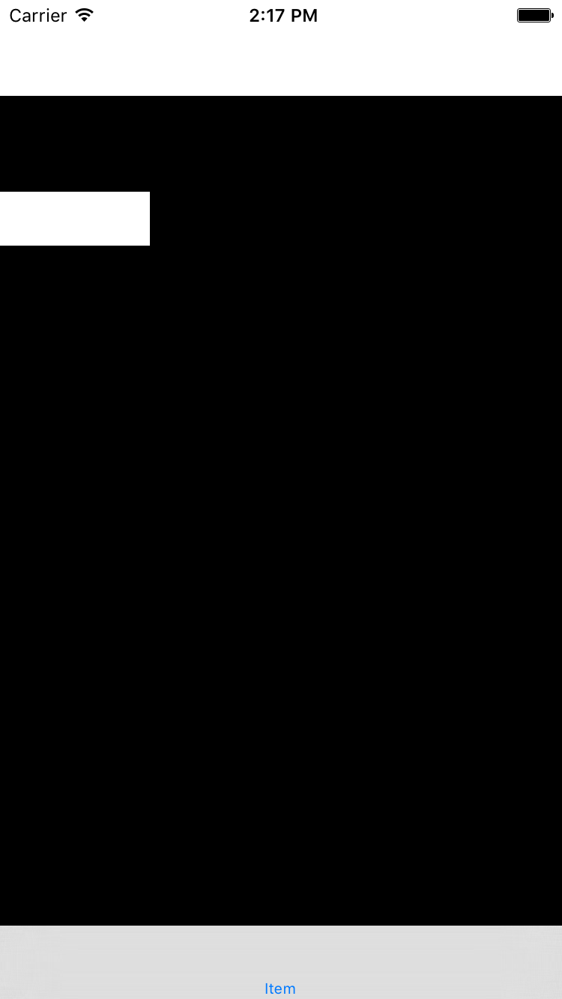

#问题如图:

当导航栏透明度设为NO的时候   xib视图的frame明明设置为 textView.frame = CGRectMake(0, 64, 100, 100);  但是视图显示出来时高度却减少了64 变成了36 宽度并没有收到影响 如图1所示.

```
    self.navigationController.navigationBar.translucent = NO;
    self.view.backgroundColor = [UIColor blackColor];
    TextView *textView = [[[NSBundle mainBundle]loadNibNamed:@"TextView" owner:nil options:nil] firstObject];
    textView.frame = CGRectMake(0, 64, 100, 100);
    [self.view addSubview:textView];
```




#针对这个问题目前有两种解决方案

###第一种方案 : 
在代码中添加如下代码
```
self.extendedLayoutIncludesOpaqueBars = YES;
```
>用这种方法解决问题会发现不透明的导航栏的起始位置不是 64  而是变为与透明导航栏一样的起始位置0

###第二种方案:
经测试发现创建xib时使用系统自带的view就会发生问题, 所以创建xib文件时使用empty文件然后自己拖拽上去视图, 这样也不会出现上述问题
