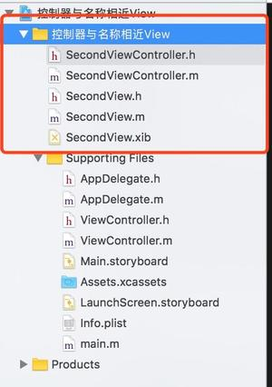
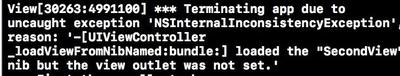

#一.BUG演示
最近发现了一个关于`xib`的恶(e)性(xin)`bug`, 用了两天的时间才找到该原因, 下面我来演示一下该bug.

##首先展示一下工程目录 红色区域为造成崩溃原因


##再来展示一下崩溃信息


崩溃信息如下

```
uncaught exception 'NSInternalInconsistencyException',
reason: '-[UIViewController _loadViewFromNibNamed:bundle:] 
loaded the "SecondView" nib but the view outlet was not set.'
```


这句话的意思写过xib的人应该都懂 程序说我的xib中的View没有绑定fileOwner, 但请仔细看一下我的控制器叫SecondViewController 而崩溃信息中说我的xib叫`SecondView`, 说到这里我不仅倒吸了一口冷气 `what fuck?` 不是应该叫`SecondViewController`吗?

说到这里可能很多人已经看到其中的缘由了, 因为我的工程目录里有一个`自定义View`叫做`SecondView`, 控制器把这个xib认为是自己的xib所以从中去寻找`fileOwner`所绑定的`View`, 但是从这个`View`中并没有发现任何有用的信息, 所以它崩了, 并抛出异常说 `Nib but the view outlet was not set` -> 我的儿子哪去了?

#二.解决方案:
有两种解决方案

##1.修正SecondView1.xib名字
由于SecondViewController视图控制器在找儿子的时候会迁怒其他xib, 所以只需要把SecondView给换个其他名字就可以了  直接在功能下按回车重命名 变成SecondView1.xib即可, 此方法屡试不爽.

##2.创建出一个SecondViewController.xib 
创建出一个SecondViewController.xib, 并绑定fileOwner class 为SecondViewController, 并绑定所属view, 这样 SecondViewController 就会找到自己的"儿子" -> `即子view`, 也就不会迁怒于其他自定义View了.

Demo地址
https://github.com/iwgo/Nib-but-the-view-outlet-was-not-set
`注:这个demo会发生崩溃  把 SecondView.xib 改成 SecondView1.xib 即可避免崩溃`
